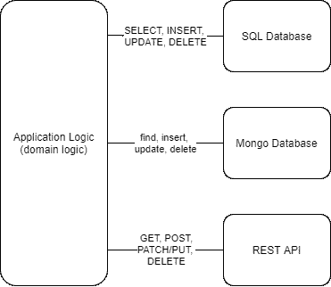

# 存储库模式:数据库变得简单

> 原文：<https://itnext.io/repository-patterns-databases-made-easy-178d63855ff4?source=collection_archive---------1----------------------->

我最近一直在读 Kleppmann 的优秀书籍*设计数据密集型应用*。这是一本关于数据工程的优秀书籍，尤其是关于*、存储库模式* 的部分吸引了我的眼球。这个想法非常有趣:将数据库交互隐藏在另一层*存储库*之后，这样无论数据库的类型如何(无论是 SQL、MongoDB 还是内存中的列表/数组)，您的代码都可以工作。我们的目标是想出一种*翻译器*来转换通用操作，比如创建、读取、更新和删除。转换成特定数据存储理解的语言。

为了说明这一点，应用程序中的数据访问通常如下所示:



典型应用

应用程序代码中可能嵌入了原始 SQL、MongoDB 查询或其他查询语言。其中一些交互可能隐藏在单独的函数、类或文件中，但是您的代码仍然是非常特定于数据库的。您不能将连接从 SQL 切换到 MongoDB，或者从 MongoDB 切换到 REST API。

存储库模式中的应用程序代码看起来有点不同:


具有存储库模式的应用程序

存储库是*翻译*层。您只需请求存储库为数据存储创建一个项目，存储库就会将该请求转换为 SQL 或任何其他查询语言。您的应用程序不需要知道数据库的类型或者如何与之交互。它只是与将通用命令翻译成数据库理解的语言的存储库进行通信。这使我们能够:

*   我们可以在没有实际数据库连接的情况下对域逻辑进行单元测试，
*   我们可以毫不费力地更改数据库，只需更新配置
*   我们可以使用相同的逻辑将不同类型的数据库集成到相同的应用程序中。

此外，这种方法可以显著提高应用程序的可读性、可维护性和开发速度。您可以从一个简单的 CSV 数据库开始您的原型，然后切换到一个实际的 SQL 数据库，没有任何问题。或者你可以为你的单元测试使用一个完全在内存中的存储库，这样你就可以完全控制测试用例。或者，您可以在应用程序中有几种类型的数据库，而丝毫不牺牲可读性。

也不是免费的午餐。对于存储库模式，我们主要局限于简单的 CRUD 操作，许多优化选项对我们来说是不可用的。随着我们移交提出查询的责任，我们不再能够对它们进行微调以处理与数据存储的性能或功能相关的特定问题。然而，大多数应用程序不需要关注性能，它们与数据库的交互是非常基本的。

在本文中，我们用一些伪代码讨论了存储库模式在实践中的样子，然后我介绍了用于存储库模式的 Python 库 [Red Bird](https://red-bird.readthedocs.io/) 。

# 实践中的知识库

那么，它在实践中是如何工作的呢？在这一节中，我们将讨论应用程序的外观，以说明存储库模式的好处。我们假设有一个现有的存储库模式库可供我们使用，下面的例子是用简单的伪代码编写的。在本文的最后，介绍了一个用于 Python 的实际存储库模式库。

假设我们需要为一家零售企业创建一个订单处理应用程序，我们手头有一个存储库模式库。首先，我们创建一个名为*订单*的简单存储库对象:

```
orders = Repository(...)
```

该储存库可以表示到关系数据库表的连接、到非关系数据库集合或任何其他数据集合的连接。重点是在上面这条线之后，我们不需要为了使用它而知道它代表什么或者它是如何工作的。我们只需要知道如何调用它。

接下来，为了便于说明，让我们在订单存储库中创建一些示例项目:

```
orders.create({order_id: 1, product: "nail box", status: "new"})
orders.create({order_id: 2, product: "saw", status: "new"})
```

如果存储库连接到 SQL 数据库中的一个表，我们现在应该有两个新行，如果它连接到 MongoDB 集合，我们应该有两个文档，如果它只是一个内存数组/列表，它现在应该有两个对象，等等。

接下来，我们通过创建一个函数来实现一些实际的应用程序逻辑，该函数将*订单*存储库作为第一个参数，将*订单 id* 作为第二个参数。该函数本身处理一个订单，首先更新其状态，然后调用另一个函数，最后从*订单*存储库中删除已处理的订单。

```
function process_order(orders, order_id)
  order = orders.get(order_id) # We update the order
  order.status = "in progress"
  orders.update(order) # We call just some other function
  handle_order(order) # We delete the order as
  orders.delete(order)
endfunction
```

上面的例子非常简单。如果我们对应用程序中嵌入的 SQL 或 MongoDB 查询做同样的事情，代码会复杂得多。当然，存储库模式库的内部工作并不像这样简单，但是对于库用户来说，它是简单和容易的。用户不需要关心数据库交互如何工作，只需要关心如何与存储库通信。

好的一面是，我们可以很容易地为这个函数创建测试，而不需要实际连接到任何地方，使用一个只在内存中的列表/数组上操作的存储库:

```
orders = InMemoryRepository([
  {order_id: 1, product: "nail box", status: "new"},
  {order_id: 2, product: "nail box", status: "new"}
])
process_order(orders, order_id=2)# Test the order was deleted
orders.count() == 1
```

当我们准备好实际连接到数据库并投入生产时:

```
orders = SQLRepository(
    url="postgresql://127.0.0.1:5432/database", 
    table="orders"
)while true order_id = get_next_order_id()
  process_order(order_id=order_id)endwhile 
```

## 接下来呢？

希望存储库模式及其有用性背后的思想是清楚的。在本文的最后一部分，我将介绍 Python 的存储库模式的一个实际实现，并展示如何使用它。如果 Python 不是你的菜，你可能想在这里停止阅读。

# 红鸟简介

所以，更多一点的故事。在阅读了书中关于存储库模式的内容后，我对它们产生了浓厚的兴趣，并想进一步研究它们。我搜索了现有的 Python 解决方案，但我非常失望。我发现了一些与书中的例子非常相似的例子，我还发现了一些非常古老的图书馆，它们似乎不是最新的，甚至也不成熟。我决定创建一个足以满足生产需求的库。我以前创作过一些高质量的包，但是这次我觉得我创作的不仅仅是一个工具。我觉得我在创造一个框架。

所以我有些工作要做。我花了一些空闲时间，进行了大量的尝试和错误，才想出了足够通用但又足够有表现力的语法，以便在此基础上构建更多内容。我想到了红鸟。

在撰写本文时，该库支持以下存储库:

*   内存中(Python 列表)
*   MongoDB(通过 Pymongo)
*   SQL(通过 SQLAlchemy)
*   REST APIs(通过请求)
*   CSV 文件
*   JSON 文件

我将 Pydantic 模型与库结合起来，这在数据验证和存储库之间的完整性方面给了它很大的能力。一些数据格式，如 CSV，没有关于数据类型的信息，一些数据存储只支持与原生 Python 不同的数据类型。Pydantic 有助于对此进行标准化，并为缺少这种功能的数据存储提供了一些结构，如 MongoDB 或 JSON。不过不要担心，如果你想保持简单，所有的库也支持普通字典。

您可以简单地通过以下方式进行 pip 安装:

```
pip install redbird
```

如果您想在深入研究之前先看看包装:

*   源代码:[https://github.com/Miksus/red-bird](https://github.com/Miksus/red-bird)
*   文档:[https://red-bird . readthedocs . io](https://red-bird.readthedocs.io/en/latest/)
*   上映日期:【https://pypi.org/project/redbird 

## 配置存储库

如前所述，Red Bird 支持许多类型的存储库。这里有一个简单的例子来配置其中的大部分:

如上所述，您还可以使用 Pydantic 模型来配置存储库:

选择您需要的一个或从文档中阅读更多选项。接下来，我们将使用它们进行一些基本操作。

## CRUD:创建、读取、更新、删除

为了清楚起见，在下面的例子中，我们使用上面定义的 Pydantic 模型。如果你想使用字典，就用字典代替模型类。

正如您可能猜到的那样，每个存储库类型都是如此。还有一些特性超出了本文的范围，但是在文档中有解释。此外，我发现这个库在连接第三方 API 获取数据方面很有前途。

如果你觉得这个项目很有前途，可以考虑在 Github 上把它列为明星，因为知道我在做有用的事情有助于我保持动力。感谢阅读。

相关链接:

*   源代码:[https://github.com/Miksus/red-bird](https://github.com/Miksus/red-bird)
*   文档:[https://red-bird . readthedocs . io](https://red-bird.readthedocs.io/en/latest/)
*   上映日期:【https://pypi.org/project/redbird 