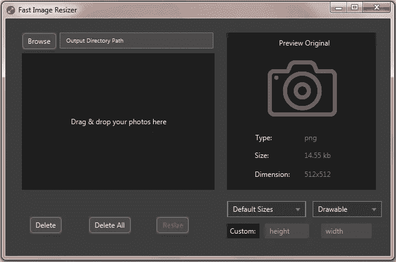

# 调整图像大小以支持 Android 设备

> 原文：<https://itnext.io/resize-images-to-support-android-devices-becf3361b6f?source=collection_archive---------1----------------------->

为了帮助 Android 开发人员调整图像大小以支持不同的 Android 设备，我创建了 Javafx 应用程序，只需点击一下即可调整图像大小，而不会改变图像质量，并自动将它们添加到文件夹中。对于 Android 开发者来说，这是一个强大的跨平台工具。此外，任何其他开发人员都可以使用它来调整图像的大小与他们最喜欢的自定义大小。

使用**快速图像缩放器**，您可以:

*   选择资源目录，这样就不必移动已调整大小的文件。
*   一次调整多个图像的大小(拖放)
*   选择输出密度(ldpi、mdpi、tvdpi、hdpi、xhdpi、xxhdpi、xxxhdpi)。
*   使用宽度和高度定制尺寸。
*   保留图像格式(jpg、jpeg、png、bmp、gif)。
*   选择输出目录(drawable 或 mipmap)。
*   删除选定的一幅或多幅图像。
*   按下以显示选择的图像。
*   显示图像的信息细节(类型-大小-尺寸)。

享受调整图像大小和快乐编码！

**通过** [SourceForge](https://sourceforge.net/projects/fastimageresizer/) 或[快速图像缩放器](https://github.com/Marwa-Eltayeb/Fast-Image-Resizer)获得

更多文章:点击 [**此处**](https://marwa-eltayeb.medium.com/)

**在这里找我:**[GitHub](https://github.com/Marwa-Eltayeb)|[LinkedIn](https://www.linkedin.com/in/marwa-eltayeb/)|[Twitter](https://twitter.com/Marwa_Eltayeb1)