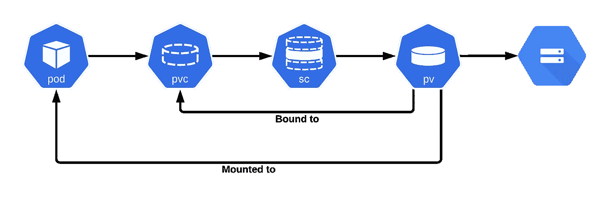

# 调整状态设置永久卷的大小，不停机

> 原文：<https://itnext.io/resizing-statefulset-persistent-volumes-with-zero-downtime-916ebc65b1d4?source=collection_archive---------0----------------------->


在我们着手调整 StatefulSet 持久卷的大小之前，让我们简要回顾一下什么是有状态应用程序，什么是 StatefulSet，以及 Kubernetes 存储如何在高级别上工作。

# 无状态与有状态应用程序

无状态应用程序既不读取也不存储关于其状态的信息。按照设计，容器最适合无状态应用程序，因为 Kubernetes 能够以快速和动态的方式创建和删除容器。

另一方面，**有状态应用**将数据保存到[持久磁盘存储器](https://kubernetes.io/docs/concepts/storage)，供服务器、客户端和其他应用使用。有状态应用程序的一个例子是数据库或键值存储，其他应用程序可以在其中保存和检索数据。

# Kubernetes 状态集

**StatefulSets** 是用于管理有状态应用程序的对象。StatefulSets 管理一组 pod 的部署和扩展，并提供关于这些 pod 的排序和唯一性的保证。

StatefulSets 对于需要以下一项或多项功能的应用程序很有价值:

*   稳定、唯一的网络标识符。
*   稳定持久的存储。
*   有序、优雅的部署和扩展。
*   有序的自动滚动更新。

有状态集合使用某种类型的**持久存储是很常见的。**

# 库伯内特仓储公司

Kubernetes 存储架构基于卷的抽象。卷可以是持久的，也可以是非持久的，Kubernetes 允许容器使用一种叫做卷声明的机制动态地请求存储资源。

## **卷**

卷是包含 Pod 中的容器可访问的数据的目录。目录的创建、支持目录的介质以及目录的内容由所使用的特定卷类型决定。

Kubernetes 支持多种类型的卷。临时卷类型具有 pod 的生存期，但永久卷的生存期会超过 pod 的生存期。当一个豆荚不复存在，Kubernetes 破坏短暂的体积；但是，Kubernetes 不会销毁持久性卷。对于给定 pod 中的任何类型的卷，数据都会在容器重新启动后保留。

## **持续卷(PV)**

持久卷是群集中由管理员调配或使用存储类动态调配的一块存储。它是群集中的一种资源，就像一个节点一样。

## **持续体积索赔(PVC)**

PersistentVolumeClaim 是用户对存储的请求。它类似于一个豆荚。Pods 消耗节点资源，PV 消耗 PV 资源。声明可以请求特定的大小和访问模式(即 ReadWriteOnce、ReadOnlyMany 或 ReadWriteMany)。

## **装订**

主设备中的控制循环监视新的 PV，找到匹配的 PV(如果可能)，并将它们绑定在一起。如果一个 PV 被动态地提供给一个新的 PVC，循环将总是将该 PV 绑定到 PVC。

## **存储类**

Kubernetes StorageClass 对象在 PersistentVolumeClaims 中按名称指定，以便为存储提供一组属性。storage 类本身标识将要使用的置备程序，并按照置备程序理解的术语定义属性集。



现在我们已经了解了 Kubernetes 存储的详细情况，让我们看看如何在不停机的情况下调整 StatefulSet 持久卷的大小！

在 Kubernetes v1.11 之前，调整永久卷(PV)的大小非常困难。这是一个完全手动的过程，涉及一长串步骤，并且需要从快照创建新卷。你不能只是去修改 PVC 对象来改变索赔的大小。

持久卷扩展功能在 Kubernetes v1.11 中升级为测试版。该功能允许用户通过编辑`PersistentVolumeClaim`对象轻松调整现有卷的大小。用户不再需要手动与存储后端交互，或者删除并重新创建 PV 和 PVC 对象来增加卷的大小。但是不支持收缩持久卷。您可以在这里找到更多信息，包括支持的卷类型列表。

虽然默认情况下该特性是启用的，但是集群管理员必须通过将用户的`StorageClass`对象中的`allowVolumeExpansion`字段设置为`true`来使该特性对用户可用。只有使用此设置从`StorageClass`创建的 PVC 才被允许触发卷扩展。

```
**allowVolumeExpansion: true**
apiVersion: storage.k8s.io/v1
kind: StorageClass
metadata:
  annotations:
    storageclass.kubernetes.io/is-default-class: "true"
  name: gp2
parameters:
  fsType: ext4
  type: gp2
provisioner: kubernetes.io/aws-ebs
reclaimPolicy: Delete
volumeBindingMode: Immediate
```

可以编辑由此`StorageClass`创建的任何 PVC，以请求更多空间。Kubernetes 将把对存储字段的更改解释为对更多空间的请求，并将触发自动调整卷大小。

> 您可以在此处找到支持卷扩展[的卷类型列表。](https://kubernetes.io/docs/concepts/storage/storage-classes/#allow-volume-expansion)

# 调整由 StatefulSet 应用程序声明的 PV 的大小

一旦创建，除了副本数量、更新策略和对象模板之外，StatefulSets 对象不能修改。如果您试图修改任何其他规范，您将得到下面的错误:

```
# * spec: Forbidden: updates to statefulset spec for fields other than ‘replicas’, ‘template’, and ‘updateStrategy’ are forbidden
```

我们在尝试增加由 Prometheus Operator 管理的 Prometheus 实例的使用量时遇到了这个问题。尽管没有停机时间，我们还是找到了解决方法。

> 如果你还没有，看看我们的观察平台！

[](/observability-at-scale-52d0d9a5fb9b) [## 大规模可观测性

### 如何使用普罗米修斯算子、格拉法纳和灭霸在库贝内特斯运行大规模的可观测性平台

itnext.io](/observability-at-scale-52d0d9a5fb9b) 

在普罗米修斯 [CRD](https://kubernetes.io/docs/tasks/extend-kubernetes/custom-resources/custom-resource-definitions/) ( `spec.storage.VolumeClaimTemplate.spec.resources.requests.storage`)中直接修改存储请求将会重新创建具有新规范的 StatefulSet，不幸的是，由 StatefulSet 管理的所有 pod 将会同时重新创建，从而导致停机。最重要的是，这不会修改 PVC 对象，存储也不会增加。

还需要完成几个步骤，按照特定的顺序:

*   **将 Prometheus Operator(或管理 StatefulSet 的任何操作员)部署扩展到零个副本:**这意味着您可以修改 Prometheus 对象，而无需任何协调。如果您的 StatefulSet 不是由一个[操作符](https://kubernetes.io/docs/concepts/extend-kubernetes/operator/)管理的，请跳过这一步。
*   **删除 StatefulSet 对象而不删除窗格:**可以删除 StatefulSet 对象而不删除底层窗格。我们将有一段时间的孤儿舱，但我们不会有停机时间，这是这里的主要目标。

`kubectl delete sts <statefulset-name> --cascade=orphan`

> 确保您有办法重新创建 StatefulSet 对象。您可以使用`kubectl get sts <statefulset-name> -o yaml`生成 yaml 文件，并从中删除不必要的字段。

*   用所需的存储空间修改 PVC 对象:

```
kubectl get pvc myPVC -o yaml apiVersion: v1
kind: PersistentVolumeClaim
metadata:
  annotations:
...
spec:
  accessModes:
  - ReadWriteOnce
  resources:
    requests:
      storage: 8Gi
  storageClassName: gp2
  volumeMode: Filesystem
  volumeName: pvc-xxxx-xxxx-xxxx-xxxx-xxxx
status:
  accessModes:
  - ReadWriteOnce
  capacity:
    **storage: 80Gi**
  phase: Bound
```

确保 PVC(本例中为 gp2)使用的 storageClass 的`**allowVolumeExpansion**` 设置为 true:

```
kubectl get storageclass gp2 -o yaml **allowVolumeExpansion: true**
apiVersion: storage.k8s.io/v1
kind: StorageClass
metadata:
  annotations:
    storageclass.kubernetes.io/is-default-class: "true"
  name: gp2
parameters:
  fsType: ext4
  type: gp2
provisioner: kubernetes.io/aws-ebs
reclaimPolicy: Delete
volumeBindingMode: Immediate
```

*   **使用新的存储请求重新创建 stateful set:**stateful set 将再次接管孤立单元，并将更新存储规范，而不重新创建它们。如果您使用 Helm 管理您的部署，只需使用新的存储大小运行 Helm 即可。如果没有，使用步骤 2 中生成的 yaml 文件(`kubectl apply -f <file_name.yaml>`
*   **用新的存储请求修改 CRD:**如果 StatefulSet 是由一个操作员通过 CRD(在我们的例子中是 Prometheus 操作员)管理的，请确保您也在这个对象中进行了更改。之后，缩减操作员部署。

# 结论

尽管 Kubernetes 默认情况下不支持调整 StatefulSet 卷的大小(有一个 [open PR](https://github.com/kubernetes/enhancements/pull/1848) 支持它)，但这种变通方法有助于实现零宕机的目标。如果您认为自己需要调整卷的大小，我们希望这篇文章对您有所帮助。