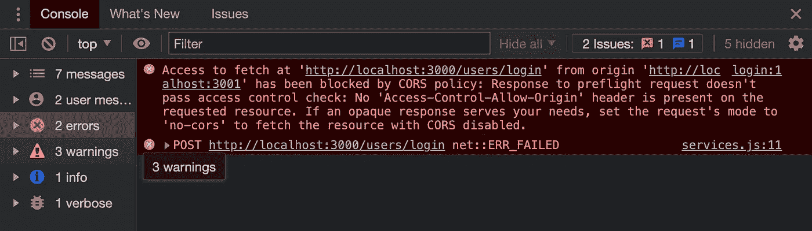
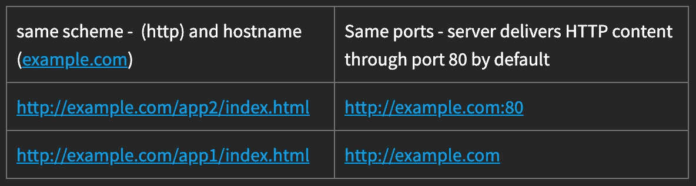
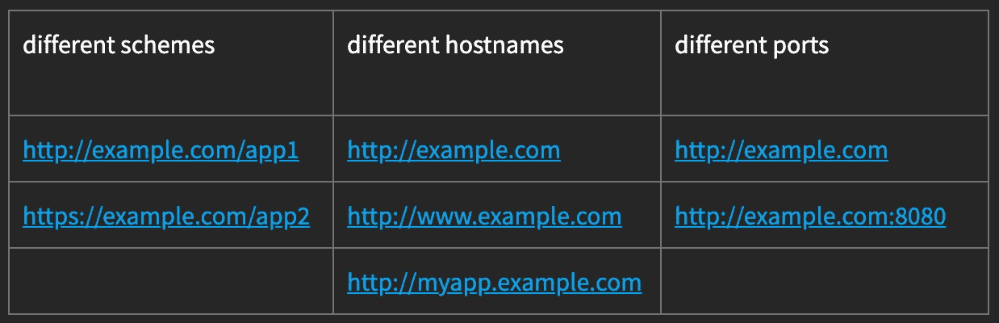

# 解决 CORS 政策错误

> 原文：<https://itnext.io/resolving-cors-policy-error-c4cd11b012b?source=collection_archive---------2----------------------->

## 什么是同源策略？以及如何绕过？


CORS 错误-同源策略

认得这个吗？？？



是啊！！！CORS 错误。它不时抬起愤怒的头。

# 这是什么？

首先要理解的是，这不是传统意义上的错误，而是一种保护用户免受互联网上可能发生的潜在不良事件影响的安全措施。这种安全措施被称为同源策略。

我试图定义它:

> 同源策略限制网页请求具有不同来源的另一网页上的数据。

想象一个浏览器没有实现同源策略的情况。

任何网页都可以请求来自任何来源的数据，这意味着任何恶意网站都可以使用存储的 cookie 或会话数据来访问您已经打开的任何社交媒体帐户、银行，甚至更糟。


如果没有同源政策，世界可能会变成这样:

> 1.用户登录电子邮件帐户，创建会话 cookie 并存储在浏览器上。
> 
> 2.用户登录到 sketchysite.com。sketchysite.com 使用 cookies 向电子邮件帐户发送请求。返回的数据被捕获并出售。
> 
> 3.下次你使用信用卡时，你会发现它已经透支了

**同源例子**



同源的例子

**不同起源的例子**



**不同产地的例子**

# 如何绕过它

很自然，会出现这样的情况，我们需要安全地绕过这一政策，而 CORS 就是这样做的一种方式。

Mozilla 将 CORS 定义为

> **跨来源资源共享** ( [CORS](https://developer.mozilla.org/en-US/docs/Glossary/CORS) )是一种基于 [HTTP](https://developer.mozilla.org/en-US/docs/Glossary/HTTP) 报头的机制，允许服务器指示除其自身以外的任何[来源](https://developer.mozilla.org/en-US/docs/Glossary/Origin) s(域、方案或端口),浏览器应该允许从这些来源加载资源。

**选项 1** 🙅‍♂️

嗯，我们实际上可以在客户端做一个改变，通过传递模式:HTTP 请求中的“no-cors”来绕过 CORS。尽管这不是推荐的解决方案。

*注意,“无 cors”只允许有限的一组方法，并防止标头成为除了* [*简单标头*](https://fetch.spec.whatwg.org/#simple-header) 之外的任何标头

```
fetch(url, {
 method: ‘POST’,
 mode: ‘cors’, // no-cors, *cors, same-origin,
 headers: {‘Content-Type’: ‘application/json’}
})
```

**选项 2** 🙅‍♂️

另一个我不推荐的解决方案是在你的浏览器上添加一个插件来绕过跨源策略。这些通常表现得像一个代理，但是会让你容易受到攻击。

流行的插件包括:

[](https://chrome.google.com/webstore/detail/allow-cors-access-control/lhobafahddgcelffkeicbaginigeejlf?hl) [## 允许 CORS:访问控制允许来源

### 轻松地将(Access-Control-Allow-Origin: *)规则添加到响应头中。

chrome.google.com](https://chrome.google.com/webstore/detail/allow-cors-access-control/lhobafahddgcelffkeicbaginigeejlf?hl) [](https://chrome.google.com/webstore/detail/cors-unblock/lfhmikememgdcahcdlaciloancbhjino?hl=en) [## CORS 解锁

### 启用时，通过将“Access-Control-Allow-Origin: *”标头附加到本地和远程 web 请求，不再出现 CORS 错误

chrome.google.com](https://chrome.google.com/webstore/detail/cors-unblock/lfhmikememgdcahcdlaciloancbhjino?hl=en) 

**选项三**💁‍♂️

解决方案应该在服务器端。对于 Node 和 Express 我们可以下载 cors 包【https://www.npmjs.com/package/cors 

`$ npm install cors`

这个包将允许我们添加一个响应头`access-control-allow-origins`并指定允许哪些源。

```
// Default = CORS-enabled for all origins 
app.use(cors())// restrict to certain origin
app.use(cors({origin: “http://localhost:3001"})) 
```

Viola 在不影响安全性的情况下完全控制公认的来源

我希望你已经发现这是有用的，感谢您的阅读。如果你喜欢这个，你可能也会喜欢我们在[创造的其他一些博客帖子和创意！！书呆子](https://www.notnotnerdy.com/)。每个月都会推出新的设计。