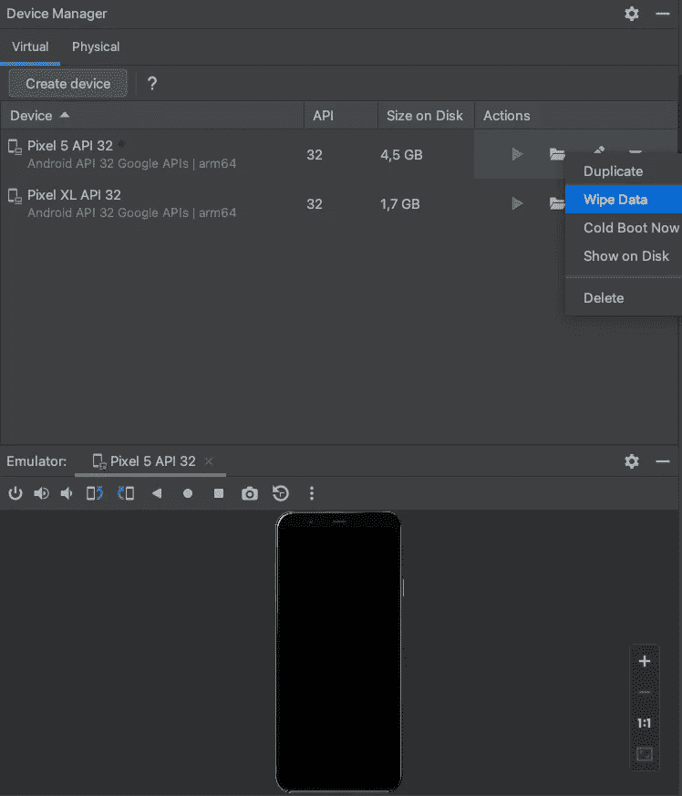
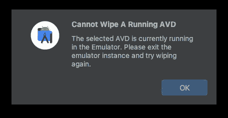
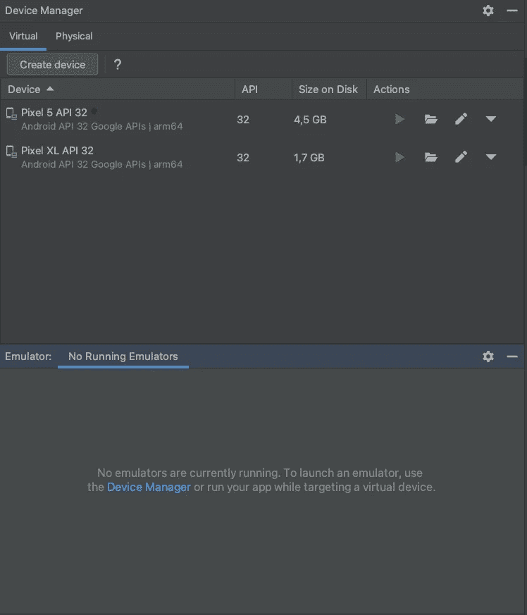
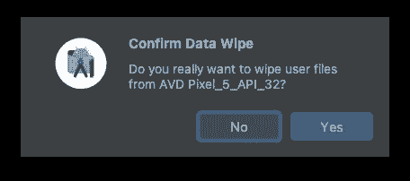

# 解决 Android Studio 中的存储不足错误

> 原文：<https://itnext.io/resolving-insufficient-storage-error-in-android-studio-714d363e35f0?source=collection_archive---------1----------------------->


由 [Rami Al-zayat](https://unsplash.com/@rami_alzayat?utm_source=medium&utm_medium=referral) 在 [Unsplash](https://unsplash.com?utm_source=medium&utm_medium=referral) 拍摄的照片

我在 Android Studio 中经常遇到的最令人讨厌的错误之一是在虚拟设备上启动应用程序时抱怨存储不足:`INSTALL_FAILED_INSUFFICIENT_STORAGE`。

```
05/31 16:08:52: Launching 'DebugViewPreview' on Pixel 5 API 32.
Installation did not succeed.
The application could not be installed: INSTALL_FAILED_INSUFFICIENT_STORAGE

List of apks:
[0] '/Users/.../MyProject/build/MyProject-0.1.0-1.apk'
The device needs more free storage to install the application (extra space is needed in addition to APK size).
Retry
Failed to launch an application on all devices
```

解决方法很简单:打开设备管理器(在工具菜单下)。然后点击您要安装应用程序的设备右侧的向下箭头，并选择“擦除数据”。



小心接下来的对话！不要只是点击它。如果设备仍在运行，什么也不会发生。不会擦除任何数据，因此您仍然无法在设备上安装应用程序。



为了让 Android Studio 真正能够擦除数据，需要关闭并关闭设备。设备名称旁边的绿点需要消失。

单击“x”关闭设备选项卡时，需要几秒钟时间，直到绿点消失。



现在，设备已经关闭，您将最终能够擦除所有数据，以便最终再次在设备上安装您的应用程序。



希望这能节省你一点时间！

感谢您的阅读！

*   如果你喜欢这个，请[在 Medium](https://twissmueller.medium.com/) 上跟随我
*   给我买杯咖啡让我继续前进
*   通过[在这里注册](https://twissmueller.medium.com/membership)来支持我和其他媒体作者

[](https://twissmueller.medium.com/membership) [## 通过我的推荐链接加入媒体

### 阅读托拜厄斯·维斯缪勒(Tobias Wissmueller)的每一个故事(以及媒体上成千上万的其他作家)。您的会员费直接…

twissmueller.medium.com](https://twissmueller.medium.com/membership)