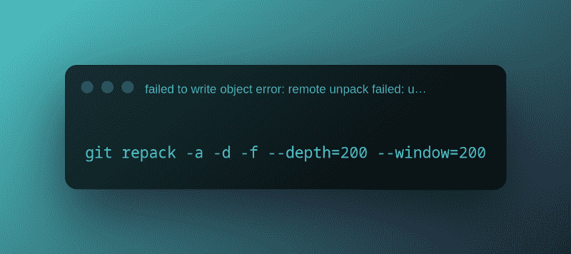
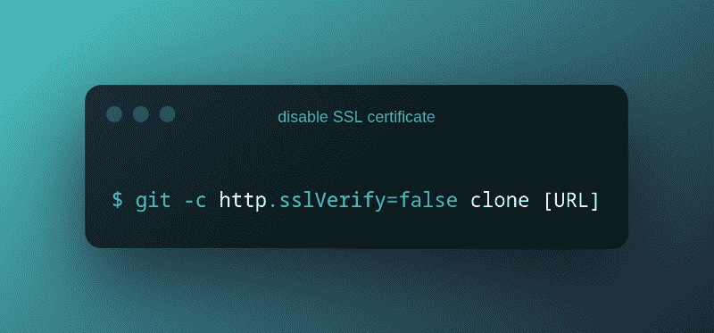
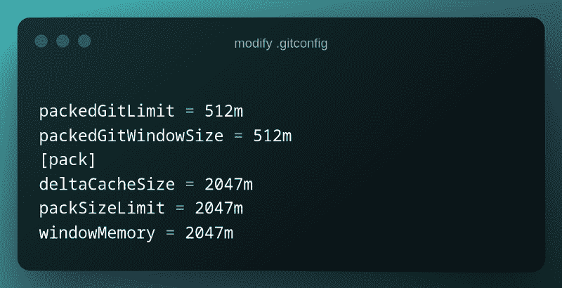
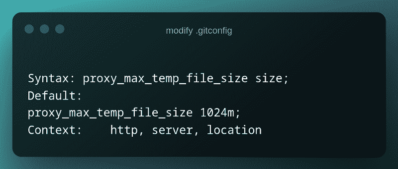

# 解决 Git 的网络相关错误

> 原文：<https://itnext.io/resolving-network-related-errors-for-git-57922c0be63b?source=collection_archive---------4----------------------->

罗曼·辛克维奇在 [Unsplash](https://unsplash.com/photos/wX2L8L-fGeA) 上拍摄的照片

如果你是一名开发人员，我相信你非常依赖 VCS(版本控制系统)来维护新特性的版本，并灵活地添加、合并和恢复变更。

Git 是开发人员生活中不可或缺的一部分。但是，不幸的是，当你非常依赖某样东西时，错误和失败就迫在眉睫。

困难的是，要找到一个快速且相关的解决方案，需要进行大量的研究。我从亲身经历中了解到这一点。

因此，我想我可以尝试通过整理一些最常见的与 git 网络相关的错误，并看看如何轻松地修复它们，来减少一些痛苦。

让我们注意一些麻烦的与网络相关的 git 错误:

1.  无法写入对象错误:远程解包失败:解包-对象异常退出
2.  无法获取本地颁发者证书
3.  早期 EOF 致命:索引包失败
4.  远端意外挂断致命:索引包失败

上面提到的错误是一些常见的错误。因此，让我们找出如何解决它们。

# 1.无法写入对象错误:远程解包失败:解包-对象异常退出

这个错误消息可能会吓到你。但是相信我，当您的 git 本地和远程版本不断追加新的提交时，这个错误是很常见的。

如果本地存储库损坏或远程存储库空间耗尽，可能会出现此错误。

我们有不止一种方法来解决这个问题。

**修复 1-**[**git-repack**](https://git-scm.com/docs/git-repack)**:**新建目录，克隆出错的 repo，重新打包，推送。****

****Pack 是单个增量压缩对象的集合，其相关联的索引存储在单个文件中。****

****重新打包用于将当前不在一个“包”中的所有对象组合成一个包。****

********

******git re pack-a-d-f—depth = 250—window = 250******

******修复 2-** 在远程回购中释放空间或购买更多空间。****

# ****2.无法获取本地颁发者证书****

****配置是获得更好结果的关键。当配置错误时，您可能会以难以跟踪或修复的错误而告终。****

****在使用任何 REST 服务时，客户端和服务器端都必须进行 HTTPS 握手，以建立安全的通信连接。如果无法验证 SSL 证书，git 就无法完成与托管存储库的服务器的 HTTPS 握手。此时会出现[无法获取本地发行者证书](https://komodor.com/learn/how-to-fix-ssl-certificate-problem-unable-to-get-local-issuer-certificate-git-error/)的错误。****

******修复 1-** 将证书添加到可信证书库中。****

****在 Windows 上，转到位于以下位置的可信证书存储:****

****c:\ Program Files \ Git \ mingw 64 \ SSL \ certs \****

****通过将 git [SSL](https://docs.gitlab.com/ee/administration/troubleshooting/ssl.html) 证书粘贴到文件末尾来修改 ca-bundle.crt。之后，您可以执行 git pull、push 或 clone 命令。****

******修复 2-** 禁用 SSL 证书验证(不推荐)****

****在本地禁用 git SSL 证书验证。****

********

******git-c http . SSL verify = false clone[URL]******

****您还可以在全局级别禁用 SSL 证书验证。****

********

******git 配置—全局 http.sslVerify false******

****要重新启用 SSL 证书验证，请使用以下命令:****

********

******git 配置—全局 http.sslVerify false******

******修复 3-** 重新安装 git，并在安装过程中选择 SSL 传输后端选项。****

# ****3.早期 EOF 致命:索引包失败****

****由于 git 的内存需求，当您尝试通过连接到远程服务器并从另一台机器运行 fetch 命令来从一台机器克隆 repo 时，会出现此错误。****

******修复 1-** 到截断下来的信息量，你应该先关闭压缩，做一个部分克隆。然后，当工作正常时，进入新目录并检索克隆的其余部分:****

********

******#关闭压缩
git config—global core . compression 0
#执行部分克隆
git 克隆—深度 1<repo _ URI>
#获取并完成克隆
git 获取—取消允许******

******修复 2-** 修改你的全局 git 配置文件，也就是。$USER_HOME 中的 gitconfig。****

********

******packed git limit = 512m
packed git windowsize = 512m
【pack】
delta cachesize = 2047m
packetSizeLimit = 2047m
window memory = 2047m******

# ****4.远端意外挂断致命:索引包失败****

****当试图克隆或获取回购时，如果您在公司网络或 VPN 下，或者如果 Nginx 被配置为反向代理，则可能会出现此错误。****

******修复 1-** 禁用防病毒设置、防火墙设置或 VPN 客户端，以便连接可以绕过错误。****

******修复 2-** 更改. gitconfig 中临时文件大小的默认值。****

********

******语法:proxy _ max _ temp _ file _ size size
默认:
Proxy _ max _ temp _ file _ size 1024m；
上下文:http，服务器，位置******

# ****结论****

****当在项目截止日期前工作时，git 错误可能是一个噩梦般的路障，因为它们需要您花费数小时的时间进行故障排除和寻找修复方法。由于我们都选择使用自己喜欢的操作系统和配置，对我有效的解决方案可能不适合你的情况。有许多潜在的因素，并且总会有不止一个修复来从您的状态中恢复并继续。****

****我希望这篇文章能帮助你改正错误，回到你的发展轨道上来。****