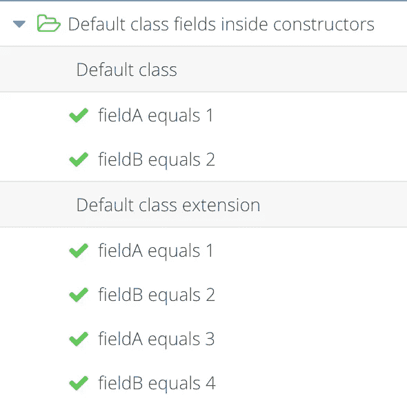
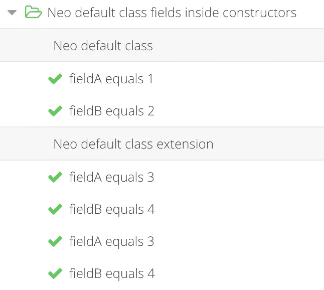
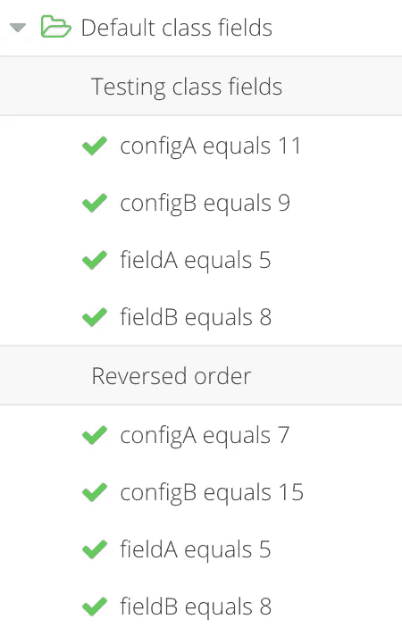
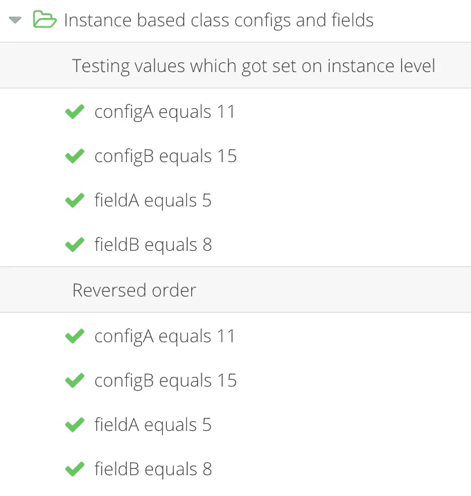
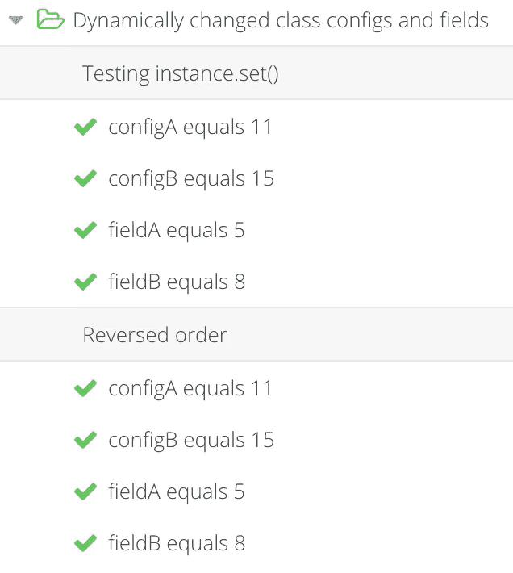
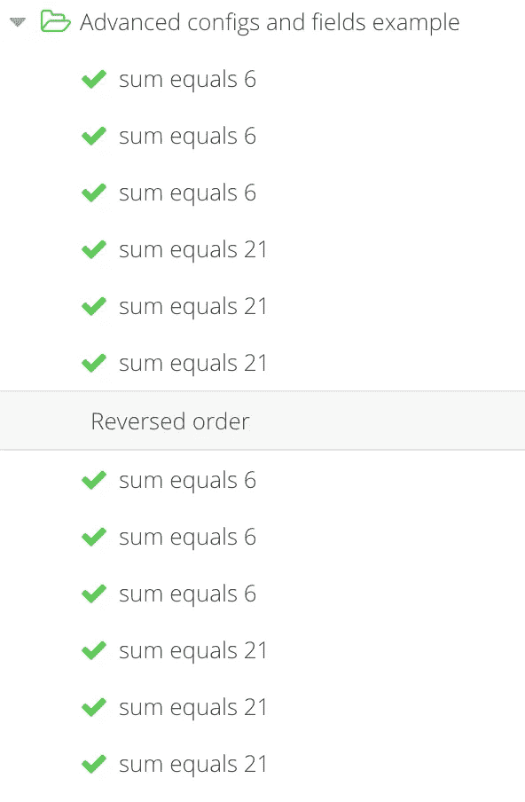
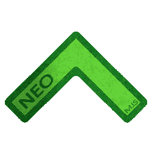

# 解决 ECMAScript 类系统的缺陷

> 原文：<https://itnext.io/resolving-pitfalls-of-the-ecmascript-class-system-856024218399?source=collection_archive---------4----------------------->

本文强调了使用“JavaScript”类系统时的问题以及每个问题的解决方案。我们将讨论自定义类配置系统的好处，以及以一种巧妙的方式将它与类字段结合起来，以解决交叉依赖，并为批量更新创建一致的输出。

# 内容

1.  介绍
2.  重写类扩展中的类字段值
3.  获取类字段的正确值
4.  在调用 super()之前在构造函数中使用它
5.  类字段的顺序对于动态更新很重要
6.  顺序应该无关紧要
7.  测试订单的动态批量更新
8.  高级示例
9.  neo.mjs v3 版本
10.  埃森哲正在德国招聘 neo.mjs 开发人员

# 1.介绍

我将使用基于[午睡](https://www.bryntum.com/products/siesta/)的测试来展示问题及其解决方案。虽然当前版本有点过时，但一个闪亮的全新完整重写版本 6 即将问世:[博客文章](https://www.bryntum.com/blog/siesta-6-0-0-alpha-4-released/)。

解决方案包含在 [neo.mjs](https://github.com/neomjs/neo) 第 3 版中，但是这些概念可以应用于任何 js 环境。

我们讨论的所有测试都运行成功。你可以在这里自己跑:[neo.mjs/test/siesta/index.html](https://neomjs.github.io/pages/node_modules/neo.mjs/test/siesta/index.html#tests/ClassConfigsAndFields.mjs)。

# 2.重写类扩展中的类字段值

让我们从一个非常简单的测试案例开始:

创建基类的实例给了我们预期的结果。然而，当创建扩展类的实例时，基类`constructor`不能访问新的(正确的)值。在其他基于 get / set 的类字段依赖它们的情况下，这尤其是个问题。

# 3.获取类字段的正确值

这种行为更有用，因为我们现在在整个类层次结构中获得了相同的类字段值。

解决方案优雅而简单:虽然我们不能改变默认的运行时问题本身，但我们可以用自定义的`construct`方法替换`constructor`。

简单地说，v3 中的`Neo.create()`功能是:

我们调用真实的`constructor`而不传递任何参数，一旦完成，我们调用我们的自定义`construct`方法。

# 4.在调用 super()之前在构造函数中使用它

自从 ES 类系统发布以来，困扰我的一件事是我们不能在父调用之前使用`this`。

切换到我们定制的`construct`方法允许我们添加我们认为合适的预处理逻辑。

# 5.类字段的顺序对于动态更新很重要

如果我们使用基于 get / set 的字段，情况会变得更糟。我在这里称它们为配置，以使测试用例尽可能接近真实的 neo.mjs 类。

我们正在创建两个实例，唯一的区别是，我们以相反的顺序传递所有字段。

查看测试结果很痛苦:当创建一个新实例时，根据对象键的顺序，我们得到完全不同的输出。

虽然在我们从上到下分配每个键的情况下这是有意义的，但这会导致糟糕的开发体验，因为我们必须非常仔细地考虑顺序。

# 6.顺序应该无关紧要

让我们对新的 neo.mjs 类系统做同样的事情:

两个实例在这里获得完全相同的值，与顺序无关。

它的工作方式是`Neo.core.Base.set()`现在首先分配所有非基于 get / set 的值。

# 7.测试订单的动态批量更新

接下来让我们用相同的值测试批量更新:

我们得到了与创建实例时直接赋值完全相同的结果。

# 8.高级示例

这个例子将让你一瞥类配置系统的全部威力:

三个基于 get / set 的类字段(类配置)正在访问另外两个字段的值。

否则，无论你如何改变顺序，你都无法实现这种一致的行为。

这给了我们处理类似事务的批量更新的能力。

如果你在前端区域工作:
**想想当使用它时状态更新是多么容易。**

显然,`component.Base`扩展了`core.Base`,我们扩展了`set()`方法以确保只有一个虚拟 dom 树比较，不管你在定制 setter 逻辑中为每个改变的配置做了什么。

它的工作方式是`this.configA`是一个吸气剂。使用的`set()`调用将所有新值推入到一个`configSymbol`中，getter 将总是首先检查这个值，在预处理逻辑存在的情况下触发它，并从内部符号中删除新值。这以一种聪明的方式解决了交叉依赖。

# 9.neo.mjs v3 版本

如果您不熟悉创建超高速多线程前端的“应用程序工作者是主角”范例，我强烈推荐您阅读这篇博文:

 [## 2022 年最佳前端发展策略

### 这篇文章是有挑战性的，两极分化的，发人深省的。它涵盖了很多新鲜的内容和想法…

itnext.io](/the-best-frontend-development-strategies-in-2022-cb02dd7aa48b) 

v3 版本不关注性能或新功能，而是完全关注开发人员的体验，以使我们的生活更加轻松。

在所有浏览器和 webpack 支持类字段之前，类配置系统就已经存在了。由于类配置是在`constructor`方法中设置的，这就产生了将它们与类字段结合的问题，除非类字段值只在以后需要。

我很高兴这个问题现在得到了解决:)

因为这是一个突破性的改变，所以需要一个新的主要版本。

 [## GitHub - neomjs/neo:应用工人驱动的前端框架

### neo.mjs 使您能够使用一个以上的 CPU 创建可扩展的高性能应用程序。不需要照顾一个…

github.com](https://github.com/neomjs/neo) 

**迁移:**
如果你想迁移到新版本，你唯一需要做的就是把你的应用中与 neo 相关的`constructor`方法替换成新的`construct`方法。你还需要把你的`super(config)`电话换成`super.construct(config)`。就这么简单。

**关于实现的细节:**
如果您对它如何工作感到好奇，或者如果您想在 neo 范围之外使用这些概念，我建议您研究以下两个文件: [core/Base.mjs](https://github.com/neomjs/neo/blob/dev/src/core/Base.mjs) 和 [Neo.mjs](https://github.com/neomjs/neo/blob/dev/src/Neo.mjs) 。

欢迎您加入 Slack 频道，获取反馈和想法:

 [## 松弛的

### 编辑描述

join.slack.com](https://join.slack.com/t/neomjs/shared_invite/zt-6c50ueeu-3E1~M4T9xkNnb~M_prEEOA) 

**路线图:**
我们现在可以将几个非基于 get / set 的配置转换成真正的类字段。对我来说，最重要的重点是创建一个新的学习部分，使快速上手变得更容易。非常感谢对此的任何帮助！

# 10.埃森哲正在德国招聘 neo.mjs 开发人员

虽然我能够主要靠自己来推动框架开发，但在此基础上为有需要的客户提供帮助和支持是非常棘手的。

为了解决这个问题，我在 9 月份加入了埃森哲。该公司正在德国创建一个新的云技术工作室(Kaiserslautern)，目标是将这个工程中心扩大到 500 名开发人员。

我的新前端领导角色使我能够为相关的应用程序开发创建一个 neo.mjs 专家知识库。我们现在可以在此基础上提供企业级框架支持和培训，以确保客户项目成功运行。

不用担心，该框架将保持开源。

如果你喜欢公司的理念:“创新”，并准备好迎接挑战，重新定义前端开发的工作方式，欢迎你加入这个团队。激励措施很有吸引力。

目前，这些角色仅限于德国:

 [## 高级 neo.mjs 前端开发人员/架构师(所有性别)

### 我们陈苏人有自己的生活和工作。个人国家制服。维尔法特州…

www.accenture.com](https://www.accenture.com/de-de/careers/jobdetails?id=R00057924_de) 

问候&快乐编码，
托拜厄斯

