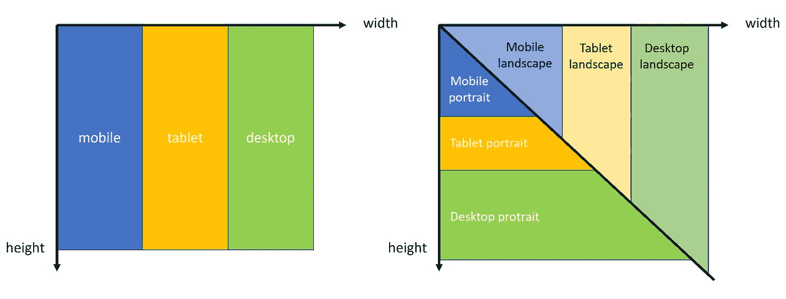
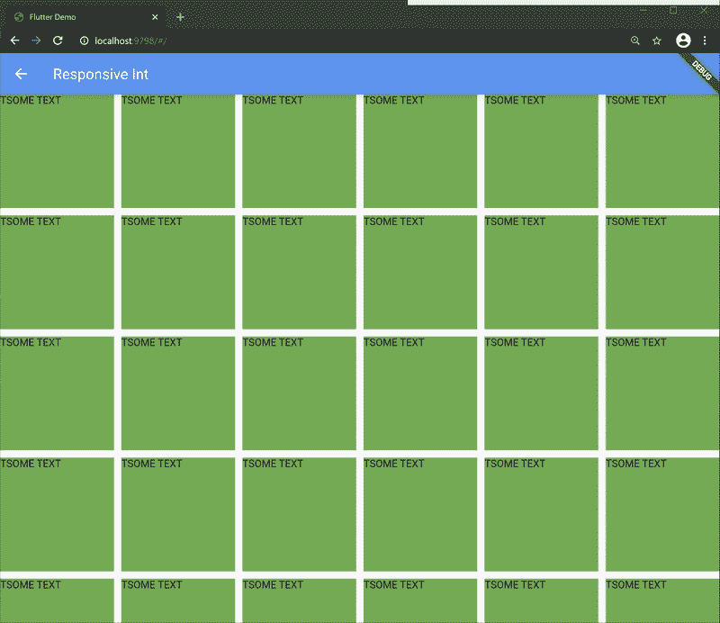
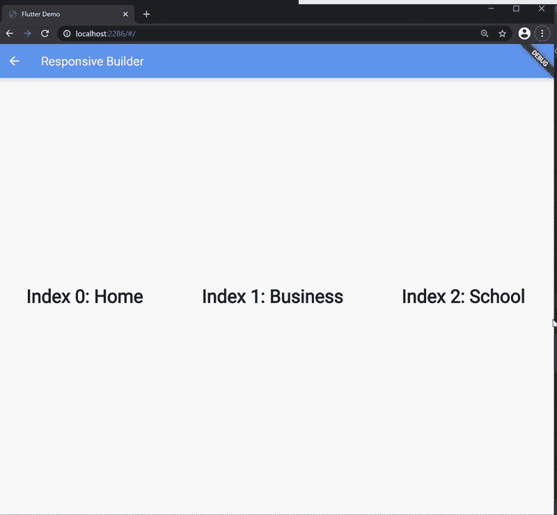

# 颤振中不同层次的响应设计

> 原文：<https://itnext.io/responsive-design-at-different-levels-in-flutter-197443e7f50?source=collection_archive---------4----------------------->

响应式设计对于那些希望使用单一代码库面向不同平台的人来说非常重要。这对于颤振的发展尤其如此，因为颤振的目标是所有主要的平台。

# 如何做响应式设计？

颤振响应设计可以用许多方法来实现。最简单的方法是使用 MediaQuery 小部件获取当前屏幕信息:

```
Size screenSize = MediaQuery.of(context).size;
Orientation orientation = MediaQuery.of(context).orientation;
```

然后，基于这些信息，以不同的方式构建您的小部件。

或者您可以使用一个软件包来简化这个过程。它们通常为您提供如下界面:

```
ResponsiveBuilder(
    builder: (context, sizingInformation) {
      *// Check the sizing information here and return your UI*
          **if** (sizingInformation.deviceScreenType == DeviceScreenType.desktop) {
          **return** Container(color:Colors.blue);
        }

        **if** (sizingInformation.deviceScreenType == DeviceScreenType.tablet) {
          **return** Container(color:Colors.red);
        }

        **if** (sizingInformation.deviceScreenType == DeviceScreenType.watch) {
          **return** Container(color:Colors.yellow);
        }

        **return** Container(color:Colors.purple);
      },
    },
  );
}
```

或者为您提供一些预定义的屏幕类型:

```
ScreenTypeLayout.builder(
  mobile: (BuildContext context) => Container(color:Colors.blue),
  tablet: (BuildContext context) => Container(color:Colors.yellow),
  desktop: (BuildContext context) => Container(color:Colors.red),
  watch: (BuildContext context) => Container(color:Colors.purple),
);
```

(以上代码示例来自 [responsive_builder](https://pub.dev/packages/responsive_builder) 包)。

# 受材料状态属性启发的不同界面

我们希望在编写响应性代码时实现良好的灵活性。有时候我们只是希望单个值(比如 GridView 中的 crossAxisCount 整数)是灵活的。有时，我们希望不同的屏幕有完全不同的 UI 设计(例如，移动设备的 TabBarView 和桌面设备的 Row)。因此，我们应该能够让一个**整数**或一个**小部件**做出响应，而不需要反复编写 if/switch 语句。此外，人们对在哪里设置断点持有不同的意见。所以我们应该让人们轻松地定义自己的断点。

内置的材质组件(如 ElevatedButton)根据它是被按下、悬停还是被选择来改变它们的外观。这些组件不使用单一颜色实例作为它们的背景色。相反，它们使用 MaterialStateProperty，这将根据组件的内部状态生成不同的颜色值。

```
property?.resolve(_states)
```

如果我们使用一个类似的接口进行响应会怎么样？

一个状态现在将是一些我们想要作为目标的屏幕配置。我把它命名为屏幕范围:

```
class ScreenScope {
  final double minWidth;
  final double maxWidth;
  final double minHeight;
  final double maxHeight;
  final Orientation? orientation;
  ...
}
```

我提供了一些预定义的屏幕范围:

```
mobileScreenScope (0px - 480px width)
tabletScreenScope (480px - 840px width)
desktopScreenScope (840px -  width)

mobilePortraitScreenScope (0px - 480px width, portrait)
tabletPortraitScreenScope (480px - 840px width, portrait)
desktopPortraitScreenScope (840px - width, portrait)

mobileLandscapeScreenScope (0px - 840px width, landscape)
tabletLandscapeScreenScope (840px - 1200px width, landscape)
desktopLandscapeScreenScope (1200px - width, landscape)
```



具有 2 个断点和不同方向的屏幕镜

如果只使用一个断点:

```
smallScreenScope (0px - 600px width)
bigScreenScope (600px -  width)

smallPortraitScreenScope (0px - 600px width, portrait)
bigPortraitScreenScope (600px - width, portrait)

smallPortraitScreenScope (0px - 1000px width, landscape)
bigPortraitScreenScope (1000px - width, landscape)
```

然后声明一个响应实例，并通过对其调用 resolve 来获取实际值。

```
GridView.count(
  crossAxisSpacing: 10,
  mainAxisSpacing: 10,
  crossAxisCount: Responsive({
        mobileScreenScope: 2,
        tabletScreenScope: 4,
        desktopScreenScope: 6
      }).resolve(context)!,
  children: List.generate(
      30,
      (index) =>
          Container(color: Colors.*green*, child: Text("SOME TEXT"))),
);
```



响应式网格

如果您想在不同的屏幕上使用不同的小工具:

```
Widget widget = Responsive({
    mobileScreenScope: mobileWidget,
    tabletScreenScope: tabletWidget,
    desktopScreenScope: desktopWidget,
  }).resolve(context);
```

我还创建了一个叫做 ScreenBuilder 的助手小工具，可以帮你节省一些时间:

```
ScreenBuilder(
  mobile: mobile,
  tablet: tablet,
  desktop: desktop,
  );

ScreenBuilder.builder(
  mobileBuilder: mobileBuilder,
  tabletBuilder: tabletBuilder,
  desktopBuilder: desktopBuilder,
  )
```

构建器语法使用 WidgetBuilder，因此您可以访问 BuildContext。



响应式 wiget 生成器

# 结论

这就是 [responsive_property](https://pub.dev/packages/responsive_property) 包。目标很简单:响应性设计的灵活性，同时避免您编写 if 语句。如果您有任何建议或发现任何 bug，请随时在 Github 上打开问题。谢谢大家！