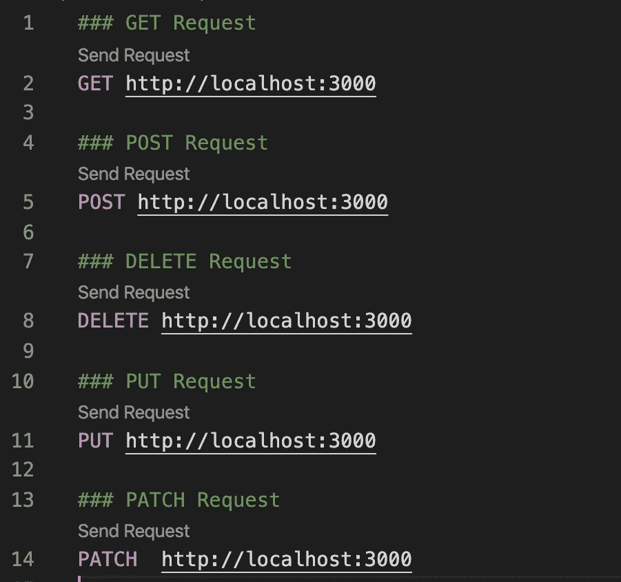

# 使用 Node.js 和 Express 进行 RESTful API 开发:编码入门(第 2 部分)

> 原文：<https://itnext.io/restful-api-development-with-node-js-and-express-getting-started-with-coding-part-2-7c79e27fafbb?source=collection_archive---------3----------------------->


图片来源:Unsplash 图片作者:阿迪·戈尔茨坦

这是用 Node.js 和 Express 开发 RESTful API 的第二部分。我希望您已经完成了第一部分并创建了您的项目环境。如果你没有看过第一部分，可以在这里查看[。在这一部分，我们将开始构建我们的 RESTful API。](https://medium.com/@humayun.ashid/restful-api-development-with-node-js-9b14dde70c90)

你会发现所有来自 Github 的代码:

```
[https://github.com/humayun-rashid/first-rest-api-medium.git](https://github.com/humayun-rashid/first-rest-api-medium.git)
```

我们将首先创建一个具有首选名称的新目录。在我的例子中，我将其命名为“first-rest-API”。打开终端，键入以下命令创建一个新目录，并导航到新创建的目录。

```
$ sudo mkdir rest-API-project
$ cd rest-API-project
```

导航到目录后，可以通过将以下命令写入目录来打开 visual studio 代码。

```
$ code .
```

或者，您可以在 Github 中创建一个存储库，使用您喜欢的项目名称，比如“first-rest-api”。如果您已经按照上一篇文章安装了 git，那么您应该能够通过下面的命令克隆存储库。

```
$ git clone "git repo url"
```

然后导航到该目录，通过运行以下命令启动 visual studio 代码。

```
$ cd rest-API-project
$ code .
```

## 由 NPM 初始化生成 Package.json

我们现在将通过生成“package.json”文件开始开发 RESTful API，该文件将包含所有的依赖项。在开发过程中添加更多依赖项时，该文件将被更新。要生成“package.json ”,请在终端中运行以下命令，该命令将请求一些问题的答案以生成文件。要自动填充，可以在命令末尾添加问题“-y”。

```
$ npm init
$ npm init -y
```

将在项目的根目录中创建一个“package.json”文件，如下所示。

```
{
  "name": "first-rest-api-medium",
  "version": "1.0.0",
  "description": "",
  "main": "index.js",
  "scripts": {
    "test": "echo \"Error: no test specified\" && exit 1"
  },
  "repository": {
    "type": "git",
    "url": "git+[https://github.com/humayun-rashid/first-rest-api-medium.git](https://github.com/humayun-rashid/first-rest-api-medium.git)"
  },
  "keywords": [],
  "author": "",
  "license": "ISC",
  "bugs": {
    "url": "[https://github.com/humayun-rashid/first-rest-api-medium/issues](https://github.com/humayun-rashid/first-rest-api-medium/issues)"
  },
  "homepage": "[https://github.com/humayun-rashid/first-rest-api-medium#readme](https://github.com/humayun-rashid/first-rest-api-medium#readme)"
}
```

## 安装 Express Framework 和 Nodemon

下一步，我们需要将 Express 安装到我们的项目目录中，并将其保存在“package.json”的依赖项列表中。如果需要仅用于开发，也可以将依赖项保存为“开发依赖项”。将依赖项安装为开发依赖项的目的是，不要求软件包用户在生产中安装它。

```
$ npm install express — save
```

要临时安装 Express 而不将其添加到依赖项列表中，请执行以下操作:

```
$ npm install express — no-save
```

现在，我们将安装一个非常酷的工具 nodemon，它允许 node.js 应用程序在每次发生更改时自动重启。使用“-g”编写下面的命令，这将允许将软件包安装为全局的，以便可以从任何地方使用它。与 nodemon 的本地安装相关的问题是，nodemon 在您的系统路径中不可用，而 nodemon 的本地安装可以通过从 npm 脚本中调用它来运行。

```
$ npm install -g nodemon
```

也可以在终端中使用以下命令将 Nodemon 安装为开发依赖项。

```
$ npm install — save-dev nodemon
```

## 创建基本服务器

开始编码吧！首先，我们将在项目根目录下创建一个文件，并将其命名为“server.js”。在终端中运行以下命令，或者从 visual studio 代码创建它。

```
$ sudo touch server.js
```

现在，我们将开始在“server.js”中编写代码。首先，我们将导入“快速”模块。对于导入模块，我们将使用“require”功能。

```
require(“express”)
```

导入的模块需要在变量中。变量可以声明为 var、let 或 const。您可以在此找到有关变量声明的详细信息:

```
[https://dev.to/sarah_chima/var-let-and-const--whats-the-difference-69e](https://dev.to/sarah_chima/var-let-and-const--whats-the-difference-69e)
```

用 const 声明的变量保持常数值，但用 var 声明的变量可以更新。我们将把“express”导入到一个常量变量中。然后，将通过“app”变量创建导入模块的实例。“app”是 express 的一个实例。您可以设置环境变量“PORT”来告诉您的 web 服务器监听哪个端口。所以 process.env.PORT || 3000 的意思是:环境变量 PORT 中的任何内容，如果那里什么都没有，则为 3000。因此，您传递 app.listen 或 app.set('port '，…)，这使您的服务器能够接受来自环境的参数，即在哪个端口上侦听。如果您将 3000 硬编码传递给 app.listen()，您将始终在端口 3000 上进行侦听，这可能只是针对您的，也可能不是，这取决于您的要求以及您运行服务器的环境的要求。

```
const express = require(‘express’); // importing Express
const app = express(); // instance of express
const port = process.env.PORT || 3000; // Defining port by environmental parameter or 3000// Create a routing 
app.get(‘/’,function(req,res){
 res.send(‘Server is running.’)
})// App is listening to user-defined port or 300 and printing the information to the console.
app.listen(port, function(req,res){
 console.log(`Server is listening on port ${port}!`)
})
```

使用以下命令运行服务器:

```
$ node server.js
```

现在，转到下面的 URL 来访问服务器。

```
[http://localhost:3000](http://localhost:3000)
```

通过访问这个 URL，我们将通过 web 客户端发送一个 GET 请求。这就是路由的概念。我们将在本节稍后讨论这一点。现在，如果我们要进行更改，我们必须通过按 ctrl + c 停止服务器，然后使用上面的命令再次启动服务器。为了避免通过运行相同的命令反复运行服务器，我们将使用 nodemon。

转到 package.json，将脚本中的 test 替换为以下内容:

```
"scripts": {
"devStart": "nodemon server.js"
}
```

然后，您可以通过使用以下命令使用 nodemon 启动服务器。

```
$ npm start devStart
```

或者，您可以运行以下命令直接启动服务器:

```
$ nodemon server.js
```

现在，只要您对代码进行更改，服务器就会自动重启。目前，我们的服务器运行在端口 3000。我们还可以通过 env 设置或导出端口参数来定义我们的端口。如果您只想运行一次，请运行以下命令。

```
$ PORT=1234 node server.js
```

您不必重启服务器，因为 nodemon 会自动重启。要永久设置端口，请使用以下命令。

```
$ export PORT=3000
$ node server.js
```

对于 Windows，请使用以下命令。

```
$ set PORT=3000
```

对于 Windows PowerShell:

```
$ env:PORT = 3000
```

设置 env 参数的另一种方法是通过 dotenv 包。

```
npm install dotenv
```

将这一行添加到服务器的开头。

```
require(‘dotenv’).config()
```

在项目的根目录下创建一个. env 文件。增加

```
PORT = 3000
```

创造。gitignore 因为不想导入。env 到 git。

所以，我们的基本服务器正在运行。但是目前还没有配置路由。我们将讨论路由并配置一些端点。

## 按指定路线发送

路由是指确定应用程序如何响应客户端对特定端点的请求，这是一个 URI(或路径)和一个特定的 HTTP 请求方法(GET、POST 等)。每个路由可以有一个或多个处理函数，当路由匹配时执行这些函数。路线定义采用以下结构:

路线定义采用以下结构:

```
app.METHOD(PATH, HANDLER)
```

方法是一个 HTTP 请求方法，小写。PATH 是服务器上的路径。处理程序是匹配路由时执行的功能。写下以下代码，使用 GET、POST、PUT 和 DELETE 方法创建路由。

```
require('dotenv').config()
const express = require('express'); 
const app = express(); // instance of express
const port = process.env.PORT || 3000; // GET requestapp.get('/', function (req, res) {
res.status(200).send('Server is up and running.')
})// POST requestapp.post('/', function (req, res) {
res.status(200).send('This is a POST request')
})// PUT Requestapp.put('/', function (req, res) {
res.status(200).send('This is a PUT request')
})// PATCH Requestapp.patch('/', function (req, res) {
res.status(200).send('This is a PATCH request')
})// DELETE Requestapp.delete('/', function (req, res) {
res.status(200).send('This is a DELETE request')
})// App is listening to user-defined port or 300 and printing the information to the console.app.listen(port, function (req, res) {
console.log(`Server is listening on port ${port}!`)
})
```

要测试您的路由，您需要有 POSTMAN 或任何其他 API 端点测试工具。但是为了简单起见，我将使用 REST Client，visual studio 代码中的一个扩展来测试端点。您可以通过快速打开(`Ctrl+P`)并粘贴以下命令，在 VS 编辑器中安装它:

```
ext install humao.rest-client
```

让我们创建一个扩展名为 rest 的新文件。我正在创建一个 test.rest 来测试端点。现在写下以下内容开始测试。

```
### GET Request
GET [http://localhost:3000](http://localhost:3000)### POST RequestPOST [http://localhost:3000](http://localhost:3000)### DELETE RequestDELETE [http://localhost:3000](http://localhost:3000)### PUT RequestPUT [http://localhost:3000](http://localhost:3000)### PATCH RequestPATCH [http://localhost:3000](http://localhost:3000)
```

请求上方应该有一个“发送请求”。你需要按下它来测试你的端点。



如果请求成功，您应该会看到类似如下的输出:

```
HTTP/1.1 200 OK 
X-Powered-By: Express 
Content-Type: text/html; 
charset=utf-8 
Content-Length: 25 
ETag: W/"19-mtGkfbkTqxz/NZr8uVnRPTJZzm8" 
Date: Fri, 03 Apr 2020 21:18:53 GMT 
Connection: close **Server is up and running.**
```

如果端点不工作，它应该返回类似如下的 404 错误:

```
HTTP/1.1 404 
Not Found X-Powered-By: Express 
Content-Security-Policy: default-src 'none' 
X-Content-Type-Options: nosniff Content-Type: text/html; charset=utf-8 Content-Length: 140 
Date: Fri, 03 Apr 2020 21:20:29 GMT 
Connection: close  
<!DOCTYPE html> 
<html lang="en"> 
<head> <meta charset="utf-8"> 
<title>Error</title>
 </head> 
<body> <pre>**Cannot GET** /r</pre> </body> 
</html>
```

## 文件夹结构

我们刚刚编写的代码工作得很好，但是为了使它标准化，我们不应该把我们所有的代码放在一个脚本中，随着时间的推移，它将是一个包含大量编码的大文件，你会发现很难编写更多的功能。为了解决这个问题，我们将把代码分成几个脚本。在我们的 server.js 中，我们将保持服务器处理代码，我们将创建一个包含所有路由的不同脚本。该脚本可以作为模块导出，并在 server.js 中调用，所有端点都应该像之前一样工作。让我们创建一个名为“routes”的新目录，并创建一个名为“routes.js”的文件。

```
mkdir routes
touch routes/routes.js
```

让我们开始在 routes.js 中编写代码。首先，我们将像以前一样导入 express，然后创建 express 的一个实例，但不是在带有“express()”的“app”变量中，而是我们将如下使用:

```
const express = require(‘express’);
const router = express.Router();
```

让我们从服务器中取出路由代码，并将它们放在 routes.js 中。我们将替换我们的应用程序。方法。最后，我们需要将其导出为模块。

```
// GET requestrouter.get(‘/’, function (req, res) {
res.status(200).send(‘Server is up and running.’)
})// POST requestrouter.post(‘/’, function (req, res) {
res.status(200).send(‘This is a POST request’)
})// PUT Requestrouter.put(‘/’, function (req, res) {
res.status(200).send(‘This is a PUT request’)
})// PATCH Requestrouter.patch(‘/’, function (req, res) {
res.status(200).send(‘This is a PATCH request’)
})// DELETE Requestrouter.delete(‘/’, function (req, res) {
res.status(200).send(‘This is a DELETE request’)
})module.exports = router;
```

现在，我们可以使用 routes.js 作为模块，并可以从我们的 server.js 调用该模块。为此，让我们将下面两行添加到 server.js 中:

```
const router = require(‘./routes/routes’)
app.use(‘/’,router)
```

现在服务器中将没有路由。server.js 的最终代码如下所示:

```
require(‘dotenv’).config()const express = require(‘express’); // importing Express
const app = express(); // instance of express
const port = process.env.PORT || 3000; // Defining port by environmental parameter or 3000const router = require(‘./routes/routes’)
app.use(‘/’,router)// App is listening to user-defined port or 300 and printing the information to the console.app.listen(port, function (req, res) {
console.log(`Server is listening on port ${port}!`)
})
```

使用 test.rest 测试端点。它应该返回 200 个 http 代码，所有端点都应该工作正常。

## 将您的代码推送到 Github

现在您已经完成了编码和测试。让我们将您的代码推送到您的 github。我假设您已经安装了 git，否则您可以通过以下命令来安装:

```
$ sudo apt install git$ git config — global user.name “username”$ git config — global user.email “email”
```

运行以下命令将您的代码推送到 github(它可能会要求您提供 git 用户名和密码) :

```
$ git add .$ git ommit -m “Your commit message”$ git push
```

祝贺您第一次开发 rest api！我很喜欢写这前两部分，我希望你也喜欢阅读和创建你的第一个 API。在下一部分中，我将讨论一些更重要的话题。如果你在阅读这篇文章的过程中遇到任何困难，可以问我任何问题。