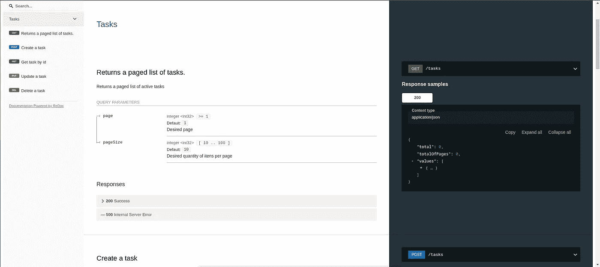
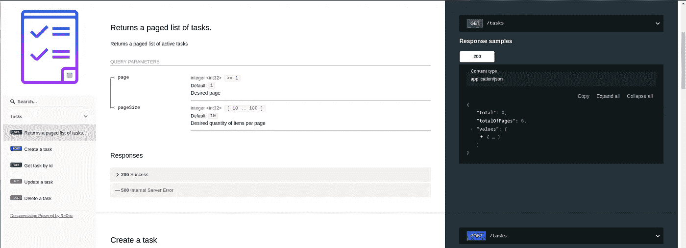
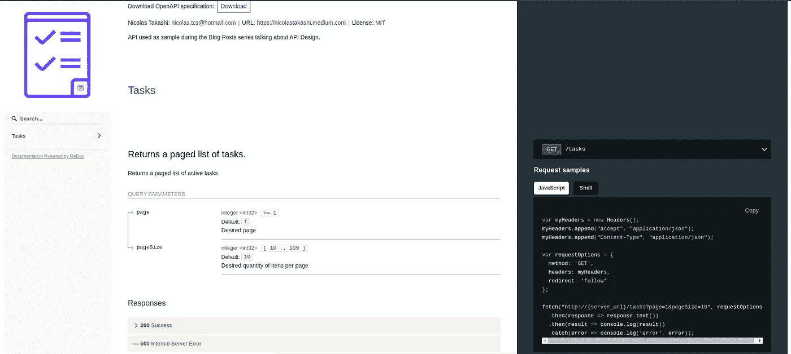

# 使用 API 优先的方法设计 Restful APIs 文档

> 原文：<https://itnext.io/restful-apis-api-documentation-d911664c16a6?source=collection_archive---------3----------------------->

在过去的几个月里，我一直在写关于如何使用 OpenAPI 开发更好的 API 的文章。我们可以看到 OpenAPI 和它的生态系统有多强大。

为了保持标准，并向您展示 OpenAPI 如何提高开发人员的生产力，并为那些使用您的 API 的人提供更好的体验，我将讨论 API 文档。


由 [Kerttu](https://pixabay.com/users/kerttu-569708/) 在 [Pixabay](https://pixabay.com/photos/book-wall-books-wall-decorative-1151405/) 上拍摄的照片

API 开发人员必须牢记的最重要的事情是尽可能提供更好的开发人员体验，并实现这一挑战。我们可能会使用一些很棒的工具和实践。

# 📕API 文档——API 指南

API 文档是促进良好开发体验的基本实践，但是，不幸的是，大多数 API 没有利用这种实践来交付更好的 API。

一个好的 API 文档从一个好的 API 设计开始，所以在这之后，当 API 提供者需要解释一些 API 设计中不清楚的东西时，清晰的描述可以提高客户的理解。其他实践，如**代码样本**和 **API 控制台**将会是开发者体验的蛋糕糖衣。

# [📝](https://emojipedia.org/memo/)ReDoc——成功的文档

ReDoc 是一个开源项目，它的 Github 库[中有超过 11，000 颗星星，它相信文档是 API 的基础。它是一个强大的工具，使用 OpenAPI(以前称为 Swagger)作为事实的来源，为 API 提供了一个文档门户。](https://github.com/Redocly/redoc)

## 创建 API 文档

在官方文档中，有几个构建 ReDoc 项目的选项。今天我将向你展示如何使用 [React Create App](https://github.com/facebook/create-react-app) 建立一个 ReDoc 项目。

> 请记住，我使用的是我在本系列开始时与您分享的同一个 [Git 存储库](https://github.com/nicolastakashi/todoapp-openapidocuments)。

## 开始吧

首先，让我们运行下面的命令来创建一个新的 react 项目。

```
npx create-react-app docs
```

现在我们需要添加 ReDoc 及其依赖项。

```
yarn add redoc mobx styled-components core-js
```

现在，我们可以配置 ReDoc 并查看 API 文档输出。要配置它，您需要编辑 App.js 文件，如下例所示。

ReDoc —反应设置

信不信由你，我们完成了 ReDoc 基本配置。还有更多的选项可以配置，比如主题、模式标题、滚动等等。

让我们将 OpenAPI 文档作为 JSON 捆绑到 docs 文件夹中，使 ReDoc 能够呈现它。为此，您需要运行下面的命令。

```
swagger-cli bundle specs/api.yaml -o ./docs/src/api.json -t json
```

# 🧑‍💻睁大眼睛

毕竟，我们将看到 ReDoc 是什么样子，以及我们可以做些什么来改进 ReDoc 使用 OpenAPI 作为事实来源创建的 API 文档。

但是为了不失去习惯，运行另一个命令来启动文档项目。

```
yarn start
```

现在你可以享受它的样子了。



ReDoc — API 文档

正如您在上面看到的，它看起来很棒，并且配置所需的一切都很简单。

## Brading 您的文档

为了让它更加激动人心，你可以添加一个 API 标志，将下面的内容添加到 info 部分的 OpenAPI 中。

```
x-logo:
    url: "[https://img.icons8.com/nolan/452/todo-list.png](https://img.icons8.com/nolan/452/todo-list.png)"
    backgroundColor: "#FFFFFF"
    altText: "Logo"
```

之后，重启应用程序以查看下面的输出。



ReDoc —品牌文档

## 赠送给 API 消费者的礼物

将 API 设计与 API 文档相结合，开发人员几乎拥有了使用 API 所需的一切。

如果您希望在 API 使用过程中进一步改善开发人员的体验，您可以提供代码示例。

令我们高兴的是，redoc 很好地支持了这一点，添加了一个名为`x-codeSamples`的扩展，包含您想要提供的样本列表。

代码样本支持最流行的语言，你可以点击[这里](https://github.com/github/linguist/blob/master/lib/linguist/popular.yml)查看可用列表。

代码示例结构如下所示。

```
lang: JavaScript
source: console.log('Hello World');
```

在本文中，我将在一个单独的文件中使用示例，以提高可读性，因为代码示例可能非常广泛。代码示例将位于以下目录结构下。

```
.
├── js
│   ├── tasks
│   │   ├── get.yaml
│   │   └── post.yaml
│   └── tasks-by-id
│       ├── delete.yaml
│       ├── get.yaml
│       └── put.yaml
└── shell
    ├── tasks
    │   ├── get.yaml
    │   └── post.yaml
    └── tasks-by-id
        ├── delete.yaml
        ├── get.yaml
        └── put.yaml
```

现在，我可以将代码示例扩展添加到 OpenAPI path 部分，并重启应用程序以查看下面的结果。



ReDoc —代码示例

现在，与 API 交互变得更加容易，我们可以创建您想要向 API 消费者提供多少样本。

# 🏁结论

正如我们所看到的，ReDoc 使用以前在 API 设计会议中创建的 OpenAPI 文档作为事实的来源，不费吹灰之力就提供了一个很好的 API 文档门户。

ReDoc 一直在发展，在项目 backlog 中有一个 API 控制台特性，对我来说，这个特性将使项目更上一层楼。

像往常一样，所有代码都可以在 [Github 库](https://github.com/nicolastakashi/todoapp-openapidocuments)中获得。让我知道你认为这个策略怎么样？你已经知道了吗？

评论下面，大家来分享一下经验吧。

我希望你喜欢它，并很快见到你。