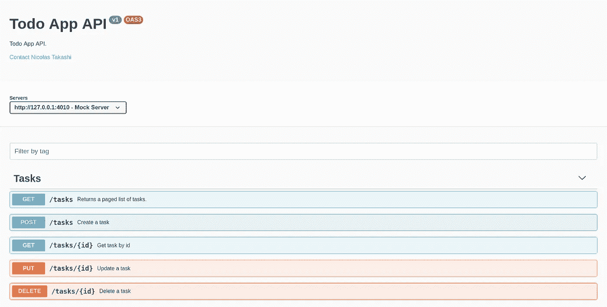
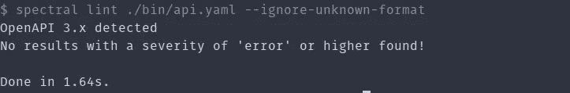
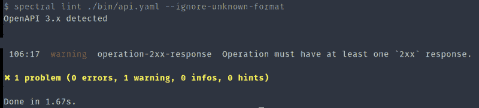

# 使用 API 优先的方法设计 Restful APIs

> 原文：<https://itnext.io/restful-using-api-first-cd305e59305d?source=collection_archive---------5----------------------->

我从事 RESTFul APIs 已经有一段时间了，我喜欢做的一件事就是谈论 API。

因此，今天我将向您展示如何使用 API 优先的方法构建 API，并使用 OpenApi 规范进行设计优先。


[丹尼尔·麦卡洛](https://unsplash.com/@d_mccullough?utm_source=unsplash&utm_medium=referral&utm_content=creditCopyText)在 [Unsplash](https://unsplash.com/s/photos/drafting?utm_source=unsplash&utm_medium=referral&utm_content=creditCopyText) 上拍照

首先，如果你不知道 API 优先的方法是什么意思，最好停止阅读这篇文章，看看我写给 Farfetchs 博客的[博文](https://www.farfetchtechblog.com/en/blog/post/why-can-api-first-improve-an-api/)，在那里我解释了使用 API 优先启动 API 所需要知道的一切。

# 📋—准备场地

在您动手之前，让我们先做好准备，了解将要开发的用例。

## 工具

如果你想复制这里将要展示的例子，你需要下面的一些物品。

*   NodeJS
*   OpenAPI 规范
*   文本编辑器(我将使用 VSCode)
*   命令行

## 用例

为了保持简单易懂，让我们使用 Todo List 应用程序，这是一个超越软件开发社区的非常常见的概念。

## 放弃

我将隐藏一些信息，以便从 gist 文件中轻松阅读，但在这篇文章的结尾，我将共享 Github 资源库链接，这样您就可以访问完整的内容。

# 🙌—弄脏你的手

现在，您已经拥有了具有所需依赖项的环境，让我们享受一下乐趣，并开始观察事情的进展。

第一步是为 OpenAPI 规范创建入口点文件，并向该文件添加一些内容。

恢复 OpenAPI 文档

上面的文件是一个 OpenAPI 文档的非常简单的表示，只是为了向您介绍这个概念。

OpenAPI 是一种不言自明的符号，但是如果你还不知道它是如何工作的，我推荐使用官方文档[在规范设计过程中为你提供支持。](https://swagger.io/specification/)

## 写入路径对象

Path 对象保存每个端点的相对路径及其操作，让我们添加一个名为`tasks.yaml`的文件，看起来应该是这样。

上面你可以看到增加了两个操作，这两个操作将使 Todo List API 创建一个任务并获得一个任务分页列表。

现在我们可以添加操作，使 API 能够删除一个任务，找到一个特定的任务，并更新一个任务，为此我们必须创建一个名为`tasks-with-id.yaml`的新文件，并添加以下内容。

或许你能理解上面文件中描述的几乎所有东西，但是我相信`$ref`符号值得一些解释。

## 使用引用

在软件开发中共享代码是很常见的，同样的事情也发生在我们设计 API 的时候。牢记 OpenAPI 规范使我们能够跨 OpenAPI 文档重用公共对象。

使用符号`$ref`,您可以向 API 添加本地或远程引用，正如您在上面的例子中看到的。

如果你想更好地了解如何使用参考资料以及在哪里可以使用它，请查看一下[官方文档](https://swagger.io/docs/specification/using-ref/)。

## 编写架构对象

我们使用一个名为 Task 的模式组件，该模式在 API 中用于表示资源任务，该模式如下例所示。

有了上面的代码，我们可以在所有 API 中重用任务模式，避免代码重复。

## 写入参数对象

就像模式一样，我们可以对参数做同样的事情，如果有跨 API 共享的参数，我们可以引用本地或远程文件，这里我们将创建两个参数来表示关于页面及其大小的信息，必须像下面的示例一样。

## 最终的 API 入口点

在很多分开的文件例子之后，让我们看看所有的东西放在一起是什么样子。

一切看起来都很好，我们已经设计了一个 Todo List API，下面是一个很好的设计，现在如果你像我一样使用 Visual Studio 代码，你可以安装一个名为 [Swagger View](https://marketplace.visualstudio.com/items?itemName=Arjun.swagger-viewer) 的扩展，这样你就可以呈现如下示例的规范。



正如您所看到的，swagger 视图看起来很棒，每个客户都可以通过 Swagger-UI 探索您的 API。

# 📦捆绑 OpenAPI 文档

在开始与 lint 的 OpenAPI 文档交互之前，为我们的客户端创建模拟服务器和 SDK，我们必须捆绑 API 以支持机器读取并与之交互。

将 OpenAPI 文档分割成许多文件并在以后引用这些文件的概念是一种在设计过程中帮助您避免重复并增强代码重用的方法。

但是它不是一个有效的 OpenAPI 文档，现在，我们将看到如何使用 [swagger-cli](https://github.com/APIDevTools/swagger-cli) 将许多文档捆绑成一个文档。

安装`swagger-cli`非常简单，只要运行上面的命令就可以了。

```
// using npm
npm install swagger-cli// using yarn
yarn add swagger-cli
```

之后，您只需要运行下面的 bundle 命令。

```
swagger-cli bundle api.yaml -o ./bin/api.yaml -t yaml
```

完成后，您已经将 API 捆绑到了一个文件中，现在您可以 lint 这个文件，以确保每个准则都被使用。

# 📐- RESTFul 指南

当我们设计 API 时，必须做的一件非常重要的事情是定义指导方针。

软件社区提供了许多设计 RESTFul APIs 的指南，但是在很多情况下，这些指南并不能满足您的业务需求，您需要创建自己的指南。

比定义指导方针更重要的是确保您的 API 遵循这些指导方针，例如，确保每个请求都有一个 200 响应。

但是我们知道，如果没有工具的帮助，我们很难完成这项工作，所以记住这一点，让我给你介绍一个好朋友，在这项工作中支持你。

## 使用 spectral 验证 OpenAPI 文档

检查你的 API 是否是按照你的公司提出的指导方针设计的，这可能是一项很难手工完成的工作。

因此，我们可以要求一个像 [Spectral](https://stoplight.io/p/docs/gh/stoplightio/spectral) 这样的工具来帮助我们，并创建一个自主的过程来完成这项工作。

Spectral 是一个开源项目，它的工作方式类似于 OpenAPI 文档的 linter，并且有许多规则来确保在软件行业开发 RESTFul APIs 时有非常通用的指导原则。

使用 spectral 非常简单，您只需要使用下面的命令安装节点包。

```
// using npm
npm install [@stoplight/spectral](http://twitter.com/stoplight/spectral)// using yarn
yarn add [@stoplight/spectral](http://twitter.com/stoplight/spectral)
```

在执行 lint 命令并检查 API 是否符合指南之前，您需要像前面提到的那样捆绑 API，之后只需运行下面的命令。

```
spectral lint ./bin/api.yaml --ignore-unknown-format
```

之后，您可以看到通知是否有错误的输出，如下图所示。



光谱成功输出



光谱误差输出

如果你想了解 spectral 是如何工作的，lint 有哪些选项，以及如何创建自己的规则或忽略现有的规则，我真的建议你访问[官方文档](https://stoplight.io/p/docs/gh/stoplightio/spectral)，他们有关于如何做的很棒的例子。

除了 spectral 给我们带来的主要好处之外，我们还可以在持续集成的过程中或者甚至通过 git hook 来利用和添加这一点，从而确保我们将始终验证 OpenAPI 文档并符合指南。

# 🏁结论

让我们在这篇文章中就此打住，我真的想多谈谈 API-First 和 OpenAPI，但是对于第一篇文章来说，有很多信息必须消化。

这篇文章背后的想法只是展示如何用 API 优先的方法和 OpenAPI 规范开始设计一个 API。在下一篇文章中，我们将讨论模拟服务器和 SDK，以及我们如何利用 OpenAPI 来帮助改进开发过程。

我希望你喜欢这些内容，如果你有任何疑问或建议，请让我知道，写下评论，或在 twitter 或其他地方打我。

[Github 库](https://github.com/nicolastakashi/todoapp-openapidocuments)带示例