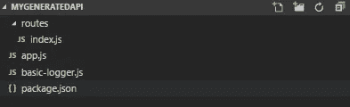
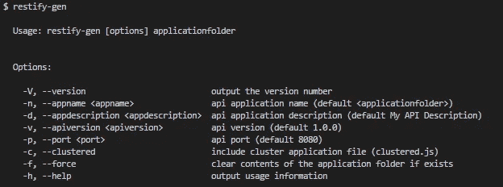
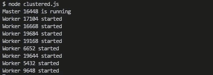

# Restify-Gen，一个 restify api 生成器

> 原文：<https://itnext.io/restify-gen-4e140ec346d2?source=collection_archive---------2----------------------->

[*点击这里在 LinkedIn* 上分享这篇文章](https://www.linkedin.com/cws/share?url=https%3A%2F%2Fitnext.io%2Frestify-gen-4e140ec346d2)

对于最后两个项目，我们使用 [Restify](http://restify.com/) 作为后端 api。

为了简化 restify 的工作，我实现了一个类似 express 的生成器，这样目录结构就可以标准化了。今天我想分享这个和它的用法。

Restify-Gen 是一个非常简单易用的 npm 包，可以通过 MIT 许可公开获得。我希望你也能发现它对你的项目有用。

让我们来看看它的用法。express generator 使用的方法几乎类似。所以如果你熟悉 express，你就会知道它的用法。

我建议全球安装。

在 shell 上执行上述命令后，目录结构如下所示。

文件夹结构

默认情况下，您将拥有节点应用程序(app.js)的主条目、一个基本的 [bunyan](https://www.npmjs.com/package/bunyan) 记录器和 routes 文件夹，其中包含一个到 */api/* 路径的示例路由。

默认情况下，应用程序将在端口 8080 上运行。当应用程序生成时，我将使用不同的命令行选项来配置此定义和其他定义。

***index.js*** 内含好帮手，供你参考如何写路线。

默认路由器

在 routes 文件夹中，您可以定义新的路线，并将每条路线分成不同的文件。让我们举个例子，让你看看这有多简单。

我将在 routes 下的一个单独的文件 users.js 中为用户定义一个简单的 get。内容大概是这样的:

用户路线示例

在我们实现了简单的用户路径之后，你需要做的就是在 *app.js* 下定义它，这样 restify 服务器就能理解了。下面是我们定义的示例用户路线和 *app.js*

基本上是找到回家的路线，要求新定义的路线，然后将其添加到您选择的路线中。

要启动您的应用程序，请转到 restify-gen 创建的应用程序文件夹，并执行 ***npm 安装；npm 在你的 shell 上启动*** 。

最后，让我们看看 restify-gen 中当前可用的命令行选项。

> 更新 05/03/2018:集群模式实施

使用选项—更新

现在我们有了另一个选项 c，集群。当提供时，我们的生成器将在根文件夹中提供另一个实现 [Node.js 的集群模式](https://nodejs.org/api/cluster.html)的文件。

该模式将根据服务器上 CPU 的数量，使用多个工作线程执行 node。

集群模式执行

我希望这个包能让你轻松开始 restify。

谢谢你读到这里。如果你喜欢你所读的，请拍我，并提供你的意见。