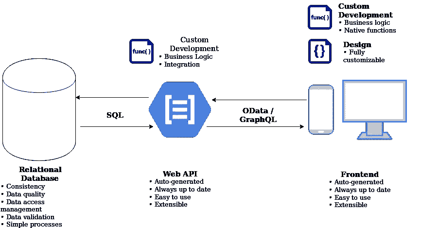
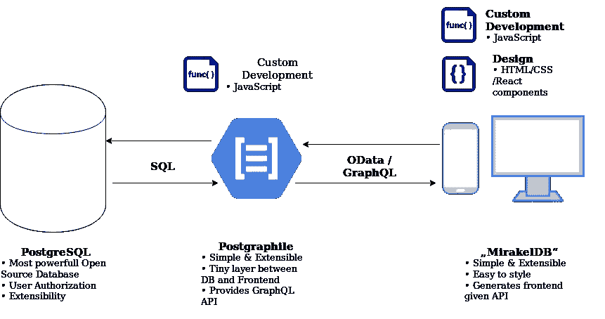

# 重新思考数据驱动的应用

> 原文：<https://itnext.io/rethinking-data-driven-applications-a17bcb9a91b?source=collection_archive---------2----------------------->

## 改变我们开发的方式和内容

乌尔凡·哈萨诺夫在 [Unsplash](https://unsplash.com?utm_source=medium&utm_medium=referral) 上的照片

今天，数据驱动的应用程序的开发包含了许多乏味且容易出错的工作。我们在这里建议一种架构，以最小化构建 CRUD 后端和前端功能的枯燥工作，转而专注于为我们的客户和用户提供真正的价值。我们提出一种方法，通过提供“前 80%”的工作来启动数据驱动的应用程序开发，此外，保持应用程序的生成部分总是最新的。当然，当使用我们的方法时，其他开发不会变得更难。

## 什么是数据驱动的应用？

在我们的上下文中，数据驱动的应用程序的核心是数据——它的可视化和操作。在这里，我们不考虑大数据应用程序或纯分析应用程序，而是讨论“小型”和“中型”数据。这种应用的例子可以是:

*   *Excel* :当你使用 Excel 作为数据库时(尽管在很多情况下你可能不应该这样做)，这对我们来说是一个数据驱动的应用程序，因为主要的用例是显示、修改和可视化数据。
*   管理界面:管理界面让用户可以经常访问大量表格格式的数据。用户可以查看和修改他们有权查看和修改的数据。用户可以触发对应用程序本身的用户有影响的操作，如发送电子邮件或推送通知。
*   *CRUD 应用:*很多用 Ruby on Rails 和 friends 这样的框架搭建的应用，往往“只是”CRUD +什么的。例如，处理数据或访问部分数据所需的进程。

我们认为大多数业务应用程序，尤其是主数据管理应用程序，都是数据驱动的应用程序。这些应用程序通常是数据库的包装器，处理 API 调用(REST、oData、GraphQL、SOAP 等)到 SQL 或其他查询语言的转换。后端主要由 CRUD 代码组成，附带一些访问限制和进程。

## 今天我们如何实现数据驱动的应用？

通常我们开始使用 MVC 框架构建这样的应用程序，比如 Ruby on Rails、Java Spring 等等。它们中的大多数都提供了生成器来自动为应该存在于数据库中的新实体生成模型、视图和控制器。当构建单页面应用程序时，框架可以生成 API 代码(例如 REST)而不是视图代码。

当数据结构发生变化时，我们编写一个迁移，将这种变化应用到数据库中。然后，我们对后端应用程序进行必要的修改，如果需要的话，修改模型、控制器和视图。

在这种方法中，数据外观的唯一真实来源是后端，如果数据结构发生变化，数据库和前端需要进行调整。

## 我们当前方法的问题

有了这种方法，我们可以非常快速地构建新的 CRUD 应用程序。每次我开发一个新的 Rails 应用程序时，我都会惊讶于这个应用程序的使用速度，并且已经为用户提供了一些价值。

Rails 的生成器方法非常强大，尽管我使用 Rails 的次数越多，使用生成器的次数就越少，因为随着应用程序的增长，生成器提供的价值越来越少。当我想在数据库表中添加一个字段时，我经常需要接触许多不同的文件:

*   创建新的迁移以使数据库适应新的要求
*   更改控制器，将字段添加到允许的参数中
*   更改视图以向其中添加字段

通过使用像 [rails_admin](https://github.com/sferik/rails_admin/) 这样的管理界面，已经解决了一些困难，但是这只能帮助管理员，而不能帮助普通用户。

最终，数据模型的每一个变化都会导致整个应用程序的变化，并且没有生成器或其他工具可以帮助我们更快地完成工作。

# 我们应该建造什么呢？

作为一个行业，我们仍然专注于解决今天的问题和满足今天的业务需求，但忽略了一个事实，即在几乎所有情况下，产品完成后需求都会发生变化。用《敏捷架构革命》一书中的话来说:我们已经尝试了所有的技巧来解决这些问题:“瀑布”架构方法从需求阶段到产品需要几年时间，当产品准备好了，没有人再需要它了。然后我们尝试了架构的迭代模型，其中我们有快速的理解-设计-开发-部署周期，但是这经常导致糟糕的设计系统，因为我们一次又一次地做错了。发展不是一连串的冲刺，我们需要时间来思考我们实际上在构建什么。

作者的结论是，归根结底，问题不在于我们如何构建系统，而在于我们实际上在构建什么。我们经常设计系统来满足当前的业务需求，但是忽略了一个事实，即软件系统的灵活性实际上应该是一个不可协商的元需求。如果我们构建的系统不能适应新的业务需求，也就是说，仅仅在应用程序中添加一个简单的字段就需要花费至少几个小时或几天的时间，那么开发工作可能是不值得的，业务只是在烧钱。

> 我们想帮助人们！
> 
> 我们想用技术解决他们的问题！
> 
> 让我们不要引入更多不必要的新问题

IT 的目标应该是实现业务(除 IT 之外的一切)敏捷性。在当今世界，快速适应变化至关重要，虽然它的独特卖点始终是“有了它，我们比市场上的其他人更快”,但它通常在缓慢的创新周期中发挥作用。我们错过了这个目标！

适应新的业务需求和环境变化的时间至关重要。我们正在构建的系统应该是灵活的，能够轻松适应新的业务需求。

我们经常听到下面的说法:

> “抱歉，这是一款云软件，我们无法让它适应您，您应该让自己适应该软件”

在很多情况下，这是绝对错误的做法！系统应该适应业务需求，而不是相反。它应该使业务用户能够完成他们的工作，而不是阻碍他们。

# 技术要求

在讨论我们建议的方法之前，让我们更深入地了解一下这种灵活的数据驱动应用程序的技术要求:数据、其结构以及与外部世界的集成是这种应用程序的核心。因此，从技术角度来看，我们应该专注于一种清晰的方式来表示这一点，这意味着对于数据结构和数据之间的依赖关系，应该只有一个*单一的*真实来源。应用程序的其余部分应该尽可能地自动适应变化。更新真实的单一来源应该产生应用程序的所有相关部分的更新，例如数据库、后端和前端。

# 我们建议的方法

> 通过自动提供“前 80%”来启动应用程序开发！

我们建议采用经典的三层 web 应用程序方法，但是我们的方法适用于更多种类的应用程序设计。整体架构如下图所示:

灵活的数据驱动应用程序的建议总体架构

我们建议应用程序设计采用功能性更强的方法，而不是从后端开始开发过程。我们开始考虑数据及其关系，并在关系数据库中实现它们。该数据库是数据结构、关系以及授权和数据访问许可规则的唯一真实来源。像 PostgreSQL 这样的现代数据库提供了正确的工具来完成这项工作。

数据库还负责数据的一致性和数据验证。值得注意的是，在许多情况下，数据库不会也不应该处理所有的业务需求。它应该只用于在数据库中容易实现的检查和保证。通常，即使这样也会大大减少后端的开发工作。

后端是从数据库结构中自动生成的 web API。这个 web API 应该非常容易扩展，以提供数据库无法处理的新功能。当数据库中的数据结构被更新时，API 应该在没有任何手动代码改变的情况下自我更新。这样，我们不需要在应用程序的第一次迭代中投入任何开发工作。

给定后端提供的 API 和 API 文档，前端会自动生成，并在 API 更改时保持最新。通常，前端是需要进行大部分定制的地方。因此，前端的生成器应该非常灵活，甚至可以手动构建前端，只生成表格、表单等部分。同样，焦点应该是生成的部分保持自己与 API 同步。

# 满足要求的拟议技术

在撰写本文时，我们还不知道有什么技术方法可以满足这些要求。我们的总体方法是开发以下架构来构建这种灵活的数据驱动的应用程序:

采用建议技术的架构图

作为数据库，我们建议使用 PostgreSQL，因为它是最强大的开源数据库，并提供了我们的数据驱动应用程序所需的许多功能。它很容易扩展，并提供货架的列级和行级的数据访问规则。将来，应该会支持更多的数据库。

Postgraphile 是一个工具，它将到 PostgreSQL 的连接作为输入，并提供一个 GraphQL API。它是数据库和前端之间的一个非常薄但容易扩展的层。在这里可以找到关于 Postgraphile 的[介绍。Postgraphile 是一个 Node.js 库，通过 JavaScript 使用钩子进行扩展。](/automatically-building-and-maintaining-graphql-apis-with-postgresql-and-postgraphile-c497636abd29)

最后，据我们所知，目前还没有一种简单的方法来自动生成一个前端，给定一个 API 的描述，以跟上 API 的变化。我们目前正在开发这样一种工具，一方面，它可以提供一个前端，而不需要 API 所需的任何配置，并且可以完全扩展或集成到现有的应用程序中。

# 结论

我们今天讨论了一种新的方法，使用旧的、久经考验的技术来减少构建数据驱动的应用程序时的迭代时间。这种方法似乎使得用最少的开发工作来满足用户不断变化的需求变得可行。即使是现在，我们在应用程序开发的许多阶段都在使用自动化，尤其是在讨论 DevOps 时，但是很少有开发人员在自动化新应用程序的实际开发。

你怎么想呢?对于我们这些开发人员来说，提议的方法是减少业务压力的可行方法吗？或者，开发过程的自动化甚至会威胁到我们的工作吗？我们很高兴收到您的所有反馈！