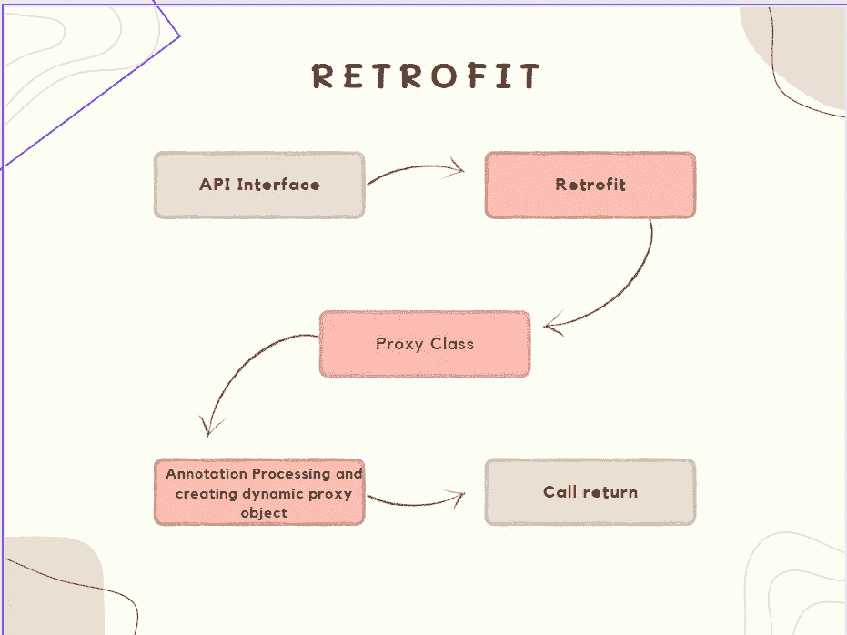
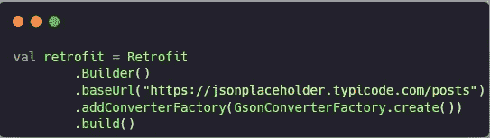
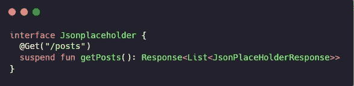
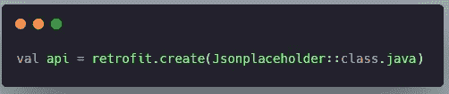
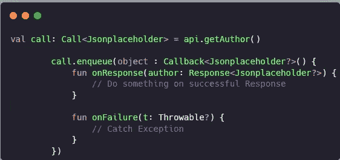
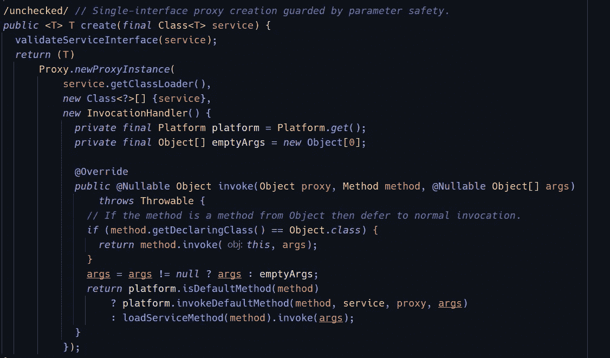
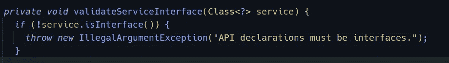
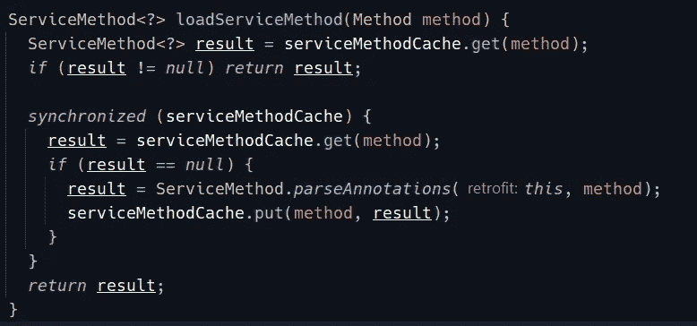
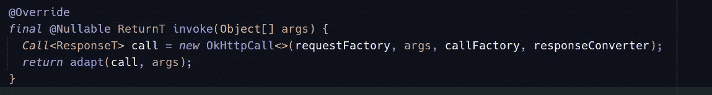

# 改装:详细分析和说明- 1

> 原文：<https://itnext.io/retrofit-detailed-analysis-and-explanation-1-4e5a069423e2?source=collection_archive---------3----------------------->

创建 Android 应用程序时，HTTP 请求用于连接服务器、上传或下载数据以及其他事情。众多开源的 HTTP 请求工具可用，包括 [***Google 的凌空***](https://google.github.io/volley/) ， [***loopj 的 Android 异步 Http***](https://loopj.com/android-async-http/) ***，***[***OkHttp***](https://square.github.io/okhttp/)***，*** 以及 [Square 的 ***改型***](https://square.github.io/retrofit/)

改造，在我看来，毫无疑问是其中最伟大的几个，由于其独特和智能的设计。考虑到最少的改造代码，阅读它的源代码将是非常有益的。

# 1.什么是翻新？

根据改装官网:

> Android 和 Java 的类型安全 HTTP 客户端

简而言之，它是一个基于 OkHttp 的 RESTFUL API 请求工具，在功能上与 Google 的凌空非常相似，但在用法上却截然不同。

凌空更基础，使用简单；当应用程序想要发送 HTTP 请求时，您需要创建一个请求对象，用 GET、POST 或其他方法指定请求，一个 api 地址和一个处理响应的回调。如果请求是 POST，您必须另外设置请求对象内容，有时还需要设置标题。在将*请求*对象添加到 ***请求队列*** 中、检查缓存并发送 HTTP 请求之后，凌空将协助您处理这种情况。如果一个应用程序有许多不同的 API 调用，代码将难以阅读，另一方面，翻新允许您调用 Java 方法以简单的方式请求 API，因此应用程序中的代码将非常简洁，易于阅读

# 2.如何使用改装

比方说，你想请求一个 API 来查看来自一个网站的帖子信息，例如，我将在这里使用*jsonplaceholder*

首先，您需要创建一个改造对象，并指定 API 的域名。

图片:1

接下来，我们需要一个基于 API 调用的接口，这里将使用 Java 注释。

图片:2

接下来改造对象(图 1)将被用来创建一个***Jsonplaceholder***对象

图片:3

这意味着我们必须请求的 API 是[https://jsonplaceholder.typicode.com/posts](https://jsonplaceholder.typicode.com/posts)

接下来我们创建一个调用对象来获取数据 ***入队*** 方法用于异步发送请求，如果我们想以同步方式发送我们需要使用 ***执行*** 方法。call 对象还提供了其他方法，如 ***取消*** 、 ***取消*** 或其他方法来检查 HTTP 请求的状态等等。

看，Retrofit 只需要构造一个接口来表示 HTTP 请求，然后它将允许我们请求一个 API，就像我们调用 Java 方法一样。这不是很棒很不可思议吗？😀

# 3.改造工作

从上面描述的对 reference 的使用中，可以清楚地看到，通过将 Java 接口转换成 HTTP 请求，然后通过 OkHttp 发送请求，reference 起到了适配器的作用。

AFAIK 凌空创建一个 ***请求*** 对象，然后将它放入队列进行 HTTP 请求。请求通过***HttpUrlConnection***放到单独的线程中

所以问题是:改造如何实现这一点？

答案:Java 动态代理

在图 3 中，您可以看到 Jsonplaceholder 接口被传递给改型对象的 create 方法，作为回报，它给出 Jsonplaceholder 对象，然后该对象完成调用。

让我们深入研究一下 create 方法

你可以在这里得到代码[。](https://github.com/square/retrofit/blob/9b32c965ef31275627e35a862f584bcc7b9fa4e5/retrofit/src/main/java/retrofit2/Retrofit.java#L146-L168)

这里发生了很多事情，所以让我们开始吧，

它通过执行函数***validateServiceInterface***和***IllegalArgumentException***初步验证提供的接口是否为有效接口，如果是无效接口则抛出。

接下来的 create 方法返回一个***proxy . newproxyinstance***动态代理对象。现在的问题是:什么是动态代理？

这本身就是一个高级的话题，你可以从其他地方了解它，但简单地说，它是 Java 代理设计模式的一部分，当程序需要扩展或修改现有类的某些功能时，它允许创建代理对象。在这种情况下，代理对象被实例化，而不是原始对象。代理类只创建一个代理，实际行为在其处理程序中被修改。处理程序完成它的扩展工作，然后继续调用原始方法，让它执行进一步的任务。当一个 API **接口**实例被使用 refuge 创建时，从 refuge 返回的实例实际上是一个**代理**类，一个**动态**实现**接口**在**运行时**。

主要要学习的是 ***InvocationHandler，*** 它是一个接口，允许我们拦截对对象的任何方法调用，并处理额外的行为。这个接口非常简单，只创建了一个需要被覆盖的方法 ***invoke***

现在回到改进***new proxy instance***方法所需的 3 个参数

1.  传递了类的类加载器:(在我们的例子中是接口)，现在类加载器基本上是 JRE 的一部分，负责在运行时将 *Java* 类动态加载到 JVM。
2.  类的接口列表:这是必需的，以便知道当调用这些接口的任何方法时，代理类将知道它。
3.  *invocation handler****:这个*** 是实现***invocation handler***和覆盖 invoke 方法的地方，这个 invoke 方法有 3 个参数:

> a.)代理对象:*在*上调用该方法的代理实例
> 
> b.)方法:*对应于代理实例用来调用的接口方法的实例。声明方法的接口将是方法对象的声明类，该接口可以是代理类从其继承方法的代理接口的超接口。*
> 
> c.)args: *一个对象数组，或者* **null** *如果接口方法不接受任何参数，则表示在代理实例上的方法调用中传递的参数值。适当的原语包装类的实例，如***Java . lang . integer***或***Java . lang . boolean***，用于封装原语类型的参数。*

接下来的改进使用 *java 反射*来获取被调用方法的注释信息，并使用提供的参数创建一个 ***ServiceMethod*** 对象。

改造对象和方法对象被传递给 ServiceMethod，然后 service Method 调用每个接口和解析器，并生成一个请求，其中包含 API 的域名、路径、HTTP 请求方法、请求头、主体状态、是否为多部分等信息。
OkHttpCall 是 Retrofit2 中 Call 接口的默认实现，它默认使用 OkHttp3 作为 Http 请求客户端。

Java 动态代理用于解析 Java 方法的注释，构建随后由 OkHttp 提交的请求，并拦截正在调用的 Java 方法。

接下来，对象进入调用方法，然后调用方法执行请求

# 4.改造的四大支柱

1️⃣ ***回调< T >*** :这是改造返回其调用的地方，这里有两种方法:

*   `void onResponse(Response<T> response)`
*   `void onFailure(Throwable t)`

2️⃣ ***转换器< F，T > :*** 其主要作用是将 HTTP 返回的数据解析成 Java 对象，主要是 Xml、Json、protobuf 等。创建改造对象时，您可以添加需要使用的转换器

3️⃣ ***调用<>***:其主要作用是发送一个 HTTP 请求，默认实现的改型是 *OkHttpCall < T >* ，你可以根据实际情况实现自己的调用类

4️⃣***calladapter<t>:***如上所述， ***CallAdapter*** 只有一个 *responseType* 属性和一个 ***< R > T adapt(调用< R > call)*** 方法，并且这个接口只有一个实现类， ***DefaultCallAdapter 这个类可能是为了支持 RxJava 而设计的***

# 5.执行 Http 请求

如前所述，OkHttpCall 实现了 Call 接口，并且是调用 OkHttp3 来提交 Http 请求的类。这个 HTTP 请求调用一个请求对象，该对象通过 ServiceMethod 的 toRequest 方法返回。

综上，OkHttpCall 调用 ServiceMethod 获取可能用于执行的请求对象，等待 HTTP 请求完成，然后将响应体传递给 ServiceMethod，service method 可以调用转换器接口将响应体转换成 Java 对象。

综合以上，我们可以看到 ServiceMethod 几乎包含了一个 API 请求所需的所有信息，OkHttpCall 需要从 ServiceMethod 获取一个请求对象，然后在收到应答后，还需要传入 ServiceMethod，使用传递的转换器将其转换成 Java 对象

# ~~ =>

Retrofit 非常巧妙的用注解来描述一个 HTTP 请求，把 HTTP 请求抽象成 Java 接口，然后用 Java 动态代理把接口的注解动态“解析”成 HTTP 请求，然后执行 HTTP 请求。

Retrofit 的功能性很大程度上依赖于 Java 反射，代码中其实有很多细节，比如异常的捕捉、抛出和处理，还有很多工厂设计模式。

改型中的接口设计恰到好处，在创建改型对象时，给你更多更灵活的方式来处理你的需求，比如使用不同的转换器，使用不同的 CallAdapter，这也给你提供了使用 RxJava 调用改型的可能性

我一直相信，一个没有读过好代码的人是不太可能写出好代码的。Picasso 和 retrieval 是可扩展性强、耦合度低、易于插入的优秀代码的例子。

*第 2 部分即将发布更多信息* …

🙂