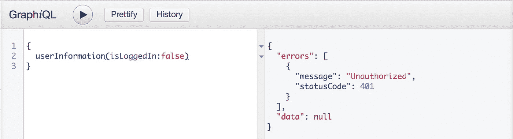
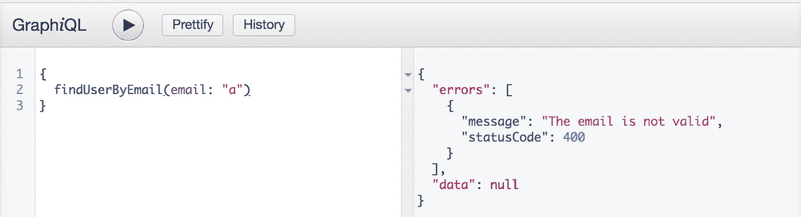

# 用几行代码在 GraphQL 上返回带有状态代码的自定义错误。

> 原文：<https://itnext.io/return-custom-errors-with-status-code-on-graphql-with-few-lines-of-code-f51ebfc4a6de?source=collection_archive---------2----------------------->


[https://github.com/EasyGraphQL](https://github.com/EasyGraphQL)

现在您可以用几行代码在 GraphQL 上用`statusCode`返回自定义错误。您可以默认返回 HTTP 错误，也可以创建自定义错误。

# 怎么做！

*   导入库`const FormatError = require('easygraphql-format-error)`
*   初始化`const formatError = new FormatError()`你可以在数组内部传递自定义错误`const formatError = new FormatError([{name: INVALID_EMAIL, message: 'The email is not valid', statusCode: 400 }])`
*   将`errorName`传递给上下文`const errorName = formatError.errorName`上的解析器
*   如果有错误`throw new Error(errorName.UNAUTHORIZED)`

# 示例:

## GraphQL 模式:

```
type Query {
  userInformation(isLoggedIn: Boolean!): String!
  findUserByEmail(email: String!): String!
}
```

## App.js

```
'use strict' const express = require('express')
const { buildSchema } = require('graphql')
const graphqlHTTP = require('express-graphql')
const bodyParser = require('body-parser')
const FormatError = require('easygraphql-format-error') 
const fs = require('fs')
const path = require('path') const root = require('./schema/resolvers') const app = express() app.set('port', process.env.PORT || 7000)
app.use(bodyParser.json({limit: '10mb'}))
app.use(bodyParser.urlencoded({ extended: true })) const formatError = new FormatError([
  {  
    name: 'INVALID_EMAIL',  
    message: 'The email is not valid',  
    statusCode: 400
  }
])
const errorName = formatError.errorName const schemaCode = fs.readFileSync(path.join(__dirname, 'schema', 'schema.gql'), 'utf8')const schema = buildSchema(schemaCode) app.use('/', (req, res) => {  
  graphqlHTTP({    
    schema,    
    rootValue: root,    
    graphiql: true,    
    context: { errorName },    
    formatError: (err) => {      
      return formatError.getError(err)    
    }  
  })(req, res)
}) const server = app.listen(app.get('port'), () => {     
  console.log(`Server running -> PORT ${server.address().port}`)
})module.exports = app
```

## 分解器

```
'use strict'*const* resolvers = {
  userInformation: ({ isLoggedIn }, { errorName }) *=>* {
    *if* (!isLoggedIn) {
      *throw* new Error(errorName.UNAUTHORIZED)
    }

    *return* 'My username'
  },

  findUserByEmail: ({ email }, { errorName }) *=>* {
    *const* re = /\S+@\S+\.\S+/; *if* (!re.test(email)) {
      *throw* new Error(errorName.INVALID_EMAIL)
    } *return* email
  }
}module.exports = resolvers
```

## 结果



**完整演示:**[https://github . com/EasyGraphQL/EasyGraphQL-format-error/tree/master/example](https://github.com/EasyGraphQL/easygraphql-format-error/tree/master/example)

**Npm 包:**[https://www.npmjs.com/package/easygraphql-format-error](https://www.npmjs.com/package/easygraphql-format-error)