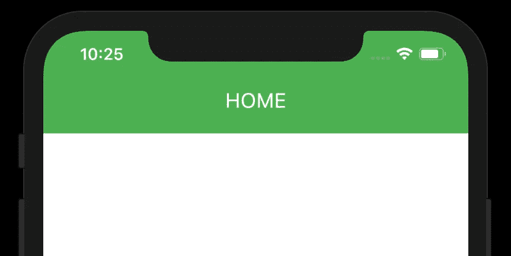

# Flutter 中可重用的小部件和可重用的自定义应用程序栏。

> 原文：<https://itnext.io/reusable-widgets-reusable-custom-appbars-in-flutter-4d4b8b06d176?source=collection_archive---------4----------------------->


Flutter 中可重用的小部件

在本文中，我们将讨论如何重用小部件和创建自定义的可重用 AppBars。

在颤动中是如此的容易。在 flutter 中，编写窗口小部件并使其更加强大和可重用是如此容易。

# **观看视频教程**

Flutter 可重用部件

# **第二部分——教程**

Flutter 可重用部件

让我们从初学者曾经做过的一个错误的方法开始。

假设我希望我的应用程序中有一些 TextFormField，并且我希望它有相似的外观和感觉。于是就有了下面这种写法的倾向。假设您有一个 Utils 类，我们在其中添加了所有的实用方法…

```
import 'package:flutter/material.dart';class Utils {
  //
  static getTF(TextEditingController controller) {
    return TextFormField(
      controller: controller,
    );
  }
}
```

现在来添加用户界面…

```
body: Container(
        child: Column(
          children: [
            Utils.getTF(_emailController),
...
```

嗯，这肯定是有效的…，但是你看到了吗，它看起来不像一个小部件。这是初学者常犯的错误之一…

您可以通过发送更多的参数来定制这个函数，从而定制“TextFormField”小部件…但这仍然是错误的方法。

颤振是更强大的，很容易处理这一点..

让我们看看做这件事的正确方法…

只需创建一个具有适当名称的 dart 文件，如 app_textfield.dart…

然后创建一个名为“AppTextFormField”的类，这将扩展一个 StatelessWidget。这一点非常重要。将可重用的小部件创建为无状态小部件总是一个好的做法。

所以我们的 *AppTextFormField* 类看起来会像这样。

```
import 'package:flutter/material.dart';class AppTextFormField extends StatelessWidget {
  //
  AppTextFormField({
    this.controller,
    this.hintText,
    this.helpText,
    this.prefixIcon,
    this.suffixIcon,
    this.isPassword,
    this.enabled,
    this.readOnly,
    this.borderColor,
  });final TextEditingController controller;
  final String hintText;
  final String helpText;
  final IconData prefixIcon;
  final IconData suffixIcon;
  final bool isPassword;
  final bool enabled;
  final bool readOnly;
  final Color borderColor;[@override](http://twitter.com/override)
  Widget build(BuildContext context) {
    return Container(
      child: TextFormField(
        controller: controller,
        readOnly: null == readOnly ? false : true,
        obscureText: null == isPassword ? false : true,
        decoration: InputDecoration(
          focusedBorder: OutlineInputBorder(
            borderSide: BorderSide(
              color: Colors.greenAccent,
              width: 1.0,
            ),
          ),
          enabledBorder: OutlineInputBorder(
            borderSide: BorderSide(
              color: Colors.greenAccent,
              width: 1.0,
            ),
          ),
          border: OutlineInputBorder(
            borderSide: BorderSide(
              color: null == borderColor ? Colors.teal : borderColor,
              width: 1.0,
            ),
          ),
          hintText: null == hintText ? '' : hintText,
          helperText: null == helpText ? '' : helpText,
          prefixIcon: null == prefixIcon ? null : Icon(prefixIcon),
          suffix: null == suffixIcon ? null : Icon(suffixIcon),
          enabled: null == enabled ? true : false,
        ),
      ),
    );
  }
}
```

这里我们将所有参数设置为可选。因此，我们正在检查一些是否为空，并采取相应的行动。

*例如:如果“prefixIcon”为空或者没有作为参数发送，那么我们将把它设置为空，然后它将从 TextFormField 中消失，就这么简单……*

然后在我们的 UI 中…

```
Container(
    child: Column(
        children: [
        AppTextFormField(
            controller: _emailController,
            helpText: 'Email',
            hintText: 'Email',
            prefixIcon: Icons.email,
        ),
        AppTextFormField(
            controller: _passwordController,
            helpText: 'Password',
            hintText: 'Password',
            isPassword: true,
            prefixIcon: Icons.lock_open,
        ),
....
```

所以现在，看起来有些部件。正在添加到小部件树中。

# 可重用/自定义 AppBar

创建一个可重用的 AppBar 没什么不同。AppBar 扩展了一个 PreferredSizeWidget。是的，它需要一个尺寸…

因此，让我们看看在这种情况下，我们如何创建一个可重用的应用程序栏。

因此，创建一个新文件 app_bar.dart，我将按类 IAppBar 命名。

在这里，重要的是我们需要提供一个高度，否则我们会将它设置为默认的'*kToolbarHeight*' from Flutter，即 56.0。

这是整个班级的样子…

```
import 'package:flutter/material.dart';class IAppBar extends PreferredSize {
  //
  final Widget child;
  final double height;
  final Color color;IAppBar({
    [@required](http://twitter.com/required) this.child,
    this.color,
    this.height = kToolbarHeight,
  });[@override](http://twitter.com/override)
  Size get preferredSize => Size.fromHeight(height);[@override](http://twitter.com/override)
  Widget build(BuildContext context) {
    return Container(
      height: preferredSize.height,
      color: color ?? Colors.red,
      alignment: Alignment.center,
      child: child,
    );
  }
}
```

现在使用它就像下面这样简单

```
return Scaffold(
  appBar: IAppBar(
  height: 100,
  color: Colors.green,
  child: Column(
    crossAxisAlignment: CrossAxisAlignment.end,
    mainAxisAlignment: MainAxisAlignment.end,
    children: [
      Text(
        'HOME',
        textAlign: TextAlign.center,
        style: TextStyle(
          color: Colors.white,
          fontSize: 20,
        ),
      ),
      SizedBox(
        height: 20,
      ),
    ],
  ),
 ),
 body: Container(
    //
 ),
);
```

子属性可以是您发送的任何小部件。这里我发送一个列部件。



Flutter 中的自定义 AppBar

**源代码**

[https://bit bucket . org/vipinvijayan 1987/tutorial projects/src/ReUsableWidgets/fluttertutorial projects/flutter _ demos/](https://bitbucket.org/vipinvijayan1987/tutorialprojects/src/ReUsableWidgets/FlutterTutorialProjects/flutter_demos/)

*如果你觉得这篇文章有用，请给点掌声……(最多可以打到 50)*