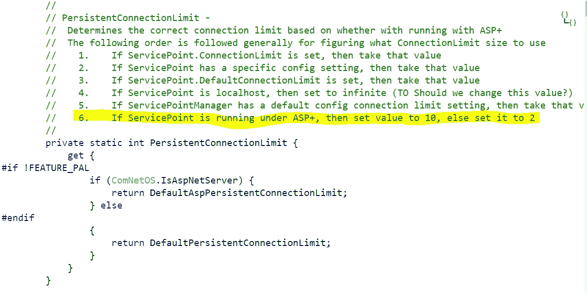

# 重用 HttpClient 并没有解决我所有的问题

> 原文：<https://itnext.io/reusing-httpclient-didnt-solve-all-my-problems-142a32a5b4d8?source=collection_archive---------3----------------------->


你为什么不表演？

[在上一篇文章](https://medium.com/@rahulbhuwal/httpclient-may-kill-your-system-be-careful-62b1533ad456)中，我发布了处理 HttpClient 是如何频繁地阻塞我的 Api 并使服务器在巨大的负载下崩溃的。我们研究了更好的重用 HttpClient 的方法，避免了线程安全问题。重用 HttpClient 确实提高了 Api 的稳定性，但并没有提高我的系统的性能。我所说的性能是指触发多个并行 http api 调用，并在最少的时间内获得单独的响应。

# 我们为什么需要这个？

让我们来看一个假设的例子，假设您正在构建一个 Rest 端点，它需要提供一个经销商列表，您可以从这些经销商那里订购修理汽车的零件。

让我们假设您的 Api 接受 Partids 列表，您需要为这些列表找到经销商。您的请求负载如下所示:

```
{
    "partIds": [1, 2, 3, 4, 5, 6, 7, 8]
}
```

假设您的响应 json 看起来是这样的:

```
{
    "dealers": [{
        "dealerId": 1,
        "dealerName": "abc dealer",
        "parts": [{
            "partId": 1,
            "partId": 2
        }]
    }, {
        "dealerId": 2,
        "dealerName": "def dealer",
        "parts": [{
            "partId": 3,
            "partId": 4,
            "partId": 5
        }]
    }, {
        "dealerId": 3,
        "dealerName": "xyz dealer",
        "parts": [{
            "partId": 6,
            "partId": 7,
            "partId": 8
        }]
    }]
}
```

要生成此响应，假设您必须通过经销商调用库存 Api，并向其提供您需要检查可用性的零件 id 列表。假设下面是标准的**要求**代理商库存 api。

```
{
    "parts": [{
        "partId": 1,
        "partId": 2,
        "partId": 3,
        "partId": 4,
        "partId": 5,
        "partId": 6,
        "partId": 7,
        "partId": 8
    }]
}
```

每个经销商的回复如下所示。

```
{
    "parts": [{
        "partId": 1,
        "price": 255,
        "isAvailable": true
    }, {
        "partId": 2,
        "price": 55,
        "isAvailable": true
    }, {
        "partId": 3,
        "price": 155,
        "isAvailable": true
    }, {
        "partId": 4,
        "price": 255,
        "isAvailable": false
    }, {
        "partId": 5,
        "price": 255,
        "isAvailable": false
    }, {
        "partId": 6,
        "price": 255,
        "isAvailable": false
    }, {
        "partId": 7,
        "price": 255,
        "isAvailable": false
    }, {
        "partId": 8,
        "price": 255,
        "isAvailable": false
    }]
}
```

> 从上面的例子中你可以看到，如果你有和你有关系的经销商，那么对于每一个请求，你都需要给每个经销商打电话，最好是并行的，处理他们的回复。因此，对于每个传入请求，您必须打开 15 个出站请求。[如果你没有像前一篇文章中描述的那样重用 HttpClient，你将很快耗尽可用的套接字，从而导致请求失败和用户体验下降。几乎失去了你的客户。](https://medium.com/@rahulbhuwal/httpclient-may-kill-your-system-be-careful-62b1533ad456)但是，即使按照我之前写的最佳实践，也不会减少出站请求的响应时间，因为越来越多的请求在出站套接字上排队。为此，您需要切换不同的“ [ServicePointManager](https://docs.microsoft.com/en-us/dotnet/api/system.net.servicepointmanager?view=netframework-4.7.2) ”设置。

# ServicePointManager。DefaultConnectionLimit 是关键

网上有很多文章说服务点管理员的默认连接限制是 2，这是真的也是假的。查看[源代码文档](https://referencesource.microsoft.com/#System/net/System/Net/ServicePointManager.cs,6a75423260490f3a)和我的观察，我可以有把握地告诉你，如果你不做任何更改默认连接限制，你的出站连接将被限制到 ASP.NET 管道最多 10 个出站连接。



如果您对出站连接没有任何高吞吐量要求，您将永远不必担心切换此设置。但是对于我的用例来说，这是一个严重的限制，我开始想知道我还需要覆盖什么缺省值以及设置什么。

# 我是如何诊断问题的

我的集成测试将调用我的 api 中的一个端点，这将在内部进行 15 次 api 调用，将在顺序运行它们时顺利工作。但是当我并行运行它们时，一个或其他测试将永远无法执行，并最终以超时错误代码失败。如果您在托管 api 的服务器上运行 fiddler，您可以看到给定时间的出站连接数。

因此，通过简单的计算，如果我并行运行 10 个集成测试，我的 api 将有 150 个出站连接。这个问题让我走上了一条研究之路，并向有类似问题的其他工程师学习，但互联网上关于这些事情的文献非常少。因此，我采用了读书的老方法来解决问题，而不是浏览那些问题。


我最喜欢的书之一。Net app 调优是"[写高性能。NET 代码由本·沃特森](https://www.amazon.com/Writing-High-Performance-NET-Code-Watson-ebook/dp/B07BF68842/ref=sr_1_1?ie=UTF8&qid=1529985344&sr=8-1&keywords=high+performance+.net+code)。这本书在第六章“优化 HTTP 设置和网络通信”中阐明了如何切换各种 ServicePointManger 设置。因此，我遵循了 Ben 的建议，令我惊讶的是，我的应用程序性能发生了巨大的变化。

# 用于高吞吐量和高性能的最佳 ServicePointManager 设置

这里是我切换的属性，它对我的 orchestraion api 性能产生了巨大的影响。

```
ServicePointManager.UseNagleAlgorithm = false;ServicePointManager.Expect100Continue = false;ServicePointManager.DefaultConnectionLimit = int.MaxValue;ServicePointManager.EnableDnsRoundRobin = true;ServicePointManager.ReusePort = true;
```

**DefaultConnectionLimit** -每个端点的连接数。将这个值设置为最大值大大提高了我的总吞吐量。该设置在 prod 中成功运行，在任何服务器上都没有任何不稳定性。您也可以安全地为您的 API 打开它。

**Expect100Continue-** 在发送 post 和 put 请求的大型对象以确保远程端点启动并运行之前，设置此设置是为了节省带宽。如果您在两端都拥有 api，那么您应该关闭它，以减少每个 api 通信之间的延迟。

**UseNagleAlgorithm-** Nagle 的算法是一种通过减少需要通过网络发送的数据包数量来提高 TCP/IP 网络效率的方法。这可以减少总的传输开销，但是会导致数据分组到达的延迟。你也可以安全地关闭它。现代网络通信不应该依赖这种节省带宽的老方法。

这一章中提到的可以进一步提高性能的属性很少，但是我能够通过上面的更改成功地达到我的基准。

我正在试验最后两个属性(EnableDnsRoundRobin 和 Reuse Port ),因为我还不能对它们在整个画面中的贡献进行基准测试，所以对最后两个属性要有所保留。

最后最重要的一点是，在进行任何 api 调用之前，在 Global.asax.cs 中更改服务点管理器。ServicePointManager 一旦初始化，就会在应用程序的整个生命周期中以相同的配置保留在内存中，除非您为每个端点挑选 ServicePoint 对象。

如果这些改变也帮助你使你的 Api 更快，请分享。

保持冷静，每个问题总有解决的办法，只要你努力去寻找！！！