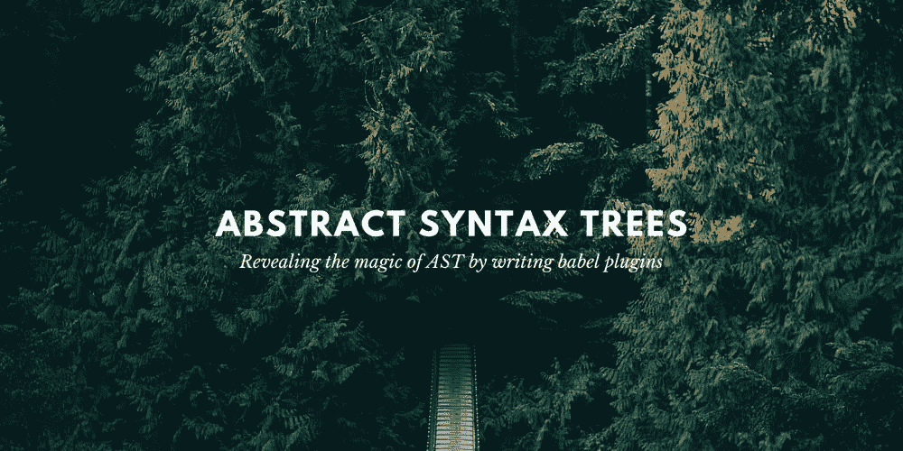
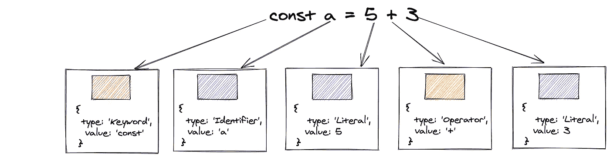
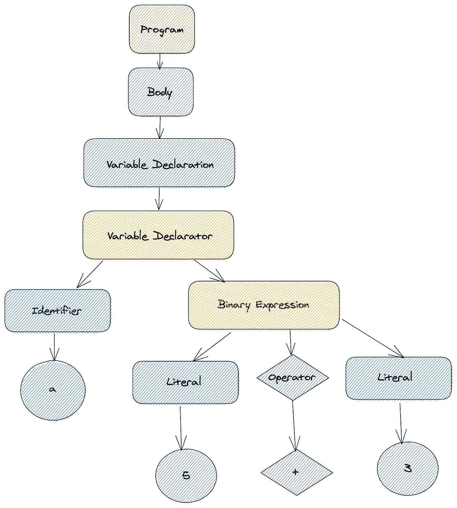
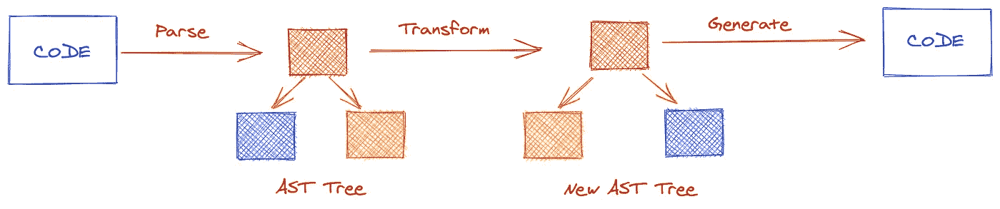
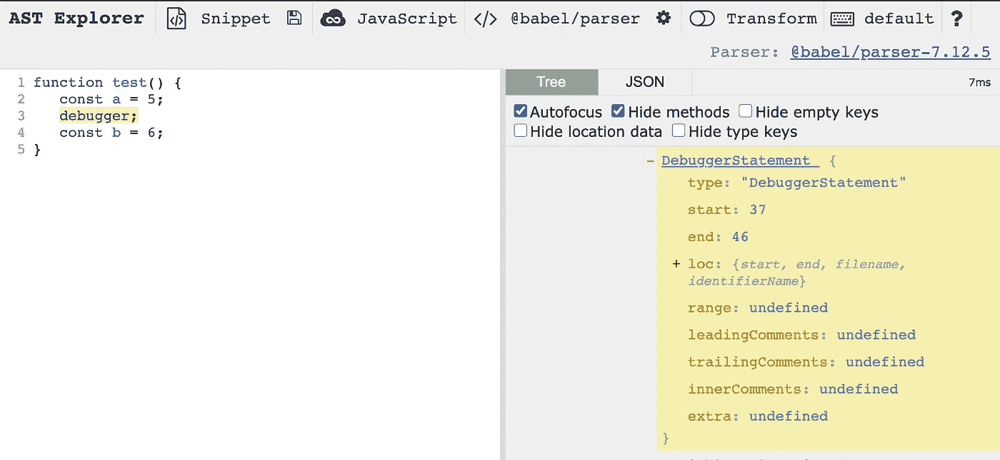
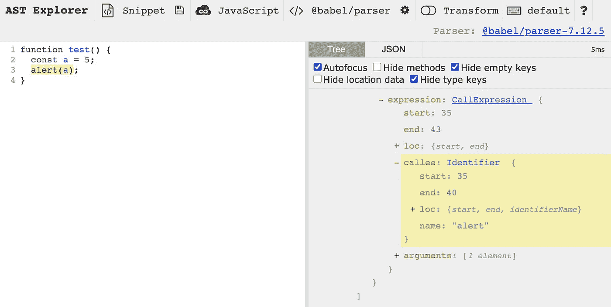
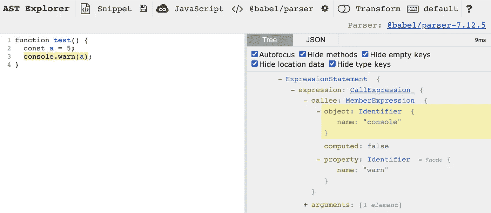
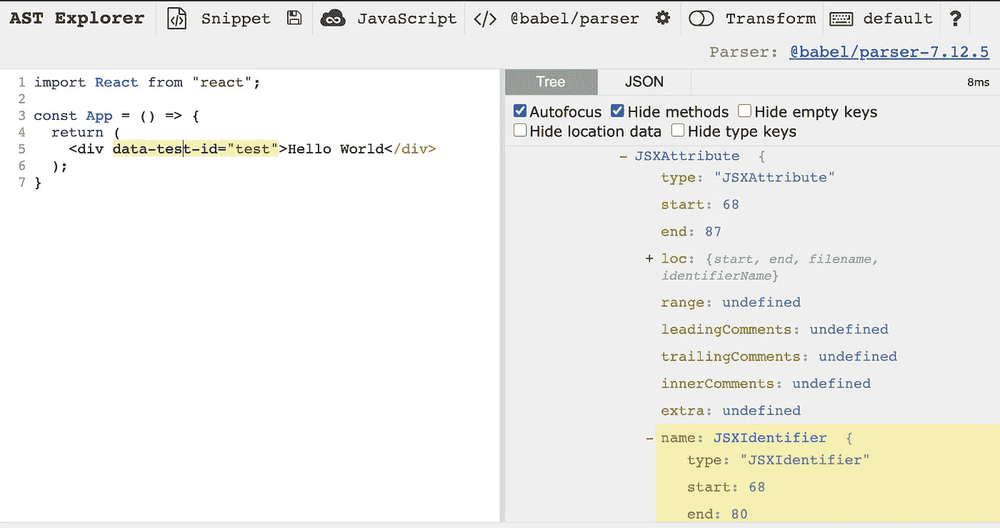

# 通过编写 babel 插件揭示 AST 的魔力

> 原文：<https://itnext.io/revealing-the-magic-of-ast-by-writing-babel-plugins-11a1af8d70ae?source=collection_archive---------3----------------------->

当你听到抽象语法树的时候，你脑海中第一个想到的是什么？
与编译器有关？一些复杂的树操作？比特操作？🤔

在我职业生涯的开始，AST 看起来像是一个复杂的术语，其中夹杂着低级编译器和转换编译器的魔力。

# 💡动机

写这篇博客的动机是让每个人都容易理解什么是抽象语法树，以及它们如何在我们日常使用的大多数工具中发挥重要作用。

无论是 babel、webpack、parcel、eslint、codemods、css 解析器、js 中的 CSS——所有这些工具都使用 AST 的魔力来操纵我们的代码，并将其转换成其他东西。

在本帖中，我们将揭开这个魔法，并在这个过程中学习编写一些超级简单的巴别塔插件。是🎉

# 🤔什么是 AST？

像每个新概念一样，我们将从一个具体的定义开始。
根据维基百科

> *抽象语法树是用编程语言编写的源代码的树表示。树的每个节点表示源代码中出现的一个构造。*

为了理解这一点，假设我们在编辑器中编写了一行简单的代码

这是一个非常简单的变量赋值和两个数的相加。
这个简单的操作经历了一个`Tokenization`和`Parsing`的过程。

# 🕹️标记化(词法分析)

标记化或词法分析是函数将代码作为字符串读取并将其拆分为一系列标记的步骤。

为了简单起见，让我们假设每个令牌都有以下接口

我们的代码经过词法分析的过程，并被分解成记号。

# 🧵分析(句法分析)

后词法分析给我们一个令牌数组，我们通过 AST 解析器(babylon 或 acorn 或 espree)将它转换成 AST 节点树，在它们之间建立依赖关系。

我们写的超级简单的代码被转换成一个节点树，我们称之为抽象语法树。

整个树以下面的方式表示为一个 json

在这个 json 对象中，我们注意到一个名为`type`的参数。我们称之为 AST 节点类型。
存在多种类型的 AST 节点，对于 babel，我们可以参考以下
[Babel AST 节点类型](https://babeljs.io/docs/en/babel-types)

对于 espree 解析器(eslint 使用的那个),我们可以参考这里的 [Eslint AST 节点类型](https://github.com/estree/estree/blob/master/es5.md)

Babel、webpack、parcel 和所有这些工具都使用一种通用的方法。他们首先将我们的代码转换成 AST 树，然后对其应用一些转换(添加、编辑、更新、删除)，从这些转换中创建一个新的树，然后将其转换回人类可读的代码。

为了理解特定代码行的 AST 树表示是什么样子，我建议总是检查 [AST Explorer](https://astexplorer.net/)

现在，不浪费任何时间，我们将编写我们的第一个巴别塔插件。这个插件将删除我们代码中可能有的任何调试器语句。

# 📕Babel 插件—删除调试器

考虑在您的 repo 的多个位置使用以下代码

很明显，我们不希望这个调试器语句出现在我们的生产应用程序中。
(注意:在现实世界的应用程序中，我们会有一些捆绑器或一些部署管道步骤，可以帮助我们避免这样的错误，但为了这个例子，让我们假设我们没有任何这样的部署管道)。

所以我们写了一个巴别塔插件来为我们做同样的事情。

# 编写一个巴别塔插件

**步骤 1** :识别我们想要定位的 AST 节点类型。如果我们转到 AST Explorer 并单击第 2 行，我们会注意到节点类型以黄色突出显示，它显示我们必须定位的 AST 节点是`DebuggerStatement`。

**第二步**:启动编辑器，创建新文件。姑且称之为`removeDebugger.js`。这将是我们的插件文件。

从现在开始，我们编写的每一个巴别塔插件都将遵循一个通用的模式

我们将返回一个包含另一个嵌套对象的对象，其中包含关键字`visitor`。由于访问者模式，它被命名为 visitor。

**步骤 3** :我们知道我们希望定位的节点类型是`DebuggerStatement`

所以我们的代码现在看起来像这样

我们希望定位的每个节点都必须是 visitor 对象中的一个键。

**步骤 4** :现在这个 babel 插件剩下的唯一一步就是移除调试器语句节点，我们这样做:

我的朋友是我们的第一个巴别塔插件。

这个 babel 插件向我们解释了如何通过删除一个节点来操作一个 AST。

我们将学习的下一个插件将向我们解释如何编辑一个现有的节点，并将其转换成其他东西

# 📕巴别塔插件—向控制台发出警报

所以在这里我们将把每个`alert`语句转换成一个`console.warn`语句。

所以我们希望修改的代码应该是这样的

我们将把它转换成

**步骤 1** :识别我们想要定位的 AST 节点类型。转到 AST explorer 并复制粘贴我们的`from`代码，然后点击`alert`。它将在右侧突出显示节点类型。我们看到现在要定位的节点类型叫做`CallExpression`。

所以任何函数调用都是一个`CallExpression`，任何对象上的函数调用都被称为`MemberExpression`。所以`alert`是`CallExpression`，`console.warn`是`MemberExpression`。

在我们的例子中，MemberExpression 总是有一个对象(控制台)和一个属性(警告)。

**步骤 2** :再次启动编辑器，创建新文件。姑且称之为`convertAlertToConsole.js`。

就像在我们用框架代码开始插件之前一样

**第三步**:现在我们知道了我们的目标节点是一个`CallExpression`，让我们来写代码

**步骤 4** :因为我们不希望将目标指向所有其他的函数调用，所以让我们设置一个 if 条件来指定我们只希望将名为`alert`的调用表达式作为目标

现在唯一剩下的部分就是想出用什么来代替它。

**步骤 5** :我们回到 AST explorer，这次复制我们的`to`代码，点击 console.warn 会告诉我们，我们需要用另一个调用表达式替换它，因为所有的函数调用都是调用表达式，但是因为这是一个`object property function call`，这就是为什么它需要一个调用表达式，其中有一个成员表达式作为它的被调用者。

仅此而已。我们也写了我们的第二个插件🥳.这一切是不是太简单了？🤗

# 📕奖励插件——从 react 应用程序中删除数据测试 id

在这种情况下，我们将从 react 应用程序中移除每个`data-test-id`属性。由于`data-test-id`通常只在 dev env 中需要，我们的插件可以安全地将它从我们的产品包中移除。

所以我们希望修改的代码应该是这样的

我们将把它转换成

**步骤 1** :识别我们想要定位的 AST 节点类型。转到 AST explorer 并复制粘贴我们的`from`代码，然后点击`data-test-id`。它将在右侧突出显示节点类型。我们看到现在要定位的节点类型叫做`JSXAttribute`。

第二步:启动你的编辑器，创建一个新文件。姑且称之为`removeDataAttribute.js`。就像在我们用框架代码开始插件之前一样

**第 3 步**:现在我们知道我们的目标节点是一个`JSXAttribute`，让我们写代码

所以我们的代码现在看起来像这样

**步骤 4** :现在这个 babel 插件剩下的唯一一步就是移除这个 jsx 属性节点，我们这样做:

仅此而已。我们写了另一个插件🥳.

Github 回购:【https://github.com/vivek12345/webcamp-zagreb-demo 

# 🍬结论

我希望这有助于我们理解 AST 并不复杂，我们都可以通过制作 linter 插件或编写 babel 插件或使用 codemods 进行大规模重构来改进我们的开发人员工具生态系统。如果你有心情，你也可以用 js 库写一个 css。

# 🔗参考

*   [升级解析游戏](https://medium.com/basecs/leveling-up-ones-parsing-game-with-asts-d7a6fc2400ff)
*   费利克斯·克林的《AST 探险家》
*   [巴别塔手册](https://github.com/jamiebuilds/babel-handbook)
*   [一步一步指南写巴别塔改造](https://lihautan.com/step-by-step-guide-for-writing-a-babel-transformation/)
*   [AST 的神奇之地](https://www.youtube.com/watch?v=669ste6xgkks&ab_channel=HasgeekTV)