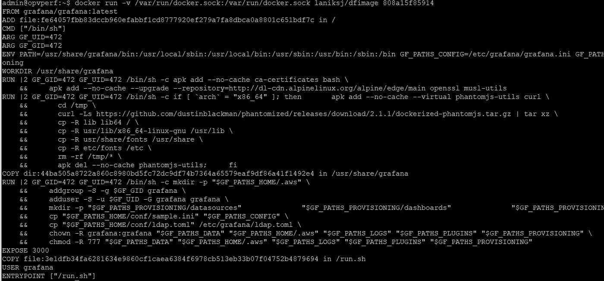
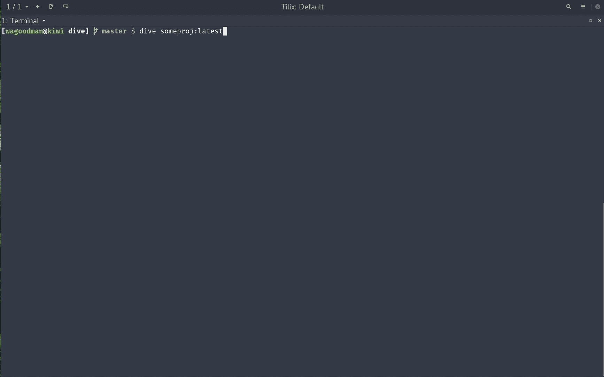
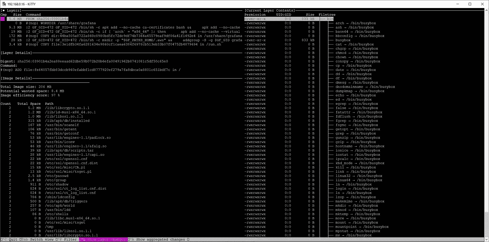
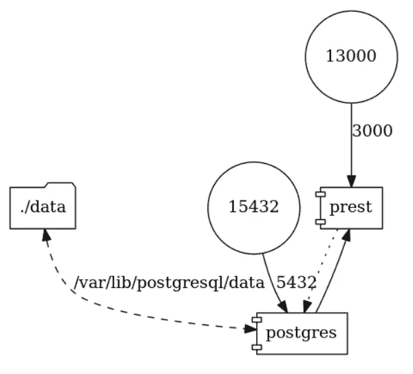
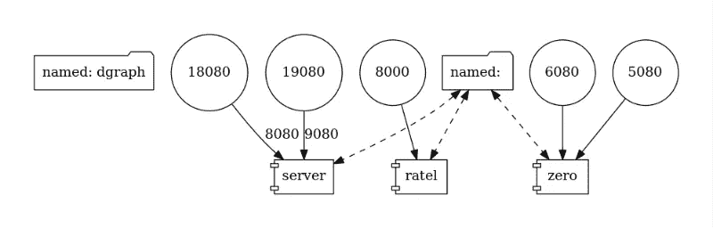

# 反向工程 docker 文件和可视化 docker-compose 文件

> 原文：<https://itnext.io/reverse-engineer-docker-files-and-visualize-docker-compose-files-80a86c33e031?source=collection_archive---------4----------------------->

Docker-compose 文件可能会变得非常复杂，在某些情况下，您不仅希望记录 docker-compose.yml 内容，还希望可视化不同的 docker-compose 服务如何通信。此外，对 docker 文件进行逆向工程，以便更好地理解它们是由什么构成的，这可能非常有趣。

有不同的方法可以做到这一点，我想深入探讨一些最流行的方法。

从 dfimage 开始，这是一个 Docker 文件的逆向工程项目，它大大简化了这项任务。

如果您愿意，您可以简单地使用可用的 dockerhub 映像，当然也可以自己构建项目。

要针对本地(已经提取的)docker 映像运行映像，只需执行:

```
docker images 
# to pick your image id # or pull an image docker pull grafana/grafana #as an example # docker run -v /var/run/docker.sock:/var/run/docker.sock laniksj/dfimage imageID docker run -v /var/run/docker.sock:/var/run/docker.sock laniksj/dfimage 808a15f85914
```

该项目需要访问 docker.sock 来访问图像细节，因此使用-v /var/run/docker.sock 运行它…

Grafana 图像的输出看起来就像这样，可以让您很好地了解图像是如何构建的:



项目可以在这里找到:[https://github.com/LanikSJ/dfimage](https://github.com/LanikSJ/dfimage)

# 跳水

dive 是一个探索 docker 图像每一层的工具。它不仅有助于审核 docker 图像，还可以找到缩小图像大小的方法。

和往常一样，你可以构建 dive 命令，下载一个版本或者使用 docker 容器。在这个例子中，我使用了 debian 版本 0.8.1:

```
wget [https://github.com/wagoodman/dive/releases/download/v0.8.1/dive_0.8.1_linux_amd64.deb](https://github.com/wagoodman/dive/releases/download/v0.8.1/dive_0.8.1_linux_amd64.deb) sudo dpkg -i dive_0.8.1_linux_amd64.deb # check the Grafana image 
dive 808a15f85914 
Fetching image... (this can take a while with large images) 
Parsing image... 
Analyzing image... 
Building cache...
```



项目演示视频

我们的 Grafana 图像看起来更像这样



另一个不错的 dive 特性是通过将 CI 变量设置为 true 来集成到 CI 构建过程中

**CI =真潜<your-image>**

发布下载可以在这里找到:【https://github.com/wagoodman/dive/releases/tag/v0.8.1 

潜水项目可以在这里找到:

[https://github.com/wagoodman/dive](https://github.com/wagoodman/dive)

# Docker-Compose-Viz

我想介绍的最后一个项目是 docker-compose 文件的可视化。当您想要在 docker-compose 文件中可视化端口或不同服务之间的通信时，这非常方便。它使用 graphviz 项目创建一个图像文件。请确保您在 docker-compose.yml 文件所在的目录下运行以下命令，并确保您拥有写权限。

运行该命令后，您也将在该目录中找到 docker-compose.png 文件。

```
docker run --rm -it --name dcv -v $(pwd):/input pmsipilot/docker-compose-viz render -m image docker-compose.yml
```

这个例子是一个简单的 [prest/postgres](https://github.com/prest/prest) 项目，基于以下 docker-compose.yml 文件:

```
version: "3"
services:
    prest:
        image: prest/prest
        links:
            - "postgres:postgres"
        environment:
            - PREST_DEBUG=true # remove comment for enable DEBUG mode (disable JWT)
            - PREST_PG_HOST=postgres
            - PREST_PG_USER=prest
            # - PREST_PG_PASS=prest
            - PREST_PG_DATABASE=prest
            - PREST_PG_PORT=5432
            - PREST_JWT_DEFAULT=false # remove if need jwt
        depends_on:
            - postgres
        ports:
            - "13000:3000"
    postgres:
        image: postgres:latest
        volumes:
            - "./data:/var/lib/postgresql/data"
        environment:
            - POSTGRES_USER=prest
            - POSTGRES_DB=prest
            # - POSTGRES_PASSWORD=prest
        ports:
            - "15432:5432"
```



```
version: "3.2"
services:
  zero:
    image: dgraph/dgraph:latest
    volumes:
      - type: volume
        source: dgraph
        target: /dgraph
        volume:
          nocopy: true
    ports:
      - 5080:5080
      - 6080:6080
    restart: on-failure
    command: dgraph zero --my=zero:5080
  server:
    image: dgraph/dgraph:latest
    volumes:
      - type: volume
        source: dgraph
        target: /dgraph
        volume:
          nocopy: true
    ports:
      - 18080:8080
      - 19080:9080
    restart: on-failure
    command: dgraph alpha --my=server:7080 --lru_mb=2048 --zero=zero:5080
  ratel:
    image: dgraph/dgraph:latest
    volumes:
      - type: volume
        source: dgraph
        target: /dgraph
        volume:
          nocopy: true
    ports:
      - 8000:8000
    command: dgraph-ratelvolumes:
  dgraph:
```



根据服务的数量和复杂程度，你可以生成一些大小合适的图像——所以一定要有一个大屏幕。

docker-compose viz 项目可以在这里找到:[https://github.com/pmsipilot/docker-compose-viz](https://github.com/pmsipilot/docker-compose-viz)

*原载于 2019 年 10 月 9 日*[*【https://www.opvizor.com】*](https://www.opvizor.com/reverse-engineer-docker-files-and-visualize-docker-compose-files)*。*