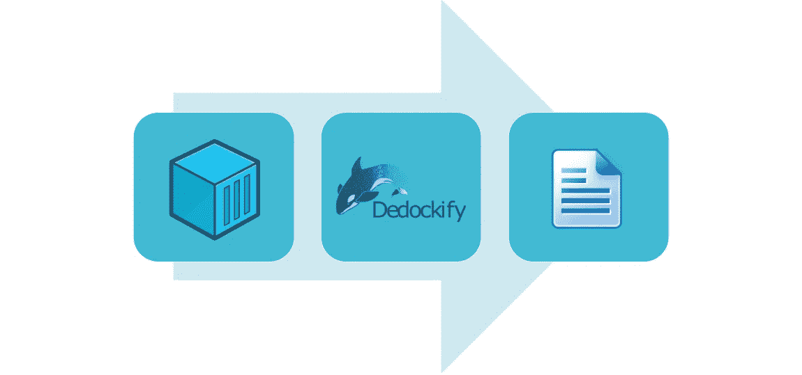
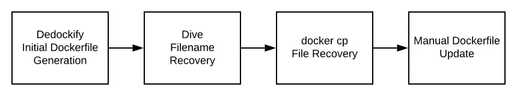
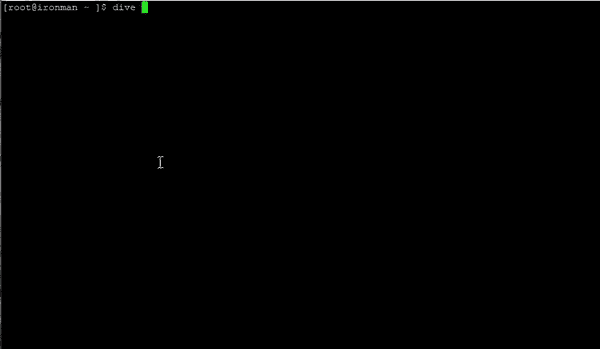
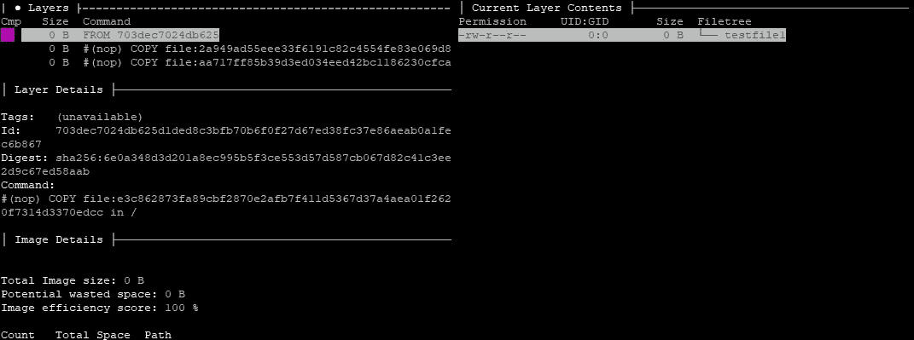
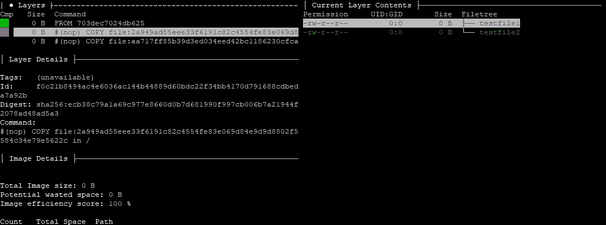
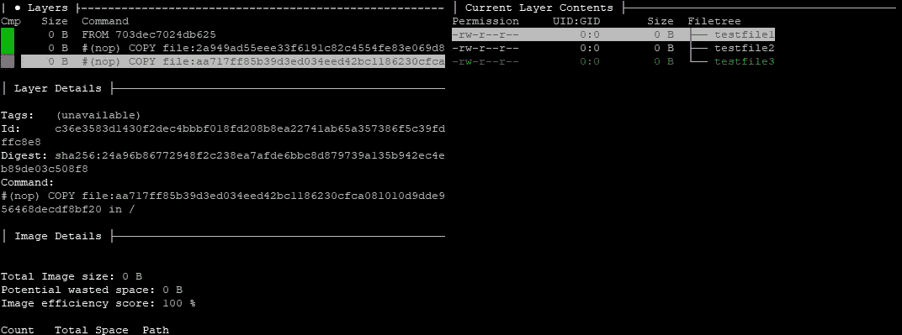
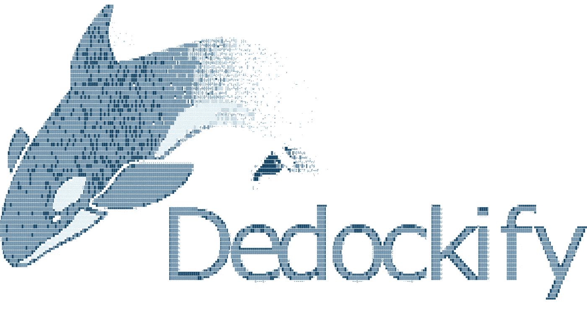
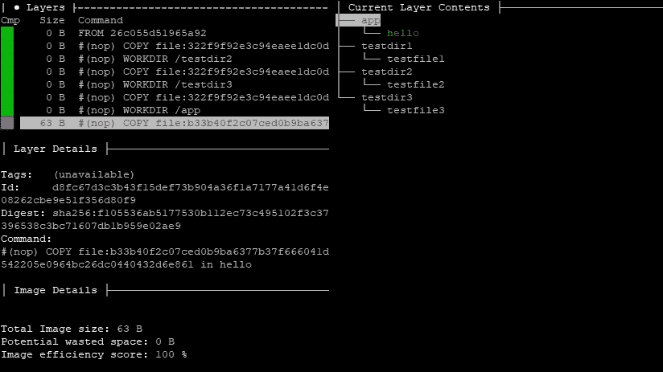
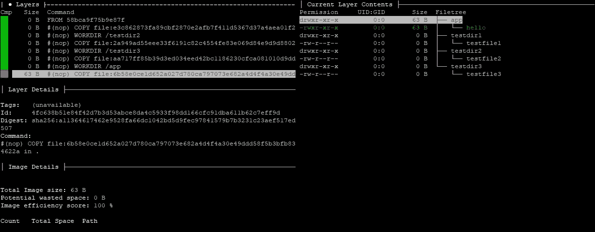

# 将 Docker 图像反向工程为 Docker 文件

> 原文：<https://itnext.io/reverse-engineer-docker-images-into-dockerfiles-453d3d21d896?source=collection_archive---------0----------------------->

## 码头深水潜水

## 通过检查 docker 映像存储数据的内部机制，对 Docker 映像进行逆向工程

# TL；速度三角形定位法(dead reckoning)

在这个故事中，我们将通过查看 Docker 映像如何存储数据，如何使用工具查看映像的不同方面，以及如何创建像 [Dedockify](https://github.com/mrhavens/Dedockify) 这样的使用 Python Docker APIs 创建 Docker 文件的工具，来对 Docker 映像进行逆向工程。



[去神秘化](https://github.com/mrhavens/Dedockify)插图作者[作者](https://markhavens.us)。

# 介绍

随着像 [Docker Hub](https://hub.docker.com) 和 [TreeScale](https://treescale.com) 这样的公共 Docker 注册表越来越受欢迎，管理员和开发人员下载未知实体创建的图像变得越来越常见。很多时候，便利战胜了感知的风险。在某些情况下，当 Docker 图像公开时，它要么直接在清单中、在 git 存储库中提供，要么通过相关链接提供。更常见的是，不提供 docker 文件。在 docker 文件可用的情况下，我们很难保证预构建的映像与 docker 文件相关，或者甚至可以安全使用。

也许你不关心安全漏洞。也许你想更新你最喜欢的一张图片，这样它就可以在最新版本的 Ubuntu 上运行了。或者，您可能会不可控制地被迫发布一个稍微优化一点的映像，因为有一个针对另一个发行版的编译器，它更适合在编译时生成二进制文件。

不管是什么原因，都有恢复映像 docker 文件的选项。Docker 图像不是黑盒。重建 Dockerfile 文件所需的大部分信息都可以检索到。通过查看 Docker 映像内部并检查其内部结构，我们将能够从任意预构建的容器中重建 Docker 文件。

在这个故事中，我们将展示如何使用两个工具从图像中重建 Docker 文件: [Dedockify](https://github.com/mrhavens/Dedockify) ，一个为这个故事提供的定制 Python 脚本，和 [Dive](https://github.com/wagoodman/dive) ，一个 Docker 图像探索工具。所用的基本工艺流程如下。



使用 [Dedockify](https://github.com/mrhavens/Dedockify) 的基本流程。作者[插图](https://markhavens.us)。

# 使用潜水



作者[的潜水演示剪辑](https://markhavens.us)。

为了快速理解图像是如何构成的，我们将使用 Dive 学习一些高级的和可能不熟悉的 Docker 概念。Dive 工具检查 Docker 图像的每一层。

让我们创建一个简单、易于遵循的`Dockerfile`来进行测试。

将这段代码直接放入一个空目录中:

```
cat > Dockerfile << EOF ; touch testfile1 testfile2 testfile3
FROM scratch
COPY testfile1 /
COPY testfile2 /
COPY testfile3 /
EOF
```

通过输入上面的内容并按回车键，我们刚刚创建了一个新的 *Dockerfile* 并在同一个目录中填充了三个零字节测试文件。

```
$ ls
Dockerfile  testfile1  testfile2  testfile3
```

现在，让我们使用这个 Dockerfile 文件构建一个图像，并将其标记为`example1`。

```
docker build . -t example1
```

构建`example1`映像应该产生以下输出:

```
Sending build context to Docker daemon  3.584kB
Step 1/4 : FROM scratch
 --->
Step 2/4 : COPY testfile1 /
 ---> a9cc49948e40
Step 3/4 : COPY testfile2 /
 ---> 84acff3a5554
Step 4/4 : COPY testfile3 /
 ---> 374e0127c1bc
Successfully built 374e0127c1bc
Successfully tagged example1:latest
```

下面的零字节`example1`图像现在应该是可用的:

```
$ docker images
REPOSITORY          TAG                 IMAGE ID            CREATED             SIZE
example1            latest              374e0127c1bc        31 seconds ago      0B
```

请注意，由于没有二进制数据，这个图像将不起作用。我们只是用它作为一个简化的例子，说明如何在 Docker 图像中查看图层。

我们可以从图像的大小看出这里没有源图像。我们没有使用源图像，而是使用了`scratch`,它指示 Docker 使用一个零字节的空白图像作为源图像。然后，我们通过复制三个额外的零字节测试文件来修改空白图像，然后将这些更改标记为`example1`。

现在，让我们用潜水来探索我们的新形象。

```
docker run --rm -it \
    -v /var/run/docker.sock:/var/run/docker.sock \
    wagoodman/dive:latest example1
```

执行上面的命令应该会自动从 Docker Hub 拉`wagoodman/dive`，并产生 Dive 的抛光接口的输出。

```
Unable to find image 'wagoodman/dive:latest' locally
latest: Pulling from wagoodman/dive
89d9c30c1d48: Pull complete
5ac8ae86f99b: Pull complete
f10575f61141: Pull complete
Digest: sha256:2d3be9e9362ecdcb04bf3afdd402a785b877e3bcca3d2fc6e10a83d99ce0955f
Status: Downloaded newer image for wagoodman/dive:latest
Image Source: docker://example-image
Fetching image... (this can take a while for large images)
Analyzing image...
Building cache...
```



[作者](https://markhavens.us)潜水截图。

滚动列表中图像的三个层，在右侧显示的树中找到三个文件。



[作者](https://markhavens.us)的潜水截图。

当我们滚动每一层时，我们可以看到右边的内容发生了变化。当每个文件被复制到一个空白的 Docker `scratch`图像时，它被记录为一个新层。



[作者](https://markhavens.us)的潜水截图。

还要注意，我们可以看到用于生成每一层的命令。我们还可以看到源文件和被更新文件的哈希值。

如果我们注意到`Command:`部分中的项目，我们应该看到以下内容:

```
#(nop) COPY file:e3c862873fa89cbf2870e2afb7f411d5367d37a4aea01f2620f7314d3370edcc in /
#(nop) COPY file:2a949ad55eee33f6191c82c4554fe83e069d84e9d9d8802f5584c34e79e5622c in /
#(nop) COPY file:aa717ff85b39d3ed034eed42bc1186230cfca081010d9dde956468decdf8bf20 in /
```

每个命令都提供了对 Dockerfile 文件中用于生成图像的原始命令的深入了解。但是，原始文件名会丢失。恢复这些信息的唯一方法似乎是观察目标文件系统的变化，或者根据其他细节进行推断。稍后将详细介绍。

# 码头工人历史

除了像 *dive* 这样的第三方工具之外，我们立即可用的工具是`docker history`。如果我们在我们的`example1` 图像上使用`docker history`命令，我们可以查看我们在 docker 文件中用来创建该图像的条目。

```
docker history example1
```

因此，我们应该得到以下结果:

```
IMAGE               CREATED             CREATED BY                                      SIZE                COMMENT
374e0127c1bc        25 minutes ago      /bin/sh -c #(nop) COPY file:aa717ff85b39d3ed…   0B
84acff3a5554        25 minutes ago      /bin/sh -c #(nop) COPY file:2a949ad55eee33f6…   0B
a9cc49948e40        25 minutes ago      /bin/sh -c #(nop) COPY file:e3c862873fa89cbf…   0B
```

请注意，`CREATED BY`列中的所有内容都被截断了。这些是通过 Bourne shell 传递的 Dockerfile 指令。这些信息对于重新创建我们的 docker 文件可能是有用的，虽然它在这里被截断了，但是我们也可以通过使用`no-trunc`选项来查看全部内容:

```
$ docker history example1 --no-trunc
IMAGE                                                                     CREATED             CREATED BY                                                                                           SIZE                COMMENT
sha256:374e0127c1bc51bca9330c01a9956be163850162f3c9f3be0340bb142bc57d81   29 minutes ago      /bin/sh -c #(nop) COPY file:aa717ff85b39d3ed034eed42bc1186230cfca081010d9dde956468decdf8bf20 in /    0B
sha256:84acff3a5554aea9a3a98549286347dd466d46db6aa7c2e13bb77f0012490cef   29 minutes ago      /bin/sh -c #(nop) COPY file:2a949ad55eee33f6191c82c4554fe83e069d84e9d9d8802f5584c34e79e5622c in /    0B
sha256:a9cc49948e40d15166b06dab42ea0e388f9905dfdddee7092f9f291d481467fc   29 minutes ago      /bin/sh -c #(nop) COPY file:e3c862873fa89cbf2870e2afb7f411d5367d37a4aea01f2620f7314d3370edcc in /    0B
```

虽然这有一些有用的数据，但从命令行解析可能是一个挑战。我们也可以使用`docker inspect`。然而，在这个故事中，我们将重点关注使用 Python 的 Docker 引擎 API。

# 为 Python 使用 Docker 引擎 API

Docker 为 Docker 引擎 API 发布了一个 [Python 库，允许从 Python 内部完全控制 Docker。在下面的例子中，我们可以通过运行下面的 Python 3 代码来恢复与使用`docker history`类似的信息:](https://docker-py.readthedocs.io/en/stable/)

```
#!/usr/bin/python3

import docker

cli = docker.APIClient(base_url='unix://var/run/docker.sock')
print (cli.history('example1'))
```

这将产生如下所示的输出:

```
[{'Comment': '', 'Created': 1583008507, 'CreatedBy': '/bin/sh -c #(nop) COPY file:aa717ff85b39d3ed034eed42bc1186230cfca081010d9dde956468decdf8bf20 in / ', 'Id': 'sha256:374e0127c1bc51bca9330c01a9956be163850162f3c9f3be0340bb142bc57d81', 'Size': 0, 'Tags': ['example:latest']}, {'Comment': '', 'Created': 1583008507, 'CreatedBy': '/bin/sh -c #(nop) COPY file:2a949ad55eee33f6191c82c4554fe83e069d84e9d9d8802f5584c34e79e5622c in / ', 'Id': 'sha256:84acff3a5554aea9a3a98549286347dd466d46db6aa7c2e13bb77f0012490cef', 'Size': 0, 'Tags': None}, {'Comment': '', 'Created': 1583008507, 'CreatedBy': '/bin/sh -c #(nop) COPY file:e3c862873fa89cbf2870e2afb7f411d5367d37a4aea01f2620f7314d3370edcc in / ', 'Id': 'sha256:a9cc49948e40d15166b06dab42ea0e388f9905dfdddee7092f9f291d481467fc', 'Size': 0, 'Tags': None}]
```

查看输出，我们可以看到，重建 Dockerfile 的大部分只是解析所有相关数据并反转条目的问题。但是正如我们前面看到的，我们还注意到在`COPY`指令中有一些散列条目。如前所述，这里的散列条目表示从层外部使用的文件名。这些信息不能直接恢复。然而，正如我们在 Dive 中看到的，当我们搜索对层所做的更改时，我们可以推断出这些名称。有时也可能推断出原始复制指令包含目标文件名作为目的地的情况。在其他情况下，文件名可能并不重要，允许我们使用任意文件名。在其他情况下，虽然更难评估，但我们可以推断出系统中其他地方反向引用的文件名，例如支持脚本或配置文件等依赖项。但无论如何，搜索层间所有变化是最可靠的。



[Dedockify](https://github.com/mrhavens/Dedockify) logo 作者[作者](https://markhavens.us)。

# [去时钟化](https://github.com/mrhavens/Dedockify)

让我们更进一步。为了帮助将该图像逆向工程为 order 文件，我们需要解析所有内容并将其重新格式化为可读的形式。请注意，为了这个故事的目的，下面的 Python 3 代码已经可用，可以从 GitHub 上的 [Dedockify](https://github.com/mrhavens/Dedockify) 库获得。感谢 [LanikSJ](https://github.com/LanikSJ) 所有[伟大的原创基础和编码](https://github.com/LanikSJ/dfimage)。

```
from sys import argv
import docker

class ImageNotFound(Exception):
    pass

class MainObj:
    def __init__(self):
        super(MainObj, self).__init__()
        self.commands = []
        self.cli = docker.APIClient(base_url='unix://var/run/docker.sock')
        self._get_image(argv[-1])
        self.hist = self.cli.history(self.img['RepoTags'][0])
        self._parse_history()
        self.commands.reverse()
        self._print_commands()

    def _print_commands(self):
        for i in self.commands:
            print(i)

    def _get_image(self, img_hash):
        images = self.cli.images()
        for i in images:
            if img_hash in i['Id']:
                self.img = i
                return
        raise ImageNotFound("Image {} not found\n".format(img_hash))

    def _insert_step(self, step):
        if "#(nop)" in step:
            to_add = step.split("#(nop) ")[1]
        else:
            to_add = ("RUN {}".format(step))
        to_add = to_add.replace("&&", "\\\n    &&")
        self.commands.append(to_add.strip(' '))

    def _parse_history(self, rec=False):
        first_tag = False
        actual_tag = False
        for i in self.hist:
            if i['Tags']:
                actual_tag = i['Tags'][0]
                if first_tag and not rec:
                    break
                first_tag = True
            self._insert_step(i['CreatedBy'])
        if not rec:
            self.commands.append("FROM {}".format(actual_tag))

__main__ = MainObj()
```

# 初始 Dockerfile 文件生成

如果您已经做到了这一步，那么您应该有两个图像:`wagoodman/dive`和我们自定义的`example1`图像。

```
$ docker images
REPOSITORY          TAG                 IMAGE ID            CREATED             SIZE
example1            latest              374e0127c1bc        42 minutes ago      0B
wagoodman/dive      latest              4d9ce0be7689        2 weeks ago         83.6MB
```

对我们的`example1`映像运行这段代码，最终会产生以下结果:

```
$ python3 dedockify.py 374e0127c1bc
FROM example1:latest
COPY file:e3c862873fa89cbf2870e2afb7f411d5367d37a4aea01f2620f7314d3370edcc in /
COPY file:2a949ad55eee33f6191c82c4554fe83e069d84e9d9d8802f5584c34e79e5622c in /
COPY file:aa717ff85b39d3ed034eed42bc1186230cfca081010d9dde956468decdf8bf20 in /
```

我们已经提取了几乎与之前用 Dive 探索图像时观察到的相同的信息。请注意`FROM`指令向我们显示了`example1:latest`而不是`scratch`。在这种情况下，我们的代码对基本图像做了一个技术上不正确的假设。

作为比较，让我们对我们的`wagoodman/dive`图像做同样的事情。

```
$ python3 dedockify.py 4d9ce0be7689
FROM wagoodman/dive:latest
ADD file:fe1f09249227e2da2089afb4d07e16cbf832eeb804120074acd2b8192876cd28 in /
CMD ["/bin/sh"]
ARG DOCKER_CLI_VERSION=
RUN |1 DOCKER_CLI_VERSION=19.03.1 /bin/sh -c wget -O- https://download.docker.com/linux/static/stable/x86_64/docker-${DOCKER_CLI_VERSION}.tgz |     tar -xzf - docker/docker --strip-component=1 \
    &&     mv docker /usr/local/bin
COPY file:8385774b036879eb290175cc42a388877142f8abf1342382c4d0496b6a659034 in /usr/local/bin/
ENTRYPOINT ["/usr/local/bin/dive"]
```

与我们的`example1`图片相比，这显示了更多的多样性。我们注意到`ADD`指令就在`FROM`指令之前。我们的代码又做出了错误的假设。我们不知道`ADD`指令增加了什么。然而，我们可以直观地假设，我们并不确切知道基础图像是什么。`ADD`指令可以用来将本地`tar`文件提取到根目录中。有可能它使用这种方法加载另一个基础映像。

# [去毛刺](https://github.com/mrhavens/Dedockify)限制测试

让我们通过创建一个例子`Dockerfile`来进行实验，在这个例子中，我们显式地定义了基本图像。正如我们前面所做的，在一个空目录中，直接从命令行运行下面的代码片段。

```
cat > Dockerfile << EOF ; touch testfile1 testfile2 testfile3
FROM ubuntu:latest
RUN mkdir testdir1
COPY testfile1 /testdir1
RUN mkdir testdir2
COPY testfile2 /testdir2
RUN mkdir testdir3
COPY testfile3 /testdir3
EOF
```

现在，执行一个构建，将我们的新图像标记为`example2`。这将创建一个与之前相似的图像，除了不使用`scratch`而是使用`ubuntu:latest`作为基础图像。

```
$ docker build . -t example2
Sending build context to Docker daemon  3.584kB
Step 1/7 : FROM ubuntu:latest
 ---> 72300a873c2c
Step 2/7 : RUN mkdir testdir1
 ---> Using cache
 ---> 4110037ae26d
Step 3/7 : COPY testfile1 /testdir1
 ---> Using cache
 ---> e4adf6dc5677
Step 4/7 : RUN mkdir testdir2
 ---> Using cache
 ---> 22d301b39a57
Step 5/7 : COPY testfile2 /testdir2
 ---> Using cache
 ---> f60e5f378e13
Step 6/7 : RUN mkdir testdir3
 ---> Using cache
 ---> cec486378382
Step 7/7 : COPY testfile3 /testdir3
 ---> Using cache
 ---> 05651f084d67
Successfully built 05651f084d67
Successfully tagged example2:latest
```

因为我们现在有一个稍微复杂一点的`Dockerfile`要重建，而且我们有了生成这个图像的精确的`Dockerfile`，我们可以做一个比较。

```
$ docker images
REPOSITORY          TAG                 IMAGE ID            CREATED             SIZE
example2            latest              05651f084d67        2 minutes ago       64.2MB
example1            latest              374e0127c1bc        1 hour ago          0B
ubuntu              latest              72300a873c2c        9 days ago          64.2MB
wagoodman/dive      latest              4d9ce0be7689        3 weeks ago         83.6MB
```

让我们从 Python 脚本中生成输出。

```
$ python3 dedockify.py 05651f084d67
FROM ubuntu:latest
RUN /bin/sh -c mkdir testdir1
COPY file:cc4f6e89a1bc3e3c361a1c6de5acc64d3bac297f0b99aa75af737981a19bc9d6 in /testdir1
RUN /bin/sh -c mkdir testdir2
COPY file:a04cdcdf5fd077a994fe5427a04f6b9a52288af02dad44bb1f8025ecf209b339 in /testdir2
RUN /bin/sh -c mkdir testdir3
COPY file:2ed8ccde7cd97bc95ca15f0ec24ec447484a8761fa901df6032742e8f1a2a191 in /testdir3
```

这与最初的`Dockerfile`非常吻合。这次没有`ADD`指令，`FROM`指令是正确的。假设我们的基础映像是在原始的`Dockerfile`中定义的，并且它避免使用`scratch`或者避免使用`ADD`指令从`tar`文件创建基础映像，我们应该能够以一定的精度重建`Dockerfile`。然而，我们仍然不知道被复制的原始文件的名称。

# 盲目自由式文件重建

现在，让我们尝试使用我们已经讨论过的工具，以正确的方式对 Docker 容器进行逆向工程。我们将使用的容器是根据上面的例子修改的。我们之前的`Dockerfile`已经被修改成了`example3`。通过添加一个小的二进制文件，图像变得实用了。汇编源代码在 [Dedockify GitHub 库](https://github.com/mrhavens/Dedockify)中的[处](https://github.com/mrhavens/Dedockify/tree/master/examples/example3/hello.s)可用。由于这个图像很小，我们不需要构建或拖动它。我们可以用下面的代码片段将整个容器复制并粘贴到我们的 Docker 环境中，来展示我们的命令行技能。

```
uudecode << EOF | zcat | docker load
begin-base64 600 -
H4sICMicXV4AA2V4YW1wbGUzLnRhcgDtXVtvG8cVVnp56UN/QJ/YDQokgETN
zJkrgTykjgsbDSzDURMkshDM5YzFhiJVkkpiCELzH/pP+tYfkf/UsxRNXdxI
spe7lqv5IJF7PTM7Z87MmY9nZxgL2qG1DkN2nkXmtTecQwYrMMfsBHgXgFuV
eXLCI5c26sxdNHQsie2Nm8GYZEYp+l7g6vdim4MWBrgyBjaY4MbIjZ66hezG
OJ7N/ZSyMp1M5tddd9P5qw/3noA11f+XD5998XjnybVpcMa0lNfoH67oHxiI
jV4nhXjP9c/7701WC1pAY/v/+2wyvimNG+zfgLpi/0KbYv+d4KQapmpQNa0G
1WZ15Kc4npMsr7JUjGGMyLUzPEXJc1RCWqFkTtoEL5TgEaLSKlmOiXHnUSlK
jYsQSFacop9jnTHuDNtinP52GRss/r6pL5iM5344xum3tJWHL6rBSfVoMpuP
/SHSXXTFZ5NDuuB8/28znJ5tfTqf+3jwxTwNx9Ug+9EMLxybHM9fP4jT6erg
7vzlanvnCMeX5Sz2dsYRV0cejr+vBuPj0WizenCYXm0+PvQvlhn7cjI6PsTZ
qzNfTabfDccvPhsuc/twPJ++PJoM66I9u2Jn/Ofj4Wgl6nMfcLS8/XSzmtBm
NRqOj3+sTm+h/8b2P/IvcdqvbeiX07je/uXr/h9oZor9dwF/dHQbF74R3sz/
F1RfuKbLi//fAWr993846C/+J0f/aCONRR9/g/4vbXNQShb7LygoKGgTTDkP
1tiEUvkgJajgnTZRA0pAplFqZ1m02hqXjc4+aaVTztx4pzywfvPxH7X1V/0/
oZgu7X8XOKn8NB4M5xjnx9N6ROIPk5ZnI6y7P67aq55+uvvok+3j2XR7NIl+
tD0Lw/Hgwv5q9/zEYuNslz6q/f85MJsd0CBVD4SHEDhGkM4LDIqHQN4JjU5s
5NqiJguRAr3nKpgICoRhyLNiCgHQOLxhfLdN7teVMd7e4uD2AY5Gkzpv14/2
VuPgegyvDA3aOATr5cJkJUs0tMsRacytE6MsGZnp/piCEMaiijHmJJOIihvN
bh5WX0zh/7kqkA5od3t2QI+yFenjw4/Gk6OPe7Wqnuw++/rpzuMnu7295xdU
9bzar29/X6rPyenpRZZFMMG2GGwxsStgoPhAQF8KrZ1grqZb0iR+R5Xie5zO
hpPxgpbpM+hrOnUwnM0nU1LY3sm1AnnfOXCgDDPfnDM834aX9XOclXZvK/aW
Jf3VzrO/fvb4WW97jjPS95RXp5vXyxd9Qd0MSCnsLeQ/2Hn6dS8PRzgAIbLL
TiBEJ9Ej8hRZEmCURW6CcTaD8+h18BhtdsrJIFDGmBigS6w3HPfqTNbCeO8W
2SQjVBK4lW9RDOIW8hUZv+PG8XdWDOI2xWA4mYGkKvYWxQC3kO+YdMYxod5Z
McDNxQB9Zpkg38iJNymG2uxvFi005+RJwRsVQAAIkmURmaF+gwUXvAZjApis
tWaSJyWFoAaKOS1DFJrKR0omQSSNVvO6ABaNz20e/mITc0MOe9c1vJsVHh7N
X3674CKrwXx6jKf7l6jQzar233Ld8lXzl0d1E724eFY3bsOcvx2mWd14Lttt
riUXQXJAZFJn5MLriMHJTA6yT44zHZjHQJ2qZM5watCpBeeevFdMdANJXUkC
7ZMxjCq7TI6cbW+zUkEpqj/RMrBeWInCUuFqj3QZTxays9RrBNT+XBJDh2Qw
wQkfqXcAqjZK5RA5SNIJzywKSTKTMGiYjkoknwJjzgVg1vBwLilYbbwhFzsz
LYTTwqNgRiMEZhMYK7zztZ9gmHUZap8/0WOROCXRenUhT1Q8IlhltBbOihhR
ZhOtoucgwVRolD3DkqprS6bHZzlbmxMNOBJGRYVxLsmDcSGZJBkTjkdlEtW3
IKj4nA0oUJHDYgP5MZQ3qjHKZCrDqJSylvwZhAtPF5PRMfJEt4I0kjvms/Qq
U4VVnp6O6jD3PJpaujKcLqJqaNF5TlrR5lxS5jQ2IfVRv22MAhbInjAaiNIp
zkSGCAacVmAj0IPWDVoKPFCjQMXi0VX7p7eh4N8phI70kElxeg7vhJIKZYpa
qOy9J9Vpck3Qkx2I2qOMIUrSQ46GKrzkqHRb8R+cF/63CzTWfyvxH8LI8vtP
JyjxH/cbje1/DfEfWvDX4j8YL/bfBZbxH02rQYnZ6DBmY51obP/txH8oUX7/
7QSv+LU2g0DezP/nVF+EBij+fxdY6b/FIJC6PN4s/kOqWv/F/gsKCgrag2Jg
EIxFl3RyIWQB2bjkDIiYFeTIUuLJy6SNNUG4wKPl3GeXEgSfWuL/BNTxv6X/
bx+N9d/O+18gVen/u0Dh/+43Gtt/K+9/gWDF/jvBkv9rWg0uvf/lBSZQEqIi
YUoB50E7iU4JFD4ESbcok5Kq6SWbIWjFpbFSCOmUYaxwiR1yiY3tvxX+T3JR
3v/sBK8Cy+4O/yfO+L/y/lcnWOn/rvF/hf8vKCgoaBXGQgwYvEKWwNmY0euo
As/cks/mFGMgBI+BfD7jaJtrHaMnhx1ZMAF9a/M/6dL/d4HG+m9r/qfS/3eC
wv/dbzS2/7bmfyr23wmW/F/TanCR/7PKBZAyeI7SuGDqd0Y9ahVYZj6nJFFq
pZS2UieBDAC05HRxNBKE06nwfx3yf43tv6X5n3iJ/+0Er96ovHP8X/H/O8FK
/3eN/yu//xUUFBS0iqbOekv8nzSs9P9doLH+23n/V4ky/1cnKPzf/UZj+2+H
/wNd7L8TLPm/NXB2K/5vDbGEhf/riv9rbP/t8H/Ayvt/naDE/xX9L/S/mrxv
/Wnc7P9f1P+C/5OyxP8WFBQUtIqmizW1Ff9X+v9u0Fj/Lc3/Z4r/3wkK/3e/
0dj+W4r/K/P/dIMl/7eGNRtX/N8aYgkL/9cV/9fY/lua/0+xYv9doMT/Ff0v
9L9atWL9abwV/1fi/wsKCgpaRdPJetqK/6vX/y39f/torP+W4v94+f2vExT+
736jsf23FP+niv13glf8X/M5+1b8X1lL5H3i/5rafzv8n9Bl/a9OcPfW/1jy
f8X/7wQr/a/WMF5/Gm/F/xX+v6CgoKBVJPK8tUkQIUjIXCXMBoJj0oPO3Btu
jJc86SyRWaFFDOhQ8QxKJ8uya2n9D6bK+h+doLH+25n/j/My/0cnKPzf/UZj
+2/O/wmQr63/a0r8TzdY8n9Nq8FF/o+xoB1a6zBk51lkXpMADhmswByzE+Bd
AG5V5skJj1zaSKm4aOhYEpf4P8EE22KwxcSugIHiAwF9KbR2grlLRGCdsKrf
XuUQrJe25hYlS5SRHDFpoxNDACOzDxhToCpmUcUYc5JJRMWNZjfzihdTuGsc
41719NPdR59sH8+m26NJ9KPtWRiOBxf2V7vnJxYbZ7v0Ue0vScq9qt7dnh3Q
o2xF+vjwo/Hk6ONezUc+2X329dOdx092e3vPq21/dLR9gKPR5Hm1X9/+itic
HXih9EB4CIFjBOm8wKB4CIxMnRkbubaokRoGgd5zFUwEBcIw5FkxRbpC4/AG
frRO/gpHunchT3WGfoEtPTk93azSJH5Hqv4ep7PhZLxgm/sM+vqsItx9Wnmd
Kr/MS9919S3Jbj+NB8M5xvnxtM61P0y6tst3uJ72+4bG/X9z/l+9Pv4DXd7/
6Qa1sbWdxhuP/znXqsT/doJVY9tiGrX9X6t/Y67w/9SPlPF/J/jnw8//8sFq
78Fvf7Xx640/0Hf9/xs68h9OG//+/c8//am38cHGv37+6VFdWTZ7P0ymo/TH
3727jBcUFBQUNMKhHw8zzub9W/B4b4sb/H8O0lzyBemIEuX9n06wd1I9WFId
FVPOgzU2oVQ+SAkqeKdN1IASaKiPUrsFr2aNy0Znn8hNTzlz453ywBZ1iIbf
z/BosutfzOrRPP7oD49GCIORryNM6iH95/WIcXGyaaTg+eCTUl1fJBsJW9+y
uCRsfXPskbD1LdhRl9na3v4lYU1530vC1sdLVPun+8VP/SVMyVZnw/lkOsRZ
W2nc9PsvB7ja/pNBlPa/C5ysWuia61420mv4Pej0tNhcQUFBwV3GfwHMszUX
AMIAAA==
====
EOF
```

直接从命令行运行一切将加载`example3:latest`。

```
$ docker images
REPOSITORY          TAG                 IMAGE ID            CREATED             SIZE
example3            latest              059a3878de45        5 minutes ago       63B
```

现在，让我们尝试重新创建`Dockerfile`。

```
$ python3 dedockify.py 059a3878de45
FROM example3:latest
WORKDIR /testdir1
COPY file:322f9f92e3c94eaee1dc0d23758e17b798f39aea6baec8f9594b2e4ccd03e9d0 in testfile1
WORKDIR /testdir2
COPY file:322f9f92e3c94eaee1dc0d23758e17b798f39aea6baec8f9594b2e4ccd03e9d0 in testfile2
WORKDIR /testdir3
COPY file:322f9f92e3c94eaee1dc0d23758e17b798f39aea6baec8f9594b2e4ccd03e9d0 in testfile3
WORKDIR /app
COPY file:b33b40f2c07ced0b9ba6377b37f666041d542205e0964bc26dc0440432d6e861 in hello
ENTRYPOINT ["/app/hello"]
```

这给了我们一个工作的基础。由于`example3:latest`是该图像的名称，我们可以从上下文中假设它使用了“scratch”。现在，我们需要查看哪些文件被复制到了`/testdir1`、`/testdir2`、`/testdir3`和`/app`中。让我们对 Dive 运行这个映像，看看我们将如何恢复丢失的数据。

```
docker run --rm -it \
    -v /var/run/docker.sock:/var/run/docker.sock \
    wagoodman/dive:latest example3:latest
```



[作者](https://markhavens.us)的潜水截图。

如果您向下滚动到最后一层，您将能够看到所有缺失的数据填充在右侧的树中。每个目录都复制了名为`testfile1`、`testfile2`和`testfile3`的零字节文件。在最后一个版本中，一个名为`hello`的 63 字节文件被复制到了`/app`目录中。

现在，让我们找回那些文件！似乎没有办法直接从映像中复制文件，所以我们需要首先创建一个容器。

```
$ docker run -td example3:latest
6fdca182a128df7a76e618931c85a67e14a73adc69ad23782bc9a5dc29420a27
```

现在，让我们使用从下面的 Dive 中恢复的路径和文件名将我们需要的文件从容器复制到主机。

```
/testdir1/testfile1
/testdir2/testfile2
/testdir3/testfile3
/app/hello
```

我们可能首先检查我们的容器是否还在运行。

```
$ docker ps
CONTAINER ID        IMAGE               COMMAND             CREATED             STATUS              PORTS               NAMES
6fdca182a128        example3:latest     "/app/hello"        2 minutes ago       Up 2 minutes                            wizardly_lamport
```

如果容器由于某种原因没有运行，那也没什么。我们可以验证它的状态，看它是否已停止。

```
$ docker container ls -a
```

我们也可以查看日志。

```
$ docker logs 6fdca182a128
Hello, world!
```

它似乎正在运行一个持久的`Hello, world!`程序。实际上，在这种情况下，`Hello, world!`程序并没有被设计成持久的。在 Docker 版本`19.03.6`中，可能有一个错误阻止了应用程序正常终止。这暂时是可以接受的。容器可以是活动的或停止的；应用程序不需要持久化来恢复我们需要的任何数据。任何状态的容器只需要从我们提取数据的源图像中生成。

```
docker cp 6fdca182a128:/testdir1/testfile1 .
docker cp 6fdca182a128:/testdir2/testfile2 .
docker cp 6fdca182a128:/testdir3/testfile3 .
docker cp 6fdca182a128:/app/hello .
```

通过运行恢复的可执行文件来验证其行为，我们应该看到以下内容:

```
$ ./hello
Hello, world!
```

使用我们之前生成的`Dockerfile`,我们可以更新它以包含所有新的细节。这包括将`FROM`指令更新为`scratch`，以及我们在使用 Dive 进行探索时发现的所有文件名。

```
FROM scratch
WORKDIR /testdir1
COPY testfile1 .
WORKDIR /testdir2
COPY testfile2 .
WORKDIR /testdir3
COPY testfile3 .
WORKDIR /app
COPY hello .
ENTRYPOINT ["/app/hello"]
```

同样，将所有文件合并到一个共享文件夹中，我们准备运行我们的逆向工程`Dockerfile`。

首先，我们构建容器。

```
$ docker build . -t example3:recovered
Sending build context to Docker daemon  4.608kB
Step 1/10 : FROM scratch
 --->
Step 2/10 : WORKDIR /testdir1
 ---> Running in 5e8e47505ca6
Removing intermediate container 5e8e47505ca6
 ---> d30a2f002626
Step 3/10 : COPY testfile1 .
 ---> 4ac46077a588
Step 4/10 : WORKDIR /testdir2
 ---> Running in 8c48189da985
Removing intermediate container 8c48189da985
 ---> 7c7d90bc2219
Step 5/10 : COPY testfile2 .
 ---> 5b40d33100e1
Step 6/10 : WORKDIR /testdir3
 ---> Running in 4ccd634a04db
Removing intermediate container 4ccd634a04db
 ---> f89fdda8f059
Step 7/10 : COPY testfile3 .
 ---> 9542f614200d
Step 8/10 : WORKDIR /app
 ---> Running in 7614b0fdba42
Removing intermediate container 7614b0fdba42
 ---> 6d686935a791
Step 9/10 : COPY hello .
 ---> cd4baca758dd
Step 10/10 : ENTRYPOINT ["/app/hello"]
 ---> Running in 28a1ca58b27f
Removing intermediate container 28a1ca58b27f
 ---> 35dfd9240a2e
Successfully built 35dfd9240a2e
Successfully tagged example3:recovered
```

然后，我们运行它。

```
$ docker run --name recovered -dt example3:recovered
0f696bf500267a996339b522cf584e010434103fe82497df2c1fa58a9c548f20
$ docker logs recovered
Hello, world!
```

现在，为了进一步验证，让我们再次用 Dive 检查各层。

```
docker run --rm -it \
    -v /var/run/docker.sock:/var/run/docker.sock \
    wagoodman/dive:latest example3:recovered
```



[作者](https://markhavens.us)的潜水截图。

此图像显示了与原始文件相同的文件。并排比较这两个图像，它们都显示它们是匹配的。两者显示相同的文件大小。两者的功能完全相同。

这里是用来生成原始`example3`图像的原始`Dockerfile`。

```
FROM alpine:3.9.2
RUN apk add --no-cache nasm
WORKDIR /app
COPY hello.s /app/hello.s
RUN touch testfile && nasm -f bin -o hello hello.s && chmod +x hello

FROM scratch
WORKDIR /testdir1
COPY --from=0 /app/testfile testfile1
WORKDIR /testdir2
COPY --from=0 /app/testfile testfile2
WORKDIR /testdir3
COPY --from=0 /app/testfile testfile3
WORKDIR /app
COPY --from=0 /app/hello hello
ENTRYPOINT ["/app/hello"]```
```

我们可以看到，虽然我们不能完美地重建它，但我们可以近似地重建它。没有办法重建像这样使用多阶段构建的 docker 文件。这些信息根本就不存在。我们唯一的选择是重建我们实际拥有的图像的 docker 文件。如果我们有早期构建阶段的映像，我们可以为每个映像复制一个 docker 文件，但是在这种情况下，我们只有最终的构建。但是不管怎样，我们仍然成功地从 Docker 图像中复制了一个有用的`Dockerfile`。

# 未来的工作

通过使用与 Dive 类似的方法，我们应该能够更新 [Dedockify](https://github.com/mrhavens/Dedockify) 源代码，以自动跨越每一层，从而恢复所有有用的文件信息。此外，该程序可以更新，以便能够自动从容器中恢复文件并将它们存储在本地，同时还可以自动对`Dockerfile`进行适当的更新。最后，该程序也可以更新，以便能够很容易地推断，如果基层是使用一个空的`scratch`图像，或其他东西。通过对恢复的`Dockerfile`语法进行一些额外的更改， [Dedockify](https://github.com/mrhavens/Dedockify) 可能会被更新，以在大多数情况下完全自动地将 Docker 映像反向工程为功能性的`Dockerfile`。

*作为 Medium 上的一名作者，* [*我邀请你成为会员*](https://mark-havens.medium.com/membership) *并获得我的故事集，以及成千上万其他天才作家写的故事。你的会员费直接支持我和你阅读的其他作家，并让你完全接触媒体上的每一个故事。*

[](https://www.buymeacoffee.com/markrhavens)

如果你喜欢这篇文章，像你这样的粉丝再给我一杯咖啡，肯定会鼓励我再写一篇这样的文章。顺便来看看，打个招呼，让我知道你对可能想读的话题的想法。你可能是我需要写一些更棒的东西的灵感火花！

# 更新:2022 年 7 月 11 日

在 2020 年疫情爆发时，我提出并被委托撰写上述的穿越。由 [*Appfleet*](https://appfleet.com/) *发布，并于 2020 年 5 月 25 日作为 Appfleet 博客* *发布* [*。*](https://appfleet.com/blog/reverse-engineer-docker-images-into-dockerfiles-with-dedockify/) [*此 Docker 逆向工程文章的一个版本*](https://havdevops.com/Reverse-Engineer-Docker-Images-into-Dockerfiles/) *也可以在* [*我的 HavDevOps 博客*](https://havdevops.com) *上找到。我将上面更新的故事发布到 Medium，只做了微小的编辑和格式更改。如果有人发现错误需要我的注意，请不吝赐教。*

[*马克·海文斯*](https://markhavens.us/) *是美国最大的全志愿者创客空间* [*达拉斯创客社区*](https://dallasmakercommunity.org/) *(DMC)的创始人兼执行董事，这是一个非营利性组织，旨在引导* [*达拉斯创客空间*](https://dallasmakerspace.org/) *。DMC 继续改革努力，为北德克萨斯州其他以创客为中心的组织提供以创客为中心的营销和创客空间领导力教育。*