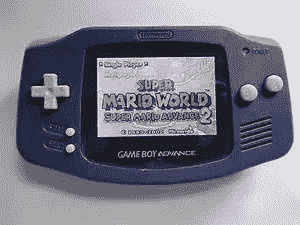
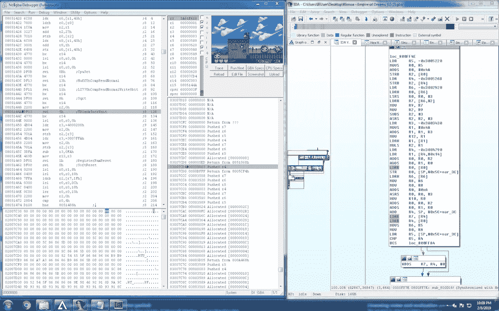
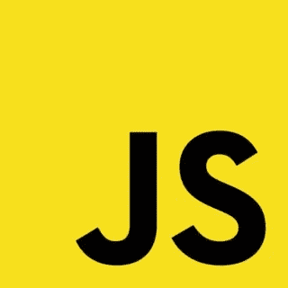
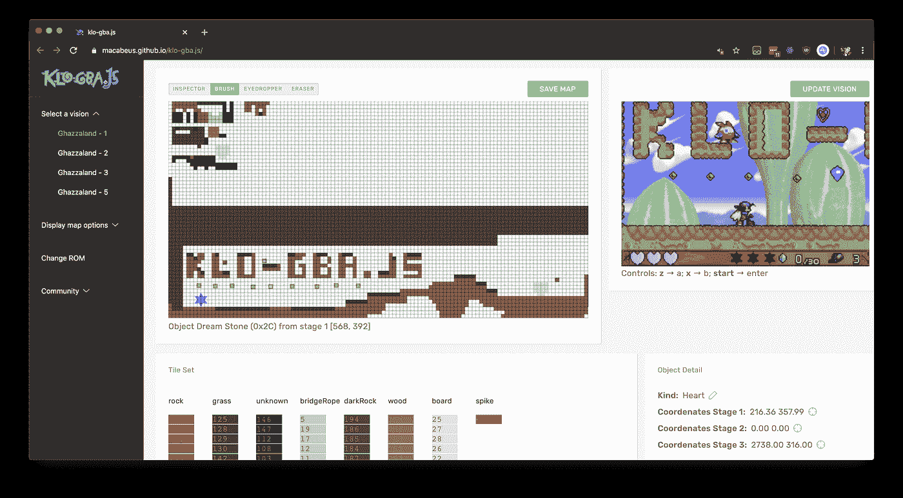

# GameBoy 高级游戏的逆向工程——完全指南

> 原文：<https://itnext.io/reverse-engineering-a-gameboy-advance-game-complete-guide-c2fca11f9e59?source=collection_archive---------2----------------------->

莱娅也是葡萄牙人！🇧🇷
[西班牙语的 léelo aquí！🇪🇸](https://macabeus.medium.com/ingenier%C3%ADa-inversa-de-un-juego-de-game-boy-advance-gu%C3%ADa-completa-dd5167f70263)

*所有帖子由*[*Benjamin Stauffer*](https://github.com/kcowolf)*和我*翻译💙

我总是试图想出个人项目；它们基本上是一种很好的方式来分散注意力，研究一些不同于我们日常所做的事情。去年，我在一个编译器项目上投入了很多精力，今年也不会有什么不同:我的研究集中在寻找一些很酷的东西来编码和研究，这需要理解计算机科学的一些领域的基础知识——并且这可能演变成一个令人兴奋的项目。
在像滚石一样度过了几个星期后，我从未能找到让我集中注意力的事情超过几天，我发现了一个真正引起我注意的挑战:**为著名 Gameboy Advance 游戏**Klonoa 创建一个关卡编辑器——也就是说，在一个 **ROM 黑客项目**上工作！

在接下来的帖子中，我将深入我的研究，以便让更多的人也研究逆向工程和其他有趣的主题。帖子将以葡萄牙语和英语两种语言撰写，以便让尽可能多的人看到。

如果你想了解项目的发展，你可以查看它的源代码，它是用 JS 和 React 编写的，在这里:[https://github.com/macabeus/klo-gba.js](https://github.com/macabeus/klo-gba.js)

但是，首先，让我们做一些概述工作~~

# 会谈

你是那种喜欢看而不喜欢读的人吗？没问题！我和我的朋友在三个关于这个项目的会议上做了演讲。当然，在一个讲座中，内容要浓缩得多，因为我们的时间更少，所以这些帖子要详细得多——但这些讲座带来了一种更具互动性的方法来揭示逆向工程的挑战。

在 **DEFCON Furs 2021** 在线演讲🌎由于这次会议是面向安全的，所以这次演讲的重点是逆向工程过程。[幻灯片](https://speakerdeck.com/macabeus/the-day-i-reverse-engineered-a-furry-gameboy-advance-game)。
(有短暂的音频问题，修复在~2:00)

在巴西🇧🇷的 Conf 2019 上演讲 **因为这个会议有普通观众，所以这个演讲的一半是关于逆向工程的，另一半是关于前端的。[幻灯片](https://speakerdeck.com/ythecombinator/the-day-i-reverse-engineered-a-gameboy-advance-game)**

演讲地点**balcon 2k 19**，塞尔维亚🇷🇸
defcon furs 2021 的情况也是如此:这个会议是面向安全的，所以演讲的重点是逆向工程过程。[幻灯片](https://speakerdeck.com/ythecombinator/the-day-i-reverse-engineered-a-gameboy-advance-game-revisited)

## 克洛诺亚到底是什么？

《克罗诺亚梦帝国》预告

这是一款 2D 平台游戏，更具益智性。它有很多关卡，当你以一种真正上瘾的方式通过这些关卡时，机械复杂性会增加。但是关卡是有限的…事实上，我真的沉迷于这个游戏，这给我带来了一个问题:**如果我们可以创造自己的关卡会怎么样？**

几个特点使这个游戏适合这个挑战:它是 2D，它有一个基于瓷砖的地图，一些相当简单的机制，并在一个古老而流行的视频游戏控制台上运行。
逆向工程和关卡编辑相当复杂但还是可以实现的！所以我们走吧！

*>什么是平铺式地图？简单易行:这是一个由许多小块组成的游戏地图。每个块(瓦片)通常出现几次，并且在内部由相同的唯一 ID 表示。
如果你看上面的视频，你可以很容易地识别出前景中的一个网格，从中有重复的棋子，从而形成游戏地图。*

这是设计 2D 游戏的一种非常常见的方式。

## Gameboy 前进

这是 2001 年推出的便携式游戏机。它在当时非常受欢迎，就像每一个变得受欢迎的游戏控制台一样，有很多人有兴趣了解更多关于它内部如何工作的信息，这导致了大量关于它的架构如何工作的研究和文档，如何创建自己的游戏，帮助逆向工程的工具和与最受欢迎的游戏相关的项目，如口袋妖怪——你可以找到关卡编辑器，如*高级地图*。

然而，**由于 Klonoa 不像口袋妖怪那样受欢迎，所以没有专注于它如何工作的研究，也没有相关的工具**。但是我们可以利用整个现有的生态系统来创建我们自己的基于 GBA 手册和调试器的工具！

## 我们的工具

左边，没有$GBA。在右边，艾达。

我们将使用两个工具: [**No$GBA**](https://problemkaputt.de/gba.htm) 主要用于动态分析(在游戏运行时进行分析)，以及 [**IDA**](https://hex-rays.com/ida-pro/) 用于静态分析(在游戏不运行时进行分析)。

不$GBA 是做动态分析的一个非常好的工具，为你提供集成到一个地方的所有东西。因为它严格地聚焦于 GBA，所以它有非常具体的特性，比如可视化背景/tilemap、图形内存查看器等。这让一切都变得简单多了。然而，对于更一般的调试过程，如果与 IDA 相比，它是非常有限的，IDA 具有优秀的静态分析功能，例如图形视图和将内存的特定区域提取到单独的文件中，这在我们提取 ROM 级别时将是至关重要的。

## Java Script 语言

该项目是一个用 JS 和 React 编写的 webapp。

我真的很喜欢 webapps，因为只需访问一个 URL，用户就可以获得现成的产品。我不想强迫一个用户下载一个应用程序，只是为了给一个游戏创造一些关卡，所以我决定这个工具是 web。

我选择 JS 是因为它是在我最熟悉的浏览器中运行的语言。之所以选择 React，是因为我非常喜欢将您的前端视为独立组件的想法，每个组件都有一组状态。

我们将在本系列的最后几篇文章中详细讨论前端。

## 都准备好了吗？开始！

在这些博客文章的最后，你将了解到这个神奇的应用程序是如何开发的

鉴于这个简要的概述，在接下来的几章中，我将解释我在项目的每一步的进展，这样我们就可以一起为 Klonoa 创建一个关卡编辑器！让我们跳到那个上面？

[下一篇:**让我们把桥拉长！**](https://medium.com/@bruno.macabeus/reverse-engineering-a-gameboy-advance-game-lets-stretch-the-bridge-part-1-26124b74be09)