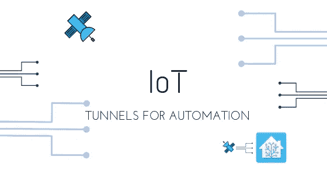
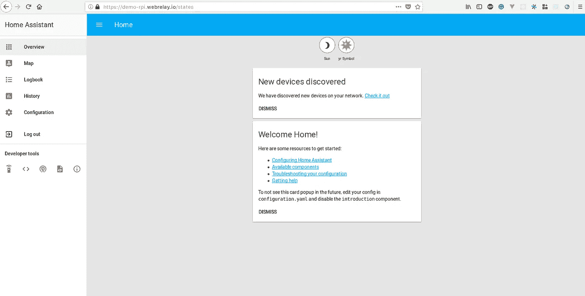
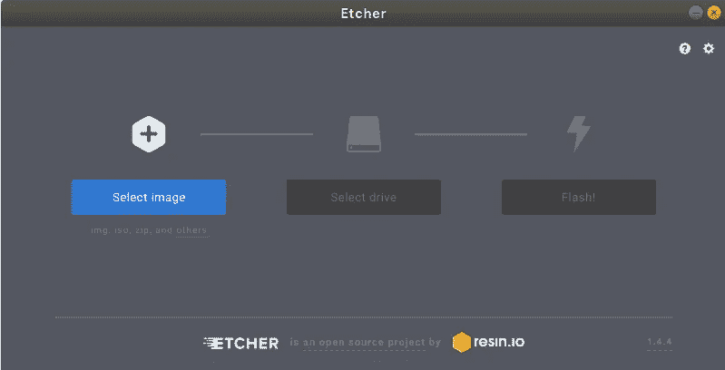
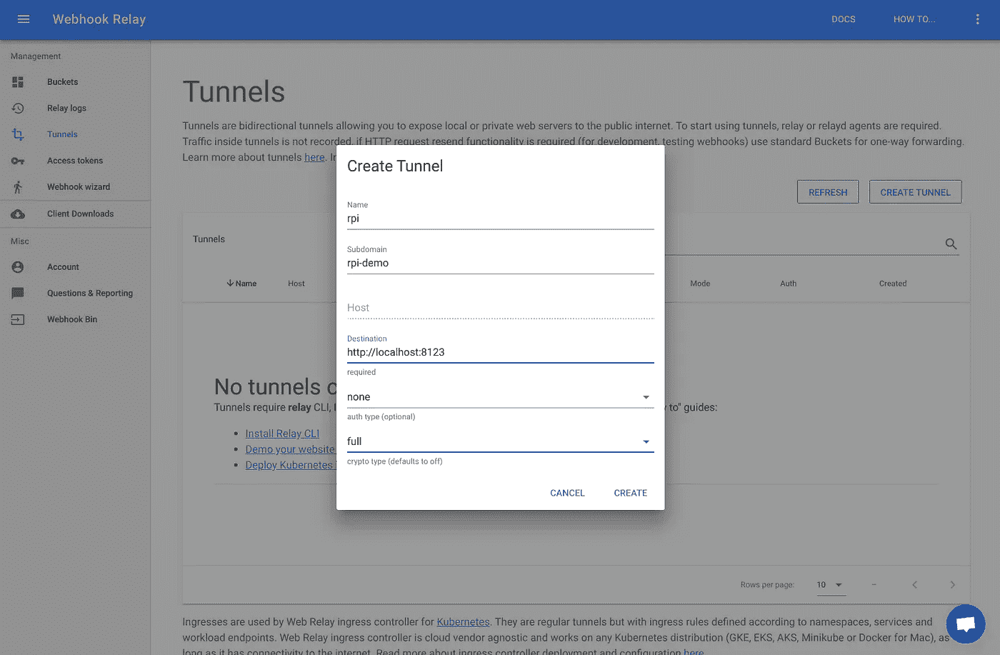
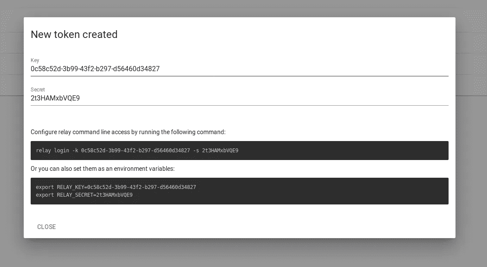

# 反向隧道为您的家庭助理对树莓皮

> 原文：<https://itnext.io/reverse-tunnels-for-your-home-assistant-on-a-raspberry-pi-cf5c63b7638e?source=collection_archive---------3----------------------->



有很多家庭自动化系统，但我最喜欢的是[家庭助手](https://www.home-assistant.io/)。它是用 Python 写的(GitHub 上有[，有一个很好的用户界面，非常容易部署。家庭助理与许多其他在线服务和硬件设备进行了大量集成。它与红色节点(](https://github.com/home-assistant/home-assistant)[https://nodered.org](https://nodered.org/))配合得非常好。

在这篇短文中，我们将使用:

*   Raspbian —操作系统
*   [Etcher](https://etcher.io/)——可能是刻录图像的最佳工具，即使你不关心 HA 或本文的其余部分，也要试试 Etcher！
*   [树莓派](https://www.raspberrypi.org/products/) —我们的迷你电脑:)
*   [Docker](https://www.docker.com/) —打包和运行服务器应用程序的最简单方式
*   [Webhook 中继](https://webhookrelay.com/) —从外部访问家庭助手的隧道服务
*   [家庭助手](https://www.home-assistant.io/) —家庭自动化系统

# TL；速度三角形定位法(dead reckoning)

创建通过 [UI](https://my.webhookrelay.com/tunnels) 的隧道，并在此提供访问密钥&秘密[。](https://my.webhookrelay.com/tokens)

有了这些详细信息，在隧道模式下启动 **webhookrelayd** 容器，并指定您的隧道名称(在本例中，隧道名称为`rpi`):

```
docker run --name whr-relayd --net host --restart always -d webhookrelay/webhookrelayd-arm:latest --mode tunnel -t rpi -k token-key -s token-secret
```

请注意，如果您在另一个容器中运行 Home Assistant，那么`--net host`并不是真正必需的，在这种情况下，您可以只使用 Docker 网络。

**启动家庭助手**

```
docker run -d --name assistant --net host -v /home/pi/home_assistant:/config -v /etc/localtime:/etc/localtime:ro --restart always homeassistant/raspberrypi3-homeassistant:0.76.2
```

从任何地方打开`your-subdomain.webrelay.io`浏览器中的隧道:



# 详细版本

## 存储卡准备:

*   将 MicroSD 存储卡插入计算机
*   格式化它
*   从[https://www.raspberrypi.org/downloads/raspbian/](https://www.raspberrypi.org/downloads/raspbian/)下载 Raspbian 操作系统镜像
*   打开[蚀刻机](https://etcher.io/)



*   使用 Etcher 选择下载的 Raspbian 图像
*   选择与您的存储卡相对应的驱动器
*   点击 flash！

# 安装 Docker

从拉斯边桌面发射终端。现在，使用终端安装 Docker:

```
curl -sSL [https://get.docker.com](https://get.docker.com) | sh
```

关于 Docker 对 Raspberry Pi 支持的官方博客文章可以在[这里](https://www.raspberrypi.org/blog/docker-comes-to-raspberry-pi/)找到。

现在，重新启动它:

```
sudo reboot
```

# 安装家庭助手

访问 Docker Hub 上的 Raspberry Pi 3 Home Assistant 存储库，确定可用的最新版本。启动家庭助手非常简单:

```
docker run -d --name assistant --net host -v /home/pi/home_assistant:/config -v /etc/localtime:/etc/localtime:ro --restart always homeassistant/raspberrypi3-homeassistant:0.76.2
```

# 创建隧道和令牌

在浏览器中打开 https://my.webhookrelay.com/tunnels[并点击“创建隧道”。如果你是一个免费计划，让'子域'和'加密'字段为空，因为它们只适用于付费计划，你会得到自动生成的子域。](https://my.webhookrelay.com/tunnels)



我们还需要一个令牌进行身份验证。转到 https://my.webhookrelay.com/tokens[创建一个新的令牌密钥&秘密对:](https://my.webhookrelay.com/tokens)



保持秘密在某个安全的地方，因为它现在被加密，不能恢复。如果你弄丢了，就生成一个新的。

# 启动 webhookrelayd

要启动隧道守护进程，请运行(只需用您自己的密钥和密码替换):

```
docker run --name whr-relayd --net host --restart always -d webhookrelay/webhookrelayd-arm:latest --mode tunnel -t rpi -k your-key -s your-secret
```

# 结论

就是这样，现在你可以远程访问你的家庭助理，而不需要配置你的路由器，获得静态 IP 或购买域名。隧道也可以通过基本认证来保护，但如果您只为您的家庭助理启用认证会更好。查看官方[文档](https://www.home-assistant.io/components/http/)中的更多信息。

此外，请记住，由于 Webhook 中继正在进行 TLS 终止，理论上流量可能会被拦截(然而，事实并非如此。只有 webhooks 可以被记录和重放)。为了解决这一潜在问题，我们将引入 HTTPS 直通模式，在这种模式下，加密流量将通过服务进行路由，并且仅在高可用性实例处终止。

另外，如果你是开发人员、工程师或者仅仅是技术人员，请尝试一下 Webhook 中继服务，我很乐意听到你的反馈！❤

附注#2:我目前正在试验 hass.io 插件，以使你的家庭自动化实例与 IFTTT 或 Zapier 服务的集成变得非常容易，我将很快就此写一篇博文:)

*原载于 2018 年 9 月 3 日*[*webhookrelay.com*](https://webhookrelay.com/blog/2018/09/03/home-assistant-remote-access/)*。*