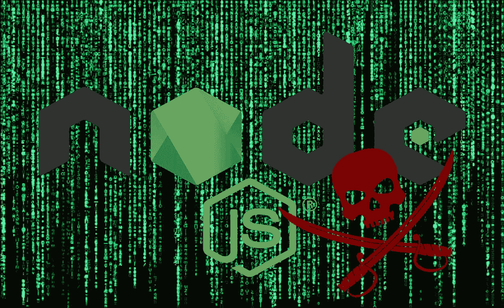

# 逆转 NodeJS 恶意软件，第 2 部分:分析源代码

> 原文：<https://itnext.io/reversing-nodejs-malware-part-2-analysing-the-source-code-a31c316ff4f?source=collection_archive---------2----------------------->



在我的上一篇文章(见[这里](/how-i-reversed-a-nodejs-malware-and-found-the-author-7dd9531b389f))中，我们发现了一个 NodeJS 恶意软件，它通过修补电子客户端的源代码来窃取客户端的不和谐凭证。

从那以后，发生了很多事情。作者删除了知识库，他为自己造成的伤害公开道歉。

# 电子

Electron 是一个框架，允许开发人员使用 HTML、Javascript 和 CSS 等 Web 技术构建桌面应用程序。

这个框架很流行，被许多典型的应用程序广泛使用，如 VSCode、Whatsapp 或 Discord。

由于应用程序代码是用 Javascript 编写的，所以源代码仍然在那里，只是隐藏在显眼的地方。那么，是什么保护我们免受恶意用户编辑包含源代码的归档并用恶意软件篡改它呢？在电子层面上，几乎没有。在操作系统层面，您可以使用代码签名或在安全的地方安装应用程序:

*   在 Windows 上，`C:\Program Files\`中的程序只能由应用程序自己编辑，但默认情况下，会安装在`%APPDATA%`中，而在这里没有这种保护。
*   在 Mac 上，应用程序通常经过签名，并且在安装过程中会验证该签名。但是在那之后，就不再检查任何东西了。
*   在 Linux 上，没有这样的默认保护机制。

# 电子恶意软件注入:盗版者

让我们通过观察 PirateStealer 的注射器如何工作来开始我们的电子注射之旅。

它首先试图在您的`%APPDATA%`目录中找到您的 Discord 安装，然后定位所有正在运行的进程。然后，它从 Github 库下载感染有效载荷，停止您的 Discord，注入有效载荷，并重新启动您的 Discord 客户端。让我们把重点放在有效载荷注入上。有效载荷注入是通过修改主 Discord 桌面文件来完成的，您可以在您的`%LOCALAPPDATA%\Discord\app-<version>\modules\discord_desktop_core-2\discord_desktop_core`目录中找到该文件。index.js 文件通常应该如下所示:

```
module.exports = require('./core.asar');
```

注射后，它将看起来像这样:

```
const fs=require("fs"),path=require("path"),{BrowserWindow:BrowserWindow,session:session}=require("electron"),querystring=require("querystring"),os=require("os");var webhook="https://discord.com/api/.....
```

正如你所看到的，恶意软件修改了 Discord 的源代码，使其代码在 Discord 中运行。

现在是时候看看这个注入的有效载荷了。

# PirateStealer 有效载荷

我不会公布有效载荷的完整代码，因为最初的 Github 库被禁止了，但我们仍然可以突出一些聪明的机制。

首先，我们可以看看 PirateStealer 是如何从 Discord 客户端获取令牌的。为了准备分发代码，Discord 团队将其代码与 [Webpack](https://webpack.js.org/) 捆绑在一起。该工具允许将许多资源捆绑成更大的块，以便于安装过程。

Webpack 还为开发人员提供了一种在运行时添加自己代码的方法。

这个特性来自这个 [Webpack JSONP 加载器](https://github.com/webpack/webpack/blob/98887e42fc9966210a09f10f33861d4f70549478/lib/web/JsonpChunkLoadingRuntimeModule.js#L412)。从突出显示的代码中可以看出，这一行允许开发人员访问整个 Webpack 运行时。从那里，我们可以访问**所有不协调的功能。从那里，我们可以列出每个函数并搜索`getToken`函数。没错，就是这样，Discord 最关键的安全功能显而易见。如果 Discord 将该函数重命名为任何其他名称，它将破坏所有当前存在的令牌抓取器。** *【咆哮:关】*

使用这个令牌，PirateStealers 运行对内部 Discord API 的几个调用:

*   它首先检查个人资料的独特徽章，如验证开发者，早期支持者…
*   然后它会列出支付来源(它不会暴露你的信用卡，但**它会暴露你的邮政地址！**)
*   然后，它列出了你的朋友与罕见的徽章，为未来的目标。
*   最后，如果它之前获取了您的密码，它会重置您的 MFA(更多信息请见下文)。

我们看到了恶意软件可以用一个简单的令牌做什么。这是相当强大的，在我看来…

但这并不是恶意软件的全部功能。它还会监视您在应用程序中的活动:

*   它检测用户何时登录、更改其密码或更改其电子邮件地址(这意味着它可以窃取您的密码和电子邮件地址)。这会泄露您现有的密码，并允许黑客登录并更改帐户上的任何信息。
*   它检测用户何时添加信用卡并泄露关于该卡的所有信息(**包括 CVC！**)

# 推荐

根据我们在文章中看到的内容，我建议:

*   **不要在 Discord 的付款方式中使用您的实际地址。**
*   **想加支付方式就不要用信用卡；用 Paypal 代替，不会泄露任何关键信息。**

还有，**请经常不和谐，混淆和旋转 getToken 函数名。这将使获取代币的过程变得非常复杂…**

感谢您阅读这篇文章，如果您有任何建议或意见，您可以在 Discord(**https://discord.gg/FKuAky4K8M**)上提出。

如果你喜欢这篇文章，请考虑留下你的反馈。这种文章需要很长时间准备(除了我的日常工作，几乎有一周时间)，所以如果你想支持我，你可以在这里订阅[中级会员](https://medium.com/@devops-guy/membership)。这也给了你无限的媒体访问权。