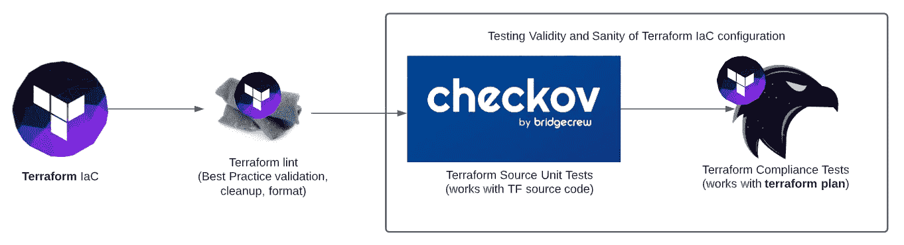
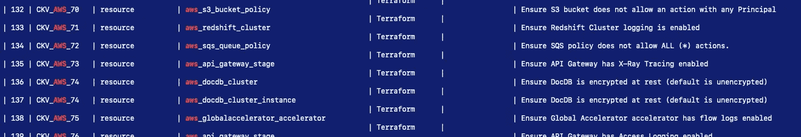
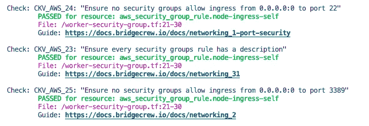
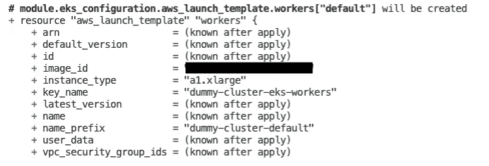
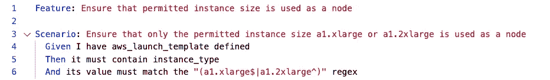
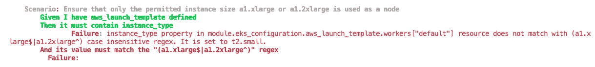
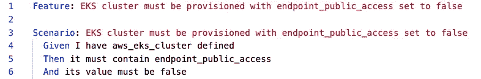
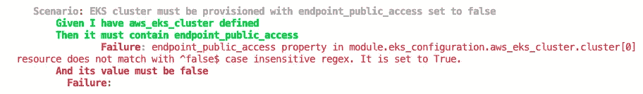
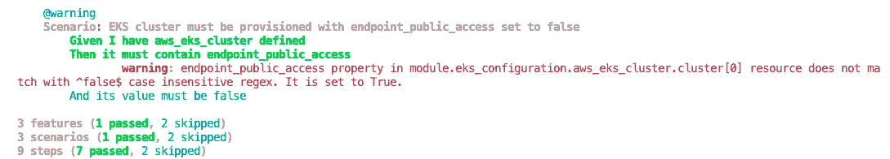
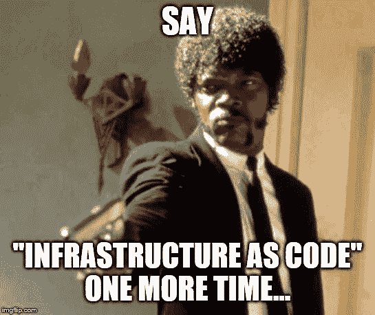

# 回顾:用单元测试测试 Terraform 基础设施，用 checkov 和符合性测试测试 BDD e2e

> 原文：<https://itnext.io/review-testing-terraform-infrastructure-as-code-with-unit-tests-bdd-e2e-with-checkov-and-9b05ca7655d2?source=collection_archive---------2----------------------->

最近，我很幸运地接受了一项任务，为 terraform 代码库调查、开发和交付一个合适的开源测试框架，作为基础设施发布管道的一部分。

“质量保证一切”的意图并不新鲜。然而，在[任何此类]上线阶段之前，实施确实依赖于组织基础设施的成熟度和风险容忍度，并因其而异。

> *TL；无论你的团队规模有多大。实施一个良好的基于 terraform 的基础设施配置分析和端到端健全性测试，不需要很长时间，也不复杂。*

重新审视“测试基础设施的代码”，展示所有新的、闪亮的测试框架，以及一个非常受欢迎的学习机会。

我必须承认，我在开始时确实有一定程度的偏见，认为这种“企业级保证”本身可能需要花费大量精力来设置和提供开销。

Hashicorp Terraform 提供了足够的开箱即用功能，来检查和验证你的代码库；

*   皮棉— `terraform fmt -check`和`terraform validate`
*   预览— `terraform plan`
*   构建— `TF_LOG=debug terraform apply`了解所有的细节。

# Terraform 的静态代码分析工具

一个关于相关 terraform 测试工具的新的 Google 搜索显示了同样多的信息，并且可用工具的列表非常庞大。

但是我们有一个特定的**需求列表**，

*   terraform 资源配置需要进行**单元测试**，以及扩展给定公共云提供商的任何此类最佳实践*检查通用列表的选项。最后，易用性是我们追求的立即开始。

**没有 ec2 实例对 0.0.0.0/0 等世界开放。*

*   运行更多定制测试的能力——一种形式的**合规“防护栏”，使我能够约束资源配置**。该选项需要具有合理的可扩展性，以保护子网、安全角色、定制标记，甚至确保启用或不启用某些 EKS 集群功能标志。
*   一个更多个人经验驱动的需求——需要确保测试框架试图尽可能减少工程开销，而不是增加它，包括技能筒仓。我很清楚，这样的测试套件——一旦创建，可能会成为以后维护和扩展的工程开销，甚至是债务。
*   就开源软件选项而言，社区支持是很重要的。至少，所选择的框架应该基于公共开发语言，比如 Go 或 Python。如果需要框架深度开发和定制方法扩展，**也许更有可能找到一个拥有一种而不是两种开发语言经验的平台工程师*。所有和任何以前的经验，当前团队和更广泛的组织可能有，与类似的工具也是有帮助的。因此，*我已经准备好为这项工作寻找合适的测试工具&框架。**

## *候选名单——让我们回顾和比较一下*

**

*希望下面的列表对你的 IaC 静态分析和 QA 之旅有所帮助。请注意，这是所有已发现的 terraform 测试相关工具的完整列表，它是配置健全性**测试**本身、 **lint** 工具和面向 secOps 的最佳实践以及**单元** - **测试**的混合体。这份清单供你参考。*

*   ***TF lint**——【https://github.com/terraform-linters/ *
*   ***陆地公司**——[https://github.com/wayfair/terrafirma](https://github.com/wayfair/terrafirma)*
*   ***TF sec**——[https://github.com/liamg/tfsec](https://github.com/liamg/tfsec)*
*   ***terras can**—[https://github.com/cesar-rodriguez/terrascan](https://github.com/cesar-rodriguez/terrascan)(目前没有 TF 0.13 支持)*
*   *查科夫——[https://github.com/bridgecrewio/checkov/](https://github.com/bridgecrewio/checkov/)*
*   *https://github.com/instrumenta/conftest*

# *选择的工具*

*现在概括一下，我热衷于为 terraform 资源组件确定**标准化** **单元** **测试**，以及一个更可定制的测试套件，该套件基于`terraform plan`结果对资源配置进行验证。*

*在回顾了每种框架的优缺点后，我选择了`checkov`并恰当地命名为`terraform-compliance`，它们都是基于 python 的框架。这似乎满足了我前面提到的所有要求。*

***IaC 发布管道，**简而言之，看起来像这样。*

**

*随着对框架的深入研究，我不可避免地自我检查了我自己的经验和目前为止在这个问题上的发现，例如；*

*   *理智测试不需要花费全世界*
*   *就单元测试而言，一些测试框架的成熟提供了大量现成的**最佳实践**。*
*   *大多数的入门都是非常直接的，因此对于任何规模的组织来说，接受和集成这样的测试框架都是必须的，其中 IaC 补充了组织自己的敏捷，由" **fail fast** "和"**go fast**"业务需求支持。*

# *单元测试——由 BridgeCrew 检查*

*[*https://www.checkov.io/*](https://www.checkov.io/)*

> *Checkov 是一个静态代码分析工具，用于基础设施即代码。*
> 
> **它扫描使用****terra form****、Cloudformation、****Kubernetes****、无服务器或 ARM 模板调配的云基础架构，并检测安全性和合规性错误配置。**

*当扫描您的 terraform 代码库时，有许多默认的最佳实践单元测试会突出与最佳实践的偏差—例如，让 VM a 端口 22 向外界开放(0.0.0.0/0 ),这从安全配置中可以明显看出。*

*所有的测试都可以在便捷的 [GitHub 链接](https://github.com/bridgecrewio/checkov/tree/master/tests/terraform/checks/resource/aws)上找到。*

*开始真的很简单。*

*   *安装二进制文件*
*   *初始化地形目录`terraform init`*
*   *在那个目录上运行 **chechov***

*所有可用的默认单元测试都可以用方便的 CLI 命令行程序列出。或者，当 **checkov** 运行时，它会默认输出所有通过和失败的单元测试。非常方便，易于上手。验证了`terraform`的最佳实践，但不是所有的。这是根本的区别。*

*Chechov 会很乐意只评估你的地形代码。它可以在`terraform init.`之后立即运行，它不关心你的`terraform plan`——这里潜在的利弊，它做它在 tin 上所说的——“静态代码分析”。请注意其中的含义，以及对您的资源的任何逻辑考虑。*

**

***checkov -l** #查看所有已发货支票的最有用班轮*

**

*checkov 运行时的输出突出显示了它通过或未通过的检查(如果适用)。*

*请注意，只要您习惯于深入 Python 开发，就可以编写额外的单元测试。框架的开发语言是需求之一，因为我有时不得不探索测试代码库，以评估这种额外的方法会花费多少精力。这一点以及对更广泛团队的维护考虑，与实现相同目的的替代框架相比，是决策过程中的驱动因素之一。*

*概括地说，就静态代码分析而言，`checkov`是非常好的。考虑到我想从一开始就将子网的某些 IP 地址列入白名单的情况，这不是 e2e 测试的地方，但是，需要一个单独的测试框架。*

**虽然肯定，我可以复制单元测试并调优值，今天就到此为止，为我的子网/IP 烘焙硬值。但是如果，我有几个实例和项目，我开始跳过相关的测试吗？也许吧。也许不是。**

> **这就是第二个补充测试框架——terraform-compliance 的用武之地。**

# *地形符合性*

*[*https://terraform-compliance.com/*](https://terraform-compliance.com/)*

> **Terraform-compliance 是一个针对 Terraform 的轻量级、安全性和合规性测试框架，可对您的基础设施即代码进行负面测试。**

# *背景故事*

*最近，作为测试框架的 BDD 再次成为焦点，强调了对通用测试框架的需求，但也有其他的需求。**简约**。*

*事实上，我觉得这种**行为驱动的开发**没有得到足够的重视。你可能听说过**TDD——测试驱动开发**——这可以追溯到很久以前，主要是在软件开发环境中。但是对于典型的基础设施工程师来说，这正是 BDD 框架之类的东西促进了一种附加逻辑的地方，以实现一种更简单、简洁和可重复的方式来开发端到端的可定制测试，而无需深入任何新的特定开发语言。*

*虽然你可以出去整理太阳底下的任何东西，但这最终还是要归结到可管理性上。理解可能需要进一步记录的复杂性，不言而喻，支持和维护，由你的同事，向前迈进。[在这里阅读更多关于 BDD 的内容](https://cucumber.io/blog/bdd/getting-started-with-bdd-part-1/)。*

*[cucumber . io](http://cucumber.io/)——更多的阿郎，促进这一测试之旅——完全旨在简化这一过程，实现**所见即所得**方法到**测试** **创建**，**理解**和**维护**。这些例子是在开发开始之前定义的，并被用作验收标准。*

*它们是**对完成**的定义的一部分。*

# *符合地形的测试*

*每个框架都根据其自身的优点进行了考虑，并对每个框架进行了深入分析，突出了它们最适合的地方，并对其中的注意事项和细微差别进行了补充—展望未来，我们可以两者都加以利用。*

*这是用`terraform-compliance`框架开发的测试用例的例子，利用了 **B** 行为 **D** riven **D** 开发。这使得测试相当复杂的端到端测试用例成为可能。*

*`terraform-compliance`框架利用`terraform plan` **输出**。因此，这使得能够为您的发布生成完整的“计划”,并相应地彻底测试这些计划。无论是使用正确的加密密钥对[为您的云提供商]帐户发言，环境或其他方面，都有很多创造性的自由，最重要的是，这是一个简单的**行为**来做所以。*

*只需查看下面的步骤和示例。*

*   ***第一步**。初始化地形目录
    # `terraform init`*
*   ***第二步**。快捷选项，用
    # `terraform plan -out=plan.out`生成一个`terraform plan`*
*   ***第三步**。写一些测试。好吧，公平地说，已经有一个范例文件夹了。下面让我们来看看我自己的测试例子，它们是基于我的`terraform plan`输出编写的。*

*这概述了 terraform 计划的片段——一个 terraform 配置，它创建了具有指定发射组的 EKS。
让我们确保我们的特定开发环境 terraform IaC 不使用任何`instance_type` **，而是使用**“批准的” `a1.xlarge` 或`a1.2xlarge`。*

*现在我故意改成`t2.small`来模拟一次失败。*

**

*编写测试来确保我们能够成功地验证需求。*

**

*   ***第四步**。让`terraform-compliance`利用您的测试用例
    # `terraform-compliance -p plan.out -f ./<test-cases-folder>`来评估计划*

***运行测试***

*通过和失败的示例结果*

**

*如果我们的地形 IaC 具有正确的`instance_type`,这将导致全绿**成功***

**

*如果我们的 Terraform IaC 功能违反了合规性要求，则不正确的`instance_type`会导致全红失败*

***让我们编写更多的测试***

**

*另一个简单的测试，从示例目录中借来开始*

**

*对于另一个**失败**场景，这是为了强调在**失败**时，用户获取提取并显示的 **Actual_Value** 以供参考和调试。*

**

*可以想象，这种失败在任何环境下都可能是灾难性的，尤其是在涉及多租户和多集群的情况下，这种相对简单的测试框架有一天真的可以拯救一些人。*

***测试运行统计数据***

*一旦所有的测试连续运行，对于所有的测试通过和失败，以及它们是否被跳过，都有一个方便的“总总结”。我喜欢这一点，因为这使我能够写一长串彻底的测试，并在最后找到什么失败以及何时失败的清晰输出。另外，有些测试可以用`@warning`标签跳过，如下例所示。*

**

# *结束语*

*这无疑是对 Terraform 基础设施即代码构建可用的一些高质量验证和测试框架的一次重大更新。*

**

*我喜欢探索这两者，并且对 checkov 集成的简单性，以及令人惊叹的 e2e 验证和带有 T6 的定制测试选项印象深刻*

*后者让我想起了另一个伟大的`kubernetes` BDD e2e 测试框架`behave`，我过去曾与之共事过。*

*一个全 python 的测试框架简化了一个跨框架的通用 python 知识共享，并减少了未来进一步维护和测试用例开发中的精神疲劳。*

*您是否需要最佳实践配置检查—不需要 terraform 计划— `checkov`可能是您所追求的，否则对于功能更丰富的 terraform 计划验证目的— `terraform-compliance`可能是答案。作为一个 BDD 框架，`terraform-compliance`非常容易上手。*

**

> **首先从基础——单元测试开始。最简单。由 bridgecrewio* *检验* ***Checkov 与开箱即用的“最佳实践”验证。****

*现在，无论你的团队规模有多大，都没有好的理由跳过任何质量保证练习。特别是，考虑到所需的实现工作量很小，正如帖子中所举例说明的:)
祝你好运，尽管你真的不需要它。*

***最后，如果你觉得这篇文章有帮助，请鼓掌并分享它***

***PS** 在 **Contino** 有很多奇妙的项目正在进行。如果您正在寻找最新最棒的基础设施堆栈，或者正在寻找挑战，——[联系我们！我们正在招聘](https://www.linkedin.com/in/johas/)，寻找各个层次的聪明人。在 **Contino** ，我们为能够为中型企业和大型企业提供最佳实践云转型项目而自豪。*