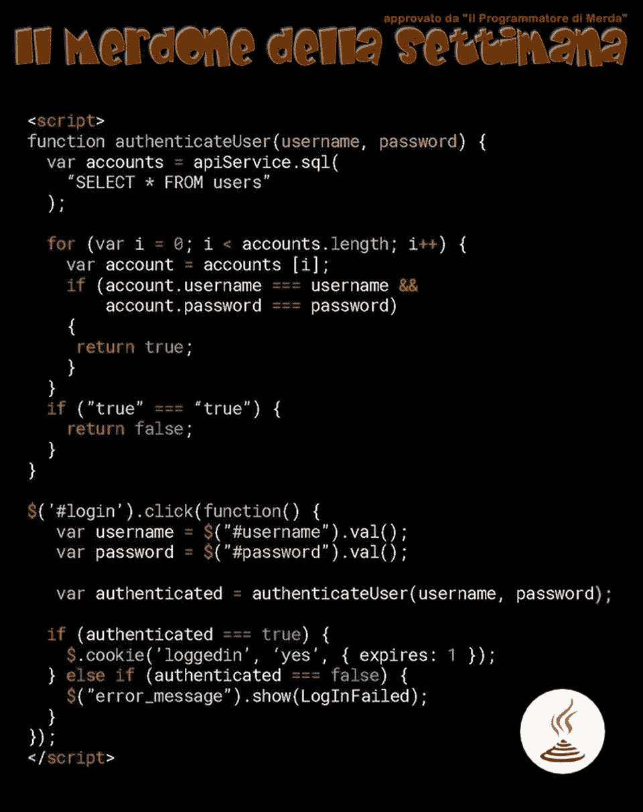

# 回顾有史以来最糟糕的代码

> 原文：<https://itnext.io/reviewing-the-worst-piece-of-code-ever-db2df8730c76?source=collection_archive---------1----------------------->

有一个意大利脸书页面叫做“ **Il Programmatore di 梅尔达**”(可以翻译成“**傻逼程序员**”)。我喜欢那一页。

他们经常分享关于编程的糟糕代码和迷因，但今天我看到了一些非常不可思议的事情:

这里有太多错误的东西，我不知道从哪里开始。如果你是初级开发人员，这篇文章将帮助你理解上面代码中的一些可怕错误。

# 28 行错误

我们把上面的代码写下来，以便讨论:

好吧，我真的不知道从何说起。
让我们将上述错误分为 3 类:

1.  [安全问题](https://www.hackdoor.io/articles/reviewing-the-worst-piece-of-code-ever-2dd33ae21850#security-issues)
2.  [基础编程知识](https://www.hackdoor.io/articles/reviewing-the-worst-piece-of-code-ever-2dd33ae21850#basic-programming-knowledge)
3.  [代码格式化](https://www.hackdoor.io/articles/reviewing-the-worst-piece-of-code-ever-2dd33ae21850#code-formatting)

# 安全问题

我们非常确定下面的代码运行在客户端，因为它被包装在两个`<script>`标签之间(也使用 jQuery)。不要误解我的意思，即使在服务器端也很糟糕，但是在客户端运行这段代码会将你的数据库暴露给…所有人。

我们来看看`authenticateUser`函数:

我们在某个地方有一个名为`apiServices`的函数，它公开了一个`.sql`方法，在这里你可以对数据库运行 SQL 查询。
这意味着，如果您在托管上述代码的网页上打开控制台，您将能够生成各种查询。

你可以这样做:

它将使用自己的 API 返回数据库表的完整列表。
不过嘿，好吧，我们就当这不是个现实问题吧。但是看看这个:

所以你告诉我你没有散列就保存了所有的密码？
大招！现在，我可以在 Chrome 控制台上安装一个调试器，查看每个用户的密码。
我也很确定很高比例的用户在社交网络、电子邮件服务、银行账户等方面使用相同的用户名/密码元组。

他们试图设置`loggedin` cookie 的方式也有问题:

所以他们基本上是使用 jQuery 来设置一个 cookie，告诉 web 应用程序用户是否经过身份验证。

嗯，**千万不要用 JAVASCRIPT** 设置这种 COOKIES。

如果你需要存储那种信息，cookies 是最常见的选择，也没关系！但是使用 JavaScript 设置它们意味着您不能设置`httpOnly`属性，这样每个恶意脚本都可以访问您的 cookies。

是的，我知道，他们只是存储一个键值，所以事实并非如此，但这是一种邪恶的做法。

此外，打开我的 Chrome 控制台，我可以随时输入`$.cookie('loggedin', 'yes', { expires: 1000000000000 });`，我将永远保持登录状态，甚至没有帐户。

# 基本编程知识

有这么多事情要说，时间却这么少。
显然`authenticateUser`函数是纯粹的垃圾，表现出一些基本编程知识的欠缺。

与其选择数据库中的每个用户，为什么他/她不选择具有给定用户名和密码的用户呢？
如果他/她在那个数据库中有数百万用户会怎样？

我以前说过，现在再重复一遍，**他们为什么不在数据库中散列密码**？

让我们继续讨论`authenticateUser`的返回值。
据我所知，它接受两个类型为`string`的参数，并返回一个值`boolean`。

所以，下面这段代码，即使很糟糕，也有点道理:

“是否存在拥有 X 用户名和 Y 密码的用户？是的，所以我会返回`true`”。
但是这个:

这根本说不通。
如果没有这个永远为真的条件，这个函数为什么不返回`false`？

现在让我们分析下面的代码:

使用 jQuery 获取值的部分是可以的。
问题在于它如何处理`loggedin` cookie。

我们之前讨论过这样一个事实，我可以打开我的 Chrome 控制台并输入`$.cookie('loggedin', 'yes', { expires: 1 });`来保持一天的认证，甚至不需要一个帐户。

那么，这个网页到底是怎么知道我是谁的？
可能只是在用户名/密码认证下显示一些私人内容，所以并没有显示任何个人数据。没人会知道。

# 代码格式

整个代码中不太关键的部分很可能就是不太关键的部分，但是我们可以很清楚的看到这个开发者复制/粘贴了一些取自某些网站的代码。

在这里，我们可以看到双引号用于编写字符串:

这里我们可以看到单引号:

这可能看起来不重要，但它实际上告诉我们，开发人员可能已经从 StackOverflow 复制了一些代码，甚至没有按照整个代码库的通用样式指南重写它。
当然，这是一个小问题，但它表明开发人员并不真正关心理解代码是如何工作的；它只是想让它以某种方式工作。

不要误会我的意思，我确实每天在谷歌上搜索一些东西，但是理解(例如)如何设置一个 cookie 比复制粘贴一些东西使其工作更重要。
如果由于某种原因，整个过程中断了怎么办？您如何知道您的脚本的哪一部分不起作用？

# 结论

我确定上面的代码是假的。
这是我第一次看到同步 SQL 查询:

通常，我会这样想:

或者像这样:

即使`apiService.sql`同步返回一个值(我对此表示怀疑)，它也必须在内部打开一个到数据库的连接，进行查询并发回响应，这(您可能已经猜到了)不可能是同步的。

但即使上面的代码不是假的，我肯定是一个初级开发人员写的。
在我作为开发人员的第一周，我非常确定我为我的旧公司写了这么糟糕的代码(抱歉😄).

不是初级开发者的错。
我们假设上面的代码是真实的。这里的初级开发人员正在尽力使它工作。他/她还没有学会如何正确处理 SQL 查询、cookies 和其他东西，这完全没问题！

高级开发人员应该提供某种形式的指导，以确保初级开发人员能够理解他们的错误，这样的糟糕代码不会投入生产。

我确信某些公司并不真正关心他们发布的代码。
解决问题了吗？部署它。
是不是学弟学妹写的，连资深 dev 都没批？部署它。

倒霉事时有发生。

# 2020 年 8 月 3 日更新

在 [Reddit](https://www.reddit.com/r/programming/comments/i1ph52/reviewing_the_worst_piece_of_code_ever) 上讨论完这篇文章后，一个很不错的家伙伸手分享了下面的 Reddit 线程:[https://www . Reddit . com/r/programming horror/comments/66 klvc/this _ JavaScript _ code _ powers _ a _ 1500 _ user _ intranet](https://www.reddit.com/r/programminghorror/comments/66klvc/this_javascript_code_powers_a_1500_user_intranet)。

“这段 JavaScript 代码支持 1500 个用户的内部网应用程序”，所以很明显，我错了。这段代码不是假的！

