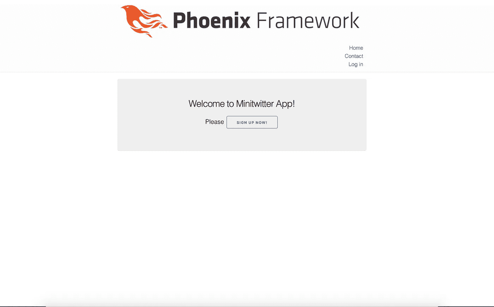
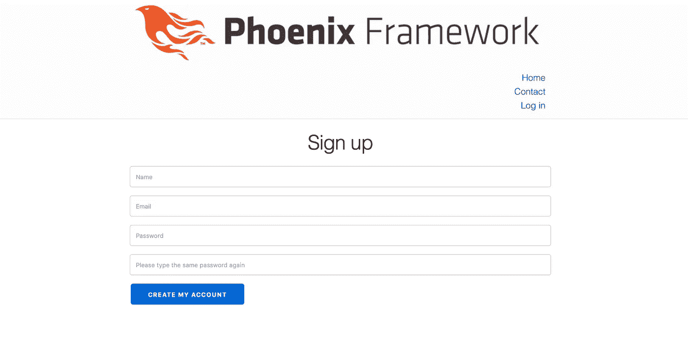
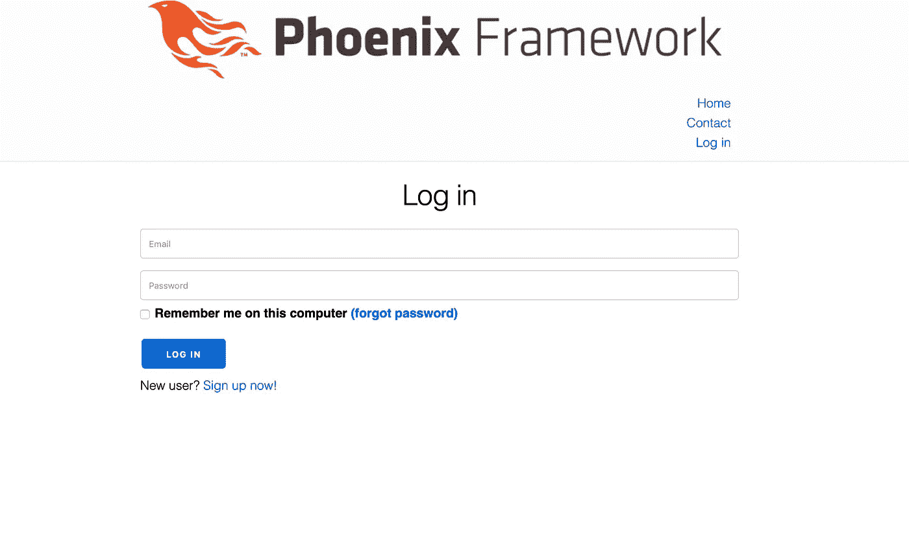
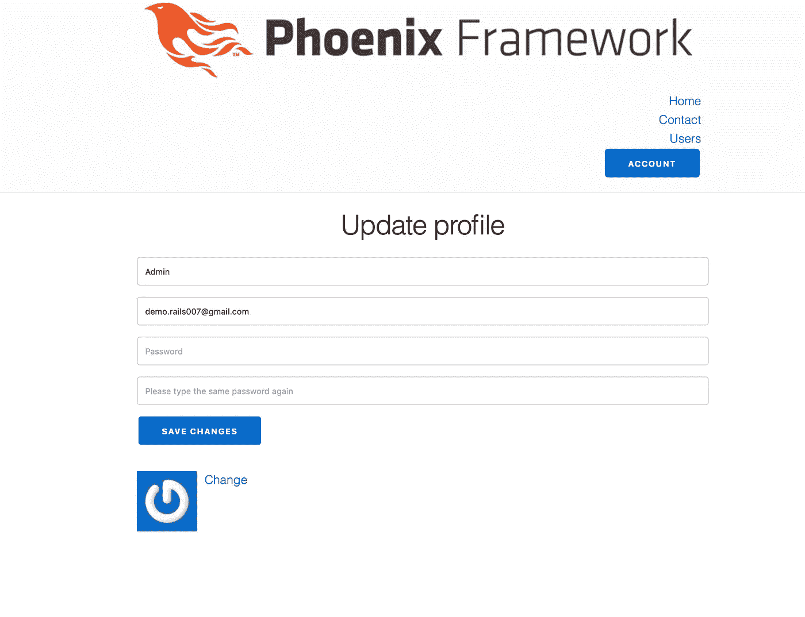
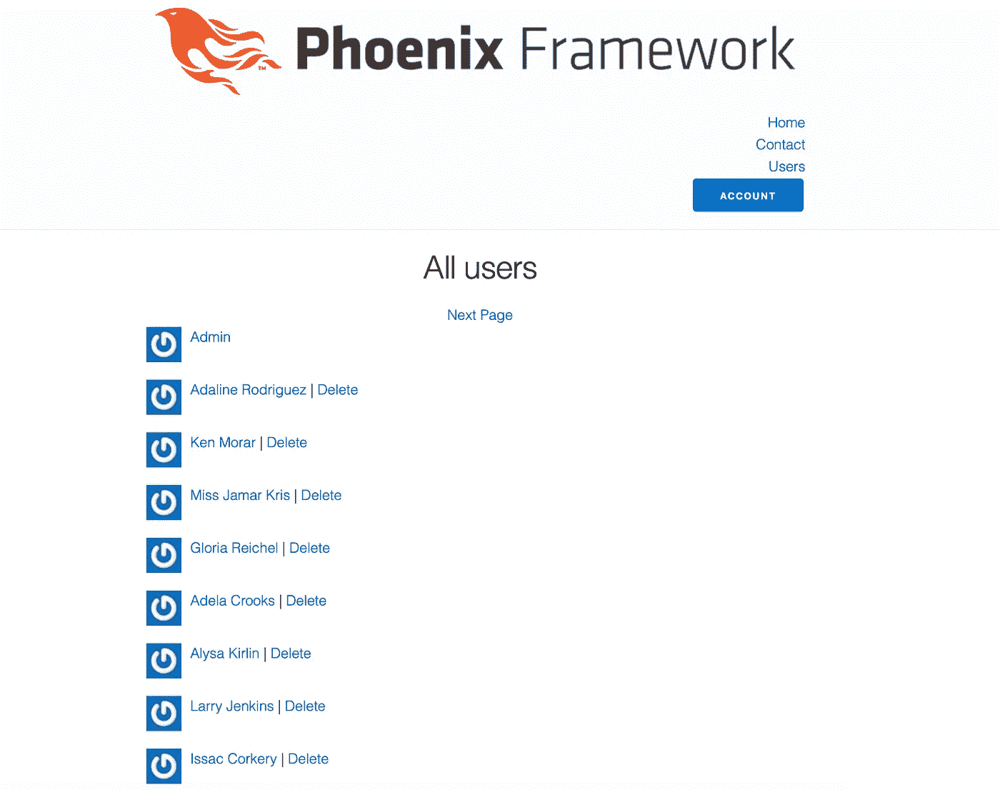
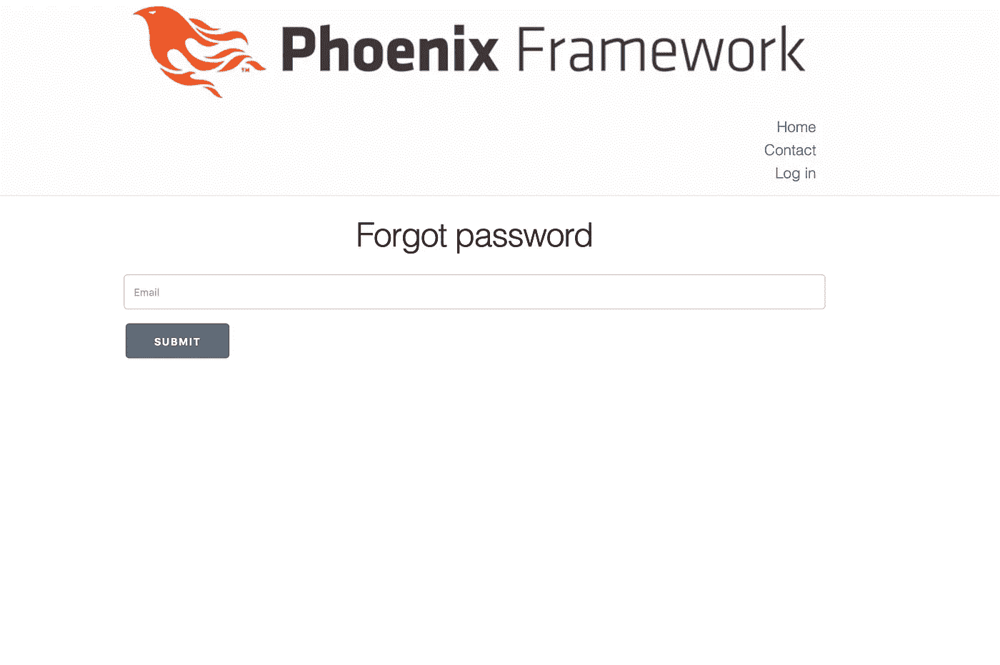
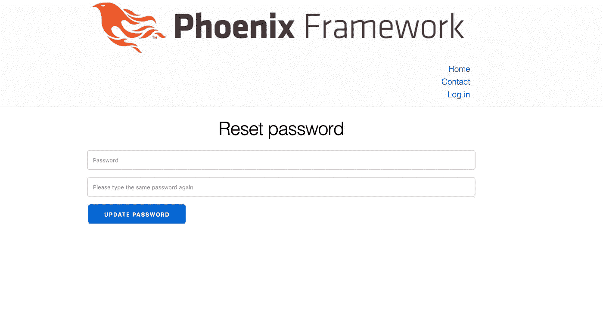
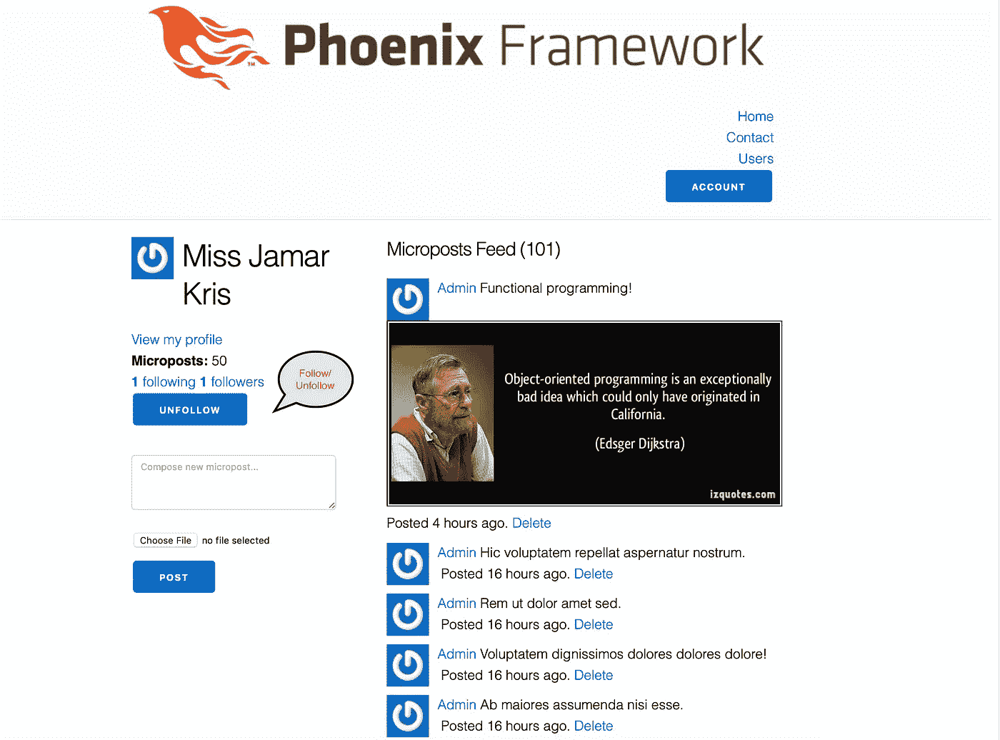

# 用 Elixir/Phoenix(几乎)逐字重写 Ruby/Rails 应用程序

> 原文：<https://itnext.io/rewriting-a-ruby-rails-app-in-elixir-phoenix-almost-literally-7d50d913c8d3?source=collection_archive---------0----------------------->

我一直在寻找一个有点挑战性的应用程序，除了用菲尼克斯框架编写的简单演示。熟悉 Ruby/Rails 之后，我选择了 Michael Hartl 的 **Ruby on Rails 教程——用 Rails 学习 Web 开发**(【https://www.railstutorial.org】)实际上，我是在阅读该教程时学习 Rails 的！)并决定转换几乎贯穿整个教程的 twitter like 示例应用程序。

我把它叫做**迷你推特**(可能不是一个好的名字选择，但是在计算机科学中命名是如此困难！).我认为这是一个相当复杂的应用程序，有很多书里没有提到的功能。所以，我接受了挑战，将这个应用程序转换为 Elixir/Phoenix，并与 Elixir/Phoenix 社区分享我的经验。



迷你推特应用主页

**完整代码**:在我的 github 上可以找到这款应用的 Elixir/Phoenix 版本的完整代码——[https://github . com/imeraj/Phoenix _ Playground/tree/master/1.4/mini Twitter](https://github.com/imeraj/Phoenix_Playground/tree/master/1.4/minitwitter)

如果有人对 Ruby/Rails 版本感兴趣，我在这里也有一些附加功能(比如 presence)的完整代码—[https://github.com/imeraj/miniTwitter](https://github.com/imeraj/miniTwitter)

**先决条件:我假设你熟悉 Ruby/Rails 和 Elixir/Phoenix** 。了解 Ruby/Rails 并不是理解代码的必要条件，只是你应该能够按照教程来理解应用程序的特性，以及它是如何实现的，以便能够理解代码。我将在这里介绍该应用的一些亮点，但由于该应用的复杂性和范围，不可能在这里介绍完整的实现；这可能需要写另一个教程/书！我会参考迈克尔的教程来遵循代码。

**仙丹/凤凰版本**:我用过仙丹 1.7.4 搭配 Erlang/OTP 21 和凤凰 1.4。

**这次重写涵盖了什么内容**:几乎所有的功能都和教程中的一样。不是前端开发人员，我不得不牺牲一些美感和前端的一些微调。

重写中没有涵盖的内容:主要是测试。我开始编写测试，但是我对编写所有的测试变得不耐烦了。所以我跳过了编写测试。我认为**编程凤凰 1.4(**[https://pragprog.com/book/phoenix14/programming-phoenix-1-4](https://pragprog.com/book/phoenix14/programming-phoenix-1-4))涵盖了在凤凰城编写测试的所有细节，如果你遵循这本书，你应该能够添加这个应用程序所需的测试。

我将每天提供一些代码摘录使用的工具/库。我已经在 git commit 消息中提供了很好的描述，所以这些连同这篇文章和 Michael 的教程可以帮助您理解 Elixir/Phoenix 版本。

# **第一天(2019 年 1 月 10 日)**

**涵盖内容**:教程第 3 章& 4

**功能覆盖**:主要是 app 设置和主页，联系人页面设置

**使用的库/依赖关系**:不适用

当我在配置文件中指定密码时，我得到了一个奇怪的关于 MySQL 和 mariex([https://github.com/xerions/mariaex](https://github.com/xerions/mariaex))的错误。我发现在最新的代码中已经修复了。所以我不得不使用最新的 git 依赖，并使用 override true 来使它与 mysql 一起工作—

来自 mix.exs —

{:mariaex，git:" https://github . com/x erions/Maria ex . git "，override: true}

**第 1 天提交**:

[](https://github.com/imeraj/Phoenix_Playground/commit/7e7214f15ccaa2c7b727b8e454e432bac6e5fa2f) [## minitTwitter:初始提交 imeraj/Phoenix _ Playground @ 7e 7214 f

### 描述:-使用 mysql 数据库-用{:mariaex，git…替换 mariax 默认依赖项

github.com](https://github.com/imeraj/Phoenix_Playground/commit/7e7214f15ccaa2c7b727b8e454e432bac6e5fa2f) [](https://github.com/imeraj/Phoenix_Playground/commit/a147423c51393efce6740572fd2194d254fb6d8e) [## minitwitter:添加大部分静态页面 imeraj/Phoenix _ Playground @ a 147423

### 描述:-增加了两个静态页面:home.html 和 help.html 与助手，路线，和必要的页面变化…

github.com](https://github.com/imeraj/Phoenix_Playground/commit/a147423c51393efce6740572fd2194d254fb6d8e) 

# 第二天(2019 年 1 月 11 日)

**涵盖内容**:第 5 章

**功能覆盖**:主要是修复 app 布局

**使用的库/依赖关系**:不适用

**第 2 天提交:**

[](https://github.com/imeraj/Phoenix_Playground/commit/6283642c0db0163fc29f179e690306e69b782adc) [## minitwitter:添加上次提交时丢失的文件 imeraj/Phoenix _ Playground @ 6283642

### 在 GitHub 上创建一个帐户，为 imeraj/Phoenix_Playground 的开发做出贡献。

github.com](https://github.com/imeraj/Phoenix_Playground/commit/6283642c0db0163fc29f179e690306e69b782adc) [](https://github.com/imeraj/Phoenix_Playground/commit/38c37f305b36836764d97fc105c1e39edf253119) [## minitwitter:修复应用布局 imeraj/Phoenix _ Playground @ 38 c37 f 3

### 描述:-修复了应用程序布局-为视图和布局编写了测试-修复了损坏的测试-使用了默认的毫克…

github.com](https://github.com/imeraj/Phoenix_Playground/commit/38c37f305b36836764d97fc105c1e39edf253119) 

**描述**:修复 app 布局。添加了第一天提交时丢失的一些文件。

# 第三天(2019 年 1 月 12 日)

内容包括什么:第六章

**功能覆盖**:建模用户

**使用的库/依赖关系**:不适用

**第 3 天提交:**

[](https://github.com/imeraj/Phoenix_Playground/commit/79d9389a1bd7ea85a345804db3d7aa201d225b86) [## minitwitter:添加用户模式(无凭据)imeraj/Phoenix _ Playground @ 79d 9389

### 描述:-添加了用户模式、注册(无凭据)-添加了必要的上下文、模式验证-添加了…

github.com](https://github.com/imeraj/Phoenix_Playground/commit/79d9389a1bd7ea85a345804db3d7aa201d225b86) 

**描述:**添加了**账户**上下文和**用户**模式和迁移文件。

**此阶段的用户**模式如下所示-

```
defmodule Minitwitter.Accounts.User do
  use Ecto.Schema
  import Ecto.Changeset

  schema "users" do
    field :name, :string
    field :email, :string

    timestamps()
  end

  @email_regex ~r/\A[\w+\-.]+@[a-z\d\-.]+\.[a-z]+\z/i

  @doc false
  def changeset(user, attrs) do
    user
    |> cast(attrs, [:name, :email])
    |> validate_required([:name, :email])
    |> validate_length(:name, min: 3, max: 50)
    |> validate_length(:email, max: 255)
    |> validate_format(:email, @email_regex)
    |> downcase_email()
    |> unique_constraint(:email)
  end

  defp downcase_email(changeset) do
    case fetch_change(changeset, :email) do
      {:ok, email} -> put_change(changeset, :email, String.downcase(email))
      :error -> changeset
    end
  end
end
```

**@email_regex** 用于帮助验证电子邮件，而 **downcase_email** 用于在持久化用户之前将提供的电子邮件地址转换为小写。

相应的迁移文件如下所示—

```
defmodule Minitwitter.Repo.Migrations.CreateUsers do
  use Ecto.Migration

  def change do
    create table(:users) do
      add :name, :string, null: false
      add :email, :string, null: false

      timestamps()
    end

    create unique_index(:users, [:email])
  end
end
```

# 第四天(2019 年 1 月 13 日)

**涵盖的内容**:第 7、8、9 章

**涵盖的功能**:主要涵盖注册用户、基本登录和高级登录，并在计算机上记住用户

**使用的库/依赖关系**:必须在 mix.exs 中添加额外的依赖关系来支持注册和登录。

来自 mix.exs —

```
 {:comeonin, "~> 4.1"},
      {:bcrypt_elixir, "~> 1.0"},
      {:pbkdf2_elixir, "~> 0.12"}
```

**第 4 天提交**:

[](https://github.com/imeraj/Phoenix_Playground/commit/20a99f065ca6ac9f647c3885485e787f7f2b5b03) [## minitwitter:添加注册支持 imeraj/Phoenix _ Playground @ 20a 99 f 0

### 描述:-添加了 uesr 模式和迁移脚本的密码字段-添加了完整的注册表单…

github.com](https://github.com/imeraj/Phoenix_Playground/commit/20a99f065ca6ac9f647c3885485e787f7f2b5b03) [](https://github.com/imeraj/Phoenix_Playground/commit/81da3e6eae4f6154bc66caf7bef8d3aff02efe3c) [## minitwitter:增加了基本的登录支持(跳过了一些测试)imeraj/Phoenix _ Playground @ 81 da 3 e 6

### 描述:-添加基本登录支持-添加注销支持-基于登录/注销的固定布局-添加新…

github.com](https://github.com/imeraj/Phoenix_Playground/commit/81da3e6eae4f6154bc66caf7bef8d3aff02efe3c) [](https://github.com/imeraj/Phoenix_Playground/commit/29ee48c165d6c3aba2610b391921c9c30e84ef4b) [## minitwiiter:添加高级登录支持，带/不带 remember_me (ski...…

### pped 测试)描述:-添加了带/不带 remember_me 的高级登录支持-添加了长期 cookie 支持…

github.com](https://github.com/imeraj/Phoenix_Playground/commit/29ee48c165d6c3aba2610b391921c9c30e84ef4b) [](https://github.com/imeraj/Phoenix_Playground/commit/bae4728080f5cfaadb75e3bc585852813f20a59c) [## minitwitter:添加了丢失的迁移文件 imeraj/Phoenix _ Playground @ BAE 4728

### 在 GitHub 上创建一个帐户，为 imeraj/Phoenix_Playground 的开发做出贡献。

github.com](https://github.com/imeraj/Phoenix_Playground/commit/bae4728080f5cfaadb75e3bc585852813f20a59c) 

他那个阶段的用户模式看起来像—

```
defmodule Minitwitter.Accounts.User do
  use Ecto.Schema
  import Ecto.Changeset

  schema "users" do
    field :name, :string
    field :email, :string
    field :password, :string, virtual: true
    field :password_confirmation, :string, virtual: true
    field :password_hash, :string
    field :remember_hash, :string

    timestamps()
  end

  @email_regex ~r/\A[\w+\-.]+@[a-z\d\-.]+\.[a-z]+\z/i

  @doc false
  def changeset(user, attrs) do
    user
    |> cast(attrs, [:name, :email, :password, :password_confirmation])
    |> validate_required([:name, :email, :password, :password_confirmation])
    |> validate_length(:name, min: 3, max: 50)
    |> validate_length(:email, max: 255)
    |> validate_format(:email, @email_regex)
    |> validate_length(:password, min: 6, max: 32)
    |> validate_confirmation(:password)
    |> downcase_email()
    |> unique_constraint(:email)
    |> put_pass_hash()
  end

  def update_changeset(user, attrs) do
    user
    |> cast(attrs, [:name, :email, :password, :password_confirmation, :remember_hash])
    |> validate_length(:name, min: 3, max: 50)
    |> validate_length(:email, max: 255)
    |> validate_format(:email, @email_regex)
    |> validate_length(:password, min: 6, max: 32)
    |> validate_confirmation(:password)
    |> downcase_email()
    |> unique_constraint(:email)
    |> put_pass_hash()
  end

  def new_token(size \\ 64) do
    :crypto.strong_rand_bytes(size)
    |> Base.url_encode64(padding: false)
  end

  defp put_pass_hash(changeset) do
    case changeset do
      %Ecto.Changeset{valid?: true, changes: %{password: pass}} ->
        put_change(changeset, :password_hash, Comeonin.Pbkdf2.hashpwsalt(pass))

      _ ->
        changeset
    end
  end

  defp downcase_email(changeset) do
    case fetch_change(changeset, :email) do
      {:ok, email} -> put_change(changeset, :email, String.downcase(email))
      :error -> changeset
    end
  end
end
```

还添加了必要的迁移文件。此外，编写了**认证插件**来认证用户——

```
defmodule MinitwitterWeb.Auth do
  import Plug.Conn
  import Phoenix.Controller

  alias Minitwitter.Accounts
  alias MinitwitterWeb.Router.Helpers, as: Routes

  @max_age 7 * 24 * 60 * 60

  def init(opts), do: opts

  def call(conn, _opts) do
    user_id = get_session(conn, :user_id)

    cond do
      user = conn.assigns[:current_user] ->
        put_current_user(conn, user)

      user = user_id && Accounts.get_user(user_id) ->
        put_current_user(conn, user)

      true ->
        assign(conn, :current_user, nil)
    end
  end

  def login(conn, user) do
    conn
    |> put_current_user(user)
    |> put_session(:user_id, user.id)
    |> configure_session(renew: true)
  end

  defp put_current_user(conn, user) do
    conn
    |> assign(:current_user, user)
  end

  def authenticate_user(conn, _opts) do
    cond do
      conn.assigns.current_user ->
        conn

      remember_token = conn.cookies["remember_token"] ->
        user_id = conn.cookies["user_id"]
        user = Accounts.get_user(user_id)

        if user && Accounts.authenticated?(user, remember_token) do
          login(conn, user)
        else
          halt_connection(conn)
        end

      true ->
        halt_connection(conn)
    end
  end

  defp halt_connection(conn) do
    conn
    |> put_flash(:error, "You must be logged in to access that page!")
    |> redirect(to: Routes.page_path(conn, :home))
    |> halt()
  end

  def login_by_email_and_pass(conn, email, given_pass) do
    case Accounts.authenticate_by_email_and_pass(email, given_pass) do
      {:ok, user} -> {:ok, login(conn, user)}
      {:error, :unauthorized} -> {:error, :unauthorized, conn}
      {:error, :not_found} -> {:error, :not_found, conn}
    end
  end

  def logout(conn) do
    if conn.assigns.current_user do
      Accounts.forget_user(conn.assigns.current_user)

      conn
      |> delete_resp_cookie("user_id")
      |> delete_resp_cookie("remember_token")
      |> configure_session(drop: true)
    end
  end

  def remember(conn, user, token) do
    conn =
      conn
      |> put_resp_cookie("user_id", Integer.to_string(user.id), max_age: @max_age)
      |> put_resp_cookie("remember_token", token, max_age: @max_age)

    conn
  end
end
```

会话和持久 cookies 都被用来记住必要的令牌。Acccounts 上下文也更新了必要的功能。



注册页面



登录页面

# 第五天(2019 年 1 月 14 日)

内容包括什么:第 10 章

**涵盖的特性**:更新、显示和删除用户

**使用的库/依赖项**:必须在 mix.exs 中添加额外的依赖项，以支持用户分页和为 DB 种子生成假数据。

来自 mix.exs —

```
 {:faker, "~> 0.11"},
      {:scrivener_ecto, "~> 2.0"}
```

**第 5 天提交**:

[](https://github.com/imeraj/Phoenix_Playground/commit/50b36dad7a78a44f0814674055d03fa4e0ee6d2b) [## 迷你推特:增加了用户更新、显示和删除支持…

### 描述:-添加了用户更新、显示和删除支持-添加了访问控制所需的插件-添加了 Faker 到…

github.com](https://github.com/imeraj/Phoenix_Playground/commit/50b36dad7a78a44f0814674055d03fa4e0ee6d2b) 

为了生成假数据，使用了下面的代码(摘自 seeds.exs 的最终提交)

```
# Script for populating the database. You can run it as:
#
#     mix run priv/repo/seeds.exs
#
# Inside the script, you can read and write to any of your
# repositories directly:
#
#     Minitwitter.Repo.insert!(%Minitwitter.SomeSchema{})
#
# We recommend using the bang functions (`insert!`, `update!`
# and so on) as they will fail if something goes wrong.
defmodule MinitwitterWeb.DevelopmentSeeder do
  import Ecto.Query, only: [from: 2]

  alias Minitwitter.Accounts
  alias Minitwitter.Accounts.User
  alias Minitwitter.Microposts
  alias Minitwitter.Repo

  def insert_data do
    # users
    Repo.insert!(%Accounts.User{
      name: "Admin",
      email: "demo.rails007@gmail.com",
      password: "phoenix",
      password_hash: Comeonin.Pbkdf2.hashpwsalt("phoenix"),
      admin: true,
      activated: true,
      activated_at: DateTime.truncate(DateTime.utc_now(), :second)
    })

    for _ <- 1..50,
        do:
          Repo.insert!(%Accounts.User{
            name: Faker.Name.name(),
            email: Faker.Internet.email(),
            password: "phoenix",
            password_hash: Comeonin.Pbkdf2.hashpwsalt("phoenix"),
            activated: true,
            activated_at: DateTime.truncate(DateTime.utc_now(), :second)
          })

    # Microposts
    query =
      from u in "users",
        select: u.id

    ids = Repo.all(query)

    Enum.each(ids, fn id ->
      for _ <- 1..50,
          do:
            Repo.insert!(%Microposts.Post{
              content: Faker.Lorem.sentence(5),
              user_id: id
            })
    end)

    # Follwing relationships
    users = Repo.all(User)
    user = Enum.at(users, 0)
    following = Enum.slice(users, 2, 50)
    followers = Enum.slice(users, 3, 40)
    for followed <- following, do: Minitwitter.Accounts.follow(followed, user)

    for follower <- followers, do: Minitwitter.Accounts.follow(user, follower)
  end
end

case Mix.env() do
  :dev ->
    MinitwitterWeb.DevelopmentSeeder.insert_data()

  _ ->
    :ignore
end
```



更新个人资料页面



显示用户页面

# 第六天(2019 年 1 月 15 日)

**涵盖的内容**:第 11 章

**涵盖的功能**:通过电子邮件支持账户激活

**使用的库/依赖关系**:必须在 mix.exs 中添加额外的依赖关系，以支持使用 smtp 发送电子邮件。

来自 mix.exs —

```
 {:bamboo, "~> 1.1"},
      {:bamboo_smtp, "~> 1.6.0"}
```

**第 6 天提交**:

[](https://github.com/imeraj/Phoenix_Playground/commit/dd43131fcda7e85178e7843744b3d510b4ce8543) [## minitwiiter:添加账号激活支持 imeraj/Phoenix _ Playground @ DD 43131

### 描述:-添加了对迁移、模式更改-修改用户和会话控制器的帐户激活支持…

github.com](https://github.com/imeraj/Phoenix_Playground/commit/dd43131fcda7e85178e7843744b3d510b4ce8543) 

config.exs 中邮件程序的配置—

```
config :minitwitter, Minitwitter.Mailer,
  adapter: Bamboo.SMTPAdapter,
  server: "smtp.gmail.com",
  port: 587,
  username: "demo.rails007",
  password: "XXXXXXX",
  # can be `:always` or `:never`
  tls: :if_available,
  # can be `true`
  ssl: false,
  retries: 3
```

电子邮件模板代码如下—

```
<h1>Minitwitter App</h1>
   <p>Hi <%= @user.name %>,</p>
<p>
   Welcome to the Minitwitter! Click on the link below to activate your account:
</p><%= Routes.account_activations_url(@conn, :edit, @user.activation_token, email: @user.email) %>
```

# 第七天(2019 年 1 月 16 日)

内容包括什么:第 12 章

**涵盖的功能**:支持通过电子邮件重置密码

**使用的库/依赖关系**:不适用

**第 7 天提交**:

[](https://github.com/imeraj/Phoenix_Playground/commit/900c02ac06afe4fdbb8c928382d5322d2536aec8) [## minitwitter:添加密码重置支持 imeraj/Phoenix _ Playground @ 900 c02a

### 描述:-添加了对迁移和模式更改的密码重置支持-添加了 password_resets_controller 以重置…

github.com](https://github.com/imeraj/Phoenix_Playground/commit/900c02ac06afe4fdbb8c928382d5322d2536aec8) 

忘记密码页面



重置密码页面

# 第 8 天和第 9 天(2019 年 1 月 18 日和 19 日)

**涵盖内容**:第 13 章

**涵盖的功能**:支持图片上传的微博客

**使用的库/依赖关系**:必须在 mix.exs 中添加额外的依赖关系，以支持微博客中的时间格式和图片上传—

来自 mix.exs —

```
 {:timex, "~> 3.4"},
      {:arc, "~> 0.11.0"},
      {:arc_ecto, "~> 0.11.1"}
```

**第 8 天&第 9 天**提交:

[](https://github.com/imeraj/Phoenix_Playground/commit/0b6e7a0fbc8fcb1227bba5c332b82bf9417b1808) [## minitwiiter:添加微帖子支持 imeraj/Phoenix _ Playground @ 0 b 6 e 7 a 0

### 描述:-添加了对数据库迁移、模式、上下文、控制器的微发布的支持-重构代码以移除…

github.com](https://github.com/imeraj/Phoenix_Playground/commit/0b6e7a0fbc8fcb1227bba5c332b82bf9417b1808) [](https://github.com/imeraj/Phoenix_Playground/commit/90a61e9df59dee810d5c2ce0bc9b2afcf30208e4) [## minitwiiter:添加对 micr post imeraj/Phoenix _ Playground @ 90a 619 的支持

### 描述:-添加了对数据库模式、视图、模板和控制器的微发布支持-添加了:arc 和:arc_ecto…

github.com](https://github.com/imeraj/Phoenix_Playground/commit/90a61e9df59dee810d5c2ce0bc9b2afcf30208e4) [](https://github.com/imeraj/Phoenix_Playground/commit/c5382f0f121e015ea392f79ca8a3409d971292fb) [## minitwitter:修正了 correct_user 插件中的错误，排除:index imeraj/Phoenix _ Playground @ c 5382 f 0

### 在 GitHub 上创建一个帐户，为 imeraj/Phoenix_Playground 的开发做出贡献。

github.com](https://github.com/imeraj/Phoenix_Playground/commit/c5382f0f121e015ea392f79ca8a3409d971292fb) 

为带有图片的微帖子添加了**帖子**模式—

```
defmodule Minitwitter.Microposts.Post do
  use Ecto.Schema
  use Arc.Ecto.Schema
  import Ecto.Changeset

  schema "posts" do
    field :content, :string
    field :user_id, :id
    field :picture, Minitwitter.ImageUploader.Type

    timestamps()
  end

  @doc false
  def changeset(post, attrs) do
    post
    |> cast(attrs, [:content, :user_id])
    |> cast_attachments(attrs, [:picture])
    |> validate_required([:content, :user_id])
    |> validate_length(:content, min: 1, max: 140)
    |> foreign_key_constraint(:user_id)
  end
end
```

此外，添加了必要的迁移文件。


带有图片和时间格式的微博客

# 第 10 天(2019 年 1 月 20 日)

内容包括什么:第 14 章

**覆盖的功能**:以下用户

**使用的库/依赖关系**:不适用

**第 8 天&第 9 天**提交:

[](https://github.com/imeraj/Phoenix_Playground/commit/5a85ff2bc43ef7ca300414c33338a632547d94ea) [## minitwitter:添加关注者，关注支持 imeraj/Phoenix _ Playground @ 5a 85 ff 2

### 描述:-添加了必要的模式，迁移，控制器，视图来支持跟随和取消跟随-修复了一些错误…

github.com](https://github.com/imeraj/Phoenix_Playground/commit/5a85ff2bc43ef7ca300414c33338a632547d94ea) 

添加了**关系**模式，以支持用户跟踪—

```
defmodule Minitwitter.Accounts.Relationship do
  use Ecto.Schema
  import Ecto.Changeset

  schema "relationships" do
    belongs_to(:follower, Minitwitter.Accounts.User)
    belongs_to(:followed, Minitwitter.Accounts.User)

    timestamps()
  end

  @doc false
  def changeset(relationship, attrs) do
    relationship
    |> cast(attrs, [:follower_id, :followed_id])
    |> validate_required([:follower_id, :followed_id])
    |> foreign_key_constraint(:follower_id)
    |> foreign_key_constraint(:followed_id)
  end
end
```

更新了**用户**模式，以支持用户跟踪—

```
defmodule Minitwitter.Accounts.User do
  use Ecto.Schema
  import Ecto.Changeset

  schema "users" do
    field :name, :string
    field :email, :string
    field :password, :string, virtual: true
    field :password_confirmation, :string, virtual: true
    field :password_hash, :string
    field :remember_hash, :string
    field :admin, :boolean, dafault: false
    field :activation_token, :string, virtual: true
    field :activation_hash, :string
    field :activated, :boolean, default: false
    field :activated_at, :utc_datetime
    field :reset_hash, :string
    field :reset_sent_at, :utc_datetime

    has_many(:posts, Minitwitter.Microposts.Post)

    has_many(:active_relationships, Minitwitter.Accounts.Relationship, foreign_key: :follower_id)
    has_many(:passive_relationships, Minitwitter.Accounts.Relationship, foreign_key: :followed_id)
    has_many(:following, through: [:active_relationships, :followed])
    has_many(:followers, through: [:passive_relationships, :follower])

    timestamps()
  end

  @email_regex ~r/\A[\w+\-.]+@[a-z\d\-.]+\.[a-z]+\z/i

  @doc false
  def changeset(user, attrs) do
    user
    |> cast(attrs, [:name, :email, :password, :password_confirmation])
    |> validate_required([:name, :email, :password, :password_confirmation])
    |> validate_length(:name, min: 3, max: 50)
    |> validate_length(:email, max: 255)
    |> validate_format(:email, @email_regex)
    |> validate_length(:password, min: 6, max: 32)
    |> validate_confirmation(:password)
    |> downcase_email()
    |> unique_constraint(:email)
    |> put_pass_hash()
    |> put_activation_hash()
  end

  def reset_pass_changeset(user, attrs) do
    user
    |> cast(attrs, [:password, :password_confirmation, :reset_hash])
    |> validate_required([:password, :password_confirmation])
    |> validate_length(:password, min: 6, max: 32)
    |> validate_confirmation(:password)
    |> put_pass_hash()
  end

  def update_changeset(user, attrs) do
    user
    |> cast(attrs, [
      :name,
      :email,
      :password,
      :password_confirmation,
      :remember_hash,
      :activated,
      :activated_at,
      :reset_hash,
      :reset_sent_at
    ])
    |> validate_required([:name, :email])
    |> validate_length(:name, min: 3, max: 50)
    |> validate_length(:email, max: 255)
    |> validate_format(:email, @email_regex)
    |> validate_length(:password, min: 6, max: 32)
    |> validate_confirmation(:password)
    |> downcase_email()
    |> unique_constraint(:email)
    |> put_pass_hash()
  end

  def new_token(size \\ 64) do
    :crypto.strong_rand_bytes(size)
    |> Base.url_encode64(padding: false)
  end

  defp put_pass_hash(changeset) do
    case changeset do
      %Ecto.Changeset{valid?: true, changes: %{password: pass}} ->
        put_change(changeset, :password_hash, Comeonin.Pbkdf2.hashpwsalt(pass))

      _ ->
        changeset
    end
  end

  defp put_activation_hash(changeset) do
    case changeset do
      %Ecto.Changeset{valid?: true} ->
        token = new_token()

        changeset
        |> put_change(:activation_token, token)
        |> put_change(:activation_hash, Comeonin.Pbkdf2.hashpwsalt(token))

      _ ->
        changeset
    end
  end

  defp downcase_email(changeset) do
    case fetch_change(changeset, :email) do
      {:ok, email} -> put_change(changeset, :email, String.downcase(email))
      :error -> changeset
    end
  end
end
```


追随者，追随者支持



跟随/取消跟随支持

这几乎是完整的应用程序。我建议你阅读 Michael 的教程，并每天阅读代码，以了解项目的整体思路。

**体验重写 app** :

这个实验后我的想法/经历—

*   Ruby/Rails 更加简洁，但是 Elixir/Phoenix 更加明确。
*   Elixir/Phoenix 库似乎是可用的，并且日益成熟。
*   Rails 和 Phoenix 在 Coffeescript 和 EEx script 上更兼容。我不是一个前端人员，但即使是我也可以毫不费力地将 Coffeescript 代码转换成 EEx(但我认为我的 CSS 乱七八糟！).
*   我发现与活动记录相比，ecto 有点复杂。特别是，ecto 支持多种可能让初学者感到困惑的做事方式。但是一旦你掌握了它，它也是非常清晰和符合逻辑的。还有，如果你卡住了，谷歌是你的朋友:)

**结论:**

通过做这个爱好项目，我学到了很多东西。我想我现在更了解长生不老药/凤凰了。我希望这篇文章将鼓励更多的开发者认真研究 Elixir/Phoenix，并可能使一些人皈依:)

*我希望这篇文章和项目源代码对一些人有用。更多详细和深入的未来技术文章，请关注我这里或点击* [*twitter*](https://twitter.com/meraj_enigma) *。*