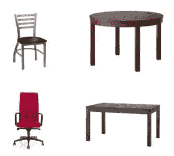
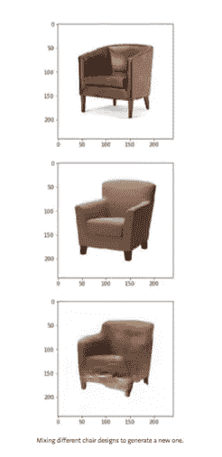
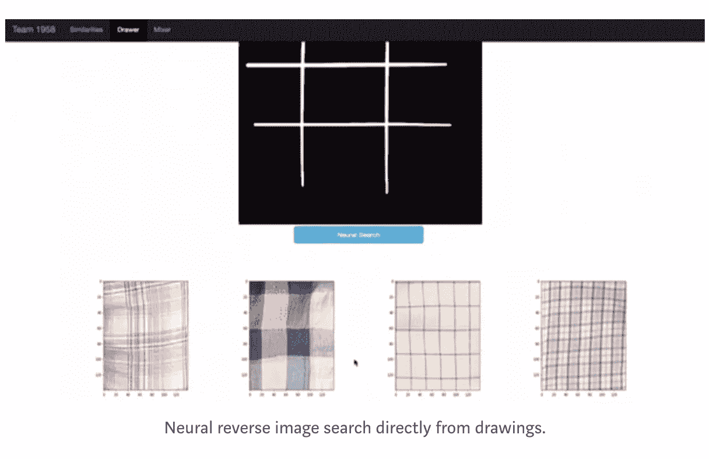
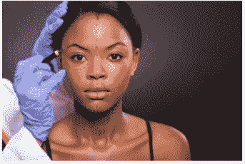
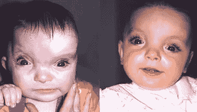
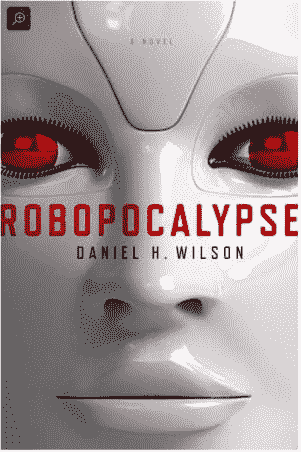

# 骑在一束光上

> 原文：<https://itnext.io/riding-on-a-beam-of-light-3c76c7970ff6?source=collection_archive---------0----------------------->

你想过骑在光束上是什么感觉吗？阿尔伯特·爱因斯坦做到了。

他试着想象如果你以如此快的速度行进，赶上了一束光，那会是什么样子。根据这一想法，爱因斯坦能够想象出，如果你从时钟发出一个光信号，在它们报时的瞬间，一个朝其中一个时钟超高速行进的人，对于它们是否同步的看法，会与另一个朝另一个方向超高速行进的人不同。因此，虽然爱因斯坦博士曾经想象的许多事情都被证实了，但正是这种想象促使诗人威廉·布莱克写道:“现在被证实的事情曾经只是想象而已。”

一位布雷克学者，数学家和物理学家，雅各布·布朗诺夫斯基写了“ ***”想象*** *是典型的行为，不是诗人的头脑，或画家的头脑，或科学家的头脑，而是人类的头脑。”人工智能(AI)技术正被用来扩展人类的思维。它被用来想象骑在一束光上会是什么样子。*

可悲的是，尽管我们从伟大的科学家和艺术家那里听到了所有这些令人鼓舞的话，但当面对新兴的人工智能(AI)和机器人技术时，我们仍然会得到如下评论:

*   “未来几十年，机器人可能会取代 45%的工作岗位。
*   “到 2021 年，机器人将会减少美国 6%的工作岗位，
*   据麻省理工学院经济学家称，报告称机器人正在偷走美国的工作
*   机器人的崛起:技术和失业未来的威胁

我经常问为什么不用计算机来支持人类，而不是用计算机来代替人类？自亚当·斯密(Adam Smith)以来，答案就已经很清楚了，至少对于发达国家成千上万的 MBA 毕业生来说是如此。这些未来的商业领袖被灌输这样的思想:用机器自动化人类工作可以降低单位劳动力成本，因此不仅是好生意，也是竞争的需要，因为不自动化的公司会被自动化的竞争者打败。

试图出人头地的年轻企业经理痴迷于营业收入，营业收入等于销售额减去费用，而人工往往是最大的费用。因此“*机器人*来了”。
但现在在一篇题为“[**des . AI . gn——用人工智能增强人类创造力**](https://towardsdatascience.com/des-ai-gn-augmenting-human-creativity-with-artificial-intelligence-bb6ff611fa2c) ”的文章中，诺曼·迪帕洛(Norman Di Palo)描述了人工智能如何支持人类创造力，而不仅仅是它的替代品，从而为经济低迷的传统智慧提供了另一种选择。终于！一个足够疯狂的人来回答我多年来一直在问的问题。迪帕洛没有将人工智能视为威胁，而是将其视为机遇。他致力于“彻底改变设计师使用人工智能的方式”。他是这样做的:

1.  从互联网上创建了一个椅子和沙发的小数据集(大约 500 个样本)。
2.  实现了一个可以从未标记数据中提取视觉特征的神经网络架构，其目标不仅是为了 ***理解一把椅子看起来像什么，而且是为了理解“作为一把椅子意味着什么”*** *和* 搜索具有相同“意义”的图像。
3.  尽可能接近地重建原始图像。
4.  将所有数据集投影到**潜在空间**中，这允许他计算样本之间的距离，从而进行“反向图像搜索”。

根据 UT 奥斯汀人工智能博士生 Prasoon Goyal 的说法，在“潜在空间”的情况下，“**潜在”意味着“隐藏的**”。它在机器学习中非常常用——你观察可观察空间中的一些数据，并将其映射到相似数据点更接近的潜在空间，从而定义“*成为一把椅子意味着什么*”。Prasoon 使用以下 4 幅图像作为示例:

在你观察的像素空间中，任何两幅图像之间都没有直接的相似性。然而，如果你将它映射到一个潜在空间，你会发现左边的图像在潜在空间中比右边的图像彼此更接近。所以你的潜在空间捕获了你的数据结构。在潜在狄利克雷分配(LDA)中，您以这样一种方式对任务建模，即属于相似图像的图像在其潜在空间中更接近。

您希望将图像映射到一个潜在的向量空间，以便具有相似“含义”的图像(基于它们的数据表示)在该空间中更接近。

潜在变量或隐藏变量不同于观察变量，因为它们不能直接测量。相反，我们使用观察变量和数学推断潜在变量的存在和关系。虽然我们不能直接测量潜在变量，但我们可以通过观察变量间接测量它们。这类似于寻找围绕遥远恒星运行的行星的技术。系外行星不能被直接看到(它们太暗了)，但是可以通过它们在母星上的引力摆动和它们在恒星和我们的望远镜之间通过时阻挡的少量 T2 光间接观察到。

根据 Di Palo 的说法，拥有一个参考设计可以让寻找新设计灵感的过程变得更加容易。另一个有趣的应用是混合来自数据集的不同样本，以生成共享两者视觉特征的新样本。特别是，可以混合不同椅子的设计，以获得美学上连贯的新椅子，并与两种椅子共享设计细节。这种技术允许设计师通过混合有趣的设计立即试验新的想法，直到一些结果激发他/她的创造力。这可以通过平均不同椅子设计的潜在空间来实现。加权平均甚至可以获得大量的细微差别，就像创建一个更接近于一个或另一个“母体”的新设计。下图显示了 Di Palo 提出的一些有趣的结果。

Di Palo 将同样的技术应用于时装设计，尤其是纺织品设计，取得了相似的结果。他进一步发展了这个项目的这一分支，并创建了一个神经逆向图像搜索，可以在一个网络应用程序上对简单的图片进行搜索。在演示中，用户可以简单地绘制一个图案，就像下面的交叉线一样简单，这是他/她希望在纺织品图案数据库中找到的图案。神经网络从草图中提取视觉特征，并将它们与数据库图像中的特征进行比较。经过一些计算后，它返回看起来最匹配的那些。

迪帕洛的工作可以像法医学一样延伸到另一个层面。想想电视剧《识骨寻踪》中的虚构人物，由米谢拉·康琳饰演的安吉拉·蒙特内格罗·哈金斯。在展览中，康林描绘了一位受过传统训练的艺术家，他正在进行 [**法医重建**](https://en.wikipedia.org/wiki/Forensic_facial_reconstruction) **。**

荷兰特温特大学的研究人员使用机器学习技术，基于生物特征进行个人识别，如人脸识别、指纹识别等。，主要是在图像数据上。他们开发了一种现实世界重建方法，用于基于相机图像的更困难的“侧视”人脸识别。该方法用于在人们进门时识别他们，然后“估计”他们在建筑物中的位置。根据研究人员的说法，这种方法在 90%的检查案例中得到了更好的分数，并有助于法医调查人员的日常工作。

与其他 3D 重建方法不同，新方法不使用面部模型形式的面部特征的先验知识，因此不会“有偏差”，这对于法医面部比较至关重要。利用这种方法，基于不同姿态的人脸图像重建 3D 人脸模型和正面轮廓。

人工智能也在改变整形手术。随着智能手机的普及，图像数据比以往更加丰富。在识别模式方面，计算机通常比人更好，这使得它们在高度可视化的领域(如整形和重建手术)中成为特别强大的盟友，在这些领域中，它们可以检测、诊断、监控和评估患者的结果。人工智能可以显著增强所有这些程序，部分原因是图像和视频已经是整形外科医生技能的一部分。它们是整形外科医生与同事交流复杂问题、向患者解释手术以及监控手术结果的方式。

在**烧伤护理**中，人工智能不仅可以准确评估烧伤的总表面积——这是正确治疗的关键——它还可以预测烧伤伤口是否会在不进行手术的情况下愈合。在一项研究中，研究人员使用反射光谱和人工神经网络来预测烧伤伤口愈合时间是多于还是少于 14 天。

**颅面手术**涉及移动颅骨的骨骼、肌肉和皮肤。一些婴儿出生时患有一种先天性疾病，称为 [**颅缝早闭，**](https://en.wikipedia.org/wiki/Craniosynostosis) 这是一种由颅骨过早融合引起的骨骼生长障碍，会造成畸形外观和大脑压力增加，从而延迟生长。两个月大的婴儿可能会接受大型颅面手术来重塑他们的头骨，越早发现情况越好。整形外科医生经常使用婴儿头部的照片和 CT 扫描来检查他们的头骨形状和计划手术。研究人员最近训练了一个人工智能应用程序，对婴儿的头骨形状进行分类，以便更好地捕捉颅缝早闭的早期迹象。这项技术可用于筛查儿童，减少婴儿诊断所需的 x 光或 CT 扫描次数。

时装设计、法医重建、烧伤护理、整形手术，这些都是人工智能(AI)工具和技术推动的重要工作领域。然而，我们的社会似乎沉迷于机器人的邪恶。我现在知道，自荷马时代以来，机器人角色、机器人(人造男人/女人)或机器人(人造女人)以及电子人(也称为“仿生男人/女人”，或具有显著机械增强功能的人类)已经成为科幻小说的主要内容，尽管这可能令人惊讶。

西方文学中第一次提到“机械仆人”出现在荷马的《伊利亚特》中。在第十八部书中，火神赫菲斯托斯在机器人的帮助下为英雄阿喀琉斯制造了新的盔甲。根据 Rieu 的翻译，“*黄金女仆急忙帮助他们的主人。他们看起来像真正的女人，不仅能说话和使用四肢，而且被赋予了智慧，并由不朽的神训练手工。*”

当然，“机器人”或“机器人”这两个词并不是用来描述它们的，但它们仍然是机械装置，看起来像人。“机器人一词的第一次使用是在卡雷尔·恰佩克的戏剧 R.U.R .(罗森的万能机器人)(写于 1920 年)”中。

《星球大战》中的角色 R2D2 和 C3PO 可能改变了我们对机器人的理解，但我们需要克服对即将到来的 [**Robopocalypse**](https://www.amazon.com/Robopocalypse-extrait-Daniel-H-WILSON-ebook/dp/B074JKLQFQ/ref=sr_1_1?ie=UTF8&qid=1512951955&sr=8-1&keywords=robopocalypse) 的恐惧，回到想象骑在光束上会是什么样子。

___________________________________________________________________

**备注:**

1.  [https://www . nytimes . com/2015/11/01/opinion/Sunday/the-light-beam-rider . html？_r=0](https://www.nytimes.com/2015/11/01/opinion/sunday/the-light-beam-rider.html?_r=0)

2.[https://www . Forbes . com/sites/timworstall/2013/09/18/phew-the-robots-only-to-take-the-45%的工作岗位/#57fd76bb56b1](https://www.forbes.com/sites/timworstall/2013/09/18/phew-the-robots-are-only-going-to-take-45-percent-of-all-the-jobs/#57fd76bb56b1)

3.[https://www . the guardian . com/technology/2016/sep/13/人工智能-机器人-威胁-乔布斯-福雷斯特-报告](https://www.theguardian.com/technology/2016/sep/13/artificial-intelligence-robots-threat-jobs-forrester-report)

4.[https://www . pop sci . com/technology/article/2010-10/robots-is-being-American-jobs-economists-say](https://www.popsci.com/technology/article/2010-10/robots-are-stealing-american-jobs-economists-say)

6.管理会计原理([https://account learning . com/principles-Management-Accounting/](https://accountlearning.com/principles-management-accounting/))

7.des . ai . gn——用人工智能增强人类创造力

8.[https://research . ut wente . nl/en/publications/side-view-face-recognition-2](https://research.utwente.nl/en/publications/side-view-face-recognition-2)

9.[https://www.quora.com/What-is-the-meaning-of-latent-space](https://www.quora.com/What-is-the-meaning-of-latent-space)

10.[https://www . science daily . com/releases/2016/01/160121100957 . htm](https://www.sciencedaily.com/releases/2016/01/160121100957.htm)，特温特大学，2016 年 1 月 21 日

11.[https://venturebeat . com/2017/10/27/人工智能正在改变整形手术的面貌/](https://venturebeat.com/2017/10/27/artificial-intelligence-is-changing-the-face-of-plastic-surgery/)

12.[https://en.wikipedia.org/wiki/Robot#Literature](https://en.wikipedia.org/wiki/Robot#Literature)