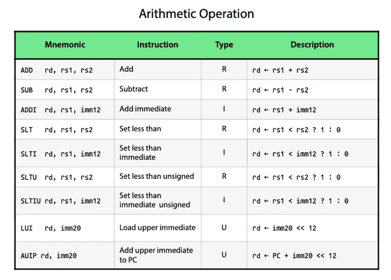
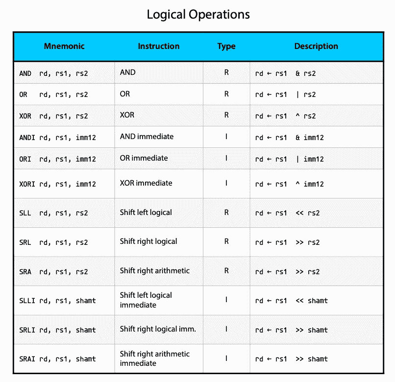
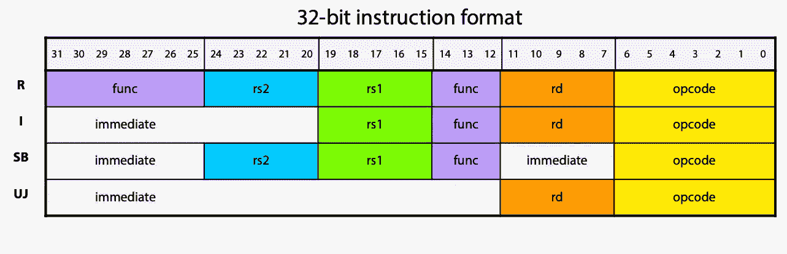
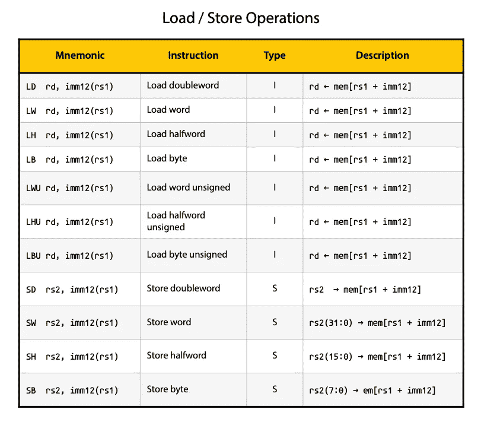
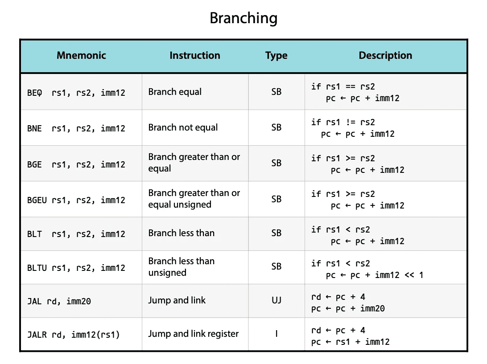
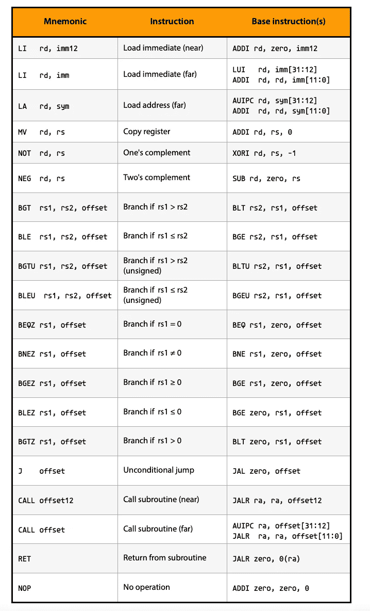
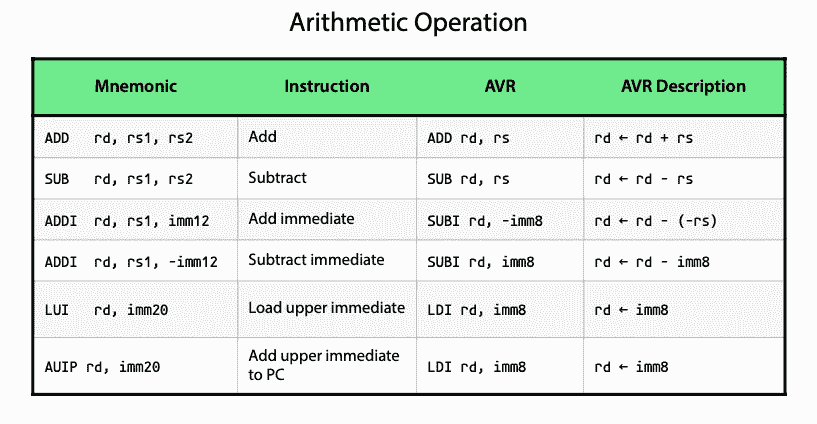
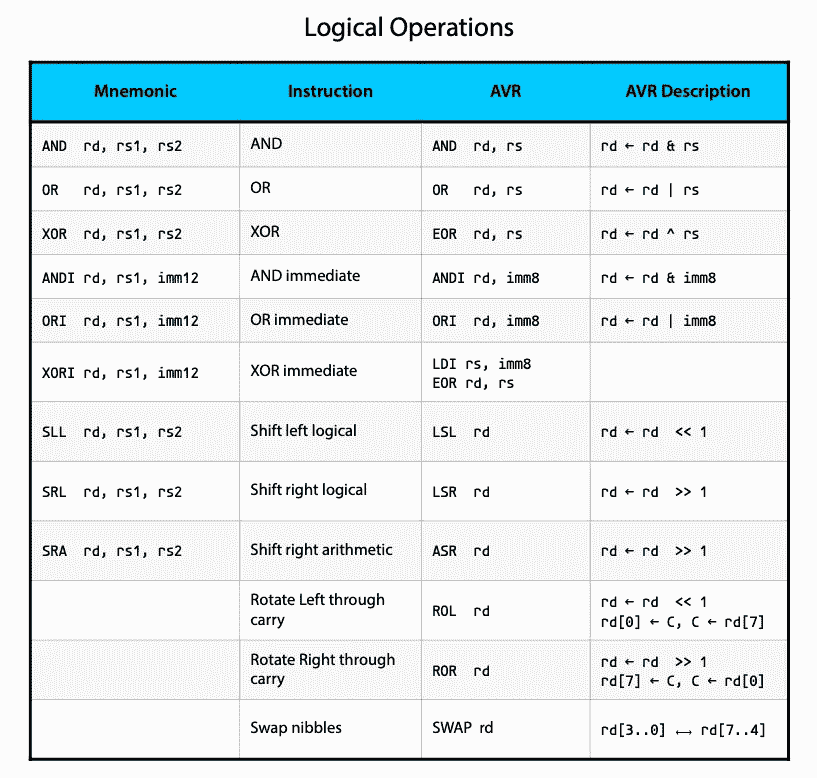
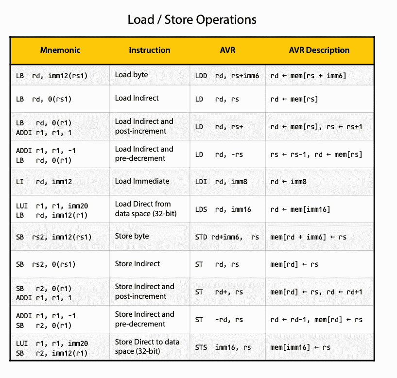
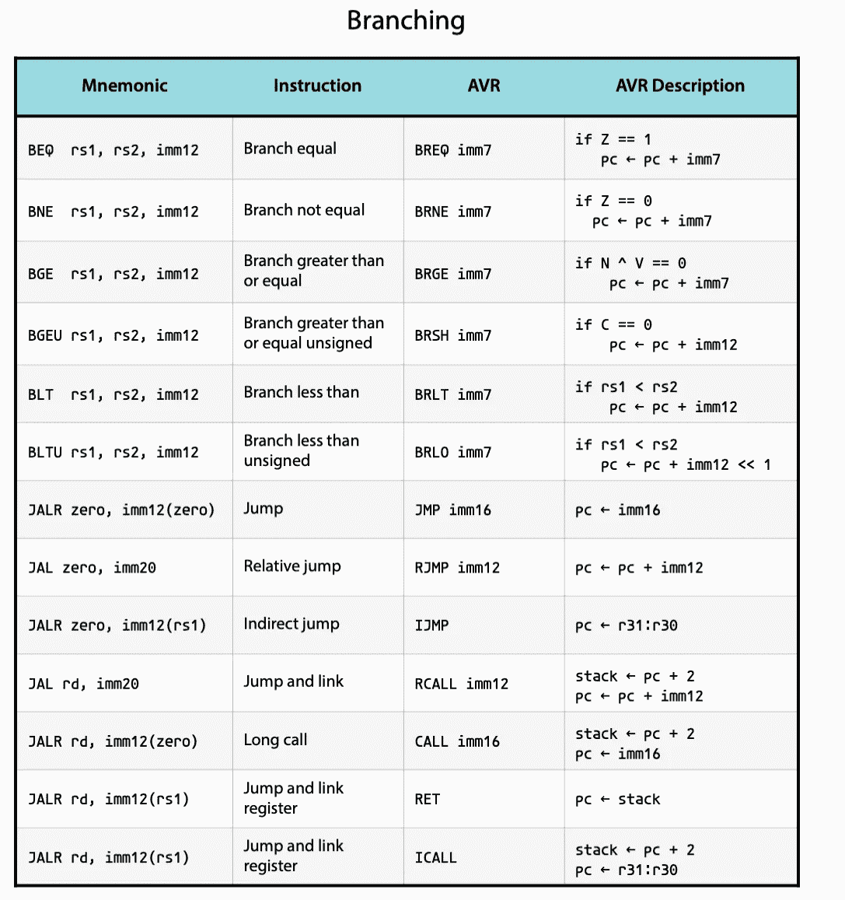

# RISC-V 指令集清单

> 原文：<https://itnext.io/risc-v-instruction-set-cheatsheet-70961b4bbe8?source=collection_archive---------0----------------------->

## RISC-V 处理器的 RV32I 基本指令集概述，包括与 AVR 指令集的比较。

许多人已经尝试制作给出 RISC-V 指令集概述的表格，所以这是我的变体。我试图在有用和易读之间找到平衡。这意味着我已经从这个概述中排除了一些东西。例如，大多数处理立即值的指令都使用[符号扩展](https://en.wikipedia.org/wiki/Sign_extension)，我选择不在这个概述中记录。你问什么是符号扩展？



许多算术运算都有符号扩展。rd 是目的寄存器。rs1 和 rs1 是输入寄存器。imm 指的是立即值。imm20 是 20 位立即值，而 imm12 是 12 位立即值。

计算机只存储带有 1 和 0 的二进制数。因此，为了表示负数，我们利用了整数回绕的事实。考虑下图所示的经典机械计数器。如果上面写着 9999，那么在上面加 4 会得到什么？它给出的数字是 0003，因为数字是环绕的。本质上，9999 的行为就好像它是-1。上面写着 9998，你加了 4？那么结果将是 0002，因此 9998 的行为就好像它是-2。因此，我们可以使用高数值来表示负数。


数字计算机的工作原理大同小异。因此，一旦达到最大值，二进制数就会回绕。处理这个问题时，一个复杂的因素是-1、-2、-3 等等的构成取决于所用的位数。在十进制系统中，如果你只能用一位数表示数字，那么 9 代表-1，8 代表-2，而如果你有两位数，那么 99 代表-1，98 代表-2，97 代表-3，依此类推。

同样的事情也适用于二进制数。十进制数字的符号扩展意味着，如果数字是负数，则每次添加数字时都要添加 9 作为第一个数字。因此，如果 9 代表一个有符号的数字，那么 09 将不起作用，因为它将是一个正数。你必须把它变成 99。对于二进制数，检查第一个数字是否是 1，然后在添加位时在前面加上 1。符号扩展甚至适用于逻辑运算，如`AND`和`OR`。



您可能会注意到，每条指令都标有 R、I 和 u 等类型，这说明了指令是如何在 32 位字中编码的。



在 RISC 处理器中，对内存的访问只能通过特殊的加载和存储指令来完成。这些指令有多种变体，能够加载不同位大小的值。只有 RV64I 支持`LD`(加载双字)，因为它加载 64 位值。一个字指的是一个 32 位的值，所以`LW`可以用来加载一个常规的 32 位整数。在处理字符串时，你可能想通过使用`LB`来加载单个字节。



*mem* 将系统内存表示为一个数组。

RISC-V 上的分支和跳转是由非常通用的`JAL`和`JALR`指令完成的。与其他流行的架构相比，RISC-V 上的条件分支是不同的。因为 RISC-V 处理器没有状态寄存器，所以我们在条件指令本身中提供了比较寄存器。因此，如果寄存器`x4`和`x6`相等，则`BEQ x4, x6, foo`跳转到标签`foo`。



PC 代表程序计数器(程序的当前位置)

关于这张表，需要指出的另一件有用的事情是伪指令。它们不是 RISC-V 处理器支持的真正指令。相反，它们只是编写其他指令的便捷方式。例如，如果我想把一个寄存器的值从`x3`移动到`x4`，如果 RISC-V 有一个移动指令就好了。`MV x4, x3`会实现这一点，只不过它并不真正存在。为什么？因为同样可以通过以下方式实现:

```
ADDI x4, x3, 0  # x4 ← x3 + 0
```

这意味着您可以避免将`MV`指令的编码添加到指令集架构(ISA)中。

伪指令好处的一个很好的例子是`LI`和`LA`指令。因为所有 RISC-V 指令都必须是 32 位宽，所以它们不能包含完整的 32 位地址。因此，将 32 位地址载入寄存器必须分两步完成。首先，我们用`LUI`或`AUIP`加载前 20 位，然后用`ADDI`添加剩余的 12 位。

```
.section .text             # Mark code section LUI  a1,     %hi(msg)    # Load upper 20 bits of msg address
  ADDI a1, a1, %lo(msg)    # Load lower 12 bits of msg address
  CALL puts                # Call puts function to show stringloop:
  J loop                   # Jump to loop - Infinite loop.section .data             # Mark section for R/W data storage msg: .string "Hello World\n"
```

为了创建可以加载到任何内存地址的代码(位置无关代码)，我们使用了翻译成`AUIP`和`ADDI`的`LA`指令。

阅读更多: [RISC-V 汇编程序参考](https://michaeljclark.github.io/asm.html)

通过使用伪指令，我们大大简化了这段代码:

```
.section .text             # Mark code section LI a1, msg               # Load immediate. Julia expands to 
                           # multiple instructions as needed. CALL puts                # Call puts function to show stringloop:
  J loop                   # Jump to loop - Infinite loop.section .data             # Mark section for R/W data storagemsg: .string "Hello World\n"
```



零对应于寄存器 x0，它总是保存值 0。

你可以看到有些指令是重复的，比如`LI`(立即加载)和`CALL`。原因是根据上下文，这些伪指令可以产生各种不同的 RISC-V 指令。如果提供给`LI`的立即值在 12 位有符号值的范围内，那么它将产生一个`ADDI`指令。如果它更大，将增加一个额外的`LUI`(立即加载上部)。甚至编译器标志也会影响结果。这在`LA`(加载地址)示例中显示。它使用`AUIPC`(将上位立即数添加到 PC)给出位置独立代码。否则将使用`LUI`。

根据大众的要求，我将所有这些表格制作成两个不同的用于 RISC-V 的 pdf，并与 AVR 指令集进行了比较。

*   [RISC-V 指令备忘单 PDF](http://blog.translusion.com/images/posts/RISC-V-cheatsheet-RV32I-4-3.pdf)
*   [AVR 和 RISC-V 指令对比 PDF](http://blog.translusion.com/images/posts/RISC-V-vs-AVR-cheatsheet.pdf)

# AVR 与 RISC-V 的比较

我打算写一个更深入的 AVR 和 RISC-V 的比较，但这里是一个比较 AVR 和 RISC-V 指令的尝试。指令集完全不同，遵循它们自己的逻辑，这使得任何简单的比较都有缺陷。

例如，对于 RISC-V，每个寄存器都可以以相同的方式使用，而对于 AVR，一些寄存器具有特殊的用途，这在比较中没有准确地传达。

下一个问题是 AVR 通常使用 16 位地址，而 RISC-V 使用 32 位地址。AVR 和 RISC-V 对它们的寄存器使用不同的命名方案和约定。我在这里使用 RISC-V 命名约定，这对于 AVR 来说并不理想。

支持的算术运算非常相似。一个明显的区别是 RISC-V 没有`SUBI`指令。相反，您可以使用带有负立即值的`ADDI`。有趣的是，AVR 已经交换了这一点，没有`ADDI`。相反，AVR 有一个`SUBI`，这意味着如果你想增加一个即时值，你需要减去一个负值。



当然，立即值的可用位数也有所不同。对于 AVR，我们通常只有 8 位，而 RISC-V 可以根据指令使用 12 或 20 位立即值。

逻辑运算则截然不同。AVR 一次只能移动一位，而 RISC-V 可以向左或向右移动任意数量的位。另一个很大的区别是 AVR 上的旋转操作使用进位状态标志。RISC-V 不能这样做，因为它没有状态标志。



AVR 和 RISC-V 在寄存器和内存之间加载和存储数据的方法也大不相同。RISC-V 加载和存储指令非常有规律。源地址是通过将寄存器的内容与立即值相结合来计算的。相比之下，AVR 在负载方面有很多变化:

*   间接加载—从存储在 X、Y 或 Z 寄存器(最后六个寄存器的实际对)中的存储器地址加载。
*   带位移加载— LDD 类似于 RISC-V 加载指令的工作方式。它使用位移和寄存器来计算源地址。
*   后递增或前递减 AVR 上的许多加载和存储指令会在加载数据之前或之后递增或递减 X、Y 或 Z 寄存器。



AVR 使用状态寄存器，而 RISC-V 不使用，这导致条件分支指令非常不同。RISC-V 上所有的无条件分支都是只用两条指令`JAL`和`JALR`完成的，而 AVR 有`JMP`、`IJMP`、`CALL`、`RCALL`、`ICALL`、`RET`等几条这里没有列出。



在这个比较中，我指出了 JAL 和 JALR，但人们自然会在 RISC-V 上使用伪指令，如`J`(跳转)`CALL`、`RET`和`TAIL`(跳转而不存储返回地址)

AVR 有一些你必须知道的边缘情况。例如，某些指令仅适用于寄存器 R16 至 R31。其他的只在 X，Y，Z 寄存器上工作。这里还有更多我没有涉及到的说明。所以我建议你看看官方文档: [AVR 指令集](http://www.mmajunke.de/doc0856.pdf)

# 相关故事

我写过的关于 RISC-V 和 AVR 编程或硬件的其他故事:

*   [面向初学者的 RISC-V 汇编语言](https://medium.com/swlh/risc-v-assembly-for-beginners-387c6cd02c49) —假设您是汇编编程新手。
*   [RISC-V 汇编代码示例](https://erik-engheim.medium.com/risc-v-assembly-code-examples-7bca0e7ebaa3) —微小而简单的 RISC-V 代码示例。
*   [AVR 编程入门](http://blog.translusion.com/posts/avr_without_arduino/) —关于超越 Arduino，直接编程 AVR 芯片。介绍程序员、保险丝计算器、AVRdude 和 ATiny13 芯片(仅 8 个引脚)。
*   [Mac OS X 上的 AVR 汇编编程](http://blog.translusion.com/posts/avrassembly/) —在 Mac OS 上设置汇编编程。这篇文章需要更新。
*   [8 针 AVR 微控制器开发板](http://blog.translusion.com/posts/avrdevboard/)——我做的一个小项目，可以对 13 个 AVR 芯片进行编程和测试。这些很酷的小集成电路只有 8 个引脚。
*   [调试 AVR 项目](http://blog.translusion.com/posts/debugavrproject/) —分享您在开始 AVR 编程之旅时容易出错的地方的经验。

对微处理器更普遍的兴趣:

*   [微操作到底是个什么鬼？](https://erik-engheim.medium.com/what-the-heck-is-a-micro-operation-e991f76209e) —微操作是讨论现代 RISC 和 CISC 处理器时经常弹出的概念。这个故事揭秘了什么是微操作。
*   [为什么要流水线一个微处理器？](https://erik-engheim.medium.com/microprocessor-pipelining-f63df4ee60cf) — RISC 处理器率先使用指令流水线。它们是什么？为什么它们对提高性能有用？
*   [2020 年的 RISC 和 CISC 意味着什么？](https://medium.com/swlh/what-does-risc-and-cisc-mean-in-2020-7b4d42c9a9de)—RISC 和 CISC 设计的历史比较，以及它们的趋同性和仍然存在的差异。
*   [RISC-V 矢量指令 vs ARM 和 x86 SIMD](https://medium.com/swlh/risc-v-vector-instructions-vs-arm-and-x86-simd-8c9b17963a31) —重点比较打包 SIMD 和矢量 SIMD 指令以及它们存在的原因。
*   ARMv9:有什么大不了的？ —详细介绍添加到 ARMv9 架构中的 SVE2 矢量 SIMD 指令集。
*   [RISC-V 微处理器的天才](https://erik-engheim.medium.com/the-genius-of-risc-v-microprocessors-b19d735abaa6)——与 SIMD 无关，而是关于 RISC-V 内核中的指令压缩和宏操作融合。
*   [CPU 和 GPU 上的矢量处理比较](https://erik-engheim.medium.com/vector-processing-on-cpus-and-gpus-compared-b1fab24343e6) —比较和探索实现数据并行的不同方式。
*   [为什么苹果的 M1 芯片这么快？](https://debugger.medium.com/why-is-apples-m1-chip-so-fast-3262b158cba2) —与讨论 RISC 和 CISC 处理器相关，因为这涉及到 M1 是 RISC 教授这一事实如何在解释它为什么表现如此出色方面发挥了重要作用。