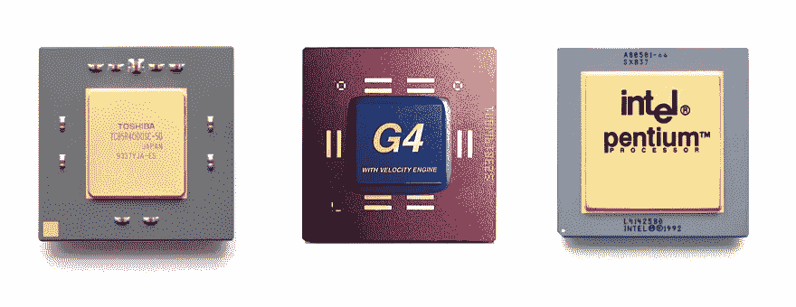
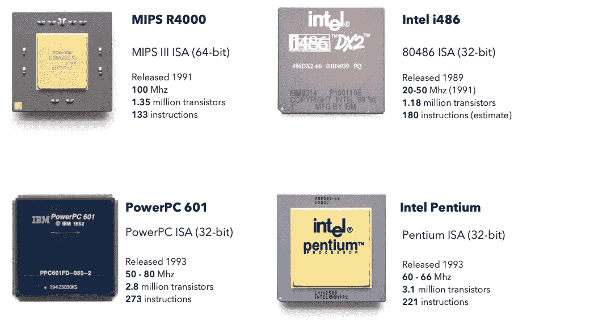
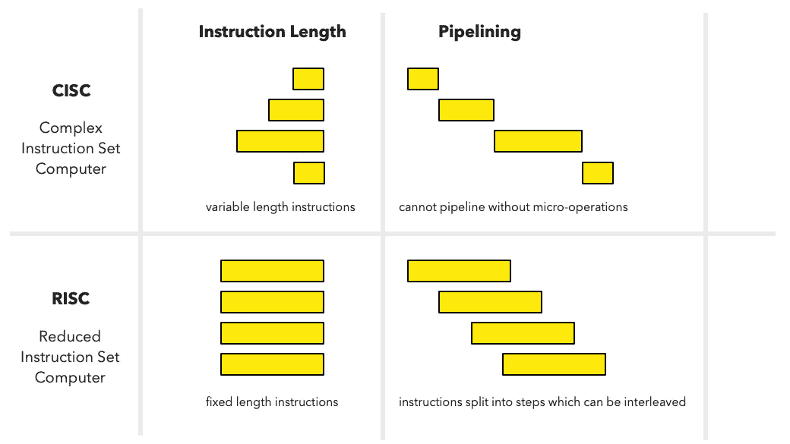
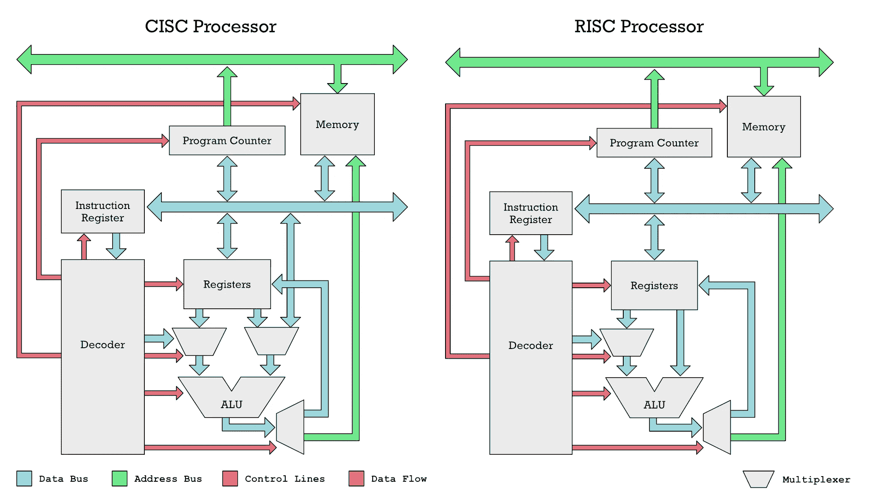
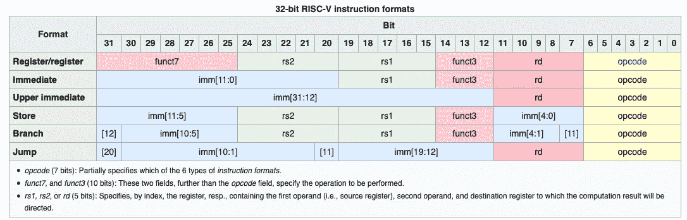
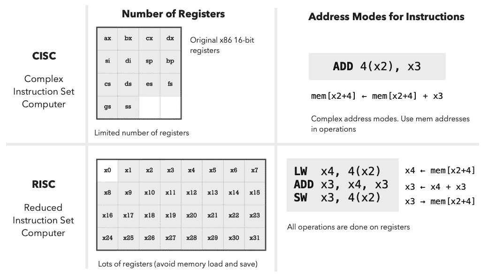
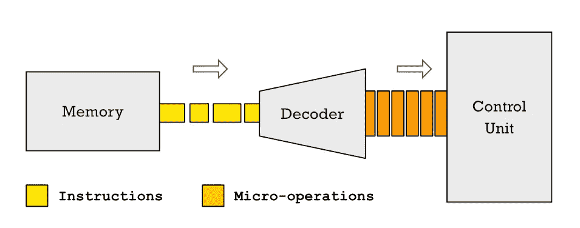
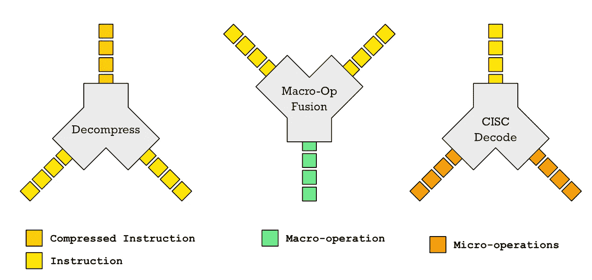

# 2022 年 RISC vs CISC 微处理器理念

> 原文：<https://itnext.io/risc-vs-cisc-microprocessor-philosophy-in-2022-fa871861bc94?source=collection_archive---------0----------------------->

## 通过将 RISC 与 CISC 的争论框定为如何花费有限的晶体管预算来实现性能的争论，来重新审视这场争论。



人们喜欢把 RISC 和 CISC 处理器之间的区别看作是一些特定的功能，或者是对指令或晶体管数量的某种神奇限制。

# 指令少不代表 RISC

让我们消除一些非常明显的误解。因为 RISC 代表*精简指令集计算机*，有很多人认为 RISC 处理器仅仅是一个指令很少的 CPU。如果是这样的话，那么 [6502 处理器](https://en.wikipedia.org/wiki/MOS_Technology_6502)将会是有史以来最精简的处理器之一，只有 56 条指令。甚至英特尔 8086 也可以算作 RISC 处理器，因为它只有 81 条指令。即使是后来的 Intel 80286 也只有 100 条左右的指令。

像 AVR 这样的简单 8 位 RISC 处理器有 [78 条指令](http://www.avr-asm-tutorial.net/avr_en/overview/overview.html)。如果你看看第一个 32 位 RISC 处理器，比如 PowerPC 601(1993 年发布)，它有 [273 条指令](https://www.ibm.com/docs/en/aix/7.1?topic=reference-appendix-g-powerpc-601-risc-microprocessor-instructions)。

从 Berkley 最初的 RISC 处理器衍生而来的 MIPS32 指令集也有 200 多条指令。

我们可以将其与 CISC 的 32 位处理器如 80386 进行比较，后者只有 170 多条指令。尽管在类似的时间(1986 年)发布的 MIPS R2000 处理器有大约 92 条指令。

对于古董:

*   [x86 指令列表](https://en.wikipedia.org/wiki/X86_instruction_listings)
*   [奔腾指令集](https://eun.github.io/Intel-Pentium-Instruction-Set-Reference/data/index.html)
*   [6502 指令集](https://www.masswerk.at/6502/6502_instruction_set.html)
*   [MIPS R2000 指令集](http://ti.ira.uka.de/TI-2/Mips/Befehlssatz.pdf)

# 晶体管少不代表 RISC

这里有一个有趣的练习，去这篇维基百科文章:[晶体管计数](https://en.wikipedia.org/wiki/Transistor_count)。

CISC 处理器和 RISC 处理器之间晶体管数量的分界点是什么？哦，你找不到吗？那是因为没有。6502 有 4，528 个晶体管。而第一个 ARM 处理器有 25000 个晶体管。

或者这个有趣的小事实。摩托罗拉 68060 被认为是那个时代最精确的处理器之一，重 250 万个晶体管，少于 1994 年发布的 IBM PowerPC 601 的 280 万个晶体管。

如果你看看几乎同时发布的 RISC 和 CISC 处理器，没有明显的趋势表明 RISC 处理器比 CISC 处理器有更少的晶体管和更少的指令。



20 世纪 90 年代早期流行的 RISC 和 CISC 处理器的晶体管和指令数的比较

因此，让我们得出这样的结论:不存在神奇数量的晶体管或指令能让你的芯片神奇地变成 RISC 或 CISC 芯片。但是问题依然存在，到底是什么造就了微处理器 RISC 或 CISC？

# RISC 和 CISC 是不同的晶体管预算哲学

当你的老板告诉你“这里，有一百万个晶体管，让我成为一个快速处理器！”那么你有很多方法来实现这个目标。对于相同数量的晶体管，RISC 和 CISC 设计者将做出不同的选择。

伯克利的大卫·a·帕特森最出名的可能是他在 1980 年发表的论文《精简指令集计算机的案例》中推广了 RISC 处理器的思想。

帕特森在这篇论文中概述的并不是芯片应该如何制造的详细蓝图，而更像是哲学指导方针。

*   在真实世界的程序中添加这条指令会带来多少性能提升？
*   有什么硬件含义？我们需要存储大量的复杂状态吗？由于需要存储大量的状态，这使得上下文切换和无序执行更加复杂。
*   一个设计良好的简单指令组合可以完成同样的工作，并且性能相当吗？
*   我们是否可以利用现有的算术逻辑单元(alu)和 CPU 上的其他资源来添加这条指令，或者我们是否需要添加许多新的东西？
*   如果不添加这条指令，这些晶体管的其他用途是什么？更多缓存？更好的分支预测器？

理解这些规则适用于给定的晶体管预算是很重要的。如果你有更多的晶体管，你可以添加更多的指令，甚至是复杂的指令。

然而，RISC 哲学优先考虑保持 ISA 简单。这意味着 RISC 设计者将首先尝试通过*而不是添加指令来提高性能，例如:*

*   使用晶体管增加更多高速缓存
*   更多 CPU 寄存器
*   更好的渠道
*   更好的分支预测器
*   超标量体系结构
*   添加更多指令解码器
*   无序执行
*   宏观操作融合
*   压缩指令

因此，当设计一个好的 RISC 指令集(ISA)时，一个关键的目标是使设计不妨碍未来的微体系结构优化。

这与 CISC 设计师设计 CPU 的方式不同。CISC 的设计者将添加复杂的指令，引入更多的状态来跟踪，如状态寄存器，如果这样能提供更好的性能。

## CISC 设计哲学的问题

问题是 CISC 的设计师没有超前思考。将来你的晶体管预算可能会增加。突然间，你得到了所有这些可以用来创建无序(OoO)超标量处理器逻辑的晶体管。这意味着您在每个时钟周期解码多条指令，并将它们放入指令队列。然后 OoO 逻辑计算出哪些指令不相互依赖，这样它们就可以并行运行。

如果你是一名软件开发人员，你可以考虑一下函数式编程和命令式编程的区别。为了短期的性能收益而改变全局数据是很有诱惑力的。然而，一旦你并行运行，全局状态被多个函数改变，这些函数可以在多个线程中并行运行，这绝对是一场噩梦。

函数式编程更喜欢只依赖输入而不依赖全局数据的纯函数。这些功能可以很容易地并行运行。同样的机制也适用于 CPU。不依赖于全局状态(如状态寄存器)的汇编代码指令可以更容易地并行或在流水线中运行。

RISC-V 是这种思想的一个很好的例子。RISC-V 没有状态寄存器。比较和跳转指令合二为一。除非通过运行额外计算来确定是否发生了溢出，否则无法用状态寄存器捕获整数溢出。

这应该给你一些关于 RISC 和 CISC 之间区别的线索。

## RISC 处理器设计者的优先事项

一个 RISC 设计者在增加 10 条新指令时不一定会有问题，如果这些指令对微体系结构没有显著影响的话。如果一条指令要求在 CPU 中表示更多的全局状态，RISC 设计者将更不愿意添加该指令。

这种理念的最终结果是，在历史上，向 RISC 处理器添加诸如流水线和超标量架构之类的东西比 CISC 处理器更容易，因为人们避免了添加引入状态管理或控制逻辑的指令，这使得很难添加这些种类的微架构创新。

这就是为什么 RISC-V 团队更喜欢进行宏操作融合，而不是添加支持复杂寻址模式或整数溢出检测的指令。如果你不知道什么是微操作融合，看看这些文章:

*   [微操作到底是个什么鬼？](https://erik-engheim.medium.com/what-the-heck-is-a-micro-operation-e991f76209e)
*   [RISC-V 微处理器的天才](https://erik-engheim.medium.com/the-genius-of-risc-v-microprocessors-b19d735abaa6) —涵盖了宏操作融合在 RISC-V 中的使用

现在，RISC 理念导致了不断出现的特定设计选择，这使我们能够谈论一些更具体的差异，您将在比较 RISC 和 CISC 处理器时观察到这些差异。让我们看看这些。

# 现代 RISC 和 CISC 处理器的特点

某些设计选择不断出现在许多不同的 RISC 处理器上。一个常见的模式是，RISC 处理器往往有固定长度的 32 位指令。有一些例外，如 AVR 使用固定长度的 16 位指令。相比之下，英特尔 x86 处理器的指令长度为 1 至 15 字节。摩托罗拉 68k 处理器，另一个著名的 CISC 设计，有 2 到 10 字节长(16 位到 80 位)的指令。



变长指令实际上对汇编程序员来说很方便。我的第一台电脑是 Amiga 1000，它配有摩托罗拉 68k 处理器，所以它向我介绍了 68k 组件，坦白说，它非常简洁。它有将数据从一个存储位置移动到下一个存储位置的指令，或者你可以将数据从一个寄存器`A1`给定的地址移动到另一个寄存器`A2`给定的存储位置。

```
; 68k Assembly code

MOVE.B 4, 12      ; mem[4] → mem[12] 
MOVE.B (A1), (A2)   ; mem[A1] → mem[A2]
```

这种指令使 CPU 易于编程，但这意味着没有办法将每个支持的指令都放在 32 位内，因为表达完整的源地址和目的地址将单独消耗 64 位。因此，通过使用可变长度指令，我们可以轻松地在任何指令中包含完整的 32 位内存地址。

然而，这种便利是有代价的。可变长度指令更难流水线化，如果你想让超标量处理器并行解码两条或更多条指令，你不容易做到，因为你不知道每条指令在哪里开始和结束，直到你解码它们。


对于超标量处理器，你有多个并行工作的指令解码器。

如果流水线和超标量听起来像天书，那么读读这些故事:

*   [为什么要流水线化一个微处理器？](https://erik-engheim.medium.com/microprocessor-pipelining-f63df4ee60cf) —什么是指令流水线及其优势。
*   [超长指令字微处理器](https://erik-engheim.medium.com/very-long-instruction-word-microprocessors-17262def3037) —更深入地解释超标量微处理器。

RISC 处理器倾向于避免可变长度指令，因为它们打破了不添加指令的 RISC 哲学，这使得添加更高级的微架构优化更加困难。

固定长度的指令造成不便。您不能将内存地址放入任何操作中，只能放入特定的操作中，如加载和存储指令。



RISC 处理器中的算术逻辑单元(ALU)只能从寄存器中获取输入，而不能从内存中获取

## 加载/存储架构

机器代码指令必须对关于正在执行什么信息的信息进行编码，例如它是否正在执行`ADD`、`SUB`或`MUL`。它还必须对其输入信息进行编码。什么是输入寄存器和输出寄存器。一些指令需要对我们试图从哪个地址加载数据进行编码。在 RISC-V 中，指令是这样编码:



展示了如何使用 32 位字中的每一位对 RISC-V 指令集的指令进行编码

我们执行的特定指令称为操作码(黄色)，它消耗 7 位。我们指定的每个寄存器输入或输出都需要 5 位。由此应该很清楚，挤进一个 32 位的地址是不可能的。甚至更短的地址也很难，因为你需要位来指定操作中使用的寄存器。有了 CISC 处理器，这就不成问题了，因为你可以自由地执行超过 32 位的指令。

这种紧凑的空间要求导致 RISC 处理器具有我们所说的加载/存储结构。只有 RISC-V 上的`LW`和`SW`等专用加载和存储指令才能用于访问内存。

使用 CISC 处理器，如 68k，几乎任何操作，如`ADD`、`SUB`、`AND`和`OR`，都可以使用内存地址作为操作数(参数)。在下面的例子中，`4(A2)`计算一个内存地址，我们用它来读取`ADD`指令的一个操作数(参数)。最终结果也存储在那里(在 68k destination 上是右参数)。

```
; 68k assembly
ADD.L D3, 4(A2)  ; D3 + mem[4 + A2] → mem[4 + A2]
```

典型的 RISC 处理器，如基于 RISC-V 指令集的处理器，需要将加载(`LW`)和存储(`SW`)作为单独的指令存储到存储器中。

```
# RISC-V assembly
LW  x4, 4(x2)      # x4 ← mem[x2+4] 
ADD x3, x4, x3     # x3 ← x4 + x3 
SW  x3, 4(x2)      # x3 → mem[x2+4]
```

不需要结合地址寄存器(`A0`到`A7`)来计算地址。你可以直接指定一个内存地址，比如 400:

```
; 68k assembly
ADD.L 400, D4     ; mem[400] + D4 → D4
```

但是即使像这样看似简单的操作也需要多条 RISC 指令。

```
# RISC-V assembly
LW  x2, 400(x0)    # x3 ← mem[x0 + 400] 
ADD x4, x4, x3     # x4 ← x4 + x3
```

在许多 RISC 设计中,`x0`寄存器总是为零，这意味着即使你只对绝对内存地址感兴趣，你也可以使用偏移加基址寄存器的形式。虽然这些偏移量看起来非常类似于您在 68k 上所做的，但它们要有限得多，因为您总是需要适应 32 位字。有了 68k 你可以给`ADD.L`一个完整的 32 位地址。你不能用 RISC-V `LW`和`SW`。获取完整的 32 位地址相当麻烦。比方说你想从 32 位地址`0x00042012`加载数据，你必须分别加载高 20 位和低 12 位来形成一个 32 位地址。

```
# RISC-V assembly
LUI  x3, 0x42        # x3[31:12] ← 0x42  put in upper 20-bits
ADDI x3, x3, 0x12    # x3 ← x3 + x3 + 0x12 

LW x4, 0(x3)         # x4 ← mem[x3+0]
```

实际上这可以简化为: `LUI x3, 0x42 LW x4, 0x12(x3)`

我记得当我从 68k 汇编过渡到 PowerPC(苹果以前使用的 RISC 处理器)时，这让我很恼火。当时我认为 RISC 意味着一切都将变得容易得多。我发现 x86 很混乱，很难处理。然而，对于汇编代码来说，RISC 不如 68k 这样好的 CISC 指令集使用起来方便。幸运的是，在 RISC 处理器上有一些简单的技巧可以使这变得更容易。RISC-V 定义了许多伪指令，使汇编代码编写更容易。使用`LA`(加载地址)伪指令，我们可以像这样编写前面的代码:

```
# RISC-V assembly with pseudo instructions
LI x3, 0x00042012   # Expands to a LUI and ADDI
LW x4, 0(x3)
```

总结:虽然加载/存储架构使得编写汇编代码更加麻烦，但是它允许我们保持每条指令 32 位长。这意味着创建一个超标量微体系结构，可以并行解码多条指令，实现成本更少的晶体管。流水线处理每条指令变得更加容易，因为它们中的大部分可以适合经典的 5 步 RISC 流水线。

## RISC 处理器有很多寄存器

有了像 68k 这样的 CISC 处理器，你可以用一条指令做很多事情。假设您想将数字从一个数组复制到另一个数组。下面是一个用 C 语言设计的使用指针的例子:

```
// C code
int data[4] = {4, 8, 1, 2, -1};
int *src = data;

while (*xs > 0)
    *dst++ = *src++;
```

如果您将指针`src`存储在 68k 处理器的地址寄存器`A0`中，并将`dst`存储在地址寄存器`A1`中，您可以在一条指令中复制并推进每个指针 4 个字节:

```
; 68k assembly

MOVE.L  (A0)+,(A1)+   ; mem[A1++] → mem[A2++]
```

这只是一个例子，但一般来说，你可以做更多的 CISC 指令。这意味着您需要更少的代码。RISC 设计者因此意识到他们的代码会变得臃肿。因此，RISC 设计者分析真实代码，提出不使用复杂指令就能减少代码大小的方案。他们发现大量代码只是简单地从内存中加载和存储数据。通过增加许多寄存器，可以将临时结果保存在寄存器中，而不用将它们写到存储器中。这将减少需要执行的加载和存储指令的数量，从而减少代码 RISC 代码的大小。

因此，MIPS、SPARC、Arm (64 位)和 RISC-V 处理器都有 32 个通用寄存器。我们可以将其与只有 8 个通用寄存器的原始 x86 进行对比。



# 从 RISC/CISC 的角度看复杂性

在这个故事中，我想表达的是，RISC 处理器并不比 CISC 处理器更先进。区别在于 RISC 和 CISC 设计者选择增加复杂性的地方。

CISC 设计师将复杂性放在指令集架构(ISA)中，而 RISC 设计师宁愿将复杂性添加到他们的微架构中，但正如我一直强调的那样，他们不希望 ISA 将复杂性强加到微架构中。

让我在 MIPS R4000、摩托罗拉 68040 和英特尔 486 之间做一个比较，以强调这种理念上的差异。他们每个人都有大约 120 万个晶体管，并在同一时间(1989 年至 1991 年)发布。

*   RISC 处理器(R4000)是 64 位的，其他的是 32 位的。
*   R4000 具有 8 级流水线，比 6 级流水线的 68040 和 5 级流水线的 486 允许更高的时钟频率。
*   更长的管道使 R4000 从 100-200 Mhz 远远超过 68040 的 40Mhz，486DX2 达到 66Mhz(在更晚的型号中为 100Mhz)。

最终，在 1993/1994 年，人们得到了更快的 CISC 处理器，如 68060 和奔腾。但同时出现了 MIPS R8000，它是一种超标量体系结构，可以并行解码 4 条指令。奔腾处理器每个时钟周期只能解码 2 条指令。

因此，我们可以看到 RISC 设计者是如何偏爱花哨的微体系结构而不是花哨的指令的。

# "但是现代 CISC 处理器有复杂的微结构！"

你可能会抗议说，今天的 CISC 处理器有复杂的微体系结构。的确如此。现代英特尔或 AMD 处理器具有多个解码器、微操作高速缓存、高级分支预测器、无序(OoO)执行引擎。然而，这并不奇怪。记住我关于晶体管预算哲学的关键点:今天每个人都有很多晶体管可以使用，所以所有高端芯片都将有很多先进的微架构功能。他们可以用给他们的预算负担得起。

这里有个问题:许多复杂的微架构特性是由复杂的 CISC 指令集强加的。让我举几个例子。为了使流水线工作，x86 处理器把它们复杂的长指令分解成微操作。微操作很简单，行为更像 RISC 操作，因此更容易流水线化。



问题是将 CISC 指令分解成更简单的微操作并不容易。因此，许多现代超标量 x86 处理器具有 3 个用于简单指令的指令解码器和 1 个用于复杂指令的解码器。由于你不知道每条指令的开始和结束，CISC 处理器不得不参与一个复杂的涉及许多晶体管的猜谜游戏。

RISC 处理器避免了这种复杂性，可以将所有浪费的晶体管用于添加更多解码器或进行其他优化，如使用压缩指令或宏操作融合(将非常简单的指令组合成更复杂的指令)。



在不同的 CPU 设计中，指令组合或分解的不同方式。

如果你将苹果公司的 M1 处理器与 AMD 和 Intel 处理器进行比较，你会发现它有更多的指令解码器。CISC 的设计者试图通过添加微操作缓存来缓解这个问题。有了微操作高速缓存，CISC 处理器就不必一次又一次地通过障碍或解码相同的复杂指令。然而，增加这一功能显然会增加晶体管成本。它不是免费的。因此，你在微结构复杂性上浪费了晶体管预算，这是因为你的 ISA 的复杂性才需要的。

# Arm 与 RISC-V 设计理念

比较现代 RISC 和 CISC 处理器的一个问题是，RISC 基本上赢了。没有人再从头开始设计 CISC 处理器了。Intel 和 AMD 的 x86 处理器今天之所以受欢迎，主要是因为向后兼容。

> 如果你今天让一个设计团队坐下来，告诉他们从头开始设计一款高性能处理器，那么你不会得到传统的 CISC 设计。

然而，这并不意味着 RISC 社区在设计者倾向于 CISC 还是 RISC 方向上没有差异。现代 Arm 处理器和基于 RISC-V 的处理器是这种对比的有趣例子。

Arm 设计人员更愿意添加复杂的指令来获得性能。请记住，不启动不是 RISC 设计。随着晶体管预算的增长，增加更复杂的指令是公平的。

RISC-V 设计人员更热衷于将 ISA 的复杂性保持在最低水平，而不是通过使用压缩指令和宏操作融合等技巧来增加微体系结构的复杂性以获得性能。我在这里讨论这些设计选择:[RISC-V 微处理器的天才。](https://erik-engheim.medium.com/the-genius-of-risc-v-microprocessors-b19d735abaa6)

Arm 和 RISC-V 的不同选择不是随意的，而是受到非常不同的目标和市场的严重影响。Arm 越来越多地涉足高端市场。请记住，苹果的 Arm 芯片正在与 x86 芯片进行正面竞争，不久 Nvidia 也会这样做。

RISC-V 的目标是成为一个更广泛的架构，用于从键盘到人工智能加速器，从 GPU 到专门的超级计算机的任何东西。这意味着 RISC-V 意味着灵活性，你添加的指令越复杂，你强加的复杂性就越小，从而减少了为特定用例定制芯片的自由。

# 资源和相关文章

参考资料和我写的关于这个主题的相关文章。

2020 年的 RISC 和 CISC 意味着什么？——我思考这个话题的最初尝试之一。

[RISC 哲学](https://erik-engheim.medium.com/demystifying-risc-microprocessors-philosophy-f6303f6c0f7f)——我第一次想到 RISC 是一种设计哲学，而不是一系列功能的复选框。

[RISC-V 矢量处理相对于 x86 风格 SIMD 的优势](https://medium.com/itnext/advantages-of-risc-v-vector-processing-over-x86-simd-c1b72f3a3e82) —用矢量处理代替 SIMD 指令进行数据并行的优势。

IBM 801——被认为是第一个 RISC 处理器