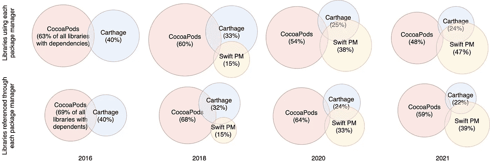

# 在 iOS 应用中使用第三方库的风险

> 原文：<https://itnext.io/risks-of-using-third-party-libraries-in-ios-apps-c920d7ef760c?source=collection_archive---------1----------------------->

# 通过第三方库将漏洞引入 iOS 应用的风险有多高？

开发软件时使用第三方库是常见的做法。现代的包管理器使得向应用程序添加外部依赖变得非常容易。但是就像生活中的一切美好事物一样，使用第三方库确实会带来一定的风险。

## 其他生态系统中的例子

大多数开发人员可能听说过去年的 Log4J 事件，当时一个流行的 Java 日志库中的一个漏洞(允许远程代码执行)影响了 4%的 Java 应用程序。如果不是，谷歌有一篇关于这个漏洞的巨大影响的博文:

 [## 了解 Apache Log4j 漏洞的影响

### 截至 12 月 19 日，仅 log4j-core 的生态系统影响数字就超过 17，000 个软件包受到影响，这是…

security.googleblog.com](https://security.googleblog.com/2021/12/understanding-impact-of-apache-log4j.html) 

另一个流行的例子是 npm 中的左垫事件。删除一个小库(**只有 11 行代码**)会导致很多混乱。

 [## 一个程序员如何通过删除一小段代码来破坏互联网

### 上周，加州奥克兰的一名男子删除了 11 行代码，扰乱了全球的网络开发。的…

qz.com](https://qz.com/646467/how-one-programmer-broke-the-internet-by-deleting-a-tiny-piece-of-code/) 

然而，Npm 似乎是一个极端的例子。平均来说，一个 npm 库有 3 个直接依赖项，这听起来没那么多。但是包括间接依赖的 npm 库依赖于 [80](https://www.usenix.org/system/files/sec19-zimmermann.pdf) (！)其他图书馆平均。[研究人员](https://ieeexplore.ieee.org/document/8530047)发现 npm 中超过 35%的库发布依赖于易受攻击的库(直接或间接)。

## iOS/Swift 呢？

使用一个只包含 11 行代码的库，就像左键盘事件一样，似乎有点..精神错乱？作为一名 iOS 开发人员，我无法证明仅仅为了 11 行代码就增加一个外部库是合理的。所以也许是因为生态系统的不同而存在文化上的差异？

另一个有着相同印象的人在 reddit 上问了这个问题，答案几乎一致:

那么 iOS 开发者对第三方库有多势利呢？为了量化它，我为 iOS 生态系统建立了一个库依赖网络。(顺便说一下，如果您愿意，您可以下载并自己探索)

 [## 通过 CocoaPods、Carthage 和 Swift PM 可以获得开源库的依赖网络

### 第三方库用于集成常见问题的现有解决方案，并帮助加速开发。的…

zenodo.org](https://zenodo.org/record/6641875#.Ys6eci8RpQI) 

在下文中，我将首先描述 iOS 第三方图书馆生态系统，然后我们将研究数据所说的内容。

## iOS 第三方图书馆生态系统概述

在 Swift 中编写应用程序时，开发人员有三种包管理器可供选择:

*   椰子足类
*   迦太基
*   Swift 软件包管理器

CocoaPods 于 2011 年发布，拥有一个中央图书馆。CocoaPods 相当容易使用，但是对于一些开发人员来说有点笨拙。

Carthage 于 2014 年推出，作为椰子脚掌的更轻量级替代物。没有中央存储库，几乎任何库(作为库项目创建的)都可以通过指定存储库 URL 通过 Carthage 包含进来。

2017 年苹果发布了第一个官方包管理器 Swift Package Manager。最初，人们只能在创建库或命令行应用程序时使用它。从 2019 年开始，苹果增加了 iOS 支持，Swift Package Manager 现在也可以直接从 Xcode 使用。类似于 Carthage，没有中央存储库，库通过它们的存储库 URL 来识别。

当查看库的数量时，CocoaPods 声称包括大约 80，000 个库。Carthage 和 Swift Package Manager 的库数量估计只有 4500 个左右。

考虑到库数量的差异，如果一个人希望访问尽可能多的库，那么 CocoaPods 似乎是显而易见的选择。然而，看看那些依赖于其他库的库，这三个包管理器在库的数量上并没有太大的不同。

属于每个包管理器的库的百分比

## iOS 开发者对第三方库有多势利？

我们查看了 iOS 生态系统中库的平均依赖项数量，发现尽管直接依赖项的平均数量与 npm 相似(约 3)，但总依赖项(直接和间接)的平均数量不到 7。令人有些担忧的是，依赖关系的数量正在增加，但仍然比 npm 少 10 倍。

同样重要的是要注意，对于连接到其他库的库，总是计算平均依赖项的数量。没有从属关系和从属关系的库将从分析中丢弃。iOS 生态系统中的大多数库(大约 85%)没有任何依赖或从属关系。

## 通过第三方库将漏洞引入 iOS 应用的风险有多高？

我们查询了国家漏洞数据库(NVD)来寻找这些库公开报道的漏洞。我们发现只有 5.9%的依赖库依赖于易受攻击的库。

iOS 生态系统中的库报告的漏洞可能较少，但平均总依赖数较少可能是 iOS 生态系统中依赖易受攻击的库的风险比 npm 生态系统小得多的原因。

## 结论

结论是，在使用第三方库时，iOS 开发者确实是势利的。一个幸运的副作用是，通过 iOS 生态系统中的第三方库引入漏洞的可能性相当小。

然而，一个小风险仍然存在。因此，检查您的依赖项是否公开报告了漏洞并不是一个坏主意:

 [## SwiftDependencyChecker —检查 CocoaPods、Carthage 和 Swift PM 依赖项以了解已知的…

### 我们的应用程序中漏洞的一个来源是使用第三方库的易受攻击版本。有…

blog.devgenius.io](https://blog.devgenius.io/swiftdependencychecker-check-cocoapods-carthage-and-swift-pm-dependencies-for-known-def2fba890c) 

你可以在这里阅读完整研究的预印本:

 [## iOS 开发中软件包管理器的依赖网络分析

### 编写软件时，使用第三方库是常见的做法。然而，漏洞可以在…中找到

www.techrxiv.org](https://www.techrxiv.org/articles/preprint/Analysis_of_Dependency_Networks_of_Package_Managers_Used_in_iOS_Development/20088539) 

## 然后

为了更好地理解依赖关系中的漏洞如何影响 iOS 应用程序，我将发布一系列博客文章，详细分析其中的一些漏洞，并展示它们是如何被利用的。

 [## 在 iOS 应用程序中使用易受攻击的库第 1 部分

### 使用 GCDWebServer 库利用应用程序中的错误授权漏洞的演练

medium.com](https://medium.com/@kristiina_28701/using-vulnerable-libraries-in-ios-apps-part-1-4f699fe8337d)