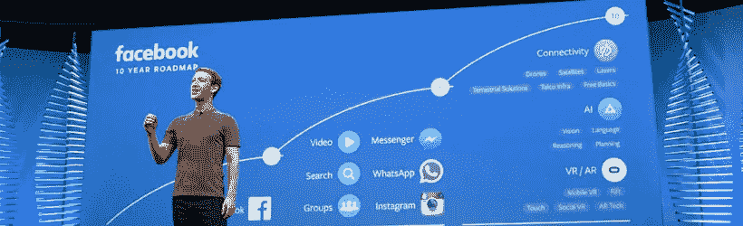
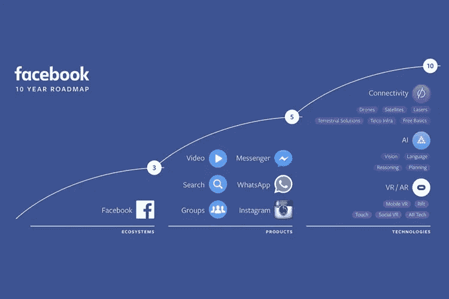

# Facebook 的路线图:连接、AI、VR 和 AR

> 原文：<https://itnext.io/roadmap-van-facebook-connectiviteit-ai-vr-en-ar-4ec4808f8551?source=collection_archive---------0----------------------->

“建造技术来给安妮他们想要与安妮共享的力量。”这是一项既美丽又高贵的任务，同时也是一项挑战性的任务。这是 Facebook 创始人扎克伯格的计划。Facebook 最初是一个社交媒体，但现在它已经不仅仅是一个社交媒体的互联网巨头。这是一家科技公司，致力于把人们联系起来。

今年 4 月，zuckerberg 公布了 Facebook 未来 10 年的路线图。将 Facebook 作为一个生态系统集中起来，并使用各种应用程序和媒体以尽可能多的方式扩展该生态系统，并在其中添加触摸点。但是 Facebook 真正的创新在于它的技术进步来使生态系统变得更聪明，将每个世界公民与生态系统联系起来，并使体验变得更丰富。

这三项核心技术将在未来十年成为公司的焦点:

**连接性**

*   无人机吗
*   是卫星吗
*   激光吗
*   领土解决方案
*   Telco 红外线
*   自由基础

**艾**

*   我的愿景
*   语言
*   推理能力
*   有计划吗

【T6 个 VR/ar】T7 个

*   移动 VR
*   撕了它
*   摸摸看
*   社会福利部
*   AR 技术

Zuckerberg 预计，视频在通信中的出现将带来和我们到目前为止所看到的 *mobile* 的出现一样大的变化。此外，Facebook 主要关注 360°视频、增强的现实和实时流。

## 连接世界上所有的公民

“连接是人类的基本权利，”t11 马克扎克伯格]说。这是他个人的使命，也是 Facebook 的使命把世界上所有的公民联系起来。理论上，世界上 85%的人可以上网。他们有一个或多个广播域，在这些广播域中可以使用 2G internet。剩下的 15%想把公司和无人机卫星激光联系起来。这是一个怪兽工程。但在 85%的网络连接中，很长一段时间并不是每个人都在线上。由于社会经济和文化原因，互联网的使用受阻。

在《时代周刊》的“T0”有趣的采访中，马克扎克伯格(Mark Zuckerberg)很好地解释了他是如何通过协作来提供不需要付费的基本电话服务的。通过免费提供内容，人们可以了解互联网的功能，并且愿意支付更多费用。“数据起作用”

行动服务提供者不仅要成为 mindset 的封面，而且要真正实现 Zuckerberg 的计划可能会很困难。法律规定的[网络中立](https://nl.wikipedia.org/wiki/Netneutraliteit)(在荷兰也是如此)很难在免费数据连接中只允许某些服务。

## 具有人类情感的人工智能

安装、登录和学习每个组织的应用程序是否符合逻辑？Zuckerberg 相信通过使用 Facebook messenger 格式的 T4 生态系统，应用程序是不必要的。这是人工智能在聊天机器人背后的驱动力，它将取代应用程序。随着 Facebook[T7 的推出，该组织正试图将 Siri 和 Cortana 的竞争对手推向市场。](http://www.wired.com/2015/08/facebook-launches-m-new-kind-virtual-assistant/)

有了全球五分之一的人使用的平台，Facebook 就可以大量使用用户生成的数据。[机器学习和 ai](http://fortune.com/facebook-machine-learning/)使其平台更智能，而且还基于所有 Facebook 用户的行为所采用的“真实的人类”行为。

## 每个人都戴上虚拟/增强的现实眼镜

2014 年 3 月，Facebook [Oculus VR 接管了 Oculus Rift 的创建者](http://www.nu.nl/tech/3735824/facebook-koopt-maker-virtual-reality-bril-oculus-rift.html)。这家公司是虚拟现实技术的领导者。Zuckerberg 指出，借助虚拟现实，在线/数字体验可以变得更加丰富。尤其是在虚拟视界已经取得了长足的发展的情况下，Facebook 希望在虚拟视界内的技术更进一步。

收购 Oculus 只是 Facebook 在 VR/AR 上的一个强大赌注的标志之一。每个 Facebook 用户都可以在几个月内发布和查看 360 度视频和照片。该公司宣布了一个[360 度相机，](https://techcrunch.com/2016/07/26/if-you-source-it-they-will-build/)允许任何人创建自己的 VR 内容。Zuckerberg 相信 VR 和 AR 将越来越多地结合在一起，像 Google glass[这样的技术创新将在未来被更广泛的](http://www.theverge.com/2016/4/12/11415366/mark-zuckerberg-facebook-f8-virtual-augmented-reality-glasses)公众接受和使用。

