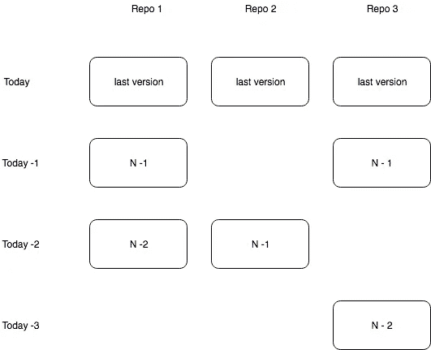
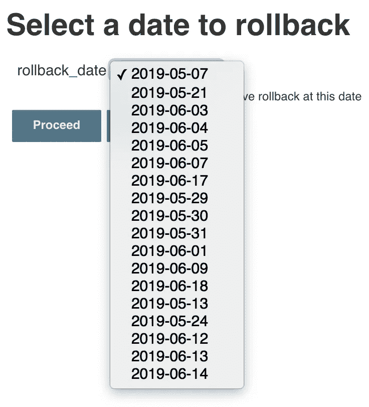

# Ansible 和 Jenkins 的微服务回滚

> 原文：<https://itnext.io/rollback-for-microservices-with-ansible-and-jenkins-9bf84e36a694?source=collection_archive---------4----------------------->

假设您的项目由 4 个微服务组成(3 个后端，1 个前端)。昨天，您介绍了几个新功能并发布了一个版本。不幸的是，您的用户刚刚报告了一个错误。一些旧的重要功能不起作用了。您需要对所有服务进行回滚。啊，如果可以一键搞定。

其实可以。在这篇文章中，我将向您展示如何。

技术堆栈:

*   Jenkins 支持回滚自动化
*   用于回滚脚本的 Ansible + Python
*   用于存储发布映像的 Docker 注册表
*   运行应用程序的 DC/操作系统

# 概观

我们将有一个 python 脚本，叫做 via Ansible from Jenkins，如本文[中所述。唯一的区别是—我们应该运行两个不同的标签。第一个收集所有可用的映像，第二个运行回滚。](https://justtech.blog/2019/04/27/ansible-and-jenkins-automate-your-scritps/)

`get`算法:

1.  从 docker 注册表中请求所有图像。按环境过滤，按日期排序，并为每个存储库取最后 10 个。
2.  用存储库、图像和日期形成 json，并写入文件系统

`run`算法:

1.  从 get second step 中读取 json 并创建一个 Jenkins 输入
2.  获取选定日期的所有可用映像并执行回滚

回滚本身:

1.  修改 marathon json 配置中的 docker 图像部分
2.  使用修改后的配置开始部署

## 特例

想象一个服务，它在这个版本中没有改变。这意味着它将没有任何可用的回滚映像。但是由于兼容性问题，您仍然需要回滚它。请在下图中找到这种情况的例子。



如果选择`Today-1`，只有`Repo1`和`Repo3`会被回滚，因为`Repo2`没有图像。也许它没有被改变。

这里的问题是`Repo1`或`Repo3` N-1 版本可能与`Repo2`最新版本不兼容。所以你需要在回滚日期之前找到`Repo2`的下一个版本。是`Today-2`版本。

# 获得回滚

我们将有两个回滚操作:

*   我们收集当前环境可用的所有回滚日期和映像。
*   用户选择数据，我们执行回滚。

## 易弯曲侧

可能的变化很小。只需为常见步骤添加两个标签(如需求安装):

```
- name: "Copy requirements.txt"
  copy:
      src: "requirements.txt"
      dest: "/tmp/{{ role_name }}/"
  tags:
    - get
    - run
```

不要忘记在`always`步骤中添加标记，否则您的清理将被忽略。最好只使用`run`标签。

在`get`输出中注册回滚并调试它们会很有用。在这种情况下，即使没有 Jenkins，您也可以使用 Ansible。

```
- name: "Get rollbacks"
  shell: "source activate /tmp/{{ role_name }}/{{ conda_env }} ; {{ item }}"
  with_items:
     - pip install -r /tmp/{{ role_name }}/requirements.txt 
     - "python /tmp/{{ role_name }}/rollback.py get --repo={{ repo }} --dump={{ dump_path }} --env={{ env }}"
  args:
  executable: /bin/bash
  tags:
     - get
  register: rollbacks - debug:
     var: rollbacks.results[1].stdout
   tags:
      - get
```

## Python 端

使用 [docopt](http://docopt.org/) 你可以使用一个带有两个选项的入口点，一个用于`get`，一个用于`run`。

```
Usage:
  rollback.py get --repo=<r> --env=<e> [--dump=<dr>]
  rollback.py run --date=<d> --env=<e> --slack=<s> --user=<u> --pwd=<p> [--dump=<dr>]
```

叉子本身:

```
if arguments['get']:
   return get(repo, env, dump)
if arguments['run']:
   return run(date, env, slack, user, pwd, dump)
```

要获得回滚，您需要首先调用 Docker registry 的 API。
我假设您使用这个图像命名模式:
`<private-docker-registry-host:port>/service-name:build-number-branch`

您需要获取当前 repo 的所有标签，按环境过滤它们，然后按日期排序并返回最后 10 个标签。

```
def get_rollbacks(repo: str, env: str):
  r = requests.get(f'{DOCKER_REGISTRY}/v2/{repo}/tags/list', verify=False)
  if r.status_code != 200:
    raise Exception(f"Failed to fetch tags {r.status_code}") 
  releases = list(filter(lambda x: x.endswith(env), r.json()['tags']))
  all_rollbacks = [(get_manifest(repo, r), {r: repo}) for r in releases[-10:]]
  return dict(all_rollbacks)
```

其中 repo 是您的`service-name`，env 是当前分支。

按日期排序有点复杂。标签信息中不包括日期。得到它的唯一方法是获取 **mainfest** 并检查`history`。

```
def get_manifest(repo, tag):
  r = requests.get(f'{DOCKER_REGISTRY}/v2/{repo}/manifests/{tag}', verify=False)
  if r.status_code != 200:
    raise Exception(f"Failed to fetch manifest {r.raw}")
  history = r.json()['history']
  sort = sorted([json.loads(h['v1Compatibility'])['created'] for h in history])
  return sort[-1][:10]
```

完整的 get 函数:

```
def get(repo: str, env: str, dump: str):
  rollbacks = {}
  repos = repo.split(',')
  for r in repos:
    for date, rb in get_rollbacks(r, env).items():
      if date in rollbacks:
        rollbacks[date] += [rb]
      else:
        rollbacks[date] = [rb]
  print(rollbacks)
  if dump is not None:
    with open(path.join(dump, "rollback.json"), mode='w') as rb: 
      json.dump({'all': repos, 'rollbacks': rollbacks}, rb) return   
  rollbacks.keys()
```

其中 repo 是逗号分隔的服务名列表。`repo1,repo2,repo3`f . e .您还需要为 Ansible debug 打印回滚。

## 詹金斯侧

让我们从环境输入开始 Jenkins 管道。

```
parameters { 
  choice(choices: 'dev\nstage\nprod', description: 'Which environment should I rollback?', name: 'environment') 
}
```

如果您使用主环境而不是 prod，您不需要做任何事情。否则，您需要在管道外部创建静态变量`rollback_env`，并在第一步填充它。

```
script { 
  // need this as env names don't match each other. develop/master/stage in docker vs dev/stage/prod in marathon 
  if (params.environment == 'prod') {
    rollback_env = "master" 
  } else if(params.environment == 'stage') {
    rollback_env = "stage" 
  } else {
    rollback_env = "develop" 
  } 
}
```

然后下载您的 git repo 和 ansible playbook 并运行它。

```
git branch: 'master', 
    credentialsId: <your git user credentials id>', 
    url: "<your ansible repo>" 
ansiblePlaybook( 
    playbook: "${env.PLAYBOOK_ROOT}/rollback_service.yaml", 
    inventory: "inventories/dev/hosts.ini", 
    credentialsId: <your git user credentials id>', 
    extras: '-e "repo=' + "${env.REPOS}" + ' env=' + "${docker_env}" + ' slack=' + "${env.SLACK_CALLBACK}" + ' dump_path=' + "/tmp" + '" -v', 
    tags: "get")
```

请注意`dump_path`。它告诉 python 脚本直接在`/tmp`中创建 json，这样我们就可以从 Jenkins 那里读取了。让我们开始吧。

```
import groovy.json.JsonSlurper def gather_rollback_dates() { 
  def inputFile = readFile("/tmp/rollback.json")
  def InputJSON = new JsonSlurper().parseText(inputFile)
  return InputJSON['rollbacks'].keySet().join("\n")
}
```

这个函数将找到你的回滚，获取所有日期，并用`\n`分隔符组成一个字符串。需要用下拉菜单生成输入。

```
stage('Select rollback date') {
  steps {
    script {
      def userInput = false
      try { 
        timeout(time: 120, unit: 'SECONDS') {
          userInput = input(id: 'userInput', 
                            message: 'Select a date to rollback', 
                            parameters: [ 
                                          choice(name: 'rollback_date', 
                                                 choices: gather_rollback_dates(), 
                                                 description: 'One or more services have rollback at this date')])
        } 
      } catch(err) { 
      } 
      if (userInput) { 
        print('Performing rollback') 
        env.DATE = userInput 
      } else { 
        print('Skip rollback') 
      } 
    } 
  } 
}
```

看起来是这样的:



# 执行回滚

我们有 5 个回滚操作:

*   从上一步读取 json
*   查找所选日期的缺失图像
*   从码头 id 获取马拉松服务 id
*   更改马拉松应用程序的配置
*   更新马拉松中的应用程序

## 易弯曲侧

这里没什么特别的。就叫 python 吧。

```
- name: "Perform rollbacks"
  shell: "source activate /tmp/{{ role_name }}/{{ conda_env }} ; {{ item }}" 
  with_items: 
    - pip install -r /tmp/{{ role_name }}/requirements.txt 
    - "python /tmp/{{ role_name }}/rollback.py run
       --date={{ date }}
       --env={{ env }} 
       --slack={{ slack }} 
       --user={{ dcos_user }} 
       --dump={{ dump_path }} 
       --pwd={{ dcos_password }}" 
  tags: 
    - run
```

## Python 端

让我们从`run`方法开始

读取 json 并选择选定日期的所有可用图像。

```
def run(date, env, slack, user, pwd, dump): 
  json_data = read_rollbacks(dump) 
  all_rollbacks = OrderedDict(sorted(json_data['rollbacks'].items(), key=lambda x: x[0])) 
  repos = json_data['all'] 
  images = all_rollbacks[date]
```

如果一些回购的图像丢失，我们需要找到他们的旧版本。将此添加到您的`run`方法中:

```
if len(repos) > 1 and len(repos) > len(images):    
  get_missing_images(date, repos, all_rollbacks)
```

其中`get_missing_images`只是遍历 all_rollbacks 并为每个丢失的映像选择日期最近的映像。

```
def get_missing_images(date, repos, all_rollbacks):
  images = all_rollbacks[date] # select available images 
  found_services = [list(rb.values())[0] for rb in images] # get services from images 
  missing = list(set(repos) - set(found_services)) # substract to get missing 
  for service in missing: # populate images with rollback for every missing 
    rollback = get_nearest_date(service, date, all_rollbacks) 
    if rollback is None: 
      print(f"Previous rollback for {service} not found") 
    else: 
      images += [rollback] def get_nearest_date(repo, date, all_rollbacks): 
  for d, images in reversed(all_rollbacks.items()): 
    if d < date: 
      for rollback, image in images[0].items(): 
        if image == repo: 
          return {rollback: image} 
  return None
```

在我们有我们的图像填充后，我们需要获得马拉松服务 id。我们的马拉松 id 使用标准`/<department>/<environment>/<project>/<service-name>`。在这一步，我们只有`service-name`，所以我们应该创建一个到 Maration id 的绑定。

我们可以通过列出在 Maration 中运行的所有应用程序，并根据环境和服务名称对它们进行过滤(我还没有找到更好的解决方案)。

```
def get_service_ids(env: str, images: list, user: str, pwd: str) -> dict: 
  ids_only = get_marathon_ids_for_env(env, user, pwd) # all running services for env 
  services = {} 
  for rollback in images: 
    tag = list(rollback.keys())[0] 
    id_part = rollback[tag] 
    real_id = list(filter(lambda x: x.endswith(id_part), ids_only)) # filter by service-name 
    if not real_id: 
      raise Exception(f"Id {id_part} not found") 
    services[real_id[0]] = tag 
  return services def get_marathon_ids_for_env(env: str, user: str, pwd: str): 
  res = call_with_output(f'dcos auth login --username={user} --password={pwd}') 
  if res.decode().strip() != 'Login successful!': 
    raise Exception("Can't login to dcos cli") 
  all_services = call_with_output('dcos marathon app list') 
  matched = list(filter(lambda x: x.startswith(f"/ds/{env}"), all_services.decode().split('\n'))) 
  return [m.split(' ')[0] for m in matched]
```

有了服务 id 之后，我们可以遍历它们并为每个服务 id 执行回滚。把这个加入到你的`run`方法中:

```
services = get_service_ids(env, images, user, pwd) 
for service_id, service_tag in services.items(): 
  if slack is not None: 
    notify_slack(slack, f"Rollback { service_id }: { service_tag }")    
  print(do_deploy(service_id, service_tag))
```

嗯，就这些。不要忘记为回滚添加松弛通知。

## 詹金斯侧

Python 部分是最复杂的。在 Jenkins 端，你只需要用`run`标签和选定的日期调用 Ansible。

```
stage('Rollback') { 
  when { 
    expression { 
      return env.DATE != null 
    } 
  } 
  steps { 
    ansiblePlaybook( 
             playbook: "${env.PLAYBOOK_ROOT}/rollback_service.yaml", 
             inventory: "inventories/dev/hosts.ini", 
             credentialsId: <your git user credentials id>', 
             extras: '-e "date=' + "${env.DATE}" + ' env=' + "${params.environment}" + ' slack=' + "${env.SLACK_CALLBACK}" + ' dump_path=' + "/tmp" + '" -v', 
             tags: "run")
  }
}
```

# 总结

当前的解决方案相当复杂，但它允许您通过 cli 从 Ansible 和 Jenkins 运行回滚。第二个是首选，因为您可以看到批准回滚的用户。

好好救火，希望你永远不需要回滚！