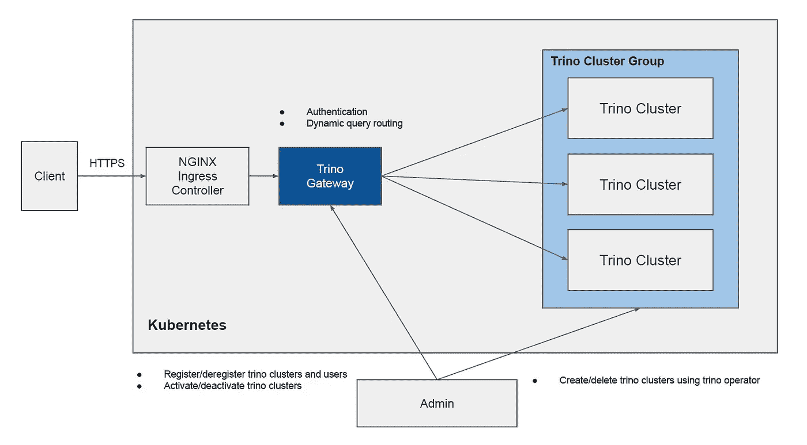

# 使用 trino 网关动态路由 Trino 查询

> 原文：<https://itnext.io/route-trino-queries-dynamically-using-trino-gateway-9772d62b1630?source=collection_archive---------2----------------------->


萨姆·莫格达姆·卡姆西在 [Unsplash](https://unsplash.com?utm_source=medium&utm_medium=referral) 上拍摄的照片

Trino 是一个流行的查询引擎，用于查询数据仓库中的数据。

假设只有一个由许多节点组成的大型 trino 集群，但是这样一个大型 trino 集群对于一些组织来说可能会有问题。Trino 可用于 ETL 工作负载和交互式查询。当 ETL 工作负载已经使用了这么大的 trino 集群的所有资源时，就没有执行交互式查询的空间了，否则交互式查询会变得更慢。

要解决这个问题，可以使用 Trino Gateway。我们可以分别为 ETL 工作负载和交互式查询创建 trino 集群，然后可以使用 trino gateway 将 trino 查询动态路由到下游 trino 集群。

在这里，我将展示如何创建这样的 trino 网关，以使用我已经编写的开源的[数据烘烤器 Trino 网关](https://github.com/cloudcheflabs/dataroaster/tree/master/trino-ecosystem/trino-gateway)和[数据烘烤器 Trino 操作符](https://github.com/cloudcheflabs/dataroaster/tree/master/operators/trino)动态地路由 Trino 查询。

# Trino 网关架构



*   `Admin`使用 trino 操作符创建和删除 trino 集群，如[数据烘烤器 Trino 操作符](https://github.com/cloudcheflabs/dataroaster/tree/master/operators/trino)。
*   在 kubernetes 上创建 trino 集群后，`Admin`向`Trino Gateway`注册 trino 集群和用户，以将 trino 查询路由到注册的 trino 集群。
*   `Admin`可以禁用查询不会路由到的 trino 集群。在停用 trino 集群时，可以修改后端 trino 集群的配置，并可以升级后端 trino 集群。我们可以考虑这样优雅地关闭 trino 集群。首先停用 trino gateway 中的 trino 集群，这样查询就不会被路由，然后监视 trino 集群中当前执行的查询。在 trino 集群中执行完所有查询后，可以关闭 trino 集群或将其升级到新版本。
*   当客户端发送查询时，`Trino Gateway`将首先对用户进行身份验证，并找到用户所属的集群组，查询将被路由到随机选择的属于该集群组的下游 trino 集群。

# 安装 Trino 网关

要让客户端通过 TLS 访问 trino trino gateway，需要先安装 nginx 入口控制器和 cert-manager。

## 安装 NGINX 入口控制器

```
helm repo add ingress-nginx https://kubernetes.github.io/ingress-nginx
helm repo update

## create namespace.
kubectl create namespace ingress-nginx;

helm install \
--namespace ingress-nginx \
ingress-nginx \
ingress-nginx/ingress-nginx \
--version 4.0.17;
```

## 安装证书管理器

```
helm repo add jetstack https://charts.jetstack.io
helm repo update

helm install cert-manager \
jetstack/cert-manager \
--namespace cert-manager \
--create-namespace \
--version v1.5.3 \
--set installCRDs=true;
```

因为我们将使用加密证书来支持 TLS，所以为它创建一个颁发者。

```
## for production.
cat <<EOF > prod-issuer.yaml
apiVersion: cert-manager.io/v1
kind: ClusterIssuer
metadata:
  name: letsencrypt-prod
spec:
  acme:
    server: https://acme-v02.api.letsencrypt.org/directory
    email: mykidong@gmail.com
    privateKeySecretRef:
      name: letsencrypt-prod
    solvers:
    - http01:
        ingress:
          class: nginx
EOF

kubectl apply -f prod-issuer.yaml;
```

## 将入口主机名添加到公共 dns 服务器

Trino gateway 有两个用于代理和管理 REST API 的服务。例如，为了通过 TLS 将两个服务公开为入口，我们需要注册公共 dns 服务器的入口主机名。

```
trino-gateway-proxy-test.cloudchef-labs.com ---> 146.56.150.205
trino-gateway-rest-test.cloudchef-labs.com  ---> 146.56.150.205
```

，其中`146.56.150.205`是 nginx 服务的外部 ip。检查 nginx 服务的外部 ip，并设置正确的 ip。用您的主机名替换这些主机名。

这些主机名将用于创建下面 trino gateway 的入口。

## 安装 Trino 网关

```
helm repo add dataroaster-trino-gateway https://cloudcheflabs.github.io/trino-gateway-helm-repo/
helm repo update

helm install \
trino-gateway \
--create-namespace \
--namespace trino-gateway \
--version v1.6.0 \
--set ingress.proxyHostName=trino-gateway-proxy-test.cloudchef-labs.com \
--set ingress.restHostName=trino-gateway-rest-test.cloudchef-labs.com \
--set trino.proxy.publicEndpoint="https://trino-gateway-proxy-test.cloudchef-labs.com" \
--set dataroastermysql.storage.storageClass=oci \
--set redis.global.storageClass=oci \
--set redis.replica.replicaCount=1 \
dataroaster-trino-gateway/dataroaster-trino-gateway;
```

*   `ingress.proxyHostName`和`ingress.restHostName`需要替换为上面 dns 的注册主机名。
*   `trino.proxy.publicEndpoint`是公共端点，trino 客户端可以连接到该端点来运行查询。
*   `dataroastermysql.storage.storageClass`哪一个是依赖关系 mysql 的存储类，需要修改以适应您的 kubernetes 集群。
*   `redis.global.storageClass`和`redis.replica.replicaCount`分别是依赖 redis 存储类和副本计数。

确保证书已成功创建。

```
kubectl get certificate -n trino-gateway;
NAME                                              READY   SECRET                                            AGE
trino-gateway-proxy-test.cloudchef-labs.com-tls   True    trino-gateway-proxy-test.cloudchef-labs.com-tls   46s
trino-gateway-rest-test.cloudchef-labs.com-tls    True    trino-gateway-rest-test.cloudchef-labs.com-tls    46s
```

# 使用 Trino 操作器安装 Trino 集群

要创建 trino 集群，使用 trino 操作符有一个简单的方法。

## 安装 Trino 操作器

```
helm repo add dataroaster-trino-operator [https://cloudcheflabs.github.io/trino-helm-repo/](https://cloudcheflabs.github.io/trino-helm-repo/)
helm repo updatehelm install \
trino-operator \
--create-namespace \
--namespace trino-operator \
--version v2.1.6 \
dataroaster-trino-operator/dataroastertrinooperator;
```

## 使用自定义资源创建 trino 集群

创建 trino 集群的自定义资源，例如`cluster-1.yaml`。

```
apiVersion: "trino-operator.cloudchef-labs.com/v1beta1"
kind: TrinoCluster
metadata:
  name: trino-cluster-etl         # (1)
  namespace: trino-operator
spec:
  namespace: trino-cluster-etl    # (2)
  serviceAccountName: trino
  image:
    repository: trinodb/trino
    tag: "384"
    imagePullPolicy: IfNotPresent
    imagePullSecrets: null
  securityContext:
    runAsUser: 1000
    runAsGroup: 1000
  coordinator:
    resources: null
    nodeSelector: null
    affinity: null
    tolerations: null
    configs:
      - name: node.properties
        path: /etc/trino
        value: |
          node.environment=production
          node.data-dir=/data/trino
          plugin.dir=/usr/lib/trino/plugin
      - name: config.properties
        path: /etc/trino
        value: |
          coordinator=true
          node-scheduler.include-coordinator=false
          http-server.http.port=8080
          query.max-memory=4GB
          query.max-memory-per-node=1GB
          memory.heap-headroom-per-node=1GB
          discovery-server.enabled=true
          discovery.uri=http://localhost:8080
      - name: jvm.config
        path: /etc/trino
        value: |
          -server
          -Xmx8G
          -XX:+UseG1GC
          -XX:G1HeapRegionSize=32M
          -XX:+UseGCOverheadLimit
          -XX:+ExplicitGCInvokesConcurrent
          -XX:+HeapDumpOnOutOfMemoryError
          -XX:+ExitOnOutOfMemoryError
          -Djdk.attach.allowAttachSelf=true
          -XX:-UseBiasedLocking
          -XX:ReservedCodeCacheSize=512M
          -XX:PerMethodRecompilationCutoff=10000
          -XX:PerBytecodeRecompilationCutoff=10000
          -Djdk.nio.maxCachedBufferSize=2000000
          -XX:+UnlockDiagnosticVMOptions
          -XX:+UseAESCTRIntrinsics
      - name: log.properties
        path: /etc/trino
        value: |
          io.trino=INFO
      - name: tpch.properties
        path: /etc/trino/catalog
        value: |
          connector.name=tpch
          tpch.splits-per-node=4
      - name: tpcds.properties
        path: /etc/trino/catalog
        value: |
          connector.name=tpcds
          tpcds.splits-per-node=4
  worker:
    replicas: 2
    autoscaler:
      minReplicas: 2
      maxReplicas: 5
      targetCPUUtilizationPercentage: 50
    resources: null
    nodeSelector: null
    affinity: null
    tolerations: null
    configs:
      - name: node.properties
        path: /etc/trino
        value: |
          node.environment=production
          node.data-dir=/data/trino
          plugin.dir=/usr/lib/trino/plugin
      - name: config.properties
        path: /etc/trino
        value: |
          coordinator=false
          http-server.http.port=8080
          query.max-memory=4GB
          query.max-memory-per-node=1GB
          memory.heap-headroom-per-node=1GB
          discovery.uri=http://trino-coordinator-service.trino-cluster-etl.svc:8080   # (3)
      - name: jvm.config
        path: /etc/trino
        value: |
          -server
          -Xmx8G
          -XX:+UseG1GC
          -XX:G1HeapRegionSize=32M
          -XX:+UseGCOverheadLimit
          -XX:+ExplicitGCInvokesConcurrent
          -XX:+HeapDumpOnOutOfMemoryError
          -XX:+ExitOnOutOfMemoryError
          -Djdk.attach.allowAttachSelf=true
          -XX:-UseBiasedLocking
          -XX:ReservedCodeCacheSize=512M
          -XX:PerMethodRecompilationCutoff=10000
          -XX:PerBytecodeRecompilationCutoff=10000
          -Djdk.nio.maxCachedBufferSize=2000000
          -XX:+UnlockDiagnosticVMOptions
          -XX:+UseAESCTRIntrinsics
      - name: log.properties
        path: /etc/trino
        value: |
          io.trino=INFO
      - name: tpch.properties
        path: /etc/trino/catalog
        value: |
          connector.name=tpch
          tpch.splits-per-node=4
      - name: tpcds.properties
        path: /etc/trino/catalog
        value: |
          connector.name=tpcds
          tpcds.splits-per-node=4
```

要创建自定义资源，请像这样运行。

```
kubectl apply -f cluster-1.yaml;
```

要创建第二个和第三个 trino 集群，需要修改`# (1)`、`# (2)`、`# (3)`并保存为另一个 yaml 文件，即`cluster-2.yaml`和`cluster-3.yaml`。举个例子，

*   `# (1)`是在 trino 运算符的名称空间中创建的自定义资源名称。`trino-cluster-etl-2`和`trino-cluster-etl-3`为 2。集群和 3。分别聚类。
*   `# (2)`是将创建 trino 集群的名称空间。`trino-cluster-etl-2`和`trino-cluster-etl-3`为 2。集群和 3。分别聚类。
*   `# (3)`是 trino worker 将注册到的发现 url。`http://trino-coordinator-service.trino-cluster-etl-2.svc:8080`和`http://trino-coordinator-service.trino-cluster-etl-3.svc:8080`为 2。集群和 3。分别聚类。

创建另外两个 trino 集群。

```
kubectl apply -f cluster-2.yaml;
kubectl apply -f cluster-3.yaml;
```

现在已经创建了三个 trino 集群。

例如，`trino-cluster-etl`名称空间中 trino cluster 的已安装资源看起来与此类似。

```
kubectl get all -n trino-cluster-etl
NAME                                     READY   STATUS    RESTARTS   AGE
pod/trino-coordinator-5b565cb97b-7prtd   1/1     Running   0          24h
pod/trino-worker-7cd68f7fd-jpm6c         1/1     Running   0          24h
pod/trino-worker-7cd68f7fd-rf6vx         1/1     Running   0          24hNAME                                TYPE        CLUSTER-IP     EXTERNAL-IP   PORT(S)    AGE
service/trino-coordinator-service   ClusterIP   10.96.35.157   <none>        8080/TCP   24hNAME                                READY   UP-TO-DATE   AVAILABLE   AGE
deployment.apps/trino-coordinator   1/1     1            1           24h
deployment.apps/trino-worker        2/2     2            2           24hNAME                                           DESIRED   CURRENT   READY   AGE
replicaset.apps/trino-coordinator-5b565cb97b   1         1         1       24h
replicaset.apps/trino-worker-7cd68f7fd         2         2         2       24hNAME                                               REFERENCE                 TARGETS         MINPODS   MAXPODS   REPLICAS   AGE
horizontalpodautoscaler.autoscaling/trino-worker   Deployment/trino-worker   <unknown>/50%   2         5         2          24h
```

# 向 trino 网关注册 trino 集群

最后，将 trino 集群和用户注册到 trino gateway，对用户进行身份验证，并将查询动态路由到 trino 集群。

可以看到 trino gateway 支持的[REST API](https://github.com/cloudcheflabs/dataroaster/tree/master/trino-ecosystem/trino-gateway#trino-gateway-rest-api)。

## 创建集群组

```
curl -XPOST \
https://trino-gateway-rest-test.cloudchef-labs.com/v1/cluster_group/create \
-d  "group_name=etl_group";
```

## 注册用户

```
## register user who belongs to the cluster group.
curl -XPOST \
https://trino-gateway-rest-test.cloudchef-labs.com/v1/users/create \
-d  "user=trino" \
-d  "password=trino123" \
-d  "group_name=etl_group";
```

## 注册 trino 集群

我们需要为之前创建的 trino 集群注册三个 trino 协调器服务。

```
# register cluster 1.
curl -XPOST \
https://trino-gateway-rest-test.cloudchef-labs.com/v1/cluster/create \
-d  "cluster_name=etl-trino-cluster-1" \
-d  "cluster_type=etl" \
-d  "url=http://trino-coordinator-service.trino-cluster-etl.svc:8080" \
-d  "activated=true" \
-d  "group_name=etl_group";

# register cluster 2.
curl -XPOST \
https://trino-gateway-rest-test.cloudchef-labs.com/v1/cluster/create \
-d  "cluster_name=etl-trino-cluster-2" \
-d  "cluster_type=etl" \
-d  "url=http://trino-coordinator-service.trino-cluster-etl-2.svc:8080" \
-d  "activated=true" \
-d  "group_name=etl_group";

# register cluster 3.
curl -XPOST \
https://trino-gateway-rest-test.cloudchef-labs.com/v1/cluster/create \
-d  "cluster_name=etl-trino-cluster-3" \
-d  "cluster_type=etl" \
-d  "url=http://trino-coordinator-service.trino-cluster-etl-3.svc:8080" \
-d  "activated=true" \
-d  "group_name=etl_group";
```

有时，您需要停用 trino 集群，该集群应该升级到新版本。为此，只需使用 trino gateway 的停用 rest API[。](https://github.com/cloudcheflabs/dataroaster/tree/master/trino-ecosystem/trino-gateway#update-activated)

# 使用客户端运行查询

Trino 客户端将用于运行对 trino 网关的查询。

## 安装 trino 客户端

```
mkdir -p ~/trino-cli;
cd ~/trino-cli;

curl -L -O https://repo1.maven.org/maven2/io/trino/trino-cli/384/trino-cli-384-executable.jar;
mv trino-cli-384-executable.jar trino
chmod +x trino

./trino --version;
```

## 连接到 trino 网关

```
# user/password: trino/trino123
./trino --server https://trino-gateway-proxy-test.cloudchef-labs.com \
--user trino \
--password --debug;
```

和运行查询。

```
...
trino> select * from tpch.tiny.nation limit 5;
 nationkey |   name    | regionkey |                                                   comment
-----------+-----------+-----------+-------------------------------------------------------------------------------------------------------------
         0 | ALGERIA   |         0 |  haggle. carefully final deposits detect slyly agai
         1 | ARGENTINA |         1 | al foxes promise slyly according to the regular accounts. bold requests alon
         2 | BRAZIL    |         1 | y alongside of the pending deposits. carefully special packages are about the ironic forges. slyly special
         3 | CANADA    |         1 | eas hang ironic, silent packages. slyly regular packages are furiously over the tithes. fluffily bold
         4 | EGYPT     |         4 | y above the carefully unusual theodolites. final dugouts are quickly across the furiously regular d
(5 rows)Query 20220710_150615_00039_532z5, FINISHED, 2 nodes
[http://trino-coordinator-service.trino-cluster-etl.svc:8080/ui/query.html?20220710_150615_00039_532z5](http://trino-coordinator-service.trino-cluster-etl.svc:8080/ui/query.html?20220710_150615_00039_532z5)
Splits: 10 total, 10 done (100.00%)
CPU Time: 0.0s total, 8.33K rows/s,     0B/s, 100% active
Per Node: 0.0 parallelism,   145 rows/s,     0B/s
Parallelism: 0.0
Peak Memory: 760B
0.09 [25 rows, 0B] [290 rows/s, 0B/s] trino> select count(*) from tpch.tiny.nation;
 _col0
-------
    25
(1 row)Query 20220710_150731_00014_kdsmu, FINISHED, 2 nodes
[http://trino-coordinator-service.trino-cluster-etl-3.svc:8080/ui/query.html?20220710_150731_00014_kdsmu](http://trino-coordinator-service.trino-cluster-etl-3.svc:8080/ui/query.html?20220710_150731_00014_kdsmu)
Splits: 10 total, 10 done (100.00%)
CPU Time: 0.0s total, 4.17K rows/s,     0B/s, 75% active
Per Node: 0.0 parallelism,   143 rows/s,     0B/s
Parallelism: 0.1
Peak Memory: 864B
0.09 [25 rows, 0B] [287 rows/s, 0B/s]
...
```

我们已经用三个 trino 集群构建了一个 trino 网关。为了改进我们的 trino 网关，我们需要考虑这样的问题，比如检测查询不应该被路由到的集群的疲惫的 trino 工作者，以及在集群关闭之前执行所有查询的正常关闭。

参见 [Trino Gateway](/trino-gateway-8e654366df5e) 。