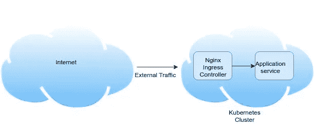
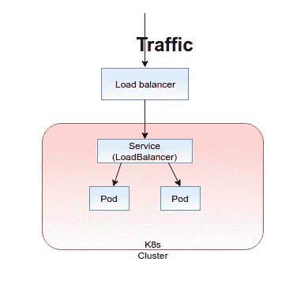
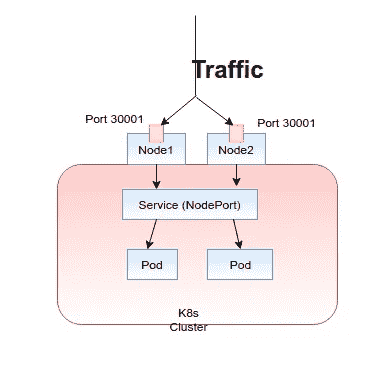
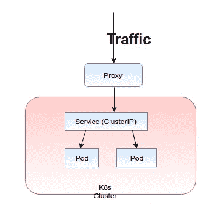
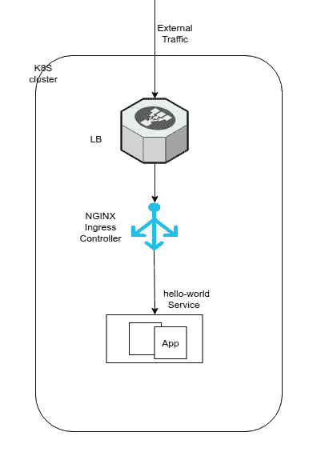

# 将外部流量路由到您的 Kubernetes 服务

> 原文：<https://itnext.io/routing-external-traffic-into-my-kubernetes-services-deb3e872f7bd?source=collection_archive---------0----------------------->

有几种方法可以将互联网流量路由到您的 Kubernetes 集群。然而，在选择正确的方法时，我们需要考虑一些因素，如成本、安全性和可维护性。本文通过考虑以上事实，指导您选择更好的方法将外部流量路由到您的 Kubernetes 集群。



到 Kube 服务的交通流量

在路由外部流量之前，让我们了解一下集群内部的路由机制。在 Kubernetes 中，所有的应用程序都在一个 pod 中运行。pod 是一个容器，它比静态实例有更多的优点。

要访问 pod 中运行的应用程序，应该有一个专门的服务。服务和 pod 之间的映射由“标签选择器”机制决定。下面是一个示例 yaml，它可以用来创建 hello world 应用程序。在那里，您可以清楚地了解“标签选择器”映射。

```
**apiVersion**: apps/v1
**kind**: Deployment
**metadata**:
  **name**: helloworld-deployment
  **labels**:
    **app**: helloworld
**spec**:
  **replicas**: 1
  **selector**:
    **matchLabels**:
      **app**: helloworld
  **template**:
    **metadata**:
      **labels**:
        **app**: helloworld
    **spec**:
      **containers**:
      - **name**: helloworld
        **image**: dockercloud/hello-world
        **ports**:
        - **containerPort**: 80
```

让我们看看如何为上面的 hello world 应用程序创建一个 Kubernetes 服务。在这个例子中，我使用了`**"app:helloworld"**`标签来定义我的应用程序。现在，您需要使用这个“ **helloworld** ”单词作为服务的选择器。然后，只有您的服务确定哪些 pod 由该服务负责。下面是对应于上述应用程序的示例服务，

```
apiVersion: v1
kind: Service
metadata:
  name: "service-helloworld"
spec:
 ** selector:
    app: helloworld**
  type: ClusterIP
  ports:
  - protocol: TCP
    port: 80
    targetPort: 80
```

该规范将创建一个名为“service-helloworld”的新`**Service**`，它的目标是任何带有`**"app:helloworld"**`标签的`**Pod**`上的 TCP 端口 80。

在这里你可以看到上面服务的类型是“ **ClusterIP** ”。这是 Kubernetes 服务的默认类型。除此之外，还有另外两种类型的服务，称为“节点端口”和“负载平衡器”。将流量路由到 Kubernetes 集群的机制将取决于您在定义服务时使用的服务类型。让我们深入了解更多细节。

1.  负载平衡器:使用云提供商的负载平衡器对外公开服务。(例如:在 AWS 中，它将为每个服务创建一个 ELB，将该类型公开为“负载平衡器”。)然后，您可以使用 ELB 的专用 DNS 名称访问该服务。
2.  NodePort:在静态端口公开每个节点 IP 上的服务。您可以通过请求 <nodeip>: <nodeport>连接到集群外部的节点端口服务。这是服务的固定端口，其范围为 30000–32767。</nodeport></nodeip>

3.ClusterIP: ClusterIP 服务是默认的 Kubernetes 服务。在群集内部 IP 上公开服务。选择该值将使服务只能从集群内部访问。但是要向外部公开这些服务，您需要在集群内部部署入口控制器。



考虑到上述服务类型，向集群外部公开服务的最简单方法是使用“负载平衡器”服务类型。但是这些云负载平衡器是要花钱的，默认情况下，每个负载平衡器 Kubernetes 服务都会创建一个单独的云负载平衡器。因此，这种服务类型非常昂贵。如果为您在 k8s 集群中创建的每个服务创建一个单独的 ELB(如果集群在 AWS 中),您能承受这样的部署成本吗？



我们的下一个选择是“节点端口”服务类型。但是选择节点端口作为服务类型由于几个缺点而有一些缺点。因为根据设计，它绕过了 Kubernetes 集群提供的几乎所有网络安全性。它从 30000–32767 范围内动态分配一个端口。因此，不能使用 80、443 或 8443 等标准端口。由于这种动态分配，您不知道预先分配的端口。您需要在创建服务后检查分配的端口，在大多数主机上，您需要在创建服务后在防火墙中打开相关端口。



最后也是最推荐的将流量路由到 Kubernetes 服务的方法是“ClusterIP”服务类型。使用“ClusterIP”的唯一缺点是，如果不使用代理，就无法从集群外部调用服务。因为默认情况下，“ClusterIP”只能由它自己的 Kubernetes 集群中的服务访问。让我们讨论一下如何获得 Kubernetes ingress 控制器的帮助，将 ClusterIP 服务公开到网络外部。

下图说明了通过 Kubernetes 入口控制器流向 ClusterIP 服务的流量的基本架构。



如果您在 Kubernetes 集群中部署了多个服务，我推荐使用上面的方法，因为它有几个优点。

1.  入口使您能够配置控制外部流量到服务的路由的规则。
2.  您可以在 Nginx 入口控制器级别处理 SSL/TLS 端接。
3.  你可以得到 URI 重写的支持。

当您需要提供对 Kubernetes 服务的外部访问时，您需要创建一个定义连接规则的入口资源，包括 URI 路径和支持服务名称。然后，入口控制器自动配置前端负载平衡器来实施入口规则。

在本系列的第 2 部分中，让我们使用 helm 在您的 Kubernetes 集群中部署上述部署。

干杯！！！