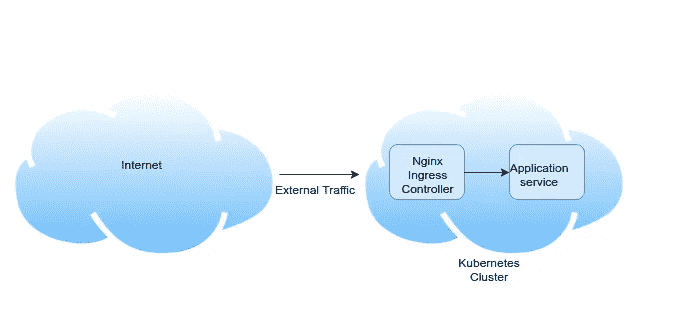
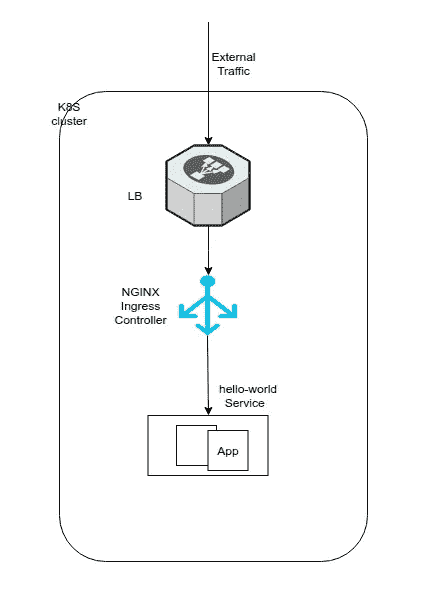
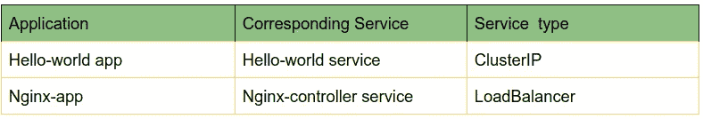
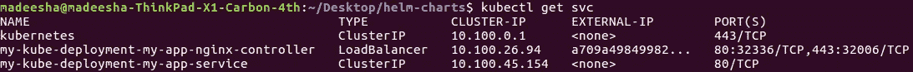
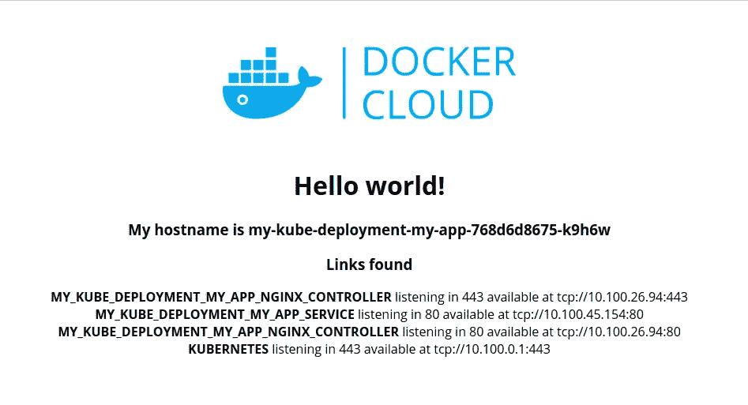

# 将外部流量路由到您的 Kubernetes 服务(第 2 部分)

> 原文：<https://itnext.io/routing-external-traffic-into-your-kubernetes-services-part-2-7d1289178671?source=collection_archive---------3----------------------->



在本文的第 1 部分中，我解释了将外部流量路由到 Kubernetes 集群的三种可能方式。在那里，我向您展示了将 ClusterIP 作为应用程序的服务类型的好处。现在，我将向您展示如何使用 Nginx 代理将流量路由到 CuslterIP 服务。

让我们使用 helm 图表在您的 Kubernetes 集群中部署以下部署。如果你不熟悉 helm，请在阅读本文其余部分之前参考这个[博客](https://medium.com/@madeeshafernando/deploying-to-kubernetes-using-helm-313af95eadf2)。



Helm 是 Kubernetes 的包管理器，它允许您使用一个“helm install”命令来部署上述部署。

在执行以下步骤之前，请确保您已经拥有从您的机器对 k8s 集群的“kubectl”访问权限，并在其中安装 helm。然后，您可以执行以下步骤，

```
1\. git clone [https://github.com/madeesha/helm-charts.git](https://github.com/madeesha/helm-charts.git)2\. cd helm-charts/3\. helm init4\. helm install --name my-kube-deployment .
```

如果部署成功，您将能够在终端中看到下面的输出。

```
NAME: my-kube-deployment
LAST DEPLOYED: Fri Jun 28 14:25:12 2019
NAMESPACE: default
STATUS: **DEPLOYED
........................**
```

> **注意:**如果你在运行 helm init 命令时遇到以下错误，请使用[博客](https://medium.com/@madeeshafernando/error-release-name-failed-namespaces-default-is-forbidden-user-99b3b6cb2720)中提到的步骤来修复。
> 
> "错误:释放 nginx-ingress 失败:命名空间" default "被禁止:用户" system:service account:kube-system:default "无法在命名空间" default "中的 API 组""中获取资源" namespaces " "

现在，您已经使用[舵图](https://github.com/madeesha/helm-charts.git)在 k8s 集群中成功创建了以下资源，



这里我们只将 Nginx 服务公开为负载平衡器服务类型，而 Hello-world 应用程序公开为 ClusterIP 服务。我们现在将从 Nginx 访问这个 ClusterIP 服务。同样，我们可以使用 ClusterIP 服务类型公开集群中的多个应用程序，并使用相同的 Nginx 主机名访问它们。一旦你浏览了 helm repo[https://github.com/madeesha/helm-charts.git](https://github.com/madeesha/helm-charts.git)中的所有 YAML 模板文件，你就可以对部署有一个清晰的想法。让我们看看如何从 web 浏览器访问上面的 hello-world 应用程序。

如果使用“kubectl get svc”命令检查集群中部署的服务，可以看到下面的输出。



如上所示,“my-kube-deployment-my-app-service”的服务类型是 ClusterIP。现在，我们将通过 Nginx 负载平衡器来访问这个 ClusterIP 服务，我们已经使用 helm 创建了这个负载平衡器。因为正如我在本系列的第 1 部分中提到的，如果没有代理，就不能从 web 浏览器直接访问 ClusterIP 服务。在这种情况下，我们的代理是 Nginx 负载平衡器。

执行下面的命令来获得你的 Nginx 负载平衡器的主机名。因为我们将从这个 Nginx 主机名访问我们所有的 Kubernetes 服务。

```
kubectl get svc my-kube-deployment-my-app-nginx-controller -o yaml
```

这将给出如下带有 nginx-hostname 的输出，(注意，这里我使用 AWS 作为我的云提供商，因为当公开 nginx-service 作为负载平衡器服务类型时，它已经创建了一个 AWS ELB)

```
............
status:
  loadBalancer:
    ingress:
    - hostname: **a709a4984998211e9b3780a6f8db7040-700681555.us-west-2.elb.amazonaws.com**
```

现在，您可以在您最喜欢的浏览器中使用此 URL 来访问我们的 hello-world 应用程序，它会在您的浏览器中给出以下输出。



现在，您可以尝试对 Nginx 入口控制器进行相关的配置更改，以访问 Kubernetes 集群中的多个应用程序。

干杯！！！