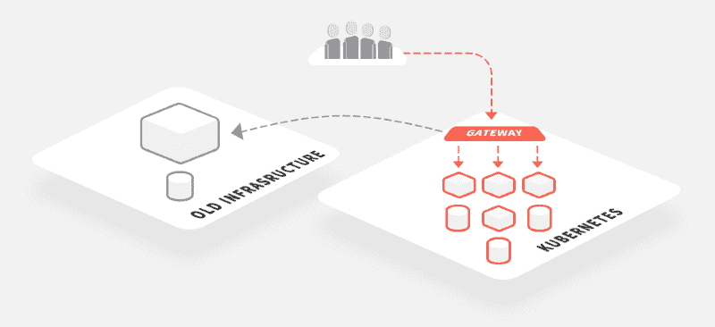
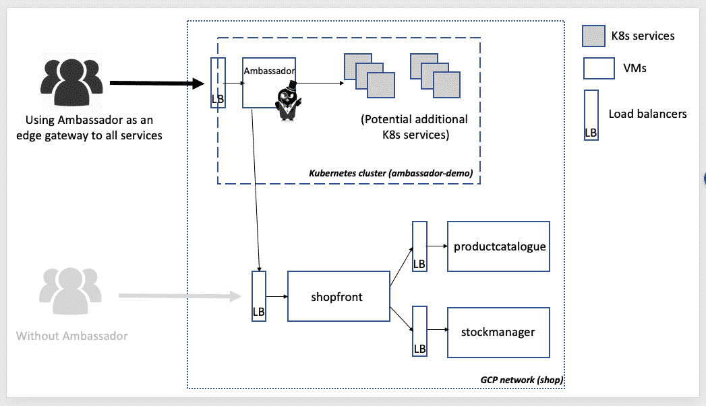
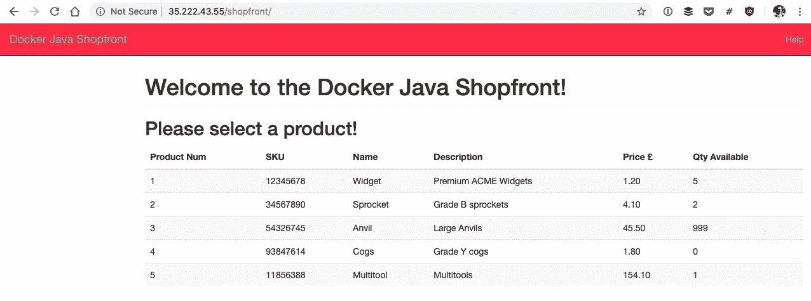

# 使用 Ambassador API 网关从 Kubernetes 路由到外部虚拟机:一个地形改造的游乐场

> 原文：<https://itnext.io/routing-from-kubernetes-to-external-vms-using-the-ambassador-api-gateway-a-terraformed-playground-4faead9b021d?source=collection_archive---------5----------------------->

在 [Datawire](https://www.datawire.io) ，我们看到越来越多的组织迁移到围绕 Docker 和 Kubernetes 构建的“下一代”云原生平台。然而，这种迁移不会在一夜之间发生。相反，我们看到多平台数据中心和云环境的激增，其中应用程序跨越虚拟机和容器。在这些数据中心中，[大使 API 网关](https://www.getambassador.io/)被用作中心入口点，整合[认证](https://www.getambassador.io/concepts/auth-overview)、[速率限制](https://www.getambassador.io/user-guide/rate-limiting)以及其他跨领域的运营问题。

本文是关于如何在将应用程序增量迁移到 Kubernetes 时使用 Ambassador 作为多平台入口解决方案的系列文章的第一篇。我们已经向 [Ambassador Pro 参考架构](https://github.com/datawire/pro-ref-arch) GitHub repo 添加了示例 Terraform 代码，该架构支持在谷歌云平台上创建多平台“沙盒”基础设施。这将允许您启动一个 Kubernetes 集群和几个虚拟机，并练习将流量从 Ambassador 路由到现有应用程序。

# 多平台世界中的边缘路由

我以前写过关于使用[边缘代理或网关](/using-api-gateways-to-facilitate-your-transition-from-monolith-to-microservices-c08fe3489237)来帮助从整体到微服务的迁移，或者从内部到云的迁移。Ambassador 可以作为所有类型平台的 API 网关或边缘路由器，虽然它是专门为 Kubernetes 设计和构建的，但配置从集群到外部网络目标的流量路由是很简单的，例如 VPN 或虚拟专用云(VPCs)内的端点、云服务、云负载平衡器或单个虚拟机。如果您可以通过网络访问端点，那么 Ambassador 可以路由到它。



我们的[Ambassador Pro Reference Architecture](https://github.com/datawire/pro-ref-arch)GitHub repo 包含几个文件夹，提供文档和示例，帮助您了解如何最好地使用 Ambassador 支持的所有功能，如速率限制和分布式跟踪。还有一个“云基础设施”文件夹，其中包含必要的 Terraform 代码和脚本，以使用谷歌云平台(GCP)构建一个示例多平台 VM / Kubernetes 基础设施。生成的基础架构堆栈如下所示:



# 构建一个示例 VM / Kubernetes 平台

大使参考架构报告中提供的地形改造基础设施示例将在 GCP 创建一个简单的区域网络，在(可公开寻址的)负载平衡器后部署一个 [Kubernetes (GKE)](https://cloud.google.com/kubernetes-engine/) 集群和几个基于虚拟机的服务。部署在虚拟机上的应用程序取自我的“ [Docker Java Shopping](https://github.com/danielbryantuk/oreilly-docker-java-shopping) ”示例**一个非常简单的**电子商务商店，它由两个使用 Spring Boot 的 Java 服务和一个使用 Dropwizard 的 Java 服务组成。

在 Kubernetes 集群中部署 Ambassador 可以简化整个网络的入口，还允许工程团队集中和标准化该网关的管理。网关和网络边缘的集中运营提供了许多好处，例如减少“认证蔓延”和标准化交叉问题的能力，例如 [TLS 终止](https://www.getambassador.io/user-guide/tls-termination/)或基于上下文的传递路由(例如使用[过滤器](https://www.getambassador.io/reference/filter-reference/)基于 HTTP 报头进行路由)和[速率限制](https://www.getambassador.io/user-guide/advanced-rate-limiting)。

克隆参考架构报告后，导航到包含 GCP Terraform 代码的文件夹，您将找到一个[自述文件](https://github.com/datawire/pro-ref-arch/blob/master/cloud-infrastructure/google-cloud-platform/README.md)，其中包含复制我们的配置所需的分步说明。请注意，如果您不在 GCP 免费试用信用范围内，构建这一基础设施将会耗费您的资金:

```
$ git clone [git@github.com](mailto:git@github.com):datawire/pro-ref-arch.git
$ cd pro-ref-arch/cloud-infrastructure/google-cloud-platform
```

一旦您配置好一切并成功运行`terraform apply`(可能需要几分钟才能完成)，上图所示的基础设施将在您的 GCP 帐户中创建完成。你还会看到一些来自 Terraform 的`outputs`，可以用来配置你的本地`kubectl`工具，也可以设置大使。

```
...
Apply complete! Resources: 15 added, 0 changed, 0 destroyed.Outputs:gcloud_get_creds = gcloud container clusters get-credentials ambassador-demo --project nodal-flagstaff-XXXX --zone us-central1-f
shop_loadbalancer_ip_port = 35.192.25.31:80
shopfront_ambassador_config =
---
apiVersion: v1
kind: Service
metadata:
  name: shopfront
  annotations:
    getambassador.io/config: |
      ---
      apiVersion: ambassador/v1
      kind:  Mapping
      name:  shopfront_mapping
      prefix: /shopfront/
      service: 35.192.25.31:80
spec:
  ports:
  - name: shopfront
    port: 80
```

第一个输出名为`gcloud_get_creds`，可以运行它来配置您的本地`kubectl`以指向新改造的 Kubernetes 集群，例如，从上面的输出中，我将在我的本地终端上运行:

```
$ gcloud container clusters get-credentials ambassador-demo --project nodal-flagstaff-XXXX --zone us-central1-f$ kubectl get svc
NAME         TYPE        CLUSTER-IP    EXTERNAL-IP   PORT(S)   AGE
kubernetes   ClusterIP   10.59.240.1   <none>        443/TCP   28m
```

现在，您可以按照[入门](https://www.getambassador.io/user-guide/getting-started/)说明，或者按照自述文件中的快速入门，将 Ambassador 安装到集群中。一旦网关启动并运行，并且您获得了 Ambassador Kubernetes 服务的外部 GCP 负载平衡器 IP，您现在可以部署一个 Ambassador 映射，该映射路由到位于 Kubernetes 集群外部的 GCP 负载平衡器。对于当前的基础设施，我有意保持[网络路由](https://cloud.google.com/vpc/docs/routes)和[防火墙规则](https://cloud.google.com/vpc/docs/firewalls)简单，但是本教程的未来迭代将引入更具挑战性的配置。

名为`shopfront_ambassador_config`的 Terraform 输出提供了 Kubernetes 配置，可以复制粘贴到 YAML 文件中并应用到集群中。然后，您应该能够通过大使 IP 和相关映射(例如:`http://{AMBASSADOR_LB_IP}/shopfront/`)访问虚拟机上运行的店面服务(并与虚拟机上运行的其他上游服务通信)

如果一切顺利，您应该能够在浏览器中看到以下内容:



这仅仅是我们将在未来几个月中展示的一系列教程的开始。我们渴望增加更多的复杂性，例如，创建具有对等 VPC 和更复杂的防火墙规则的网段，并且我们还希望演示如何使用 Kubernetes[external name](https://kubernetes.io/docs/concepts/services-networking/service/#externalname)服务和 Consul Connect 来实现多集群服务网格，以实现完整的端到端 TLS。

当你完成了地形改造基础设施的实验后，不要忘记删除它并清理干净，否则你可能会面临意想不到的 GCP 发票！

```
$ terraform destroy -force
```

# 包扎

本文和相关的多平台数据中心示例旨在帮助工程师将应用程序从虚拟机迁移到 Kubernetes 集群。大使通常被用作整个庄园的中心入口点，这允许整合[认证](https://www.getambassador.io/concepts/auth-overview)、[速率限制](https://www.getambassador.io/user-guide/rate-limiting)以及其他跨领域的运营问题。

我们将继续迭代示例基础架构代码，并计划支持其他云平台，如 Digital Ocean 和 AWS。如果您对云供应商或复杂的路由场景有任何特殊要求，请联系我。

像往常一样，你也可以通过 Twitter([@ getambassadorio](https://twitter.com/getambassadorio))、 [Slack](https://d6e.co/slack) 提出任何问题，或者通过 [GitHub](https://github.com/datawire/ambassador) 提出问题。

*本文原载于* [*getambassador.io 博客*](https://blog.getambassador.io/routing-in-a-multi-platform-data-center-from-vms-to-kubernetes-via-ambassador-47bbe658683c) *。*