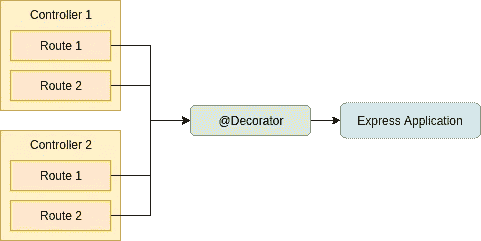
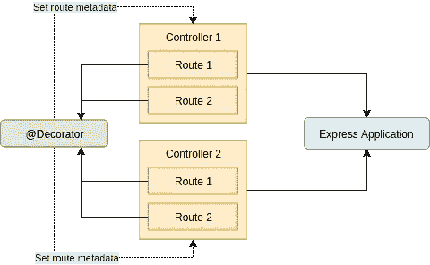

# 为节点应用程序使用类型脚本装饰器进行路由

> 原文：<https://itnext.io/routing-with-typescript-decorators-for-node-applications-41a71f83f582?source=collection_archive---------7----------------------->


在编写 TypeScript 应用程序时，Decorators 可能是一个有用的工具。我喜欢使用它们的一种方式是创建基于节点的 MVC web 应用程序，decorators 为路由提供了一个方便的工具。像这样想一想:

```
[@Controller](http://twitter.com/Controller)('/user')
class UserController {
    [@Route](http://twitter.com/Route)('/')
    public index() {
        // return proper response
    }

    [@Route](http://twitter.com/Route)('/:name')
    public details() {
        // return proper response
    }
}
```

这将提供以`/user`为前缀的路线，而`/user`可能导致用户概述，而`/user/:name`导致用户细节。如果你习惯于 [Symfony 路由](https://symfony.com/doc/current/routing.html)或 [NestJS 控制器](https://docs.nestjs.com/controllers)，这个概念可能看起来很熟悉。

# 介绍

在这篇文章中，我们将使用 [ts-node](https://www.npmjs.com/package/ts-node) 构建一个带有 TypeScript 的 [Express](http://expressjs.com/) 应用程序(这使得运行 TypeScript 应用程序而不必手动编译我们的`.ts`文件成为可能)。

你可以使用任何你想要的底层框架，例如 [koa](https://koajs.com/) 、 [hapi](https://hapijs.com/) 或者甚至是你自己的 http 服务器实现。差异应该仅在实际注册路由时出现，其他一切都应该保持不变。我选择 express 的唯一原因是因为我对它最有经验——但是你可以随意使用你想要的任何东西。

万一你在找一个 TL；DR:你可以在 GitHub 上找到这篇文章的[完整源代码(包括测试)。](https://github.com/nehalist/ts-decorator-routing)

# 体系结构

用 TypeScript 实现路由功能有不同的方法。但是在开始实现之前，记住一些事情是很重要的。

第一个重要信息是:

> Decorators 是在类被声明时调用的，而不是在它被实例化时。

所以当装饰我们的方法时，我们在我们的装饰器中使用实例化的对象。相反，我们只有一个可以使用的类声明。有关装饰工评估订单的详细信息，请参见此处的。

因为装饰者只是函数，他们有自己的作用域。一旦我们意识到 express 的路由注册发生在 decorators 之外，这就有点成问题了:



将我们的路由从装饰器获取到 express 应用程序的一种方法是引入一个注册表类，它将由我们的装饰器填充，并在稍后注册我们的路由时读取。

**但是**有一种更简单的方法，它涉及到 [reflect-metadata](https://github.com/rbuckton/reflect-metadata) 库(如果你在和 decorators 打交道，你可能已经在使用它了)。我们可以简单地将路由附加到控制器元数据，而不是使用单独的层(以注册表的形式):



我们只需将路由保存到控制器元数据中。稍后，当在我们的 express 应用程序中注册我们的路线时，我们已经需要加载我们的控制器——这就是我们简单地读取我们的路线元数据并正确注册它们的地方。

知道了所有这些，让我们开始实现我们的路由装饰器吧！

# 快速申请

首先，我们需要创建我们的 express 应用程序。在我们的第一次迭代中，我们将只提供一条默认路线来测试是否一切正常:

```
// index.tsimport 'reflect-metadata';
import {Request, Response} from 'express';const app = express();app.get('/', (req: Request, res: Response) => {
  res.send('Hello there!');
});app.listen(3000, () => {
  console.log('Started express on port 3000');
});
```

> 每个应用程序只需要导入一次，因此这里是这样做的好地方。

用`ts-node index.ts`启动你的服务器，前往`localhost:3000`接受[奥比万](https://www.youtube.com/watch?v=rEq1Z0bjdwc)的友好问候。

# 控制器装饰器

这个装饰器将被附加到我们的控制器上，并包含这个控制器的前缀:

```
// Decorator/Controller.tsexport const Controller = (prefix: string = ''): ClassDecorator => {
  return (target: any) => {
    Reflect.defineMetadata('prefix', prefix, target);// Since routes are set by our methods this should almost never be true (except the controller has no methods)
    if (! Reflect.hasMetadata('routes', target)) {
      Reflect.defineMetadata('routes', [], target);
    }
  };
};
```

一个非常简单的类装饰器，它在控制器上设置`prefix`元数据，如果没有找到`routes`元数据，就将其设置为一个空数组。如注释中所述，`routes`几乎不应该是`undefined`，除非我们的控制器没有修饰方法。

# 路线装饰者

为每个 HTTP 动词，如`@Get`、`@Post`等，都有一个装饰器会很方便..为了简单起见，我们只实现了`@Get`装饰器:

```
// Decorator/Get.tsimport {RouteDefinition} from '..';export const Get = (path: string): MethodDecorator => {
  // `target` equals our class, `propertyKey` equals our decorated method name
  return (target, propertyKey: string): void => {
    // In case this is the first route to be registered the `routes` metadata is likely to be undefined at this point.
    // To prevent any further validation simply set it to an empty array here.
    if (! Reflect.hasMetadata('routes', target.constructor)) {
      Reflect.defineMetadata('routes', [], target.constructor);
    }// Get the routes stored so far, extend it by the new route and re-set the metadata.
    const routes = Reflect.getMetadata('routes', target.constructor) as Array<RouteDefinition>;routes.push({
      requestMethod: 'get',
      path,
      methodName: propertyKey
    });
    Reflect.defineMetadata('routes', routes, target.constructor);
  };
};
```

> ***重要:*** *重要的是设定我们的目标* `*target.constructor*` *而不仅仅是* `*target*` *来恰当地处理元数据。*

同样，这是一个非常简单的装饰器，它通过一个新的路由来扩展控制器上存储的路由。`RouteDefinition`是定义路线形状的界面:

```
// Model/RouteDefinition.tsexport interface RouteDefinition {
  // Path to our route
  path: string;
  // HTTP Request method (get, post, ...)
  requestMethod: 'get' | 'post' | 'delete' | 'options' | 'put';
  // Method name within our class responsible for this route
  methodName: string;
}
```

> ***提示:*** *如果您想在控制器之前添加一些中间件，最好将其存储在* `*RouteDefinition*` *中。*

现在我们已经得到了我们需要的两个装饰者，可以返回到我们的 express 应用程序来注册我们的路线了。

# 注册路线

在将我们的路由注册到我们的 express 应用程序之前，让我们用新的 decorators 实现一个控制器:

```
// UserController.tsimport {Controller} from '../src';
import {Get} from '../src';
import {Request, Response} from 'express';[@Controller](http://twitter.com/Controller)('/user')
export default class UserController {
  [@Get](http://twitter.com/Get)('/')
  public index(req: Request, res: Response) {
    return res.send('User overview');
  }[@Get](http://twitter.com/Get)('/:name')
  public details(req: Request, res: Response) {
    return res.send(`You are looking at the profile of ${req.params.name}`);
  }
}
```

标题到`/user`应该显示一个“用户概述”信息，而`/user/foobar`应该显示一个“你正在查看 foobar 的个人资料”信息。

但是在这完全起作用之前，我们需要告诉 express 我们的路线——所以让我们回到我们的`index.ts`:

```
import 'reflect-metadata';
import * as express from 'express';
import UserController from './example/UserController';
import {RouteDefinition} from './src';const app = express();app.get('/', (req: express.Request, res: express.Response) => {
  res.send('Hello there!');
});// Iterate over all our controllers and register our routes
[
  UserController
].forEach(controller => {
  // This is our instantiated class
  const instance                       = new controller();
  // The prefix saved to our controller
  const prefix                         = Reflect.getMetadata('prefix', controller);
  // Our `routes` array containing all our routes for this controller
  const routes: Array<RouteDefinition> = Reflect.getMetadata('routes', controller);

  // Iterate over all routes and register them to our express application 
  routes.forEach(route => {
    // It would be a good idea at this point to substitute the `app[route.requestMethod]` with a `switch/case` statement
    // since we can't be sure about the availability of methods on our `app` object. But for the sake of simplicity
    // this should be enough for now.
    app[route.requestMethod](prefix + route.path, (req: express.Request, res: express.Response) => {
      // Execute our method for this path and pass our express request and response object.
      instance[route.methodName](req, res);
    });
  });
});app.listen(3000, () => {
  console.log('Started express on port 3000');
});
```

瞧，就是这样。我们现在可以导航到`/user`或`/user/<name>`，并从我们的快速应用程序中获得适当的响应。*哇呼！*

# 推进这种方法

这是一个非常基本的方法，在实际实现中还有很多改进的空间。下面是一些关于改进这种实现的想法:

# 实例化

我们的控制器用`new controller()`天真地实例化了。但是如果我们的控制器有一些`constructor`参数呢？

这将是一个完美的用例来应用一些[依赖注入，如前一篇文章](https://nehalist.io/dependency-injection-in-typescript/)中所描述的，它将被插入到我们的控制器被实例化的地方。

# 返回值

我不是`res.send()`的狂热粉丝——相反，如果响应可以是反映其内容的简单对象，那会非常方便(想想类似`return new JsonResponse(/* ... */)`的东西)。这可以通过实现这样的响应对象并从我们的方法中返回它们来轻松完成——稍后，当注册我们的路由时，回调仍然会`send`我们的响应:

```
app[route.requestMethod](prefix + route.path, (req: express.Request, res: express.Response) => {
  const response = instance[route.methodName](req, res);
  res.send(response.getContent()); // where `getContent` returns the actual response content
```

这将需要对我们的返回值进行额外的验证，尤其是为了防止 express 由于缺少一个`next()`调用而被阻塞(这个调用包含在`send`中，但是如果您不使用`send`则需要手动调用)。

# 结论

正如您刚刚看到的，通过 TypeScript decorators 处理路由非常简单，不需要太多的魔法，也不需要安装框架或任何额外的库。

一如既往，这篇文章的全部源代码(包括测试)可以在 GitHub 上找到。

*如果你有其他方法来实现这个目标，或者对这篇文章中描述的方法有任何想法，请留下你的评论！*

*如果你喜欢这篇文章，请留下你的👏，关注我上* [*推特*](https://twitter.com/nehalist) *并订阅* [*我的快讯*](https://nehalist.io/newsletter/) *。原载于 2019 年 4 月 2 日*[*nehalist . io*](https://nehalist.io/routing-with-typescript-decorators/)*。*