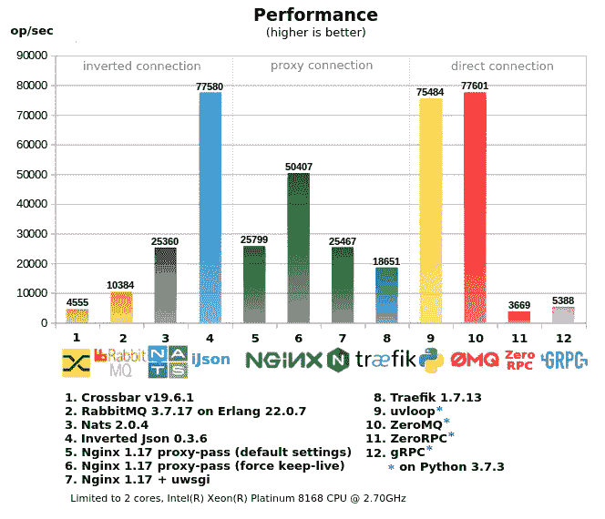
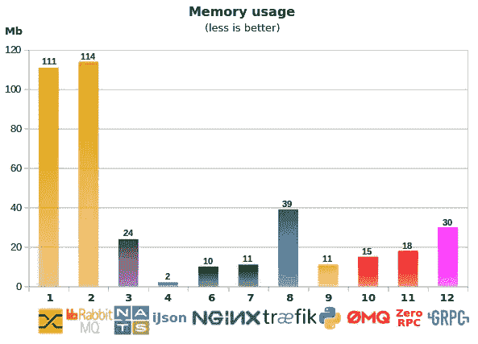
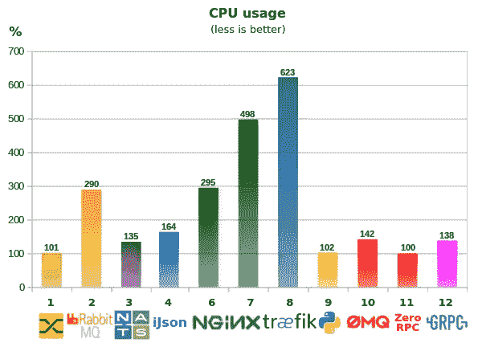
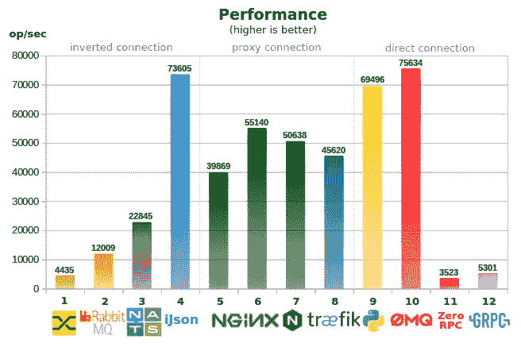

# RPC 基准测试(和反向 Json)

> 原文：<https://itnext.io/rpc-benchmark-and-inverted-json-b5ce0bf587be?source=collection_archive---------1----------------------->



内存使用、CPU 使用和多核测试

*更新于 2019-12-17*

**简而言之**:使用传统的 MQ 进行同步 RPC 调用是无效的，它会降低性能并带来副作用，你必须处理这些问题。
**Inverted Json** 是一个轻量级的作业服务器，它让你做 RPC 调用而没有副作用(一个客户端和一个工作器通过 Inverted Json 连接来传输数据)，它提供更高的性能(比通过 RabbitMQ 快 7 倍)，它通过 http 工作，所以你可以使用任何 http-客户端甚至从控制台 curl。
倒 Json 支持 RPC、MQ、PubSub 等。

# 1.基准

所有服务器/工具分为 3 类:

*   **“直接连接”** —当客户端直接连接到工作机时，如果有大量服务，这是一种成本更高的配置方式，所有客户端都应该知道所有需要的工作机(ip 和端口)，但通常会产生最小的网络开销。
*   **“代理连接”** —是一种单点访问方式，客户端可以很简单，但工作人员端仍不容易配置:分配和转发端口，注册代理，配置防火墙更复杂，因此有时需要使用一些额外的工具来控制所有这些事情。
*   **“反向连接”** —是客户端和工作人员的单点访问(可以是 ESB)，这是一种更简单的配置方式。
*   CPU 和内存使用情况取自 *`docker stats`*
*   "*双核测试"*将服务器和客户端与不同内核的工作人员分开，以减少相互影响，因此使用 taskset 将服务器限制在 2 个内核内(多核测试不受限制)
    以下是关于基准测试的一些想法。

# 2.MQ 与 RPC

尽管这两种方式是不同的，有时前者被用来代替后者，反之亦然，如果你试图找到一种规范的哪一个和什么时候使用它，它可以看起来像这样:

*   **RPC**(sync call)——当客户端需要立即响应(短时间内)，当客户端正在等待时，工作人员应该响应，如果客户端离开(超时)，则不再需要响应(这就是为什么不需要保留请求，它通常在 MQ 中是如何工作的)
    例如，当您对数据库执行一些请求/查询时，您执行 RPC，并且您不想为此使用 MQ。
*   **MQ** (异步调用)——不需要响应的时候(至少不是立即)，当你想最终完成一个任务，或者只是传输一个数据的时候。例如，它可以用于邮寄。

# 3.RPC over RabbitMQ

RabbitMQ 常用于 RPC，但是由于其他 MQ 系统有一些开销，因此它不能提供最佳性能。如果您使用 MQ，您需要“清理”队列，例如，如果一个工作者变得不可用，当它再次活动时，它可以接收许多过期的任务，并且当客户端超时时，任务仍然在队列中。

对于客户端响应的队列来说也是一样，如果一个客户端在一个工作器响应之前就离开了，那么它将保留响应，您需要“清理”它。虽然在 RabbitMQ 中你可以关闭一个客户端的队列，但是在这种情况下，性能会严重下降(慢 10-20 倍)。

您还需要 ping 一个工人，以确定工人是否还活着。除此之外，在 RPC 系统中，当数据只是被传输到一个工作器并返回时，MQ 花费资源来处理队列和消息。

# 4.倒置 Json

有很多 MQ 系统，但没有像 Gearman/Crossbar 这样多的 RPC/作业服务器——这是一个很小的选择，所以这就是为什么开发人员选择 MQ 用于 RPC。
这就是 inverted Json 被创建的原因，它是用 **C/C++** 和 **epoll** ，路由的有限状态自动机，Json 的流解析器，切片代替字符串*等构建的。为了更好的性能

**对于 RPC(同步调用)，Inverted Json 优于 RabbitMQ 的优势**

*   不需要清理过期邮件队列
*   您不必 ping 一个工作线程，如果一个工作线程失败(在 keepalive 模式下)，客户端会立即收到错误 502
*   API 更加简单和紧凑——仅仅是 http 请求(并且所有流行的语言和框架都支持它)
*   工作速度更快，使用的资源更少
*   更简单的方式发送命令到某个工人(例如，如果有几个相似的工人，你可以在标题中设置“工人 id”)

**关于倒置 Json 的其他信息**

*   反向 Json 支持 RPC、MQ、发布-订阅、优先级、定制工人
*   你可以发送二进制数据(不仅仅是 json，从名字上就可以看出来)
*   如果 worker 在 keep-alive 模式下工作，请求不需要 Id ,反向 Json 只是将客户机和 worker 相互连接起来
*   一个工人可以注册多个任务，并注册模式(如 *`/command/*`* ),而不会损失性能
*   Docker 镜像只是 **2.6Mb** (超薄版)
*   Inverted Json 的核心只有大约 1400 行代码(v0.3)，更少的代码——更少的 bugs)
*   反向 Json 从不改变请求体，它是按原样传输的

# 5.3 分钟内试试倒 Json

如果你有 **Docker** 和 **curl** ，你现在就可以尝试**倒 Json** :


**1。**通过 docker 在端口 8001 上运行反向 Json(可以选择任意一个)，— log 47 是一个用于记录传入请求和一些重要事件的掩码:

```
$ docker run -it -p 8001:8001 lega911/ijson --log 47
```

**2。**为任务**“calc/sum”**注册一个工人，并获取一个任务(请求类型“get”):

```
$ curl localhost:8001/calc/sum -H 'type: get'
```

**3。**一个客户端调用**“计算/求和”**:

```
$ curl localhost:8001/calc/sum -d '{"id": 15, "data": "2+3"}'
```

**4。**worker 收到 task *`{"id": 15，" data": "2+3"}`* ，现在发送相同 id 的响应(请求类型" result "):

```
$ curl localhost:8001 -H 'type: result' -d '{"id": 15, "result": 5}'
```

…客户端按原样接收响应 *`{"id": 15，" result": 5}`*

**5.1。JsonRPC**
JsonRPC 2 并不完全受支持，但是客户端可以发送类似

```
`{"jsonrpc": "2.0", "method": "calc/sum", "params": [42, 23], "id": 1}` on `/rpc/call`
```

并且可以接收如下错误

```
`{"jsonrpc": "2.0", "error": {"code": -32601, "message": "Method not found"}, "id": null}`
```

我不知道它有多受欢迎，但将来它可以改进。

**5.2。客户端和工作者的 Python 示例**

[这里是“工人模式”的示例](https://github.com/lega911/ijson/tree/master/example/worker_mode)，它更具性能和紧凑性。

# 6.关于基准的一些想法

*   **Crossbar.io** :基于 Python，所以没那么快，不能用多核(因为 GIL)
*   **RabbitMQ** : RPC over MQ，所以它有一些上面描述的开销，如果 RabbitMQ 过载(例如，如果您启动+2 个测试客户端),性能也会迅速下降
*   **Nats** :性能不错，虽然不如倒 Json，但也会有类似“清理”通道等问题。
*   **Inverted Json** :达到了此服务器的网络限制(在独立的内核上启动此测试用例的 2 个副本并不能产生更好的结果)，在代理系统中最低的内存和 cpu 使用率(关于性能)。
*   Nginx proxy-pass:如果有很多小请求，性能会迅速下降(测试中没有显示)，显然 linux 不允许在短时间内打开/关闭这么多套接字，所以最好使用 keep-alive(这不是默认模式)
*   Traefik :使用大量 CPU(多核测试中 600%)，比 nginx 慢一点
*   uvloop(用于 asyncio) :提供非常好的性能，因为主要部分是用 C/C++编写的，它比用于 RPC 的 ZeroMQ 要好
*   **ZeroMQ**:worker 本身是用 Python (GIL)编写的，所以它不能使用 1 个以上的内核，虽然在测试中它使用了超过 100%的内核，因为 ZeroMQ 库是在 C/C++上(并且不使用 GIL)
    它提供了良好的性能，但另一方面，如果 worker 将比“a+b”更复杂，任何额外的代码都会降低性能，因为它会更早达到 1 个内核的限制。
*   **ZeroRPC** :声明为 ZeroMQ 上的轻量级包装器，实际上 ZeroMQ 的性能损失了 95%，所以看起来不那么轻量级。
*   **GRPC** :产生大量样板 python 代码，快到了单核极限。所以 GRPC 可能对网络有利，但对 Python 不利。
*   双核与多核测试:
    在多核测试中，服务器、客户端和工作人员共享公共资源(CPU)，因此某些结果比双核测试中的少。
    另一方面，使用 2 个以上内核的服务器表现更好，例如 Traefik 使用了 600%的 CPU。

# 7.结论

如果你在一家有许多开发人员的大公司工作，那么处理不同的复杂系统来组织直接连接以获得最佳性能是可以的。
但是对于需要用微服务解决不同任务的小团队来说，**倒 Json** 可以节省你的时间和资源。

为了改进倒 Json，我想支持 pub-sub 和其他有趣的想法。
如果你认为这可能是一个有趣的项目或者只是想帮助一个作者，你可以在[github](https://github.com/lega911/ijson)([https://github.com/lega911/ijson](https://github.com/lega911/ijson))上开始这个项目，谢谢。

你用什么做 RPC(同步调用)？

**PS:**

*   用 test 创建这篇文章花费的时间比创建反向 Json 本身还要多。
*   反向 Json 的原型也是用 1) Python + asyncio + uvloop 和 2) **GoLang** 创建的
*   测试由不同的开发人员进行评审。
*   “切片代替字符串”，在大多数解析 http/json 等的情况下，不使用字符串，而是使用指向源代码的指针，这样可以避免分配和复制/粘贴内存。
*   不要用 python-requests 做基准测试——它非常慢，pycurl 好得多，我用这个包装器做测试
*   所有测试都在这里[https://github . com/lega 911/ijson/tree/master/example/benchmark](https://github.com/lega911/ijson/tree/master/example/benchmark)
*   项目来源[https://github.com/lega911/ijson](https://github.com/lega911/ijson)