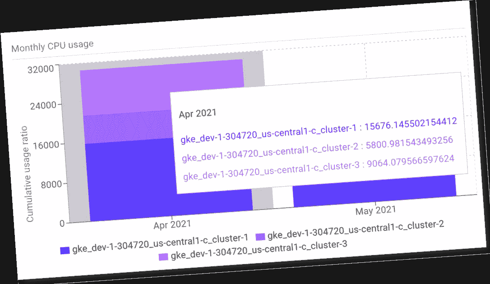

# RRDtool + Prometheus —优化聚合指标的性能和存储效率

> 原文：<https://itnext.io/rrdtool-prometheus-optimizing-the-storage-and-the-query-performance-for-aggregated-metrics-69986bb8cb1b?source=collection_archive---------6----------------------->

## 利用旧的东西让现代变得更好

RRDtool 是一个开创性的时间序列数据库和监控系统。自 1999 年以来一直存在。然而，随着监控生态系统中连续的技术炒作，该工具不为许多监控专业人员所知，也没有得到应有的重视，尽管它的强大功能在当今普罗米修斯驱动的可观测性世界中非常有用。在本文中，我们介绍了一种设计方法，其中 RRDtool 用于优化 Prometheus 的聚合指标管理。更具体地说，我们将展示这种方法如何允许我们减少 Prometheus 服务器上的存储，同时在可视化之前提高查询的性能和可伸缩性。



来自 [Krossboard](https://krossboard.app/) 的截图——一个 Kubernetes 使用分析工具，利用了下文描述的概念。

> 这项工作是一次经验分享，强调了在构建[现在流行的开源 Kubernetes 使用分析工具](https://medium.com/swlh/bringing-prometheus-metrics-and-grafana-dashboard-for-cost-allocation-on-kubernetes-clusters-1ee7f68cd677)时所做的设计决策。

# 介绍

在当今的云原生计算世界中，[可观察性](https://radar.cncf.io/2020-09-observability)是监控生产中应用和服务运行的基础构件。可观察性的核心促成因素之一是收集与被监控的应用程序和服务相关的指标的能力。在这种背景下， [Prometheus](https://prometheus.io/) 已经成为一个事实上的标准组件，用于在使用 Grafana 等工具进行可视化之前公开、收集和汇总指标。

在典型的普罗米修斯架构中，每个要监控的组件都由一个[导出器](https://www.metricfire.com/blog/first-contact-with-prometheus/)支持，该导出器向普罗米修斯世界公开指标。然后，Prometheus 服务器定期检查不同的导出器，以收集公开的指标。有时，收集的指标可能需要在可视化之前进行一些聚合；例如，我们的 Prometheus exporters 每隔几分钟就会获得更新的样本，而在可视化方面，我们只需要每小时汇总的指标。这种用例通常适用于像 [kube-opex-analytics](https://rodrigue-chakode.medium.com/kubernetes-resource-usage-analytics-for-cost-allocation-and-capacity-planning-416800e85d16) 这样的分析工具，其中每 5 分钟收集一次原始样本，同时对每小时整合的指标进行可视化。

如上所述，当需要聚合时，人们通常依靠 [PromQL](https://prometheus.io/docs/prometheus/latest/querying/operators/) ( *普罗米修斯查询语言)*在查询时执行聚合。对于给定的时间范围， [PromQL 操作符](https://prometheus.io/docs/prometheus/latest/querying/operators/)支持各种聚合操作(求和、平均、最大、最小等等)。虽然在许多情况下使用这些操作符就足够了，但在某些情况下，这种使用可能会带来一些缺点。

将讨论优化的两个方面:度量样本的存储以及可视化的性能和可伸缩性。

# 缺点和优化

## 高效存储:避免存储无用的指标

为了更好地说明，让我们考虑一个用例，其中指标每 5 分钟收集一次，出于一致性原因，我们只想可视化每小时和每天的整合指标。

在这种情况下，如果所有的 5 分钟样本都暴露在普罗米修斯世界中，那么*我们将需要单个出口者的以下存储容量:每小时 12 个样本，每天 12 * 24 = 288 个样本，每月 288 * 30 = 8640 个样本*。通过考虑每个样本的数据大小、导出者的数量、数据保留期，我们可能会在可视化之前存储和处理大量数据。

相反，如果在 Prometheus world 中只显示每小时合并的指标，*我们将需要每小时存储 1 个样本，每天 24 个样本，每月 24 * 30 = 720 个样本*。很明显，在这种情况下，存储所有的原始样本是没有效率的。也就是说，随着时间的推移，需要原始样本来计算合并的指标，我们应该找到一种策略来本地处理原始样本，同时向 Prometheus 世界公开合并的指标。

这就是 RRDtool 的用武之地。事实上，原始样本可以被收集并注入到 RRD 数据库中，该数据库被专门配置为在内部计算和维护目标粗粒度度量(例如，上述用例中的每小时度量)。

不深入 RRDtool 的更多细节，让我们举一个实现的例子。如下所示，RRD 数据库设置可以配置为保存名为`cpu_usage`的数据源，它以 5 分钟(300 秒)的周期存储原始样本，以生成每小时整合的指标(12 个原始样本的平均值)。这样，通过我们的 Prometheus exporter 的适当实现，我们可以只向 Prometheus exporter 公开每小时的指标，同时在本地维护原始样本。

```
DS:cpu_usage:GAUGE:300:U:U                         RRA:AVERAGE:0.5:12:1
```

## 可视化性能和可伸缩性:避免重复聚合

为了深入性能和可伸缩性方面，让我们假设一旦数据存储在 Prometheus 中，我们将使用 Grafana 进行可视化。如前所述，当需要聚合时，我们通常会在可视化之前使用[普罗米修斯算子](https://prometheus.io/docs/prometheus/latest/querying/operators/)来计算聚合指标。这意味着每次在用户定义的时间段(可视化窗口)内刷新可视化时，都会从 Prometheus 中检索样本，并即时处理以生成整合的指标。

例如，让我们重新考虑我们的初始示例，其中每 5 分钟收集一次原始样本，同时对每小时整合的指标进行可视化(例如，像 [kube-opex-analytics](https://github.com/rchakode/kube-opex-analytics) 所做的那样)。我们还假设我们只有一个 Prometheus exporter，而可视化是在 30 天的滑动窗口上处理的，刷新周期为 15 分钟(即每小时刷新四次)。

在第一次尝试中，如果所有的 5 分钟样本都暴露于普罗米修斯世界，则每次刷新可视化时将查询 *8640 个样本(即每小时 4 次，24 小时 96 次或 30 天 2880 次)。*

在第二次尝试中，通过在本地引入一个 RRD 数据库来维护原始样本，以便仅将每小时合并的指标导出到 Prometheus world，那么每次刷新时将只查询 *720 个样本。*这样做可以显著提高可视化的性能和可伸缩性，这得益于每次刷新可视化时查询和聚集的样本数量的**减少。**

# 结论

在本文中，我们将描述如何使用 RRDtool 来优化 Prometheus world 的聚合指标的处理和展示。我们展示了这种方法如何让我们减少 Prometheus 服务器上的存储，同时提高可视化过程中查询的性能和可伸缩性。

这项工作实际上是从设计和构建 [kube-opex-analytics](https://github.com/rchakode/kube-opex-analytics) 中学到的经验分享，这是一个现在流行的开源 Kubernetes 使用分析工具。部分由于 RRDtool 的强大功能，它最初的概念使得这个工具很快被 Kubernetes 社区所采用。目前，在不到 3 年的时间里，它总共有 330+k 的下载点击量。它甚至包含在商业报价中。