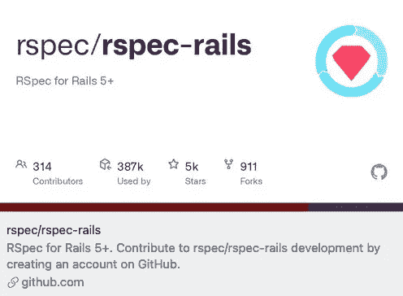

# Rspec 控制器测试与设备:登录和注册

> 原文：<https://itnext.io/rspec-controller-tests-with-devise-testing-sign-in-and-sign-up-665f1b6a04eb?source=collection_archive---------2----------------------->

# **需要宝石**

*   gem 'rspec-rails '
*   gem '工厂 _ 机器人 _ 轨道'
*   宝石'伪造者'

# **设置工厂机器人**

首先创建一个 factory_bot 支持助手

spec/support/factory_bot.rb

接下来，将`require_relative “support/factory_bot`导入`spec/rails_helper.rb`

为示例用户创建一个工厂。

spec/factories.user.rb

# 设置浏览器以执行测试

规范/支持/chrome.rb

# **用 rspec 设置设备**

spec/rails_helper.rb

# 签到

spec/system/sign_in_spec.rb

注销链接最初隐藏在导航栏的下拉菜单后面。`find(‘#user-menu-button’)`选择器打开下拉菜单。

# 签约雇用

spec/system/sign_up_spec.rb

默认用户模型中增加了一个在注册前接受条款和条件的附加字段。