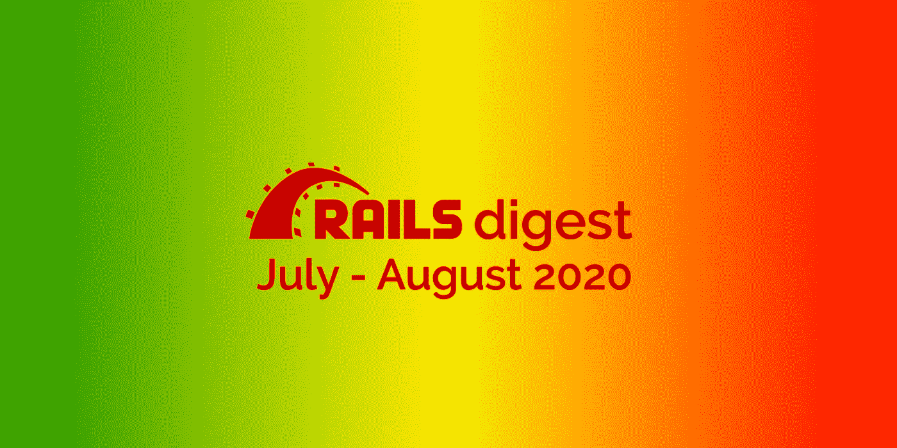

# Ruby on Rails 文摘:2020 年 7 月和 8 月最受欢迎的 26 个库

> 原文：<https://itnext.io/ruby-on-rails-digest-26-most-popular-repositories-in-july-and-august-2020-70ae593a5fe1?source=collection_archive---------4----------------------->

这是更新的 Ruby/Rails 摘要的第二版。正如你们中的一些人所知，我从去年开始就不再制作 Rails 摘要了。但是在六月，我已经正式回到我最喜欢的监测。我决定把七月和八月的文摘放在一起，因为这两个月之间没有什么活动。请欢迎 7 月和 8 月 GitHub 上最流行、最有趣、最有用的 Ruby on Rails 资源库！

我在这里的任务是把今年 7 月和 8 月在 GitHub 上广受开发人员欢迎的所有知名或新开发的 Ruby/Rails 库放在一起。

# 请在 2020 年 7 月和 8 月认识最受欢迎和最有趣的 Ruby/Rails 库:

1.  Grape 是 Ruby 的一个类似 REST 的 API 框架。它旨在通过提供一个简单的 DSL 来轻松开发 RESTful APIs，从而在机架上运行或补充现有的 web 应用程序框架，如 Rails 和 Sinatra。**到现在已经有 9200 名**明星了
2.  [Brakeman](https://github.com/presidentbeef/brakeman) 是一个静态分析工具，检查 Ruby on Rails 应用程序的安全漏洞。到目前为止已经有 5800 位明星
3.  Chartkick 帮助你用一行 Ruby 创建漂亮的 JavaScript 图表。到现在为止已经有 5600 位明星了
4.  [FriendlyId](https://github.com/norman/friendly_id) 是 ActiveRecord 的 slugging 和 permalink 插件的“瑞士陆军推土机”。它允许您创建漂亮的 URL 并使用友好的字符串，就像它们是 ActiveRecord 模型的数字 id 一样。到目前为止已经有 5500 位明星
5.  [React on Rails](https://github.com/shakacode/react_on_rails) 是 React+web pack+Rails+Rails/web packer 的集成，包括 React 的服务器端渲染，支持更好的开发者体验和更快的客户端性能。**现在已经有 4558 位**明星
6.  [通关](https://github.com/thoughtbot/clearance)是用 email &密码的 Rails 认证。它应该是小的、简单的、经过充分测试的。它有自以为是的默认值，但旨在易于覆盖。**3321**星星到现在
7.  [Ancestry](https://github.com/stefankroes/ancestry) 是一个 gem，它允许将 Ruby on Rails ActiveRecord 模型的记录组织成一个树形结构(或层次结构)。它采用物化路径模式，并公开所有标准的树结构关系(祖先、父、根、子、兄弟、后代)，允许在一个 SQL 查询中获取所有这些关系。**3136**星到现在
8.  [counter_culture](https://github.com/magnusvk/counter_culture) 是一款为你的 Rails 应用提供的涡轮增压计数器缓存。**到现在为止已经有 1301 颗**星星
9.  [ROTP](https://github.com/mdp/rotp)(Ruby 一次性密码库)是一个 Ruby 库，用于根据 RFC 4226 和 RFC 6238 生成和验证一次性密码(HOTP & TOTP)。它与谷歌认证器兼容，可用于 Android 和 iPhone 以及任何其他基于 TOTP 的实现。**1217**明星到现在
10.  [TTY::提示符](https://github.com/piotrmurach/tty-prompt)是一个功能强大的交互式命令行提示符。它为 TTY 工具包提供了一个独立的提示组件。**1133**明星到现在
11.  [Squib](https://github.com/andymeneely/squib) 是一个 Ruby DSL，用于原型卡和棋盘游戏。编写一点 Ruby，定义你的卡片组的统计数据，然后将你的游戏编译成一系列图像，准备打印和播放，甚至按需打印。 **833** 明星到现在
12.  MultiJSON 是用于 JSON 处理的通用可交换后端。**第 710 章**星星到了
13.  [Rainbow](https://github.com/sickill/rainbow) 是一种红宝石，用于为 ANSI 终端上的打印文本着色。它提供了一个 string presenter 对象，该对象向字符串添加了几个方法，用于在 ANSI 转义码中包装字符串。 **669** 星星到现在
14.  Restforce 是 Salesforce REST API 的一个 Ruby 客户端。 **643** 明星到现在
15.  TrueMail 是一个可配置的框架无关的普通 Ruby 邮件验证器。通过 Regex、DNS 和 SMTP 验证电子邮件。请确保电子邮件地址有效并且存在。 **548** 明星到现在
16.  [OmniAuth OAuth2](https://github.com/omniauth/omniauth-oauth2) 是一个 gem，包含一个针对 OmniAuth 的通用 OAuth2 策略。它旨在作为其他策略的构建块策略，而不是独立使用(因为它没有收集 uid 和用户信息的固有方法)。**第 404 章**星星到了
17.  [Motion](https://github.com/unabridged/motion) 是一个纯 Ruby 的 Rails 的反应式前端 UI 组件。它允许您使用纯 Ruby 在 Rails 应用程序中构建反应式实时前端 UI 组件。**第 303 章**星星到了
18.  炼油厂 CMS 博客是炼油厂 CMS 的博客引擎。 **299** 明星到现在
19.  [Racecar](https://github.com/zendesk/racecar) 是一个友好且易于接近的 Kafka 消费者框架。它允许您编写处理 Kafka 主题中存储的消息的小应用程序，同时可以选择与您的 Rails 模型集成。 **279** 明星到现在
20.  [Rails::Auth](https://github.com/square/rails-auth) 是一个模块化的基于资源的 Rails/Rack 认证和授权，旨在支持微服务认证和基于声明的身份。 **264** 明星到现在
21.  [Torch.rb](https://github.com/ankane/torch.rb) 是对 Ruby 的深度学习。 **242** 星星到了现在
22.  [电话号码](https://github.com/mobi/telephone_number)是基于 Google 的 libphonenumber 库的全球电话号码验证 gem。 **225** 星星到了现在
23.  Bmg 是一个作为 ruby 库实现的关系代数。它实现了几年前由 Alf 贡献的一等公民范例的关系。 **168** 明星到现在
24.  Bridgetown 是一个 Webpack 感知的、基于 Ruby 的静态站点生成器，适用于现代 Jamstack 时代。Bridgetown 获取您的内容和前端资产，呈现 Markdown 和 Liquid 模板，并导出一个完整的网站，该网站可以由 Netlify 等 Jamstack 服务或 Nginx 等传统 web 服务器提供服务。 **168** 明星到现在
25.  [Gammo](https://github.com/namusyaka/gammo) 为遍历 Gammo 构建的 DOM 树提供了一个纯 Ruby HTML5 兼容的解析器和 XPath 支持。 **147** 星辰到现在
26.  [TTY::Box](https://github.com/piotrmurach/tty-box) 为 [TTY](https://github.com/piotrmurach/tty) 工具包提供盒绘制组件。 **142** 明星到现在

如果你有 Ruby/Rails 项目要分享，请告诉我！

你可以在这里找到我之前的文摘。