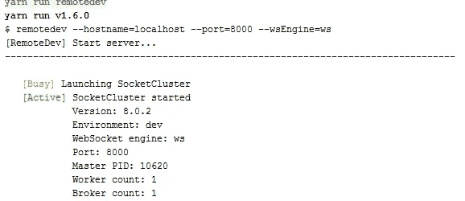
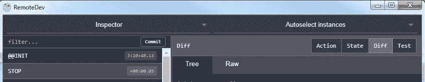
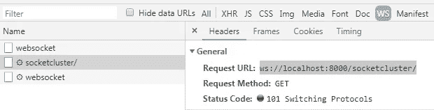

# 正在为 WebWorker 运行 Redux DevTools 扩展

> 原文：<https://itnext.io/ruining-redux-devtools-extension-for-webworker-1eeca68d7900?source=collection_archive---------3----------------------->

最近，我不得不将一些应用程序逻辑转移到 webworker，为了简化应用程序状态管理，我决定使用 redux 和 [redux-observable](https://redux-observable.js.org/) 。除了如何运行 Redux DevTools 之外，迁移几乎是顺利和容易的。经过一点挖掘，我发现了 React 本地开发人员如何使用 Redux DevTools，并决定遵循相同的路径。成功了。让我在这里分享我的故事，因为我看到几个声称它应该工作，但从来没有遇到任何描述所有步骤的博客。

*小免责声明*:我不会介绍如何创建一个 webworker 并在那里运行简单的 redux store，因为有很多博客都在介绍这个。我还希望你安装并知道如何使用 Redux DevTools。

你需要使用 [remote-redux-devtools](https://github.com/zalmoxisus/remote-redux-devtools) 和 [remotedev-server](https://github.com/zalmoxisus/remotedev-server) 项目。Remote Redux DevTools 将通过 websocket 向 RemoteDev 服务器发送 Redux 命令，remote dev 服务器将这些命令桥接到 Redux DevTools。

最后到了这个步骤:

1.  将 [remote-redux-devtools](https://github.com/zalmoxisus/remote-redux-devtools) 包导入到您的项目中，并启用它。在我的项目中，我说过我使用了 redux-observable，因此根据文档，我必须使用 DevTools compose helper。我正在配置只在 8000 端口上的开发环境中运行远程 Redux 工具。

```
import { *applyMiddleware*, createStore } from 'redux';
import { *createEpicMiddleware* } from 'redux-observable';
import { composeWithDevTools } from 'remote-redux-devtools';const epicMiddleware = *createEpicMiddleware*();
const composeEnhancers = **composeWithDevTools**({ realtime: process.env.NODE_ENV === 'development', port: 8000 });
const store = createStore(*reducer*,          composeEnhancers(*applyMiddleware*(epicMiddleware)));epicMiddleware.run(rootEpic);
```

2.将 [remotedev-server](https://github.com/zalmoxisus/remotedev-server) 包作为开发依赖项导入，并创建将启动该进程的 npm 任务:

```
**"remotedev"**: **"remotedev --hostname=localhost --port=8000 --wsEngine=ws"**
```

就是这样。现在您准备好使用 Redux DevTools 来观察您的 Redux 存储在 webworker 上的运行情况了吗？

让我们看看它是如何工作的:

1.  用 webworker 启动应用程序
2.  运行 npm remotedev 任务



3.打开 Redux DevTools。选择 Redux store 实例。我们得到了 redux webworker 的观点。



您还可以检查 Chrome Network/WS (websocket)选项卡，查看 redux store 和 remote-server 之间的数据流:



顺便说一句，Angular 开发者你听说过 [redux-observable](https://github.com/redux-observable/redux-observable) 项目吗？如果你知道 NGRX 和爱情效果，我相信你会喜欢 redux-observable。当您想在角度环境之外使用 redux 获得同样的灵活性时，这是一个很好的选择。也许我会在另一篇博文中写下我对这个库的体验。