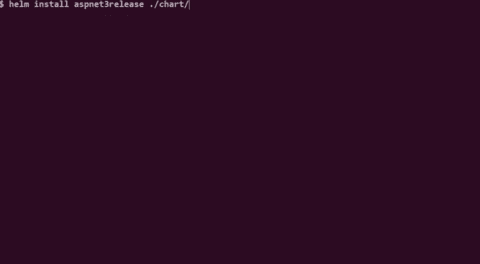

# 使用 Helm 在 Kubernetes 上运行 ASP.NET 核心 3

> 原文：<https://itnext.io/run-asp-net-core-3-on-kubernetes-with-helm-df4c2932acc3?source=collection_archive---------4----------------------->

在这篇文章中，我将一步步向你展示如何在 Helm 3 的帮助下，在 Kubernetes 上创建、构建和托管 ASP.NET Core 3 web API。

整个样本可以在 GitHub 上找到:[https://github.com/Crokus/aspnet-core-helm-sample](https://github.com/Crokus/aspnet-core-helm-sample)

我一直在使用 Windows 10 Pro，但你应该可以在 Linux 或 MacOS 上运行它。

在继续之前，您必须安装一些东西:

*   [Git](https://git-scm.com/downloads)
*   [Docker 桌面](https://hub.docker.com/?overlay=onboarding)—2.1.0.5 或更高版本
*   [。网芯 3.0](https://dotnet.microsoft.com/download/dotnet-core/3.0)
*   [舵](https://v3.helm.sh/docs/intro/install/) —版本 3.0.0 或更高

这不是必须的，但是使用 [Visual Studio 代码](https://code.visualstudio.com/Download)会对整个例子有很大帮助。

# 目标

> 在“负载平衡器”后面创建三个 ASP.NET Core 3 web API 实例，这些实例将路由到 Kubernetes 本地集群上的任何一个。



# 创建 ASP.NET 核心 3 Web API

让我们从使用`dotnet new`命令创建一个新的 Web API 开始。以管理员身份打开 Git Bash 并输入命令，该命令将在`app`目录中创建一个项目模板。

`dotnet new webapi -o app`

现在，打开`app`目录并启动 web API

```
cd app/
dotnet run watch
```

导航到`localhost:5000/weatherforecast`以确保应用程序正在运行。

# 向本地主机添加环境变量

天气数据很有趣，但是让我们尝试输出环境变量，这些变量将在以后证明我们在不同的主机中。

对于本地主机，我们将使用以下变量:

```
export APPENVIRONMENT="development"
export APPHOST="local"
```

停止应用程序并添加一个新的控制器 InfoController，它将输出这些变量。请注意设置为根路径的路由属性。

```
namespace app.Controllers
{
    [ApiController]
    [Route("")]
    public class InfoController : ControllerBase
    {
        private readonly ILogger<InfoController> _logger;

        public InfoController(ILogger<InfoController> logger)
        {
            _logger = logger;
        }

        [HttpGet]
        public InfoModel GetInfo()
        {
            return new InfoModel { AppEnvironment = GetEnvironmentVariable("APPENVIRONMENT"), AppHost = GetEnvironmentVariable("APPHOST") };
        }

        private string GetEnvironmentVariable(string name)
        {
            _logger.LogInformation($"Getting environment variable '{name}'.");
            return Environment.GetEnvironmentVariable(name.ToLower()) ?? Environment.GetEnvironmentVariable(name.ToUpper());
        }
    }
}
```

再次运行应用程序，检查`localhost:{port}`上的响应。

```
{"appEnvironment":"development","appHost":"local"}
```

我们已经准备好将 web API 发布到另一台主机上。为此，我们需要为它创建一个 docker 映像。

# 创建 docker 图像

集装箱化的第一步是创建一个 Dockerfile 文件。

```
touch Dockerfile
```

包含以下内容:

```
FROM mcr.microsoft.com/dotnet/core/sdk:3.0-alpine as build
WORKDIR /app

# copy csproj and restore
COPY app/*.csproj ./aspnetapp/
RUN cd ./aspnetapp/ && dotnet restore 

# copy all files and build
COPY app/. ./aspnetapp/
WORKDIR /app/aspnetapp
RUN dotnet publish -c Release -o out

FROM mcr.microsoft.com/dotnet/core/aspnet:3.0-alpine as runtime
WORKDIR /app
COPY --from=build /app/aspnetapp/out ./
ENTRYPOINT [ "dotnet", "app.dll" ]
```

准备好 Dockerfile 后，我们就可以构建我们的图像了，它将被命名为`aspnet3k8s`，标记为`v1`。我们需要从`app`目录向上导航一级，并运行下面的命令。

```
docker image build --pull -t aspnet3k8s:v1 .
```

建立了图像后，我们可以运行它。

```
docker run --rm -it -p 9000:80 aspnet3k8s:v1
```

浏览`localhost:9000`，您应该会看到两个变量的`null`值。

这是个好兆头。毕竟，我们现在是在一个运行在 docker 主机上的不同环境中。

停止该命令，并尝试为新主机传递一对新的环境变量。

并在`localhost:9000`上再次检查响应

```
{"appEnvironment":null,"appHost":null}
```

很好！

# 创建舵图

最后，我们谈到了问题的实质。我们将 ASP.NET 应用程序容器化，并可以将其部署在 Kubernetes 集群上。我们不会直接这样做，而是使用一个流行的 Kubernetes 的“包管理器”——Helm。

请记住，我们的目标是在一个“负载平衡器”后面创建我们的 ASP.NET Core 3 web API 的三个实例，负载平衡器将路由到它们中的任何一个。

> 将其转换为 Kubernetes 命名法，我们将创建一个部署，该部署将依次创建一个由 3 个 pod(实例)和一个服务组成的复制集，该服务将充当“负载平衡器”,将来自外部世界的请求转发给它们中的任何一个。

如果你还没有这样做，现在是时候安装 Docker 桌面和头盔了。

在继续之前，最好先阅读一下 [Helm 的三大概念](https://v3.helm.sh/docs/intro/using_helm/)。

# 初始化图表

我们可以使用`helm create NAME`命令来完成，但是它会创建很多我们在本指南中不需要的文件。

因此，让我们在根文件夹上创建以下结构。

```
chart/ 
  Chart.yaml 
  values.yaml 
  templates/ 
    deployment.yaml 
    service.yaml
```

首先，让我们看看`Chart.yaml`，它指定了图表的名称和版本。您还可以添加其他字段，但只有这些字段是必需的。

```
name: aspnet3-demo
version: 1.0.0
```

# 图表值

然后是`values.yaml`，它指定了我们的默认设置，这些设置将被解析并注入到`/templates`目录中的模板中。

我们在那里定义我们的环境名。您还可以看到我们的图像名称`aspnet3k8s`和`replicas: 3`字段，它们指定了我们想要多少个 web API 实例。
请注意，我已经添加了一个字段`pullPolicy: IfNotPresent`，因为我们的图像只在本地机器上。

```
environment: development

apphost: k8s

label:
  name: aspnet3core

container:
  name: aspnet3
  pullPolicy: IfNotPresent
  image: aspnet3k8s
  tag: v1
  port: 80
replicas: 3

service:
  port: 8888
  type: ClusterIP
```

到目前为止还不错，但是你可能会问自己这些`values`YAML 如何使我们的目标更接近？答案是，这些值在我们的模板中被引用。现在让我们来检查一下。

# 图表模板

我们从`deployment.yaml`开始。该模板将创建一个部署对象，该对象将依次创建由 3 个 pods 组成的 ReplicaSet，每个 pods 运行我们的 web API 容器映像。看看我们在`values.yaml`中定义的所有引用值。注意一个头盔的内置对象`.Release`，我们将使用它来命名我们的部署。

```
apiVersion: apps/v1
kind: Deployment
metadata:
  name: {{ .Release.Name }}-deployment
  labels:
    app: {{ .Values.label.name }}
spec:
  replicas: {{ .Values.replicas }}
  selector:
    matchLabels:
      app: {{ .Values.label.name }}
  template:
    metadata:
      labels:
        app: {{ .Values.label.name }}
        environment: {{ .Values.environment }}
    spec:
      containers:
        - name: {{ .Values.container.name }}
          image: {{ .Values.container.image }}:{{ .Values.container.tag }}
          imagePullPolicy: {{ .Values.container.pullPolicy }}
          ports:
            - containerPort: {{ .Values.container.port }}
          env:
            - name: apphost
              value: {{ .Values.apphost }}
            - name: appenvironment
              value: {{ .Values.environment}}
```

这将确保我们的 web API 的 3 个实例将在我们的本地集群上运行。但是，如果没有“负载平衡器”，我们将无法访问其中任何一个。为此，我们需要一个模板在`service.yaml`中定义的服务。

```
apiVersion: v1
kind: Service
metadata:
  name: {{ .Release.Name }}-service
  labels:
    app: {{ .Values.label.name }}
spec:
  ports:
  - port: {{ .Values.service.port}}
    protocol: TCP
    targetPort: {{ .Values.container.port }}
  selector:
    app: {{ .Values.label.name }}
  type: {{ .Values.service.type }}
```

我们一切就绪，终于可以在本地集群上部署图表了！

# 压轴戏

运行下面的命令将我们的图表安装为名为`aspnet3release`的版本。

```
helm install aspnet3release ./chart/
```

您应该会看到一个成功的响应

```
NAME: aspnet3release 
LAST DEPLOYED: Sun Dec 1 12:07:53 2019 
NAMESPACE: default 
STATUS: deployed 
REVISION: 1 
TEST SUITE: None
```

让我们使用`kubectl`命令来看看 Kubernetes 集群上到底部署了什么。注意，我们使用一个选择器来匹配那些带有标签`app=aspnet3core`的资源。

```
kubectl get all --selector app=aspnet3core
```

它应该输出以下内容。

```
NAME READY STATUS RESTARTS AGE 
pod/aspnet3release-deployment-77686884b-fq5lq 1/1 Running 0 3m43s pod/aspnet3release-deployment-77686884b-llcsv 1/1 Running 0 3m43s pod/aspnet3release-deployment-77686884b-qswsj 1/1 Running 0 3m43sNAME TYPE CLUSTER-IP EXTERNAL-IP PORT(S) AGE 
service/aspnet3release-service ClusterIP 10.107.172.66 <none> 8888/TCP 3m43s NAME READY UP-TO-DATE AVAILABLE AGE 
deployment.apps/aspnet3release-deployment 3/3 3 3 3m43s NAME DESIRED CURRENT READY AGE 
replicaset.apps/aspnet3release-deployment-77686884b 3 3 3 3m43s
```

我们现在所拥有的。运行我们的 web API 的三个 pod 一个 ReplicaSet 和一个监听`8888`端口的服务。太好了，让我们接着浏览`localhost:8888`来看看我们的 API 在起作用！

什么都没发生。为什么？因为服务的端口不在本地机器上，而是在集群内部。因此，我们必须使用`kubectl port-forward`命令将本地机器上的一个端口转发到服务的端口。我们可以重用 8888 端口，但是让我们使用 9999 来清楚地区分什么在哪里。

从前面的命令`kubectl get all`我们知道我们的服务可以被标识为`service/aspnet3release-service`。让我们试试。

```
kubectl port-forward service/aspnet3release-service 9999:8888
```

浏览`localhost:9999`并...成功！

```
{"appEnvironment":"development","appHost":"k8s"}
```

# 更新我们的部署

您可能会想，为什么我使用 Helm 而不是为部署和服务对象创建标准的 Kuberentes 定义。很方便的是，有些值不是按值复制的，而是被引用的——为什么要大惊小怪呢？

想象一下，我们想要使用我们的应用程序。我们可以复制我们的开发 YAMLs，并在这里和那里更改值，但这将非常容易出错，并且很难维护。相反，通过使用 Helm，我们可以简单地为生产创建一组新值，并将其存储在一个新文件`production-values.yaml`中。类似于:

```
environment: production
replicas: 5
```

为了简单起见，我们将只使用`helm upgrade`命令和传递`production-values.yaml`来升级我们的开发。

```
helm upgrade aspnet3release ./chart --values ./chart/production-values.yaml
```

回应是:

```
Release "aspnet3release" has been upgraded. Happy Helming!
NAME: aspnet3release
LAST DEPLOYED: Sun Dec  1 12:40:00 2019
NAMESPACE: default
STATUS: deployed
REVISION: 2
TEST SUITE: None
```

同样，让我们验证它在群集上的样子:

```
kubectl get all --selector app=aspnet3core
```

您应该会看到我们应用程序的 5 个实例。那很容易，不是吗？

```
NAME READY STATUS RESTARTS AGE 
pod/aspnet3release-deployment-774c478b4-64jgp 1/1 Running 0 12m pod/aspnet3release-deployment-774c478b4-fx8bs 1/1 Running 0 12m pod/aspnet3release-deployment-774c478b4-mkplm 1/1 Running 0 12m pod/aspnet3release-deployment-774c478b4-mnwgb 1/1 Running 0 12m pod/aspnet3release-deployment-774c478b4-xnd9b 1/1 Running 0 12m NAME TYPE CLUSTER-IP EXTERNAL-IP PORT(S) AGE 
service/aspnet3release-service ClusterIP 10.107.172.66 <none> 8888/TCP 44m NAME READY UP-TO-DATE AVAILABLE AGE 
deployment.apps/aspnet3release-deployment 5/5 5 5 44m NAME DESIRED CURRENT READY AGE replicaset.apps/aspnet3release-deployment-774c478b4 5 5 5 12m replicaset.apps/aspnet3release-deployment-77686884b 0 0 0 44m
```

我们还更改了环境变量，让我们也验证一下。我们必须再次左舷前进。

```
kubectl port-forward service/aspnet3release-service 9999:8888
```

并且浏览`localhost:9999`看到环境已经改成了`production`。酷！

那是一段相当长的旅程。我们已经创建了一个新的 ASP.NET 核心应用程序，将其容器化，创建 Helm's chart，在 Kubernetes 集群上部署它，最后更新它。

哦，差点忘了。要清理群集，请使用以下命令:

```
helm uninstall aspnet3release
```

# 信用

创建该指南的想法受到了 John Arundel 和 Justin Domingus 写的一本伟大的书的启发:[云本地 DevOps with Kubernetes](http://shop.oreilly.com/product/0636920175131.do)

感谢阅读。我希望你喜欢它。