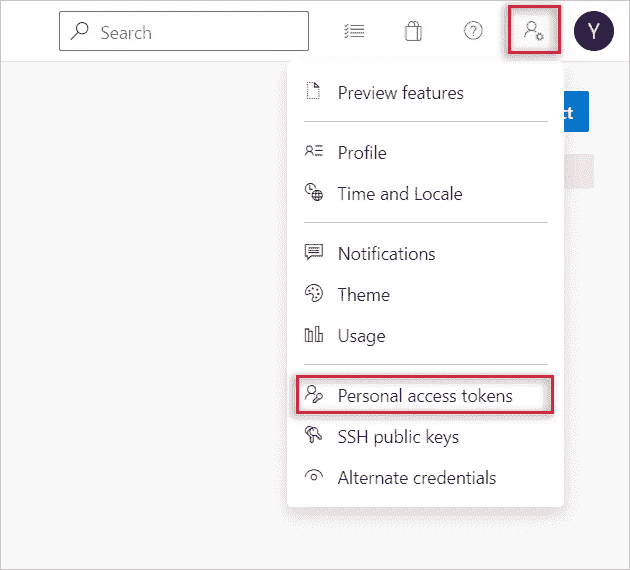
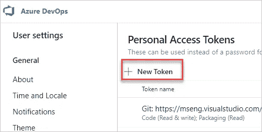
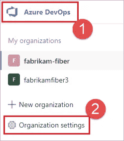
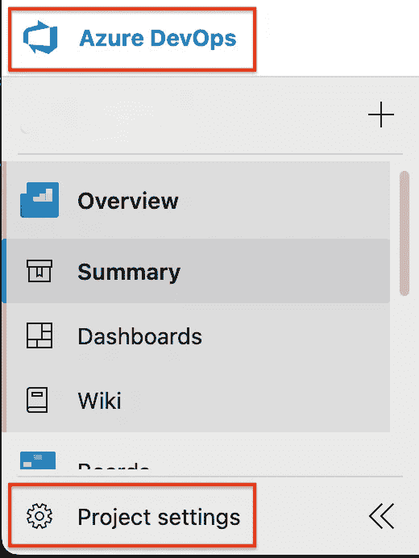
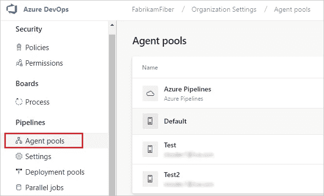
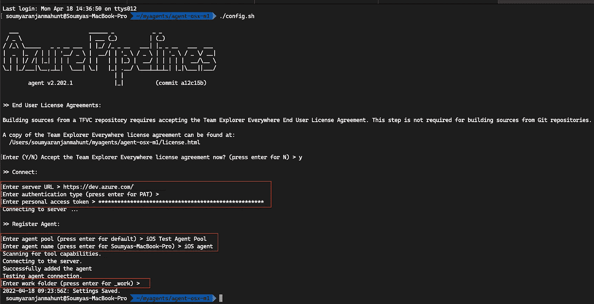
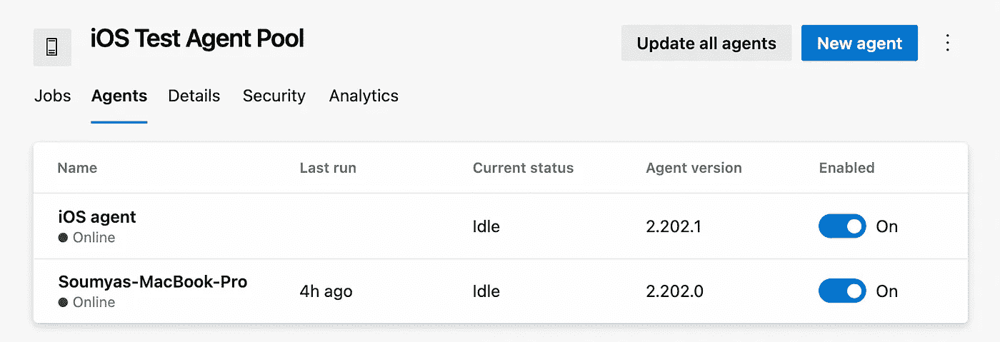
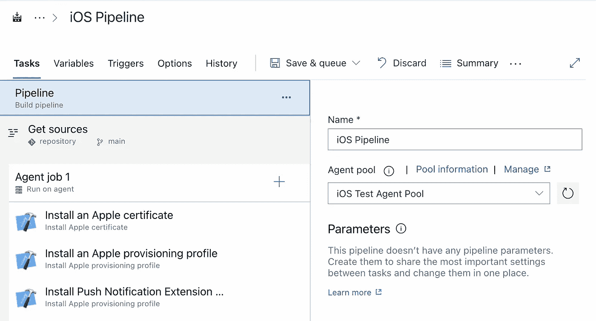

# 在苹果 M1 Mac 上运行 Azure 自托管 macOS 代理

> 原文：<https://itnext.io/run-azure-self-hosted-macos-agents-on-apple-m1-mac-72726555d83b?source=collection_archive---------1----------------------->

## 第 1 部分:使用 M1 Mac 来驱动您自己的 iOS CI/CD 管道


苹果在去年 11 月发布了基于 ARM 的 M1 芯片，明确表示最终将停止支持基于 Intel 的机器。M1 驱动的机器已被证明比基于英特尔的机器更具性能和效率，截至目前，在微软 Azure 的 DevOps CI/CD 管道中利用这种性能的唯一方法是使用自托管代理。

在本帖中，我们将介绍如何使用基于 M1 的机器为自托管代理提高现有管道的性能和效率。如果你正在使用 GitHub 动作，你可以继续使用本系列的第 2 部分。

# 生成个人访问令牌

在开始之前，您需要为 Azure DevOps 组织内拥有足够权限的用户生成个人访问令牌(PAT)。对于范围，选择**代理池(读取，管理)**，并确保清除所有其他框。如果是一个[部署组](https://docs.microsoft.com/en-us/azure/devops/pipelines/release/deployment-groups/?view=azure-devops)代理，对于范围选择**部署组(读取，管理)**并确保所有其他框都被清除。您可以选择窗口底部的 **Show all scopes** 来查看要设置权限的可能范围的完整列表。



> 注意:PAT 至少需要代理池范围的读取和管理权限。您需要在哈希生成后复制 PAT 以备后用，因为它只能在生成后查看，并且在此步骤后不会再次显示。

# 下载并配置代理

在您的 Azure DevOps 项目中，您需要选择一个现有的代理池来添加您的基于 M1 的计算机，或者您可以创建一个新的代理池。为此，导航到 Azure DevOps 门户左侧栏上的**项目设置**或**组织设置**，这取决于您是要将代理分别添加到项目级别还是组织级别。



接下来，选择或创建您打算用于 iOS 或 macOS CI/CD 工作流的代理池，首先单击左侧栏中的**代理池**，然后单击**新建代理**，如下所示。



然后，您需要点击**下载**将代理下载到您的 M1 代理上，如下图所示。


之后，您只需要在您的 M1 机器上运行提供的命令来配置和启动代理，请参考上面的截图。

> 注意:如果你还没有这样做，你应该[在你的苹果 M1 机器](https://support.apple.com/en-us/HT211861)上安装 Rosetta 2 并安装[系统必备](https://aka.ms/vstsagentosxsystem)。

# 交互配置和运行 Azure DevOps 代理

将代理提取到新创建的目录后，您需要运行`./config.sh`，如上所示，将代理与您在 Azure DevOps 中的组织相关联。

当您这样做时，您将在终端中看到以下对话:



首先，要连接您的服务器，您需要提供`server URL`，也就是`https://dev.azure.com/{organization name}`。接下来，您只需按 Enter 键选择 PAT 作为您的身份验证类型，最后在出现提示时将您之前收集的 PAT 粘贴到终端中。

现在要配置您的代理，您需要提供代理池的名称来添加您的代理，并为您的代理命名。接下来，您必须提供一个工作文件夹或者接受默认选择`_work`。

这样，您就可以通过运行`./run.sh`来启动交互式代理了。

# 确认状态

启动 Azure DevOps 自托管 macOS 代理后，您应该会在终端中看到一个**“Listening for jobs】**对话框。您还应该在 Azure UI 的相应代理池中看到新代理，如下所示:



现在，您可以将管道的代理池名称更改为基于 M1 的机器池，并享受改进的管道性能:



# 配置工具缓存

一些工具任务(即`[Use Ruby Version](https://docs.microsoft.com/en-in/azure/devops/pipelines/tasks/tool/use-ruby-version?view=azure-devops)`)要求您的工具缓存已经设置了所需的工具。您将在配置时提供的`workFolder`(默认为`_work`)内的`_tool`目录中找到您的工具缓存。使用 [homebrew](https://brew.sh/) ，您可以管理这些工具的不同版本，并且使用以下 python 脚本，您可以将已经安装的工具链接到您的`_tool`文件夹。

# Sudoers 构型

如果您的任务需要 root 权限，您可以通过键入`sudo visudo`来配置您的`sudoers`文件。您可以在该文件中添加以下行，以允许 root 权限，而不提示输入密码，但是，由于潜在的安全风险，这是不可取的:

```
your_username  ALL=(ALL) NOPASSWD: ALL
```

或者，您可以添加限制应用程序级别，以便这些应用程序不需要密码提示。例如，默认的**工具任务**需要 root 权限才能在系统目录中创建符号链接，在这种情况下，您可以将`ln`添加到无密码提示中，如下所示:

```
your_username  ALL= NOPASSWD: **/bin/ln** # Or your additional applications with arguments:your_username  ALL= NOPASSWD: **/bin/ln****,**/your_dir/your_bin your_args
```