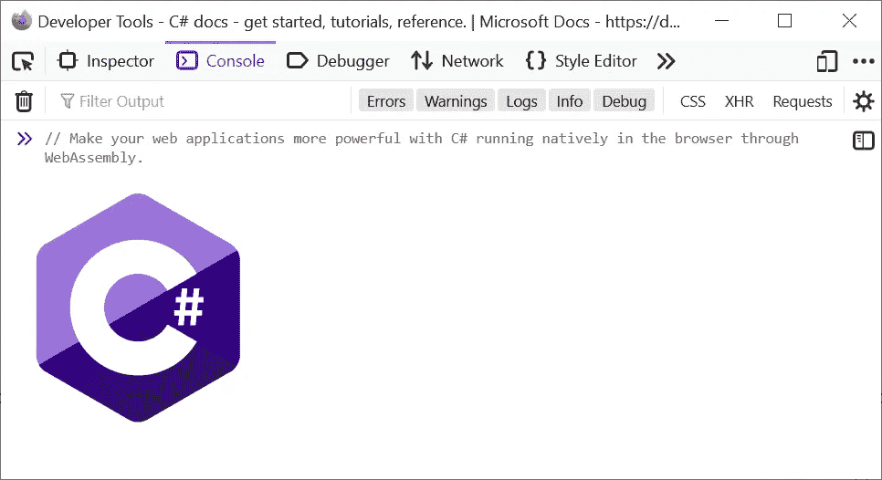
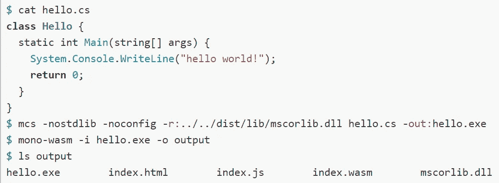
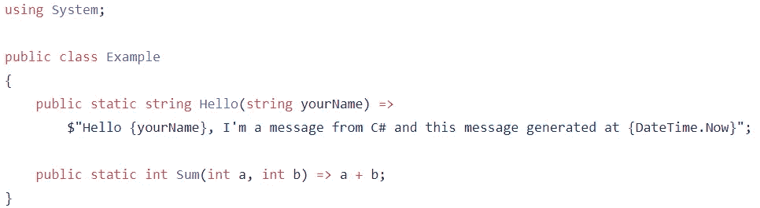
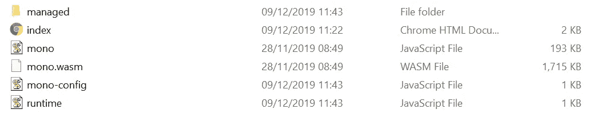
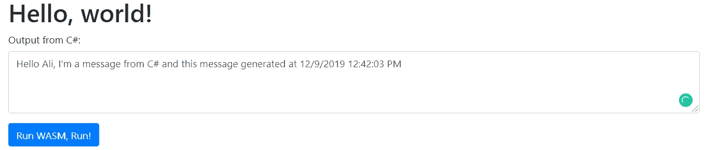
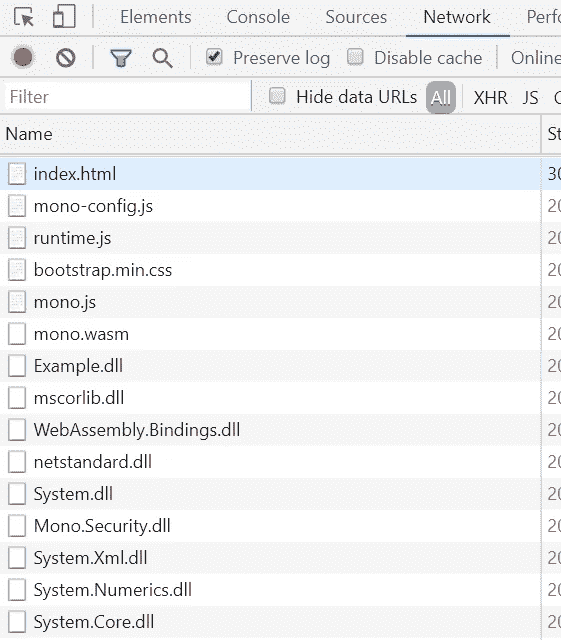

# 通过 mono-wasm 在浏览器中通过 web 程序集本地运行 C#

> 原文：<https://itnext.io/run-c-natively-in-the-browser-through-the-web-assembly-via-mono-wasm-60f3d55dd05a?source=collection_archive---------0----------------------->

## 使用 c#-Mono Wasm 增强您的前端应用



> WebAssembly(缩写为 *Wasm* )是一种基于堆栈的虚拟机的二进制指令格式。Wasm 被设计为 C/C++/Rust 等高级语言编译的可移植目标，支持客户端和服务器应用程序在 web 上的部署。
> ——【https://webassembly.org/ 

我们都听说过 WASM、能力和可能性。其他语言和运行时，如 Rust，都有它们在浏览器和。NET，官方唯一的办法就是使用 [Blazor](https://dotnet.microsoft.com/apps/aspnet/web-apps/blazor) 这是一个前端框架。

Blazor 很好，但它是开发整个前端应用程序的完整包。如果我喜欢用。我的旧 JS 应用程序中的. NET 库已经在生产中了吗？

大约两年前，我在 Mono 网站上读到一篇关于 mono-wasm 的文章。他们展示了他们所取得成就的巨大可能性。



单幅和幅装配的第一个例子之一

差不多两周前，我在 [LINKIT](https://www.linkit.nl/) 做了一次关于 WebAssembly 的[内部演讲。我想向人们展示如何在没有 Blazor 的情况下在浏览器中运行他们的代码，所以我询问了像 Steve Sanderson、Miguel de Icaza 和 Scott Hanselman 这样的人。](https://github.com/0x414c49/wasm-blazor-lecture)

一个小时后，我能够编译和运行。NET 在浏览器里面。由于这个过程没有正式的文档，我决定写一篇关于它的文章。

我们开始吧！😱

## 要求

1.  在您的操作系统上下载并安装 Mono SDK。你可以在这里找到不同操作系统的下载和安装程序。
2.  安装后，确保您可以在终端中直接访问**csc.exe**和**单声道**。如果它们不在环境路径中，在其中添加一个到 mono 的 bin 目录的路径。
3.  在这里获得 mono wasm 的最新成功构建。下载并解压缩。用`sdks/wasm/mono-wasm-###########.zip`指定的 zip 文件。
4.  (可选)web 服务器或简单的 CLI 静态文件服务器，如 **python http-server** 或[**dotnet-serve**](https://github.com/natemcmaster/dotnet-serve)**本地托管您的站点**。****

**为了便于运行和编译 C#代码，克隆或下载这个库:**

**[](https://github.com/0x414c49/mono-wasm-example) [## 0x 414 c 49/mono-wasm-示例

### 一个在浏览器中运行 C#的简单例子，以及如何用 mono-wasm 编译代码

github.com](https://github.com/0x414c49/mono-wasm-example) 

在示例中，我创建了一个非常简单的 CSharp 类，它包含两个静态方法。我们将使用这个类来演示如何运行这个项目。



首先，我们需要将代码编译成。NET 程序集。这可以用单声道或。NET 官方 **csc** (CSharp 编译器)。在运行`csc`来编译代码之前，你需要定义一个名为$ WASM SDK 的变量，这个变量应该包含 mono-wasm SDK 的路径。

```
$WASM_SDK="path to mono-wasm sdk"# for eg:
# $WASM_SDK="D:\WasmSDK\"
# DONT FORGET THE TRAILING SLASH
```

然后你可以在`example`文件夹中运行下面的命令来编译你的代码。

```
csc /target:library -out:Example.dll /noconfig /nostdlib /r:$WASM_SDK/wasm-bcl/wasm/mscorlib.dll /r:$WASM_SDK/wasm-bcl/wasm/System.dll /r:$WASM_SDK/wasm-bcl/wasm/System.Core.dll /r:$WASM_SDK/wasm-bcl/wasm/Facades/netstandard.dll /r:$WASM_SDK/wasm-bcl/wasm/System.Net.Http.dll /r:$WASM_SDK/framework/WebAssembly.Bindings.dll /r:$WASM_SDK/framework/WebAssembly.Net.Http.dll Example.cs
```

*   如你所见，用`-out`我们定义了程序集的输出名称。
*   在命令的末尾，您应该添加想要编译的 CSharp 文件
*   其他程序集位于编译时引用的 mono-wasm 目录中。

如果您成功编译了代码，`Example.dll`汇编应该被创建。然后，您需要为 web 程序集发布您的程序集:

```
mono $WASM_SDK/packager.exe --copy=always --out=./publish --asset=./index.html Example.dll
```

这个命令运行`packager.exe`,它是 Mono 的一个工具，发布你的包含所有需求的程序集。在该命令中，`index.html`被定义为一个资产，这意味着打包程序将在发布期间复制该文件。

打包程序将创建一个名为 publish 的文件夹，并在其中复制内容。



*   index.html
*   mono.js、mono-config.js 和 runtime.js 是 JavaScript 的 mono 绑定。
*   mono.wasm 就是单声道。web 程序集的. NET 运行库。

那什么是托管文件夹呢？如果你看看它的内容，你会看到许多 DLL 汇编文件，包括 Example.dll。

现在你可以宿主 publish 文件夹的例子来看看它是如何工作的，我已经在我的 GithubPages 上宿主了这里:

[https://0x414c49.github.io/wasm-example/index.html](https://0x414c49.github.io/wasm-example/index.html)



示例输出

如果导航到该 URL，请打开 F12 Web Developer 工具并转到网络选项卡。在页面加载之前，你会看到所有的 DLL 程序集都被下载了！



正如你所看到的，在你按下按钮`Run Wasm, Run`后，C#代码会在浏览器中用 wasm 执行，这真的很有趣。** 

## **与 JS 集成**

**现在你明白了如何在浏览器中执行 C#代码，但是如何将它与 JavaScript 集成在一起呢？**

**我们有一个类名示例(在 Example.cs 文件中),它包括两个公共和静态方法:**

1.  ****总和****
2.  ****你好****

**在我们的示例中，我们演示了如何调用 Hello 方法，它只是在文本区域中显示一条欢迎消息。如果你在第 [42](https://github.com/0x414c49/mono-wasm-example/blob/5e314708cf31d3e35dbf238bdbe106e0ba7fd182/example/index.html#L42) 行打开`Index.html`文件，我绑定了一个静态方法。NET 转换为 JS 变量:**

```
var execute = Module.mono_bind_static_method("[Example] Example:Hello");
```

**`Module`是由`mono.js`文件注入页面的对象。这个对象有许多方法，但最有用的方法之一是`mono_bind_static_method`。使用此方法，您可以从。NET 应用到 JS 世界，并像执行一个简单的 JS 函数一样执行它。**

```
execute("Ali");// will return something like:
// Hello Ali, I'm a message from C# and this message generated at 12/9/2019 12:55:13 PM
```

**就是这样！这是你开始需要知道的全部。下载**WASM SDK**可以查看 [Mono](https://github.com/mono/mono/tree/master/sdks/wasm/docs/getting-started) 的这个回购。有一些下载 **mono-wasm** SDK 的指南和网址。**

**Miguel de Icaza 是 Mono 的创始人和 Xamarin 的创始人，他让我写一篇关于如何用 mono-wasm 在浏览器中运行 C#的文章，所以这篇文章是献给你的，Miguel！**

**所有资料都可以在这里下载:
[https://github.com/0x414c49/mono-wasm-example](https://github.com/0x414c49/mono-wasm-example)**

## **如果你喜欢我的文章，请多看看我关于 C#的其他文章**

*   **[C #脚本的搭便车指南](/hitchhikers-guide-to-the-c-scripting-13e45f753af9)**