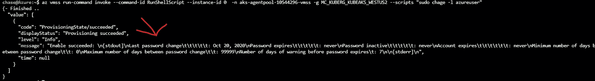
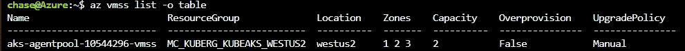
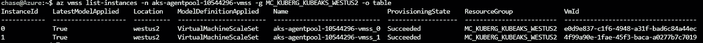

# Azure 管理:从 CLI 对 VMSS 实例运行命令

> 原文：<https://itnext.io/run-commands-against-a-vmss-instance-from-cli-8575a9ad43b1?source=collection_archive---------2----------------------->

*   [底线靠前](#2160)
*   [使用 CLI 访问虚拟机](#ad09)
*   [准备运行命令](#ee10)
*   [运行 AZ vmss 运行命令](#ce06)
*   [附加信息](#f55c)

# BLUF

> 底线在前面

`az vmss run-command`可用于影响变更或从您的虚拟机收集信息，而无需直接访问它们。执行时，shell 命令作为管理员对虚拟机运行。

如果出于某种原因，您无法通过其他方式来管理虚拟机，那么可以使用这种方法间接获得紧急访问权来管理虚拟机。这包括帐户管理，即:创建帐户，重置密码，获取网络信息等。

1.  使用`az vmss list`收集您想要运行命令的秤台信息
2.  使用`Name`和`ResourceGroup`，您可以通过运行`az vmss list-instances -n NameOfScaleSet -g ResourceGroup`获得一个实例(虚拟机)列表
3.  对实例运行您的命令，例如，如果我想检查一个帐户的到期时间:`az vmss run-command invoke --comand-id RunShellScript --instance-id 0 -n aks-agentpool10544296-vmss -g MC_KUBERG_KUBEAKS_WESTUS2 --scripts "sudo chage -l azureuser"`

输出就在那里，如果你想做一点工作，它可以变得很漂亮

# 使用命令行界面访问虚拟机

> 紧急访问、管理等

令我惊讶的是，有这么多人不知道 az vmss run-command 有多么强大和有用。所以我想告诉你，亲爱的读者，如何使用这个优秀的命令，希望能对你有所帮助。

我不得不在很多场合下用它来帮助自己和他人。一般来说，我使用它的大部分经验都是围绕着识别和修复虚拟机本身的问题。很多时候，过期的帐户或命令会破坏以更传统的方式(如 SSH)管理虚拟机的能力。

现在我要告诉你的是，所有的输出都是标准输出，根本没有格式化，所以如果你想得到大量的数据，它会变得很混乱。仅供参考。

# 准备运行命令

在我告诉你如何使用这个命令之前，我需要你理解一个基本的比例设置。在一个规模集中，单个虚拟机被称为实例，需要正确地调用这些实例以确保您的命令成功。让我们用我的一个例子。我将直接从 Azure Portal CLI 运行这些命令，但是只要您安装了 az cli，就可以从任何地方运行它。

1.  使用`az vmss list -o table`命令确定您希望运行命令的 VMSS。

az vmss 列表-o 表

2.使用上面命令中列出的名称和资源组，使用输出运行`az vmss list-instances`命令。

az vmss 列表-实例-n aks-agent pool-10544296-vmss-g MC _ KUBERG _ KUBEAKS _ westus 2-o 表

# 运行 az vmss run-command…命令

很好，现在我们有了实际运行命令所需的所有信息。呜！现在我们需要执行 run-command 并调用它。让我们假设我们想检查我的默认 azureuser 帐户的帐户到期细节。我将执行`az vmss run-command invoke --command-id RunShellScript --instance-id 0 -n aks-agentpool-10544296-vmss -g MC_KUBERG_KUBEAKS_WESTUS2 --scripts "sudo chage -l azureuser"`查看该命令，您可以看到我选择了 0 实例，同时提供了规模集的名称以及规模集所属的资源组，同时告诉它我想运行一个 ShellScript 并执行 sudo chage -l azureuser

现在，您可能已经注意到，如果您能够运行 CLI 命令，您可以绕过可能的安全限制，您的公司可能认为这些限制是可靠的，通常会阻止您以这种方式访问虚拟机。我的意思是…我要说的是安全审计的存在是有原因的:)。

不仅如此，输出是原始的，一点也不漂亮，很容易解决。您可能想知道这个特定命令的限制是什么。到目前为止，我还没有找到一个。当然，我只是把它作为一个碎玻璃的选择，但这并不意味着你不能用它做其他事情，如果你愿意的话。

# 加一个

Windows 和 Linux 都支持 Run-命令。要在 Windows 中运行命令，您需要指定 RunPowershellScript，当然还要使用 Powershell 命令语法而不是 linux shell:)

另外 [VMSS 实例](https://docs.microsoft.com/en-us/cli/azure/vmss/run-command?view=azure-cli-latest)并不是支持这个特定命令的唯一资源。来自可用性集的基本虚拟机也将以类似的方式工作。查看[文档](https://docs.microsoft.com/en-us/cli/azure/vm/run-command?view=azure-cli-latest)中的示例。

所以你有它！这是另一种与你的资源互动的方式，帮助你做你需要做的任何事情，如果你不能直接访问或者由于某种原因丢失了它。