# 在你的机器上运行 Kubernetes

> 原文：<https://itnext.io/run-kubernetes-on-your-machine-7ee463af21a2?source=collection_archive---------0----------------------->

## 立即开始玩 K8s 的几个选项

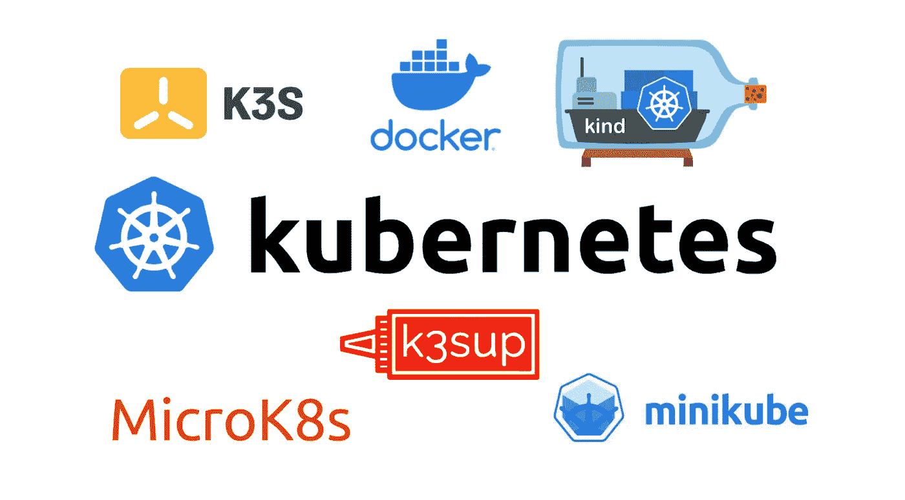

在线获得 Kubernetes 集群真的很容易，因为几乎每个云提供商都提供自己的解决方案([谷歌 GKE](https://cloud.google.com/kubernetes-engine) 、[亚马逊 EKS](https://aws.amazon.com/en/eks/) 、[微软 AKS](https://azure.microsoft.com/en-en/services/kubernetes-service/) 、[数字海洋 DOKS](https://www.digitalocean.com/products/kubernetes/) 、 [Civo Kubernetes](https://www.civo.com/kube100) 、…)。因为有时我们只是想在本地玩，这篇文章列出了这种用法的一些主要选项。

## 快速笔记

要从本地机器访问 Kubernetes 集群，我们首先需要安装和配置 *kubectl* ，这是一个命令行工具，用于向集群的 API 服务器发送请求。[安装](https://kubernetes.io/en/docs/tasks/tools/install-kubectl/)非常简单(下载并添加到路径中的二进制文件)，我们将在示例中看到如何配置 *kubectl* 来定位特定的集群。

此外，多个解决方案在一个虚拟机中运行，因此需要一个虚拟机管理程序。在几个例子中，我们将使用 [Multipass](https://multipass.run) ，这是一个伟大的工具，它允许在 Mac、Linux 或 Windows 工作站上启动 Ubuntu 虚拟机。根据您的操作系统，它使用 Hyper-V，HyperKit，KVM 或 VirtualBox 本机最快的启动时间。


Minikube 可能是最广为人知的解决方案，它启动一个虚拟机，并在其中运行所有的 Kubernetes 进程。默认情况下，Minikube 过去使用 VirtualBox 运行，但现在它可以选择系统上可用的最佳驱动程序。

我们首先需要下载[最新的稳定版本](https://github.com/kubernetes/minikube/releases)，然后运行 *minikube start* 我们就可以开始了。下面是 Minikube 在 MacOS 上启动的例子。

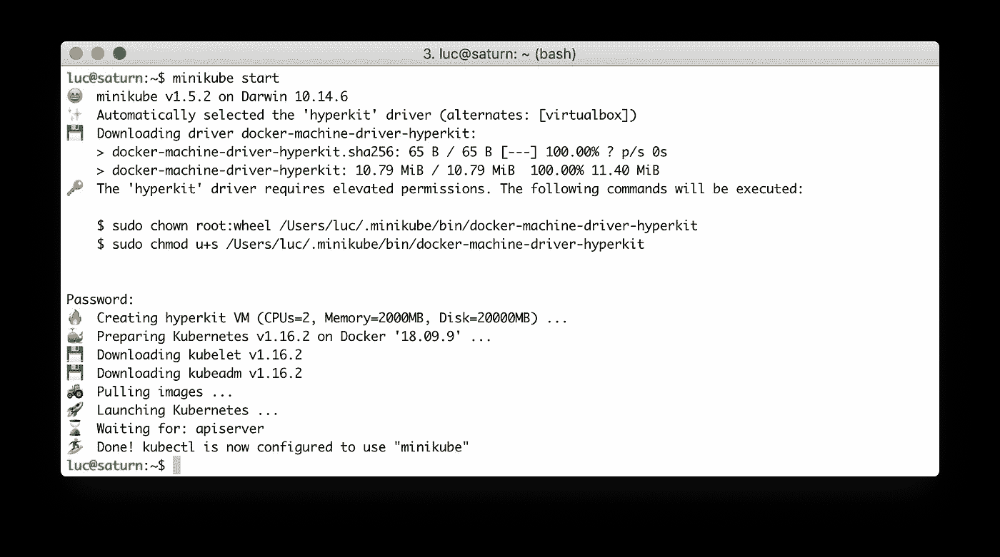

默认情况下使用 HyperKit 在 MacOS 上运行 Minikube

在启动期间，kubeconfig 文件( *~/)。kube/config* 缺省情况下)被更新(或者如果它还不在那里则被创建)并且一个名为 *minikube* 的新上下文被创建。该上下文被设置为默认上下文，因此 *kubectl* 可以立即与 minikube 通信。

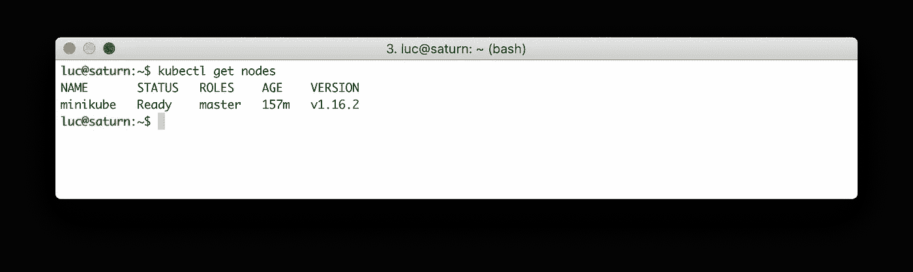

获取 Minikube 的节点


在 MacOS 或 Windows 10 上，我们可以使用 [Docker Desktop](https://www.docker.com/products/docker-desktop) ，这是一款专注于开发者体验的工具，用于构建和共享容器化的应用和微服务。Docker 桌面附带众所周知的工具，如 Docker Compose 和 Docker Machine。

Docker 桌面的分发可在 https://www.docker.com/products/docker-desktop 的[获得。安装后，可以配置它运行单节点 Kubernetes。](https://www.docker.com/products/docker-desktop)

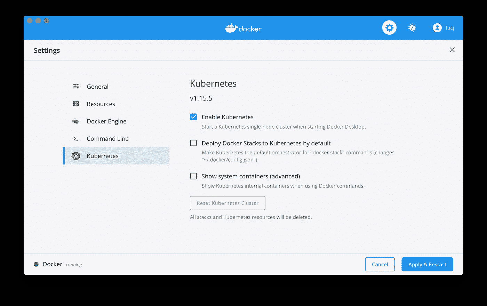

在 Docker 桌面(MacOS)上启用 Kubernetes

这创建了一个新的上下文，命名为 *docker-desktop* 。我们只需要将这个上下文设置为当前上下文，就可以开始了。

```
$ kubectl config use-context docker-desktop$ kubectl get nodes
NAME             STATUS   ROLES    AGE   VERSION
docker-desktop   Ready    master   22d   v1.15.5
```

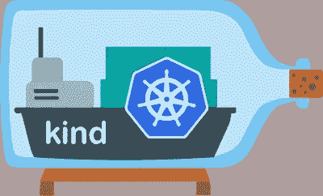

[Kind](https://github.com/kubernetes-sigs/kind) 代表 Docker 中的 Kubernetes，因为每个集群的节点都运行在 Docker 容器中。

要使用它，我们需要 Docker(用 Docker 桌面或有用的快捷方式'*curl*[*https://get.docker.com*](https://get.docker.com)*| sh '*)和[最新版本](https://github.com/kubernetes-sigs/kind/releases)。下面的屏幕截图显示了可用于管理集群生命周期的命令。


种类可用的命令

创建单节点集群非常简单，如以下命令所示:

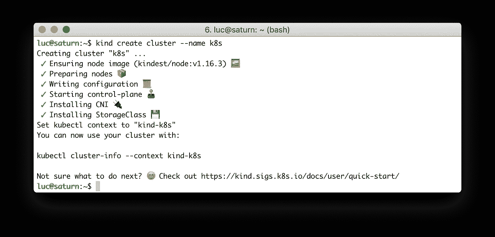

Kind 还允许创建多节点集群，为此它需要一个配置文件。例如，下面的文件定义了一个 6 节点集群:3 个主节点和 3 个工作节点。

```
*# HA-config.yaml*
kind**:** Cluster
apiVersion**:** kind.sigs.k8s.io/v1alpha3
nodes**:**
- role**:** control-plane
- role**:** control-plane
- role**:** control-plane
- role**:** worker
- role**:** worker
- role**:** worker
```

在创建命令中，我们只需要提供配置文件作为附加参数:

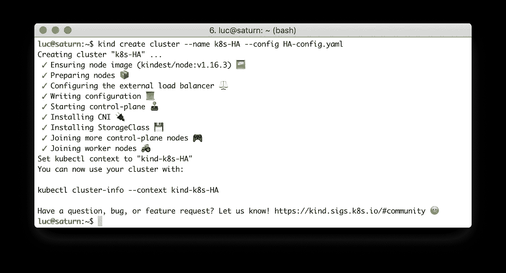

使用 Kind 创建多节点集群

创建了两个集群后，我们可以看到相应的 Docker 容器在本地机器上运行。基于*kindest/node:v 1 . 16 . 3*Docker 映像有 7 个容器，每个容器属于一个集群。

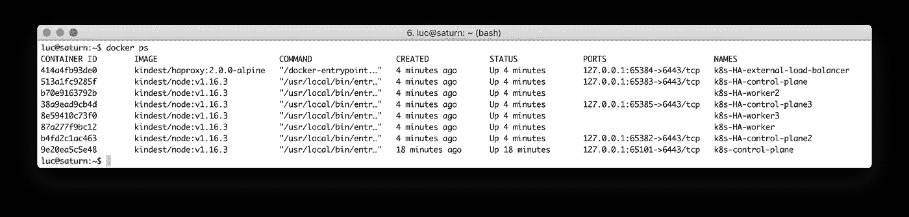

每种类型的节点都运行在一个 Docker 容器中

和前面的例子一样，Kind 更新 kubeconfig 文件( *~/)。默认为 kube/config* )与新的上下文。在下面的列表中，我们可以看到迄今为止创建的不同上下文:

```
$ kubectl config get-contexts
         docker-desktop docker-desktop   docker-desktop
         kind-k8s       kind-k8s         kind-k8s
*        kind-k8s-HA    kind-k8s-HA      kind-k8s-HA
         minikube       minikube         minikube
```

当前上下文链接到我们创建的最后一个集群 *k8s-HA* 。如果我们列出节点，我们会得到集群的 3 个主节点和 3 个工作节点。

```
$ kubectl get nodes
NAME                    STATUS   ROLES    AGE     VERSION
k8s-ha-control-plane    Ready    master   4m8s    v1.16.3
k8s-ha-control-plane2   Ready    master   3m24s   v1.16.3
k8s-ha-control-plane3   Ready    master   2m24s   v1.16.3
k8s-ha-worker           Ready    <none>   107s    v1.16.3
k8s-ha-worker2          Ready    <none>   106s    v1.16.3
k8s-ha-worker3          Ready    <none>   106s    v1.16.3
```


MicroK8s 是一款专注于简单性和开发者体验的工具。对于物联网、Edge 和在 Linux 机器上运行来说，这是非常棒的。它非常轻量级，但提供了“附加组件”，这些附加组件是预打包的组件，为 Kubernetes 提供了一些额外的功能:从简单的 DNS 管理到 Kubeflow 的机器学习。

看到 Kelsey Hightower 关于 MicroK8s 的这条推文了吗:)

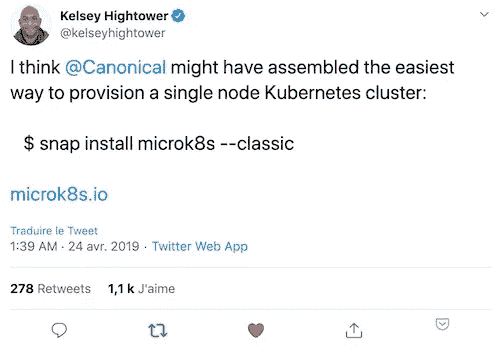

在 Windows、MacOS 或 Linux 上，MicroK8s 可以很容易地安装在配备了 [Multipass](https://multipass.run) 的 Ubuntu 虚拟机上。

```
# Create a new Ubuntu VM
$ multipass launch --name microk8s --mem 4G# Install microk8s in the VM through snap
$ multipass exec microk8s -- sudo snap install microk8s --classic
```

然后，我们将集群配置复制到本地文件中:

```
$ multipass exec microk8s -- sudo microk8s.config > microk8s.yaml
```

注意:MicroK8s 附带了几个二进制文件，其中包括:

*   *microk8s.config:* 提供了从外部使用的 *kubectl* 配置
*   *microk8s . kubectl*:*自己版本的 kubectl*

*最后，我们设置 KUBECONFIG 环境变量来定义本地 *kubectl* 使用的上下文:*

```
*$ export KUBECONFIG=$PWD/microk8s.yaml*
```

*我们已经准备好使用您的新 MicroK8s 单节点集群:*

```
*$ kubectl get nodes
NAME       STATUS   ROLES    AGE     VERSION
microk8s   Ready    <none>   4m48s   v1.16.3*
```

**

*[K3s](https://k3s.io/) 是一款轻量级的 Kubernetes(比 k8s 中少了 5 个 s:)。这是一款经过认证的 Kubernetes 发行版，专为物联网、边缘计算、CI 等领域打造*

*在 Windows、MacOS 或 Linux 上，K3s 可以很容易地安装在配备了 [Multipass](https://multipass.run) 的 Ubuntu VM 中(就像我们对 MicroK8s 所做的那样)。*

```
*# Create a new Ubuntu VM
$ multipass launch --name k3s# Get the VM's IP address (we will need it later on)
$ IP=$(multipass info k3s | grep IP | awk '{print $2}')# Run a shell in the VM
$ multipass exec k3s -- \
bash -c "curl -sfL [https://get.k3s.io](https://get.k3s.io) | sh -"*
```

*安装完成后，我们在本地机器上复制在虚拟机内的*/etc/rancher/k3s/k3s . YAML*中生成的 kubeconfig 文件。*

```
*$ multipass exec k3s sudo cat /etc/rancher/k3s/k3s.yaml > k3s.yaml*
```

*在这个文件中，我们需要更改*服务器*密钥，以便它引用虚拟机的外部 IP，而不是回环(127.0.0.1)。*

```
*$ sed -i '' "s/127.0.0.1/$IP/" k3s.yaml*
```

*然后我们设置 KUBECONFIG 环境变量来设置由 *kubectl* 使用的上下文:*

```
*$ export KUBECONFIG=$PWD/k3s.yaml*
```

*然后我们就可以开始玩 K3s 了！*

```
*$ kubectl get nodes
NAME   STATUS   ROLES    AGE     VERSION
k3s    Ready    master   2m40s   v1.16.3-k3s.2*
```

*注意:如果你在 Linux 上，你可以使用命令直接安装 k3s*

```
*$ curl -sfL https://get.k3s.io | sh -*
```

*在这篇[上一篇文章](https://medium.com/better-programming/local-k3s-cluster-made-easy-with-multipass-108bf6ce577c)中，您将找到设置 K3s 多节点集群的更多细节。*

**

*[k3d](https://github.com/rancher/k3d) 是来自 [Rancher labs](https://rancher.com) 的另一个工具，它在容器中部署 k3s 集群(感谢 [Michael Martinez](https://medium.com/u/78e4f790de62?source=post_page-----7ee463af21a2--------------------------------) 谈到这个)。它只需要一台运行 Docker 的机器。*

*安装 k3d 非常简单，可以用下面的命令来完成:*

```
*$ curl -s https://raw.githubusercontent.com/rancher/k3d/master/install.sh | bash*
```

*创建集群需要带有一些可选参数的 *k3d create* 命令，例如:*

*   *集群的名称*
*   *在本地机器上发布 api 服务器的端口(默认为 6443)*
*   *向外部发布服务的端口*
*   *多节点集群的工作线程数量*

*在下面的截图中，我们创建了一个名为 *k3s* 的集群，有两个工作节点(在主节点之上)*

*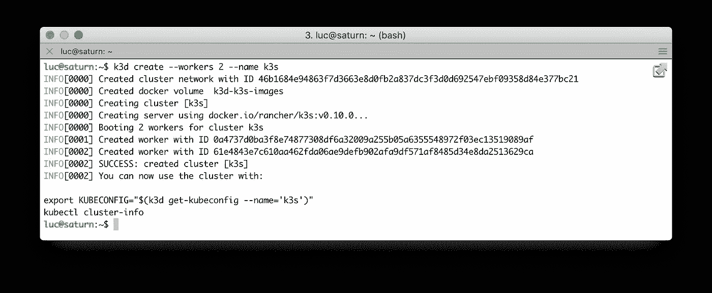*

*使用 k3d 创建的 k3s 集群*

*在后面，我们可以看到创建了 3 个容器，每个容器用于集群的一个节点。*

*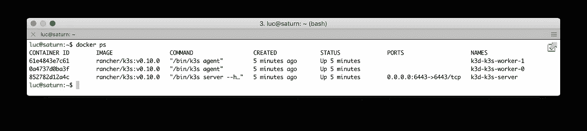*

*在容器中运行的 k3s 节点*

*然后，我们可以设置 KUBECONFIG 环境变量，以使用为集群创建的 kubeconfig:*

```
*$ export KUBECONFIG="$(k3d get-kubeconfig --name='k3s')"*
```

*开始使用我们的新集群:*

```
*$ kubectl get nodes
NAME               STATUS   ROLES    AGE     VERSION
k3d-k3s-server     Ready    master   4m45s   v1.16.2-k3s.1
k3d-k3s-worker-1   Ready    <none>   4m45s   v1.16.2-k3s.1
k3d-k3s-worker-0   Ready    <none>   4m44s   v1.16.2-k3s.1*
```

*注意:为了向外部公开服务，需要用 *- publish* 标志创建集群，文档中的[说明了几个配置选项](https://github.com/rancher/k3d/blob/master/docs/examples.md)*

*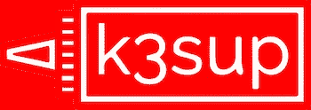*

*[k3sup](https://github.com/alexellis/k3sup) 是一个很棒的工具，来自 [Alex Ellis](https://medium.com/u/89b4ba5a32ff?source=post_page-----7ee463af21a2--------------------------------) ，用于设置 k3s 集群(以及更多)，它只需要一个 ssh 访问一个预先配置的虚拟机。让我们看看它如何与使用 Multipass 创建的 VM 一起工作。*

*Multipass 使用自己的密钥 ssh 到它创建的虚拟机上，该密钥的位置取决于操作系统(例如，在 MacOS 上，它位于*/var/root/Library/Application Support/multipassd/ssh-keys/id _ RSA*)。通常建议用一个定义 ssh 授权密钥的 cloud-init 文件启动一个多通道 VM。*

*假设我们的公钥在 *~/中。ssh/id_rsa.pub* (默认位置)，可以使用以下命令创建一个简单的 cloud-init 文件:*

```
*$ cat<<EOF > cloud.init
ssh_authorized_keys:
 - $(cat ~/.ssh/id_rsa.pub)
EOF*
```

*使用这个文件，我们创建一个虚拟机并获取它的 IP 地址。*

```
*# Create a new Ubuntu VM
$ multipass launch --name k3s --cloud-init cloud.init# Get the VM's IP address
$ export IP=$(multipass info k3s | grep IP | awk '{print $2}')*
```

*然后，我们使用以下命令设置一个带有 *k3sup* 的 k3s 集群*

```
*$ k3sup install --ip $IP --user multipass*
```

*k3s 准备就绪，可以使用当前目录中创建的 kubeconfig 文件进行访问。*

```
*$ export KUBECONFIG=$PWD/kubeconfig$ kubectl get node
NAME   STATUS   ROLES    AGE    VERSION
k3s    Ready    master   105s   v1.16.3-k3s.2*
```

## *kubectx 和 kube-ps1 前来救援*

*如果您在阅读这篇文章时测试了几个工具，那么您现在有了几个上下文，您的本地 *kubectl* 可以使用这些上下文来定位一个或另一个集群。可用上下文的示例:*

```
*$ kubectl config get-contexts
CURRENT  NAME           CLUSTER          AUTHINFO          NAMESPACE
         docker-desktop docker-desktop   docker-desktop
         kind-k8s       kind-k8s         kind-k8s
*        kind-k8s-HA    kind-k8s-HA      kind-k8s-HA
         minikube       minikube         minikube*
```

*为了更容易地在这些上下文之间导航，我建议你尝试一下 [kubectx](https://github.com/ahmetb/kubectx) 。安装非常简单，因为这只是一个添加到路径中的 shell 脚本。*

*还有，避开“黎明吧！我对错误的集群运行命令”，kube-ps1 是必须的。该工具为当前集群和命名空间提供了一个很好的 PS1 /提示符。看看这个:*

```
*# Shell without kube-ps1
luc@saturn:~$# Shell with kube-ps1
[luc@saturn ~ (⎈ |kind-k8s:default)]$*
```

## *在线游乐场*

*其他解决方案支持在线玩 Kubernetes(阅读:无需在本地安装任何东西)。这不是这篇文章的目的，但仍然是有趣的话题:)*

*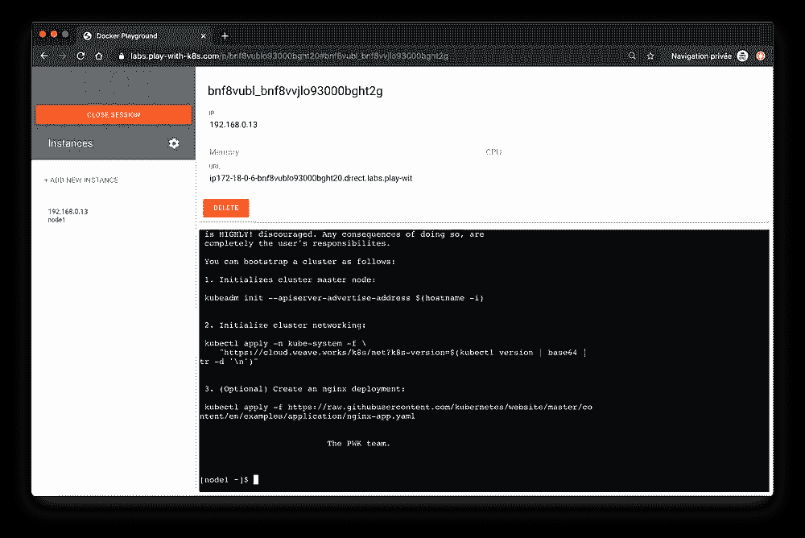**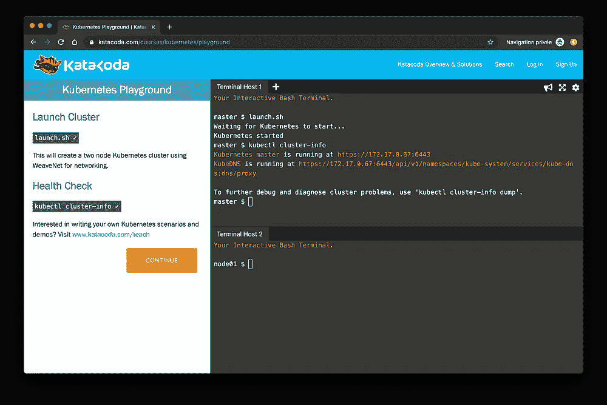*

*   *PWK*

*PWK ( [和库伯内特](https://play-with-k8s.com)玩)是 PWD([和码头工人](https://play-with-docker.com/)玩)的小哥哥。它提供了一个有 5 个终端的环境，持续 4 个小时，并指导您使用 [kubeadm](https://kubernetes.io/docs/reference/setup-tools/kubeadm/kubeadm/) (一个用于设置生产集群的工具)完成 Kubernetes 集群的设置。PWK 的一个终端感觉像一个真实 VM 中的外壳，但它实际上是一个运行在 Alpine 容器中的外壳，容器中已经安装了几个工具(docker、kubectl、kubelet 等等)。*

*   *卡塔科达*

*[Katacoda](https://katacoda.com) 专注于[云原生](https://cncf.io)应用，这包括 Kubernetes，但也包括许多其他项目和技术。这是通过许多主题的交互式教程进行学习的好地方，其中包括:*

*   *Kubernetes(你还可以得到一个漂亮的[游乐场](https://katacoda.com/courses/kubernetes/playground))和相关技术*
*   *无服务器*
*   *将（行星）地球化（以适合人类居住）*
*   *机器学习*
*   *编程语言:Go，Ruby，Node。Js，Python，Kotlin，…*
*   *Linux 操作系统*
*   *…以及更多*

*看看所有可用的[学习途径](https://katacoda.com/learn)！*

## *摘要*

*本文中详细介绍的所有工具都可以用来设置本地 Kubernetes 集群。它们有不同的功能和选项:快速设置，轻松升级，定期更新，简化与生态系统其他项目的集成，…我建议您检查其中的一些(全部？:) )并选择最符合您需求的一款。此外，正如我们在示例中看到的，Multipass 是一个很好的工具，它简化了 VM 的创建过程。*