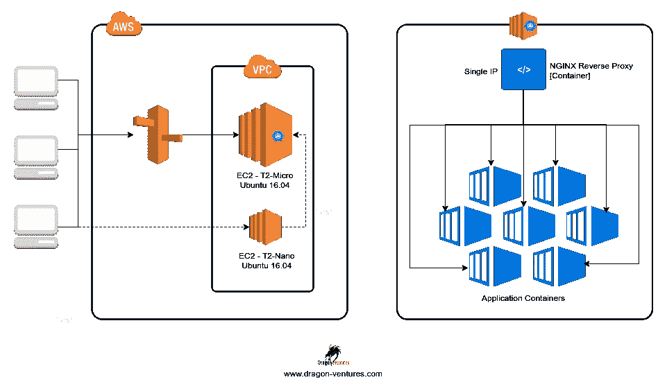
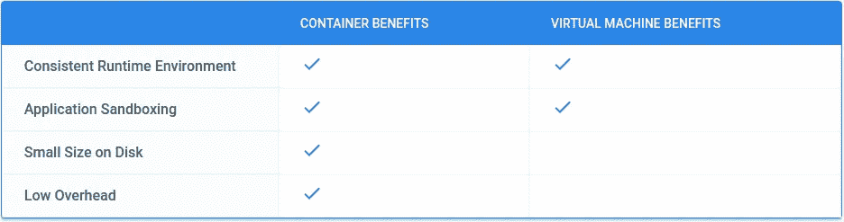
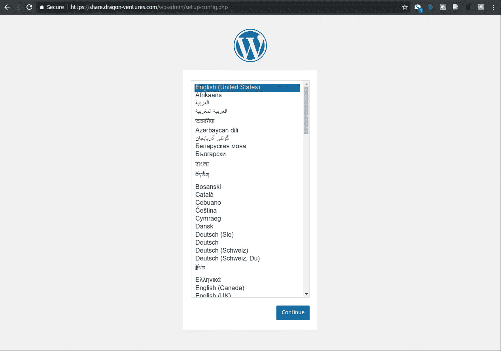
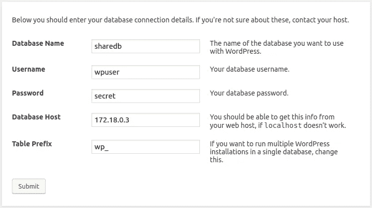
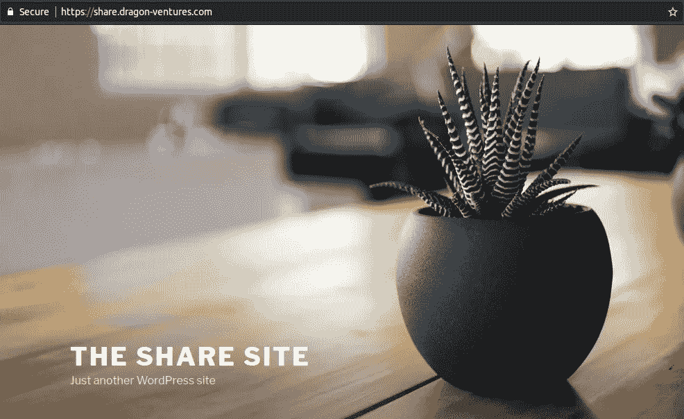
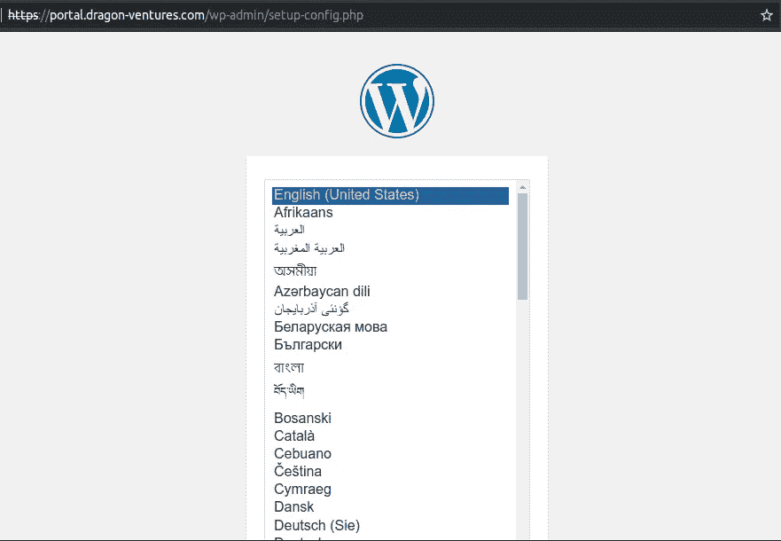
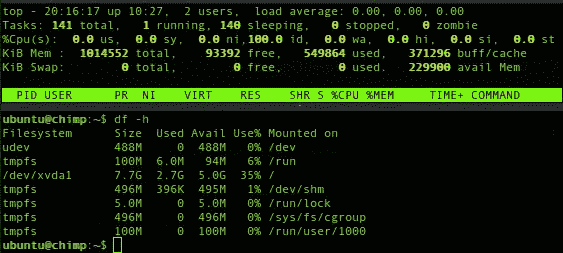

# 使用单个 IP 在容器上免费运行多个独立的 Web 应用程序

> 原文：<https://itnext.io/run-multiple-isolated-web-applications-on-containers-with-a-single-ip-for-free-52d216f3e810?source=collection_archive---------2----------------------->

## 架构逻辑介绍和构建自动化 NGINX 反向代理容器的分步指南，该容器使用一个公共 IP 地址为软件定义的局域网内多个基于容器的应用提供服务。



[*点击这里在 LinkedIn* 上分享这篇文章](https://www.linkedin.com/cws/share?url=https%3A%2F%2Fitnext.io%2Frun-multiple-isolated-web-applications-on-containers-with-a-single-ip-for-free-52d216f3e810)

如果您像我一样，总是为客户构建新的应用程序和各种技术解决方案，那么拥有一个经济高效的测试环境来按需构建新的应用程序，对于向客户交付经过良好测试的解决方案至关重要。过去，测试环境非常昂贵，我的办公室里有一架架服务器。接下来是虚拟机和云，这大大降低了测试环境的成本。最近，容器在完全取代虚拟机和/或在云中的虚拟机实例上运行方面变得非常流行。这里有一个来自 Google 的很好的比较表，解释了容器相对于虚拟机的优势，一目了然:



上图来自:【https://cloud.google.com/containers/ 

我通常告诉不熟悉这个概念的人，容器是一种新的、改进的方法，可以在很多情况下做虚拟机所做的事情，但使用的资源要少得多，因此与使用虚拟机相比，你可以运行更多的“服务器实例”。这就是我们能够完成我将要演示的任务的原因，因为如果我尝试在我的 T2 微虚拟机上运行 3 个以上的虚拟机，它可能会崩溃并死亡。如果你仍然对这整个容器的事情有点困惑，我发现 CIO 杂志有一篇很棒的[文章](https://www.cio.com/article/2924995/software/what-are-containers-and-why-do-you-need-them.html)，用通俗的语言全面地解释了事情。

现在有很多方法来创建基于容器的环境，包括一些较新的产品，如 AWS [ECS](https://aws.amazon.com/ecs/) ，AWS [EKS](https://aws.amazon.com/eks/) ，AWS [Fargate](https://aws.amazon.com/fargate/) ，[Microsoft AKS](https://azure.microsoft.com/en-us/services/container-service/)，GCP [Kubernetes 引擎](https://cloud.google.com/kubernetes-engine/)，阿里云的[容器服务](https://www.alibabacloud.com/product/container-service)，等等。我相信你也会注意到“ [Kubernetes](https://kubernetes.io/) ”这个词出现在这些服务中，他们称之为“生产级容器编排”；本质上是一个复杂的抽象层，具有软件定义的环境，在部署和管理大型容器集群时非常有用；在我看来，这是大规模容器部署的绝对必要条件。然而，虽然我对这些服务中的大多数感到非常兴奋，但它们都超出了本主题的范围，因为我打算逐步构建一个超级简单的环境，允许您旋转位于 NGINX [**反向代理**](https://en.wikipedia.org/wiki/Reverse_proxy) **容器后面的容器，所有这些容器都驻留在一个小型 AWS EC2**[**T2-微**](https://aws.amazon.com/ec2/instance-types/) **实例中。** **这样，你就可以在一个外部 IP 上托管多个与多个域/子域相关联的小型 web 应用**。另外，顺便提一下，FWIW，我有一个[T2-纳诺](https://aws.amazon.com/ec2/instance-types/)实例，作为同一个 [VPC](https://aws.amazon.com/vpc/) 中的 [SSH](https://www.openssh.com/) / [OpenVPN](https://openvpn.net/) 网关，这样我可以阻止对容器主机的直接远程访问，出于安全原因，我不会在这里讨论细节。关于货币成本的好消息是，如果你在 AWS 注册了一个[新账户，你就可以在一年内免费使用我刚刚谈到的这些资源，在他们开始对超额使用收费之前，有非常慷慨的限制](https://aws.amazon.com/free/)[。](https://aws.amazon.com/free/#details)

现在开始，但在我们开始之前，让我再次从上往下展示该图，以帮助可视化实施:


在左侧，您将看到 AWS 架构，而在右侧，您将看到 EC2 T2 微实例内部的架构。

为了这个演练的目的，我将假设你足够精通注册一个新的 AWS 帐户，并使用 Ubuntu 16.04 映像启动一个 T2 微实例。我将从实例启动并运行的地方开始，并且您已经通过 ssh 登录到实例，不管您是直接 SSH 到实例，还是像我一样通过网关主机或一些人所说的堡垒主机登录。

我将我的 EC2 实例命名为 chimp，我使用的域名是我的域名，dragon-ventures.com。我们开始吧！

首先，让我们确保 Ubuntu 是最新的，然后安装 [Docker](https://www.docker.com/) :

```
sudo apt-get update
sudo apt-get upgrade
sudo apt-get install docker.io
```

安装完成后，您可以执行以下操作来确保它正常工作:

```
ubuntu@chimp:~$ **sudo docker ps** CONTAINER ID        IMAGE               COMMAND             CREATED             STATUS              PORTS               NAMES
ubuntu@chimp:~$
```

因为我们还没有运行任何东西，所以在列下面没有显示任何东西是正常的。从这里开始，您就可以配置基于容器的环境了。这太简单了，对吧？

因此，让 NGINX 反向代理容器在自己的网络上运行。我们应该从零开始建造东西吗？没有。已经有一个现有的 [Docker 镜像](https://github.com/jwilder/nginx-proxy)由 [Jason Wilder](https://github.com/jwilder) 创建，它可以帮助你用一个命令行部署一个自动化的反向代理容器，但是在我们这样做之前，让我们确保我们已经创建了一个名为 nginx-proxy 的网络，代理容器后面的所有容器都将位于这个网络中:

```
ubuntu@chimp:~$ **sudo docker network create nginx-proxy**
2ba0a9b09db49f1524b1b4b6cd3d5d16b8cdf38e61690a1301f4015c319e9e73
```

如果你成功了，你会看到一串随机的字符，这是你的网络的唯一标识。创建网络后，因为我们希望 http 和 https 都能工作，所以现在您可以准备一个选择的本地目录，并放置一些为您的域创建的 SSL 证书，这些证书来自类似于 [ZeroSSL](https://zerossl.com/) 或您选择的任何其他证书提供商。然后，您可以选择一个您认为安全的目录来存储 ssl 证书，但是出于本演练的目的，为了方便起见，我选择了/home/ubuntu/ssl:

```
ubuntu@chimp:~$ **mkdir ssl**
```

有几种方法可以将您的 SSL 证书/密钥上传到服务器，我假设您已经知道如何上传，但这里有一个从我的 ssh 网关实例(可能是您的本地计算机)上传 dragon-ventures.com.crt 和 dragon-ventures.com.key 的例子，这是在 zerossl.com 生成的容器主机实例。请注意，证书和密钥必须以用于自动化工作的域名命名:

```
ubuntu@bastion:~$ **scp -i aws.pem dragon-ventures.com.crt** **ubuntu@chimp.dragon-ventures.com:~/ssl/**ubuntu@bastion:~$ **scp -i aws.pem dragon-ventures.com.key** **ubuntu@chimp.dragon-ventures.com:~/ssl/**
```

请注意，对于托管额外的域，您所要做的就是将名为 domain.com.crt 和 domain.com.key 的证书和密钥分别放入您正在使用的目录中，而不是/home/ubuntu/ssl，这样它就可以自动将这些证书用于关联容器。

现在，我们准备用我们的一个 liner 启动自动化 NGINX 反向代理容器:

```
ubuntu@chimp:~$ **sudo docker run -d --name nginx-proxy --net nginx-proxy -p 80:80 -p 443:443 -e HTTPS_METHOD=noredirect -e HSTS=off -v /home/ubuntu/ssl:/etc/nginx/certs -v /var/run/docker.sock:/tmp/docker.sock:ro jwilder/nginx-proxy**
Unable to find image 'jwilder/nginx-proxy:latest' locally
latest: Pulling from jwilder/nginx-proxy
e7bb522d92ff: Pull complete 
6edc05228666: Pull complete 
cd866a17e81f: Pull complete 
d9f2d6a1f8f6: Pull complete 
e9c7e986c8c1: Pull complete 
a51bcd518fd9: Pull complete 
66df98413ed2: Pull complete 
aff8c6473b42: Pull complete 
1c91fd608be1: Pull complete 
7319453a5fbe: Pull complete 
Digest: sha256:41506b2095779e6e64f34e26ccba35cb3668ee56a735cd740ac8c183af583294
Status: Downloaded newer image for jwilder/nginx-proxy:latest
a02048ca47b59325fc9e4ea9d4f4717c2cb63a4d4a78c94c3709c5d3e4bbd012
```

信不信由你，你现在已经在一个定制的网络上拥有了一个自动化的反向代理容器。超快的对吧？接下来，让我们通过启动一个新容器来进行测试。为了简单起见，假设我们想为 wordpress 上的客户建立一个新网站。嗯，你猜对了。实际上已经有一个 wordpress 容器图片可供我们使用。

首先，因为 wordpress 映像默认只支持端口 80 而不支持 SSL，所以我们需要定制 wordpress 映像来支持 SSL 和端口 443。

以下步骤纯属个人喜好，出于组织目的，因此我可以轻松地引用我创建的不同 Docker 文件，这些文件定义了定制的 Docker 映像。其背后的逻辑是，我为我定制的每个容器创建一个带有子目录的顶层目录。我还将 ssl 证书复制到容器子目录中的 ssl 子目录中，因为 Docker build 只能从 Docker 文件所在的目录及其子目录开始。

```
ubuntu@chimp:~$ **mkdir -p containers/wordpress/ssl** ubuntu@chimp:~$ **cp ssl/dragon-ventures.* containers/wordpress/ssl** ubuntu@chimp:~$ **cd containers/wordpress/**
ubuntu@chimp:~$ **vim Dockerfile**
```

将以下内容粘贴到文件中:

```
FROM wordpress:4.8.0-php7.1-apacheRUN apt-get update && \
        apt-get install -y  --no-install-recommends ssl-cert && \
        rm -r /var/lib/apt/lists/* && \
        a2enmod ssl && \
        a2ensite default-sslEXPOSE 80
EXPOSE 443
```

请注意，这个容器将使用自签名证书，但这在这种情况下不会有太大影响，因为反向代理容器将使用真实证书卸载 SSL。然而，对于我的真实测试环境，我实际上增加了几个步骤，使容器也使用真实证书，但我不会在这里介绍它们。

我们现在准备好构建自定义图像，我将它标记为 dv/wordpress:

```
ubuntu@chimp:~/containers/wordpress$ **sudo docker build -t dv/wordpress .**
Sending build context to Docker daemon 2.048 kB
Step 1/6 : FROM wordpress:4.8.0-php7.1-apache
4.8.0-php7.1-apache: Pulling from library/wordpress
ad74af05f5a2: Pull complete 
a1e75557f244: Pull complete 
6ab4f72a86ad: Pull complete 
55e3508d42ca: Pull complete 
88792c88e1bc: Pull complete 
1d8a48cffe59: Pull complete 
0c30cf9b4233: Pull complete 
37ec3cd3c9fb: Pull complete 
1925fdff3f6a: Pull complete 
f1a75ee98d0d: Pull complete 
b9e0483f0c09: Pull complete 
8c5d8b4070d7: Pull complete 
ffd7c73efd91: Pull complete 
31b2a59ece05: Pull complete 
df9af0decc33: Pull complete 
b0b6fe59a468: Pull complete 
9c183d73d613: Pull complete 
a3be0b191a8e: Pull complete 
Digest: sha256:241f092e70d128d047f2fc162904e1dba89dbe4c2f0e225d5791ff596ed2c96f
Status: Downloaded newer image for wordpress:4.8.0-php7.1-apache
 ---> 56649ecf398a
Step 2/6 : RUN apt-get update &&  apt-get install -y  --no-install-recommends ssl-cert &&  rm -r /var/lib/apt/lists/* &&  a2enmod ssl &&  a2ensite default-ssl
 ---> Running in 1bcd6bbeb433
Get:1 [http://security.debian.org](http://security.debian.org) jessie/updates InRelease [63.1 kB]
Ign [http://deb.debian.org](http://deb.debian.org) jessie InRelease
Get:2 [http://deb.debian.org](http://deb.debian.org) jessie-updates InRelease [145 kB]
Get:3 [http://deb.debian.org](http://deb.debian.org) jessie Release.gpg [2434 B]
Get:4 [http://deb.debian.org](http://deb.debian.org) jessie Release [148 kB]
Get:5 [http://security.debian.org](http://security.debian.org) jessie/updates/main amd64 Packages [631 kB]
Get:6 [http://deb.debian.org](http://deb.debian.org) jessie-updates/main amd64 Packages [23.1 kB]
Get:7 [http://deb.debian.org](http://deb.debian.org) jessie/main amd64 Packages [9064 kB]
Fetched 10.1 MB in 8s (1145 kB/s)
Reading package lists...
Reading package lists...
Building dependency tree...
Reading state information...
Suggested packages:
  openssl-blacklist
The following NEW packages will be installed:
  ssl-cert
0 upgraded, 1 newly installed, 0 to remove and 45 not upgraded.
Need to get 20.9 kB of archives.
After this operation, 104 kB of additional disk space will be used.
Get:1 [http://deb.debian.org/debian/](http://deb.debian.org/debian/) jessie/main ssl-cert all 1.0.35 [20.9 kB]
debconf: delaying package configuration, since apt-utils is not installed
Fetched 20.9 kB in 1s (13.5 kB/s)
Selecting previously unselected package ssl-cert.
(Reading database ... 13657 files and directories currently installed.)
Preparing to unpack .../ssl-cert_1.0.35_all.deb ...
Unpacking ssl-cert (1.0.35) ...
Setting up ssl-cert (1.0.35) ...
debconf: unable to initialize frontend: Dialog
debconf: (TERM is not set, so the dialog frontend is not usable.)
debconf: falling back to frontend: Readline
Considering dependency setenvif for ssl:
Module setenvif already enabled
Considering dependency mime for ssl:
Module mime already enabled
Considering dependency socache_shmcb for ssl:
Enabling module socache_shmcb.
Enabling module ssl.
See /usr/share/doc/apache2/README.Debian.gz on how to configure SSL and create self-signed certificates.
To activate the new configuration, you need to run:
  service apache2 restart
Enabling site default-ssl.
To activate the new configuration, you need to run:
  service apache2 reload
 ---> 6c5155317d89
Removing intermediate container 1bcd6bbeb433
Step 3/6 : ADD ssl/dv.crt /etc/ssl/certs/
 ---> 732f061b3bf2
Removing intermediate container 909a2770fd40
Step 4/6 : ADD ssl/dv.key /etc/ssl/private/
 ---> 2b675e639d1a
Removing intermediate container b07c19546149
Step 5/6 : EXPOSE 80
 ---> Running in 3efc852f72b9
 ---> 50201abe9632
Removing intermediate container 3efc852f72b9
Step 6/6 : EXPOSE 443
 ---> Running in 723b660431bf
 ---> 5e4dac2c8e9c
Removing intermediate container 723b660431bf
Successfully built 5e4dac2c8e9c
```

现在已经完成了定制图像的构建。让我们为 wordpress 容器设置一个 mysql 服务器:

```
ubuntu@chimp:~$ **sudo docker run -d --name share-mysql --expose 3306 --net nginx-proxy -e MYSQL_ROOT_PASSWORD=my-secret-pw mysql:latest**
Unable to find image 'mysql:latest' locally
latest: Pulling from library/mysql
8176e34d5d92: Pull complete 
17e372a8ec90: Pull complete 
47b869561d3a: Pull complete 
c90ab4483f28: Pull complete 
d6af16572c5c: Pull complete 
6d16794d04ac: Pull complete 
aaf442a8fe75: Pull complete 
7c6fa8f07ec4: Pull complete 
ece17b689642: Pull complete 
c55b06e76eaf: Pull complete 
661fabfb4fc2: Pull complete 
Digest: sha256:227d5c3f54ee3a70c075b1c3013e72781564000d34fc8c7ec5ec353c5b7ef7fa
Status: Downloaded newer image for mysql:latest
addbb43072a94d7d1e7ebced10083a3980f01af84b619621d267f8e05f436232
```

注意，我们已经在上面的 docker run 命令中将 mysql root 密码设置为“my-secret-pw”。以后记住这一点很重要。现在，我们可以让我们的自定义映像物有所值了:

```
ubuntu@chimp:~$ **sudo docker run -d --name share --expose 80 --expose 443 --net nginx-proxy --link share****-mysql:mysql** **-e VIRTUAL_HOST=share.dragon-ventures.com -e VIRTUAL_PROTO=http -e VIRTUAL_PORT=80 -e VIRTUAL_PROTO=https -e VIRTUAL_PORT=443 -e HTTPS_METHOD=noredirect dv/wordpress**
02dce41c606cb30bc5b1240606f0d83c2d5e6a80f31fc910069639637ce2276d
```

注意，我已经为 wordpress 容器指定了链接到 share-mysql 数据库，这给了它访问 mysql 所需的权限。

就是这样…真的！因此，让我们通过编辑 hosts 文件并使用浏览器查看它来看看它是否真的有效:

```
sudo vim /etc/hosts
```

将以下内容插入主机文件:

```
[Your EC2 Instance Public IP] share.dragon-ventures.com
```

然后打开浏览器查看！



嘭！看起来不错！然而，拥有一个基于容器的环境和一个反向代理服务器的意义在于，你可以托管多个应用程序(**在一个真实的用例中，有多个大不相同的服务器配置，而不是两个容器有相同的配置**)，所以让我设置 wordpress，并给站点一个不同的外观，目的是区分这个站点和我们将创建的新站点，新站点只是作为一个**概念证明，NGINX 实际上路由到多个容器**。为了做到这一点，我们必须首先准备好 mysql 服务器。让我们从安装 mysql-client 开始:

```
sudo apt-get install mysql-client
```

然后，通过查找容器 id 来识别 mysql 容器的 IP 地址，然后根据识别的容器 id 执行 inspect 命令，如下所示:

```
ubuntu@chimp:~$ **sudo docker ps**
CONTAINER ID        IMAGE                 COMMAND                  CREATED             STATUS              PORTS                                      NAMES
02dce41c606c        dv/wordpress          "docker-entrypoint..."   17 minutes ago      Up 17 minutes       80/tcp, 443/tcp                            share
**addbb43072a9**        mysql:latest          "docker-entrypoint..."   25 minutes ago      Up 25 minutes       3306/tcp                                   share-mysql
a02048ca47b5        jwilder/nginx-proxy   "/app/docker-entry..."   About an hour ago   Up About an hour    0.0.0.0:80->80/tcp, 0.0.0.0:443->443/tcp   nginx-proxy
ubuntu@chimp:~$ **sudo docker inspect addbb43072a9 |grep IPAddress**
            "SecondaryIPAddresses": null,
            "IPAddress": "",
                    "IPAddress": "**172.18.0.3**",
```

我们现在可以连接到 mysql 数据库，并按如下方式准备数据库:

```
ubuntu@chimp:~/ssl$ **mysql -h 172.18.0.3 -u root -p**
Enter password: 
Welcome to the MySQL monitor.  Commands end with ; or \g.
Your MySQL connection id is 4
Server version: 5.7.21 MySQL Community Server (GPL)Copyright (c) 2000, 2018, Oracle and/or its affiliates. All rights reserved.Oracle is a registered trademark of Oracle Corporation and/or its
affiliates. Other names may be trademarks of their respective
owners.Type 'help;' or '\h' for help. Type '\c' to clear the current input statement.mysql> **create database sharedb;** Query OK, 1 row affected (0.00 sec)mysql> **GRANT ALL PRIVILEGES ON sharedb.* TO wpuser IDENTIFIED BY 'secret';** Query OK, 0 rows affected, 1 warning (0.00 sec)mysql> \q
```

然后让我们回到浏览器，让 wordpress 站点运行起来:



关于在设置配置屏幕中输入什么内容的参考

浏览安装动作，点击地址【https://share.dragon-ventures.com ，你将会在这里结束:



**现在让我们制作第二个网站，portal.dragon-ventures.com:**

```
ubuntu@chimp:~$ **sudo docker run -d --name portal-mysql --expose 3306 --net nginx-proxy -e MYSQL_ROOT_PASSWORD=my-secret-pw mysql:latest**
'e73f179192f2ab4644a760833355673d528d79269eaff83d06e864912227b572
ubuntu@chimp:~$ **sudo docker run -d --name portal --expose 80 --expose 443 --net nginx-proxy --link portal-mysql:mysql -e VIRTUAL_HOST=portal.dragon-ventures.com -e VIRTUAL_PROTO=http -e VIRTUAL_PORT=80 -e VIRTUAL_PROTO=https -e VIRTUAL_PORT=443 -e HTTPS_METHOD=noredirect dv/wordpress** f08fde106687b039996747bf78d8605581fca6c18384b252606995f9b427937a
```

再次编辑主机文件，并添加:

```
[Your EC2 Instance Public IP]   portal.dragon-ventures.com
```

然后在浏览器上查，看！尽管 portal.dragon-ventures.com 指向同一个 IP 地址，它却去了不同的网站！



现在，让我们打开一个新的浏览器窗口，再次尝试 share.dragon-ventures.com:


你有它！您可以继续添加更多的容器，直到 EC2 实例上的容量用完，或者您也可以取下容器并快速旋转它们，以便仅在需要时开发或展示解决方案。看看 5 个容器和主机一起使用的资源有多少，即使只有几台计算机访问网站:



当然，这显然是针对小规模测试环境的，正如我之前提到的，对于高流量测试环境和大型生产环境，内部 [Kubernetes](https://kubernetes.io) 或一个出色的云产品才是正确的选择！

测试愉快！

可能有助于您探索/管理环境的其他基本命令:

```
# Stop container
sudo docker stop [container]# Start container
sudo docker start [container]# Access container shell
sudo docker exec -ti [container] /bin/bash
```

**SUDO** :如果你不喜欢每次执行 docker 命令都键入 SUDO，你可以将你的用户添加到/etc/group 中的 docker 组，注销，重新登录，然后你就可以开始运行没有 sudo 的 docker 命令了。虽然我个人更喜欢要求 sudo，因为它让我在做事情之前自然地三思。除了用户偏好之外，选择一个或另一个也有一些安全问题；一个引发另一个棘手问题的话题。

这篇文章的目的是为我将来的实施提供参考，同时也是为那些需要帮助的人提供指导。更重要的是，如果有任何专家阅读这篇文章，可以指出我的逻辑缺陷，或者告诉我如何才能做得更好，以便我可以学习和改进，我将不胜感激。

*提前感谢那些会给我写信的人！*