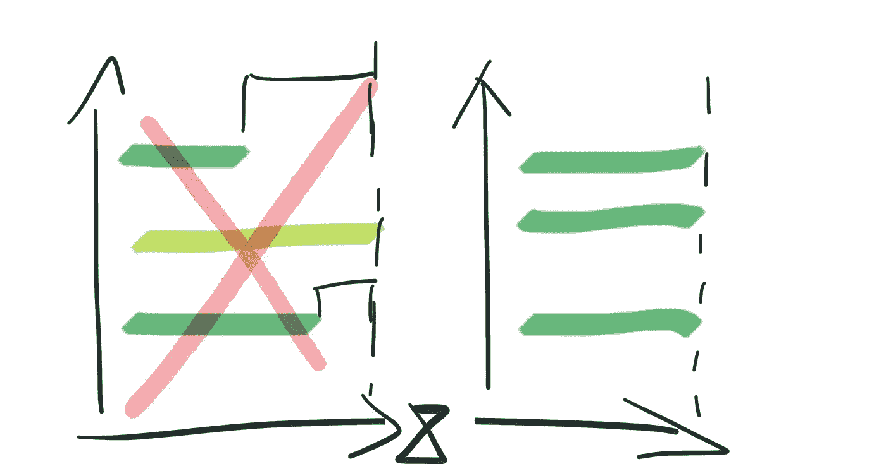
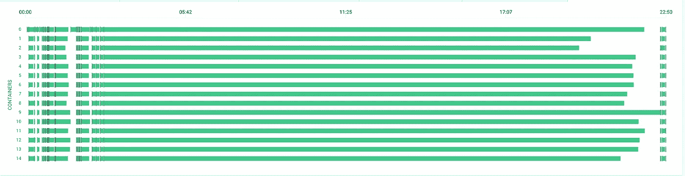

# 在 CircleCI 上对 RSpec、Minitest、Cypress 进行并行化测试

> 原文：<https://itnext.io/run-tests-on-circleci-with-parallelisation-for-rspec-minitest-cypress-fd7d3649858e?source=collection_archive---------8----------------------->

也许您使用 CircleCI parallelisation 在多个 CI 节点上运行您的测试套件，但是您注意到一些 CI 节点比其他节点花费更多的时间来完成测试。

当你的测试有随机时间时，这可能发生。通常，E2E(端到端)测试的执行时间更随机，因为浏览器必须等待一些元素加载到网站上，或者您的应用程序可能依赖于外部 API，处理请求的持续时间不同。其他原因可能是启动一个并行 CI 节点的延迟。

# 默认 CircleCI 测试套件拆分

下面是一个使用默认 CircleCI 并行化运行测试的例子。如您所见，整个 CI 构建在 29 分 37 秒内完成。测试是在 15 个并行 CI 节点上执行的，其中一些节点运行了 14 分钟，最慢的一个运行了近 30 分钟。

如果我们能够在 CI 节点之间自动平衡测试套件的划分，使所有 CI 节点在相似的时间内工作，那么我们就可以得到更短的 CI 构建。

# 动态测试套件拆分

我们可以使用[backpackage Pro](https://knapsackpro.com/?utm_source=medium&utm_medium=blog_post&utm_campaign=improve-circleci-parallelisation-for-rspec-minitest-cypress)跨 CI 节点动态地分割测试。例如，我们可以在 Ruby 中为 RSpec 或 Minitest 拆分测试。如果您使用 Cypress test runner 运行 E2E 测试，那么您也可以拆分 Javascript 测试。

这是添加[背包 Pro 队列模式](https://knapsackpro.com/?utm_source=medium&utm_medium=blog_post&utm_campaign=improve-circleci-parallelisation-for-rspec-minitest-cypress)后的图。背包 Pro 队列模式使您的测试在 CI 节点间保持自动平衡，以便允许所有 CI 节点在相似的时间内完成工作。如您所见，CI 构建花费了 22 分 50 秒，而不是将近 30 分钟。这意味着**我们每个 CI 构建节省了 7 分钟**。

当您的团队每天运行 20 个 CI 构建时，您每天可以节省 2 小时 20 分钟。一个月节省了超过 46 个小时。

在下面的视频中，我展示了动态测试套件拆分还能解决哪些问题。

你也可以在[backpack Pro](https://knapsackpro.com/?utm_source=medium&utm_medium=blog_post&utm_campaign=improve-circleci-parallelisation-for-rspec-minitest-cypress)上阅读更多关于它的内容，并在那里看到对更多测试跑步者的支持。

# 其他提示

如果你对 [Cypress 测试套件拆分](https://docs.knapsackpro.com/2018/run-javascript-e2e-tests-faster-with-cypress-on-parallel-ci-nodes)很好奇。

如果你想用 Chrome headless 运行你的 [CircleCI 2.0 测试。](https://docs.knapsackpro.com/2017/circleci-2-0-capybara-feature-specs-selenium-webdriver-with-chrome-headless)

Tech 详细说明了如何在加载动态测试文件的情况下在 [Minitest 中连续运行测试](https://docs.knapsackpro.com/2018/how-to-run-tests-in-minitest-continuously-with-dynamic-test-files-loading)。

【docs.knapsackpro.com】最初发表于**。**