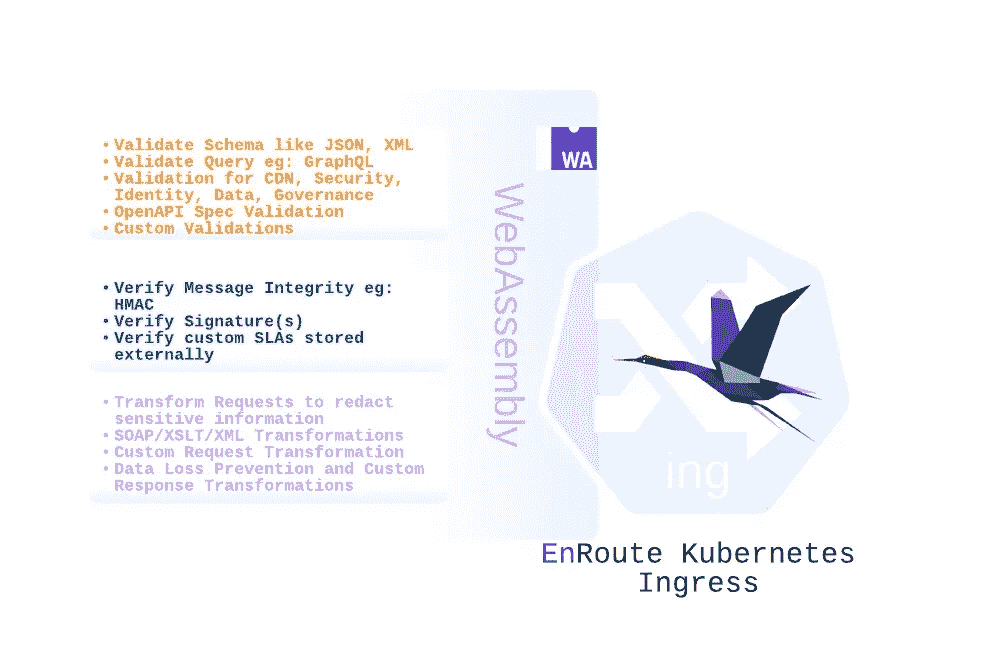

# 在入口运行 WASM 来验证、检验和转换请求

> 原文：<https://itnext.io/run-wasm-at-ingress-to-validate-verify-and-transform-a-request-5670fa2c1fd3?source=collection_archive---------0----------------------->

# 介绍

当开发人员得到他们喜欢的工具时，他们往往会更有生产力。所选语言的可扩展性提供了可扩展性的便利，而无需学习新的语言。WebAssembly 运行时执行字节码，字节码是通过编译用高级语言编写的代码生成的，高级语言包括 javascript、C、C++、Python、Rust 或 Golang。

我们探索了在 Route gateway 中对 WebAssembly 的支持，以及我们如何加载用选择的语言编写的自定义逻辑生成的字节码。使用 EnRoute 加载到 WebAssembly 运行时。

我们从验证请求、验证其模式和转换请求的目标开始。我们使用编译并加载到 WebAssembly 运行时的自定义代码来实现这一点

WASM 支持是[途中社区版](https://getenroute.io/features)的一部分，无需任何企业许可即可免费使用。

# 本文涵盖的内容

以下步骤介绍了处理请求所需的内容

*   在 WASM 支持下安装
*   安装示例工作负载
*   正在编写程序以使服务对外可用
*   创建 WebAssembly 筛选器
*   为服务启用 WebAssembly 筛选器
*   确保请求 MAC 得到验证，并转换请求以编辑敏感信息
*   确保验证了 JSON 模式

接下来，我们将详细介绍上述步骤。我们还将了解如何在 [compat variant](https://github.com/solo-io/wasm/blob/master/spec/spec-compat.md) 中构建 WebAssembly 映像，然后通过 EnRoute 将其加载到 Envoy WebAssembly 运行时

## 在 WASM 支持下安装

WASM 支持在单独的途中映像中提供。在添加 helm repo 并安装带有`wasm`标签的途中映像后，可以使用以下 helm 命令进行安装

```
helm repo add saaras https://getenroute.io 
helm install enroute-demo saaras/enroute \
--set serviceAccount.create=true \
--create-namespace \
--namespace enroutedemo \
--set images.enrouteService.tag=wasm
```

## 安装示例工作负载

```
kubectl create namespace httpbin kubectl apply -f [https://raw.githubusercontent.com/saarasio/enroute/master/helm-chart/httpbin-bin-service.yaml](https://raw.githubusercontent.com/saarasio/enroute/master/helm-chart/httpbin-bin-service.yaml)
```

## 正在编写程序以使服务对外可用

```
helm install httpbin-service-policy saaras/service-policy
--set service.name=httpbin
--set service.prefix=/post
--set service.port= 80
--namespace httpbin
```

向`LoadBalancer`服务的外部 IP 发送请求，以验证它是否按预期工作。[入门](https://getenroute.io/docs/getting-started-enroute-ingress-controller/)指南详细介绍了如何设置。

获取路由负载平衡器服务的公共 IP(`212.2.241.255`)并发送请求

```
**curl -X POST -H 'Content-Type: application/json' -d '{}' 212.2.241.255/post****{**
  "args": **{}**,
  "data": "{}",
  "files": **{}**,
  "form": **{}**,
  "headers": **{**
    "Accept": "*/*",
    "Content-Length": "2",
    "Content-Type": "application/json",
    "Host": "212.2.241.255",
    "User-Agent": "curl/7.68.0",
    "X-Envoy-Expected-Rq-Timeout-Ms": "15000",
    "X-Envoy-External-Address": "192.168.1.5"
  **}**,
  "json": **{}**,
  "origin": "152.70.114.65,192.168.1.5",
  "url": "http://212.2.241.255/post"
**}**
```

## 创建 WebAssembly 筛选器

```
cat <<EOF | kubectl apply -f -
apiVersion: enroute.saaras.io/v1
kind: HttpFilter
metadata:
  name: httpbin-wasm-wasmfilter-oci
  namespace: httpbin
spec:
  httpFilterConfig:
    config: |
      {
              "url" : "oci://saarasio/vvx-json"
      }
  name: httpbin-wasm-wasmfilter-oci
  type: http_filter_wasm
EOF
```

## 为服务启用 WebAssembly 筛选器

```
**kubectl edit -n httpbin gatewayhosts.enroute.saaras.io httpbin-80-gatewayhost** **5** apiVersion: enroute.saaras.io/v1
  **6** kind: GatewayHost
  **7** metadata:
  **8**   annotations:
  **9**     meta.helm.sh/release-name: httpbin-service-policy
 **10**     meta.helm.sh/release-namespace: httpbin
 **11**   creationTimestamp: "2022-04-26T14:56:48Z"
 **12**   generation: **3**
 **13**   labels:
 **14**     app: httpbin
 **15**     app.kubernetes.io/managed-by: Helm
 **16**   name: httpbin-80-gatewayhost
 **17**   namespace: httpbin
 **18**   resourceVersion: "3736"
 **19**   uid: b2e39054-a959-40c3-9754-365b518b8ee6
 **20** spec:
 **21**   routes:
 **22**   - conditions:
 **23**     - prefix: /post
 **24**     filters:
 **25**     - name: httpbin-80-rl2
 **26**       type: route_filter_ratelimit
 **27**     services:
 **28**     - healthCheck:
 **29**         healthyThresholdCount: **3**
 **30**         host: hc
 **31**         intervalSeconds: **5**
 **32**         path: /
 **33**         timeoutSeconds: **3**
 **34**         unhealthyThresholdCount: **3**
 **35**       name: httpbin
 **36**       port: **80**
 **37**   virtualhost:
 **38**     filters:
 **39**     - name: httpbin-80-luatestfilter
 **40**       type: http_filter_lua
 **41**     - name: httpbin-wasm-wasmfilter-oci
 **42**       type: http_filter_wasm
 **43**     fqdn: '*'
```

## 确保 MAC 得到验证，并且通过编辑个人信息来转换请求

我们首先创建一个有效负载 JSON，并使用 POST 请求将其发送给服务器。这是一个名为 payload.json 的文件中的 json 有效负载

```
**cat payload.json****{**
  "data": **[{**
    "type": "articles",
    "id": "1",
    "attributes": **{**
      "title": "JSON:API paints my bikeshed!",
      "body": "The shortest article. Ever.",
      "created": "2006-01-02 15:04",
      "updated": "2011-01-19 22:15",
      "dob": "2022-01-19 22:15"
    **}**,
    "relationships": **{**
      "author": **{**
        "data": **{**"id": "42", "type": "people"**}**
      **}**
    **}**
  **}]**,
  "included": **[**
    **{**
      "type": "people",
      "id": "42",
      "attributes": **{**
        "name": "John",
        "age": 80,
        "gender": "male"
      **}**
    **}**
  **]**
**}**
```

为了验证，我们计算有效负载的 SHA256，并将其与我们计算并在摘要报头中发送的值进行比较

```
**cat payload.json | tr -d "\n" | openssl dgst -sha256 -binary | base64**h3wEb7jrjmwD8O7TDvOD3WGG23lfnzsfmODcbwLmdlk =
```

发送请求

```
curl -vv 212.2.241.255/post -H 'Content-Type: application/json' -H "Digest: sha256=h3wEb7jrjmwD8O7TDvOD3WGG23lfnzsfmODcbwLmdlk=" --data @/home/ubuntu/payload.json**{**
  "args": **{}**,
  "data": "{  \"data\": [{    \"type\": \"articles\",    \"id\": \"1\",    \"attributes\": {      \"title\": \"JSON:API paints my bikeshed!\",      \"body\": \"The shortest article. Ever.\",      \"created\": \"2006-01-02 15:04\",      \"updated\": \"2011-01-19 22:15\",      \"dob\": \"0000-00-00 00:00\"    },    \"relationships\": {      \"author\": {        \"data\": {\"id\": \"42\", \"type\": \"people\"}      }    }  }],  \"included\": [    {      \"type\": \"people\",      \"id\": \"42\",      \"attributes\": {        \"name\": \"John\",        \"age\": 80,        \"gender\": \"male\"      }    }  ]}",
  "files": **{}**,
  "form": **{}**,
  "headers": **{**
    "Accept": "*/*",
    "Content-Length": "532",
    "Content-Type": "application/json",
    "Digest": "sha256=h3wEb7jrjmwD8O7TDvOD3WGG23lfnzsfmODcbwLmdlk=",
    "Host": "212.2.241.255",
    "User-Agent": "curl/7.68.0",
    "X-Envoy-Expected-Rq-Timeout-Ms": "15000",
    "X-Envoy-External-Address": "192.168.1.5"
  **}**,
  "json": **{**
    "data": **[**
      **{**
        "attributes": **{**
          "body": "The shortest article. Ever.",
          "created": "2006-01-02 15:04",
          "dob": "0000-00-00 00:00",
          "title": "JSON:API paints my bikeshed!",
          "updated": "2011-01-19 22:15"
        **}**,
        "id": "1",
        "relationships": **{**
          "author": **{**
            "data": **{**
              "id": "42",
              "type": "people"
            **}**
          **}**
        **}**,
        "type": "articles"
      **}**
    **]**,
    "included": **[**
      **{**
        "attributes": **{**
          "age": 80,
          "gender": "male",
          "name": "John"
        **}**,
        "id": "42",
        "type": "people"
      **}**
    **]**
  **}**,
  "origin": "152.70.114.65,192.168.1.5",
  "url": "http://212.2.241.255/post"
**}**
```

JSON 验证检查有效负载中是否存在一些 JSON 元素以及某些字段的格式。在上面的有效负载中，它检查`type`、`id`、`title`、`body`，并验证`created`和`updated`文件的格式，以确保提供有效的日期。

使用 WASM 演示进行验证、检验和改造

# 结论

WebAssembly 提供了一种灵活的扩展机制来定制请求验证、确认和转换。代理中的 WebAssembly 实现由 SDK 实现的 proxy-wasm abi 规范。不同语言的 SDK 提供了一种与 WebAssembly 运行时交互的机制。我们使用 [go sdk](https://github.com/tetratelabs/proxy-wasm-go-sdk) 实现[代理-wasm abi 规范](https://github.com/proxy-wasm/spec)来实现这一点。



使用 [WASI libc](https://github.com/WebAssembly/wasi-libc) 将上述步骤中生成的代码编译成 WASM。当使用 [tinygo](https://tinygo.org/docs/reference/usage/basic/#building-hello-world-program-for-webassembly) 进行编译时，编译后生成的字节码被打包成 compat variant 中的 WASM 工件，然后加载到 Envoy WebAssembly 运行时中。

在下一篇文章中，我们将介绍如何构建一个可以在途中加载的图像的 compat 变体，并详细介绍代理 wasm ABI，它让我们可以接收请求处理的回调。

*最初发布于*[*https://geten route . io*](https://getenroute.io/blog/developer-program-ingress-wasm-validate-verify-transform/)*。*